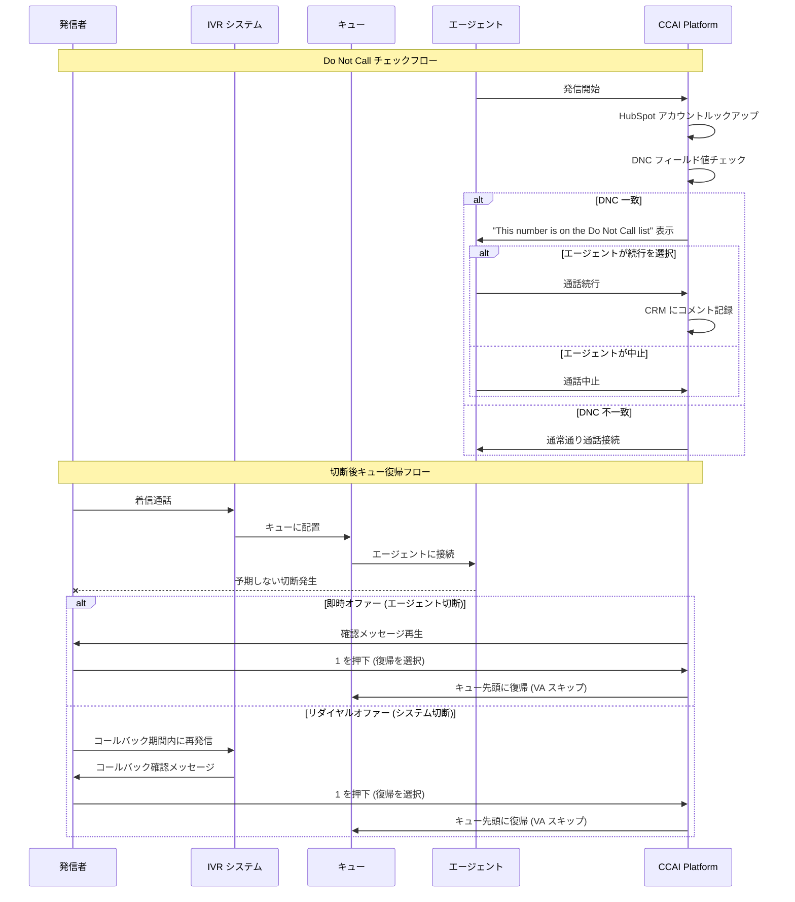

# Google Cloud CCaaS: バージョン 4.45 リリース - Do Not Call 機能と切断後キュー復帰

**リリース日**: 2026-07-01

**サービス**: Google Cloud Contact Center as a Service (CCaaS)

**機能**: Do Not Call (DNC) HubSpot 連携 / 切断後キュー復帰 / バグ修正

**ステータス**: Announcement / Feature / Fixed

📊 [このアップデートのインフォグラフィックを見る](https://takech9203.github.io/google-cloud-news-summary/20260701-ccaas-4-45-do-not-call-return-to-queue.html)

## 概要

Google Cloud CCaaS のバージョン 4.45 がリリースされました。本リリースでは、コンプライアンス強化のための Do Not Call (DNC) 機能の HubSpot 連携、顧客体験向上のための切断後キュー復帰機能、および 12 件のバグ修正が含まれています。

Do Not Call 機能は、エージェントが発信する際に DNC リストに登録された連絡先への通話を警告する機能で、法規制遵守を支援します。切断後キュー復帰機能は、予期しない切断が発生した場合に発信者がキューの先頭に戻れるオプションを提供し、顧客体験を大幅に改善します。バグ修正では、キャンペーン処理、ゴーストアサイメント、コールドトランスファーなどの重要な問題が解消されています。

インスタンスへの更新タイミングは、選択したデプロイメントスケジュール（Rapid、Regular、Critical）に依存します。

**アップデート前の課題**

- エージェントが DNC リストの連絡先に発信する際に警告がなく、コンプライアンス違反のリスクがあった
- 通話が予期せず切断された場合、発信者はキューに再度並び直す必要があり、長い待ち時間が再発していた
- キャンペーンの完了失敗により後続キャンペーンが開始できない問題があった
- コールドトランスファー時に接続が無応答・無音になる問題があった
- エージェントデスクトップでゴーストアサイメントが発生し、通話が放棄されていた

**アップデート後の改善**

- HubSpot 連携でエージェントに DNC 警告が表示され、コンプライアンス遵守を支援
- 切断後に発信者がキューの先頭に自動復帰可能になり、顧客体験が向上
- 12 件のバグ修正により通話処理とエージェントデスクトップの信頼性が大幅に改善
- キャンペーン処理、ボイスメール転送、レポーティングの正確性が向上

## アーキテクチャ図



上図は、Do Not Call チェックフローと切断後キュー復帰フローの 2 つの主要な新機能のシーケンスを示しています。DNC チェックは HubSpot ルックアップオブジェクトを使用し、キュー復帰は即時オファーとリダイヤルオファーの 2 つのワークフローで動作します。

## サービスアップデートの詳細

### 主要機能

1. **Do Not Call (DNC) - HubSpot 連携**
   - エージェントが DNC 登録済み連絡先に発信する際、コールアダプターに警告メッセージを表示
   - エージェントは警告を確認した上で通話を続行可能
   - 続行した場合、CRM に「The contact is in TPS, the agent chose to proceed with the call.」のコメントが自動記録
   - 非キャンペーンのアウトバウンド通話にのみ適用（キャンペーン通話には影響なし）
   - プライマリおよびセカンダリのルックアップオブジェクトに対応

2. **切断後キュー復帰 (Return to Queue After Disconnection)**
   - IVR 通話で予期しない切断が発生した場合、発信者にキュー復帰オプションを提供
   - FIFO ルーティング設定時はキュー先頭に復帰、非 FIFO 時はキュー先頭付近に優先配置
   - 復帰時にバーチャルエージェントをスキップし、直接人間のエージェントにエスカレーション
   - 即時オファーとリダイヤルオファーの 2 つのワークフローに対応
   - グローバル設定とキューレベル設定の両方で構成可能

3. **バグ修正 (12 件)**
   - キャンペーン完了失敗による後続キャンペーンブロック問題の修正
   - ウォームトランスファー時のボイスメール接続問題の修正
   - ゴーストアサイメントと通話放棄問題の修正
   - コールドトランスファー時の無応答・無音問題の修正
   - 切断通話のダッシュボード表示問題の修正
   - 強制ディスポジション時のパネルロード失敗問題の修正
   - ストリーミング会話の接続エラー問題の修正
   - HubSpot 重複連絡先作成問題の修正
   - ACW 期間の誤計算問題の修正
   - Start Call ボタン非表示問題の修正
   - コールドトランスファー時のボイスメール損失・誤ルーティング問題の修正
   - ラップアップ超過時のアクティブ通話の保留表示問題の修正

## 技術仕様

### Do Not Call 設定要件

| 項目 | 詳細 |
|------|------|
| 対象通話 | 非キャンペーンのアウトバウンド通話（手動発信・Click-to-Call） |
| CRM 連携 | HubSpot（連絡先またはカンパニーのルックアップオブジェクト） |
| 値の照合 | 大文字小文字を完全一致で比較 |
| HubSpot 到達不能時 | 警告は表示されず通話は通常通り進行 |
| ルックアップ対象 | プライマリ + セカンダリルックアップオブジェクト |

### 切断後キュー復帰設定要件

| 項目 | 詳細 |
|------|------|
| 対象チャネル | IVR 通話のみ |
| ルーティング方式 | FIFO: キュー先頭 / 非 FIFO: 先頭付近に優先配置 |
| VA スキップ | 復帰時にバーチャルエージェントをスキップ |
| 設定レベル | グローバル / キューレベル（キューレベルが優先） |
| 除外リスト | 特定電話番号を機能対象外に設定可能 |

### デプロイメントスケジュール

| スケジュール | 更新タイミング | 推奨用途 |
|-------------|---------------|---------|
| Rapid | 最速で適用 | 開発・テスト環境 |
| Regular | Rapid から 2 日以上後 | 一般環境 |
| Critical | Rapid から 2 日以上後、ピーク時間外 | 本番環境 |

## 設定方法

### 前提条件

1. Google Cloud CCaaS インスタンスが有効であること
2. CCAI Platform ポータルへの管理者アクセス権があること
3. DNC 機能の場合: HubSpot 連携が設定済みであること

### 手順

#### ステップ 1: Do Not Call 機能の設定

CCAI Platform ポータルで以下を設定します。

1. **Settings > Developer Settings** に移動
2. **CRM** ペインの **Account Lookup** セクションを開く
3. **Primary Lookup Object** を展開
4. **Do-Not-Call CRM Field** リストから DNC 情報を含むフィールドを選択
5. **Opt-out Values** に HubSpot のフィールド値と完全一致する値を入力
6. 必要に応じて **Secondary Lookup Object** も同様に設定
7. **Save** をクリック

#### ステップ 2: 切断後キュー復帰のグローバル設定

1. **Settings > Call** に移動
2. **Call Details** ペインの **Return to Queue After Disconnection** セクションを有効化
3. **Call disconnection timeframe** を設定（復帰対象となる最大通話時間）
4. **Callback timeframe** を設定（リダイヤルワークフロー用のコールバック期間）
5. 必要に応じて除外電話番号リストを追加
6. **Save Call Details** をクリック

#### ステップ 3: キューレベルの復帰設定（オプション）

1. **Settings > Queue** に移動
2. **IVR** ペインで **Edit / View** をクリック
3. 対象キューを選択し、**Settings** の **Return to Queue after disconnection** で **Configure** をクリック
4. チェックボックスを有効化し、タイムフレームを設定
5. **Save** をクリック

#### ステップ 4: 音声メッセージのカスタマイズ

1. **Settings > Languages & Messages** に移動
2. **Audible Messages** ペインの **Return to Queue After Disconnection Messages** セクションを開く
3. テキスト読み上げ内容を編集するか、カスタム MP3/WAV ファイルをアップロード
4. `@{QUEUE}` 変数でキュー名を動的に挿入可能

## メリット

### ビジネス面

- **コンプライアンス遵守**: DNC 機能により、法規制（TPS、TCPA など）への準拠を支援し、罰金リスクを低減
- **顧客満足度向上**: 切断後のキュー復帰により、顧客は再度長時間待つ必要がなくなり、NPS/CSAT の改善が期待できる
- **運用効率改善**: 12 件のバグ修正により、エージェントの生産性低下やコール放棄率の問題が解消

### 技術面

- **柔軟な設定粒度**: グローバルレベルとキューレベルの両方で切断後復帰を設定でき、キューの特性に応じた最適化が可能
- **監査証跡**: DNC 通話の続行時に CRM へ自動コメント記録されるため、監査対応が容易
- **信頼性向上**: ゴーストアサイメント、無音接続、ボイスメール損失など致命的な問題が解消

## デメリット・制約事項

### 制限事項

- DNC 機能は HubSpot 連携のみに対応（Salesforce やその他 CRM は未対応）
- DNC 機能はキャンペーンコールには適用されない
- 切断後キュー復帰は IVR 通話チャネルのみに対応（チャット・メールは対象外）
- HubSpot が到達不能な場合、DNC 警告は表示されず通話が進行する

### 考慮すべき点

- DNC フィールド値は大文字小文字を含め完全一致が必要であり、HubSpot のデータ品質が重要
- 切断後復帰のタイムフレーム設定が短すぎると、正当な復帰リクエストが拒否される可能性がある
- デプロイメントスケジュールに応じて更新適用のタイミングが異なるため、本番環境への反映に数日かかる場合がある
- 除外リストの管理は手動であるため、大量の除外番号がある場合は運用負荷が増大する可能性がある

## ユースケース

### ユースケース 1: テレマーケティングチームのコンプライアンス確保

**シナリオ**: 金融サービス企業のテレマーケティングチームが HubSpot を使用して見込み客に発信する際、DNC 登録済み番号への発信を防止したい。

**実装例**:
```
CRM Field: "Phone Consent Status"
Opt-out Value: "Do Not Contact"

エージェントが発信時に警告表示:
"This number is on the Do Not Call list"

エージェント選択肢:
- 通話中止 -> 次のリードへ移動
- 通話続行 -> CRM に記録が残る
```

**効果**: 法規制違反による罰金リスクの低減、コンプライアンス監査への対応力強化、エージェントの判断を支援しつつ最終決定権を付与

### ユースケース 2: 高優先度サポートキューの顧客体験改善

**シナリオ**: エンタープライズサポートのプレミアムキューで、ネットワーク問題による通話切断が発生した場合に、顧客が 30 分以上の待ち時間を再度経験することを防止したい。

**効果**: 切断後キュー復帰により顧客はキュー先頭に即座に復帰し、プレミアムサポート体験を損なわない。キューレベルで長めのコールバックタイムフレームを設定することで、再発信までの猶予を十分に確保可能。

### ユースケース 3: 大規模コールセンターの運用安定化

**シナリオ**: 数百人のエージェントを擁するコールセンターで、ゴーストアサイメントや無音接続により通話放棄率が上昇していた。

**効果**: 本リリースのバグ修正により、エージェントデスクトップでの通話表示問題、コールドトランスファーの無応答問題、ディスポジションパネルの読み込み失敗が解消され、通話処理の信頼性が大幅に向上。

## 料金

Google Cloud CCaaS の料金は、ライセンスモデルに基づいています。バージョン 4.45 の新機能は既存ライセンスの範囲内で利用可能であり、追加料金は発生しません。

### 料金モデル

| プラン | 内容 |
|--------|------|
| CCaaS ライセンス | エージェント数ベースのサブスクリプション |
| 追加料金 | 本リリースの機能については追加料金なし |

詳細な料金については Google Cloud のセールスチームへお問い合わせください。

## 利用可能リージョン

Google Cloud CCaaS はグローバルに提供されており、デプロイメントスケジュールに基づいてインスタンスが更新されます。更新タイミングは Rapid（最速）、Regular（2 日以上後）、Critical（ピーク時間外、2 日以上後）から選択できます。セキュリティパッチは全スケジュールで即時適用されます。

## 関連サービス・機能

- **CCAI Platform (Contact Center AI Platform)**: CCaaS の基盤プラットフォーム。IVR、キューイング、エージェントルーティングなどのコアコンタクトセンター機能を提供
- **Dialogflow CX**: バーチャルエージェントの構築に使用。切断後キュー復帰時にスキップされる VA もこのサービスで構築
- **HubSpot CRM 連携**: DNC 機能の基盤となる CRM 統合。アカウントルックアップ、連絡先管理を提供
- **CCAI Insights**: 通話分析とレポーティング。ACW 期間計算やセッションデータレポートの修正が本リリースに含まれる

## 参考リンク

- 📊 [インフォグラフィック](https://takech9203.github.io/google-cloud-news-summary/20260701-ccaas-4-45-do-not-call-return-to-queue.html)
- [公式リリースノート](https://docs.cloud.google.com/release-notes#July_01_2026)
- [Do Not Call for HubSpot ドキュメント](https://docs.cloud.google.com/contact-center/ccai-platform/docs/hubspot-do-not-call)
- [Return to Queue ドキュメント](https://docs.cloud.google.com/contact-center/ccai-platform/docs/return-to-queue)
- [デプロイメントスケジュール](https://docs.cloud.google.com/contact-center/ccai-platform/docs/deployment-schedules)

## まとめ

Google Cloud CCaaS 4.45 は、コンプライアンス強化（DNC 機能）、顧客体験改善（切断後キュー復帰）、プラットフォーム安定性向上（12 件のバグ修正）の 3 つの柱で構成された重要なリリースです。特にコンタクトセンターの法規制遵守と顧客満足度の両立が求められる企業にとって、早期の適用検討を推奨します。デプロイメントスケジュールを確認し、テスト環境での検証後に本番環境への展開を計画してください。

---

**タグ**: #GoogleCloud #CCaaS #CCAI #ContactCenter #DoNotCall #DNC #HubSpot #IVR #QueueManagement #コンプライアンス #顧客体験 #バグ修正
