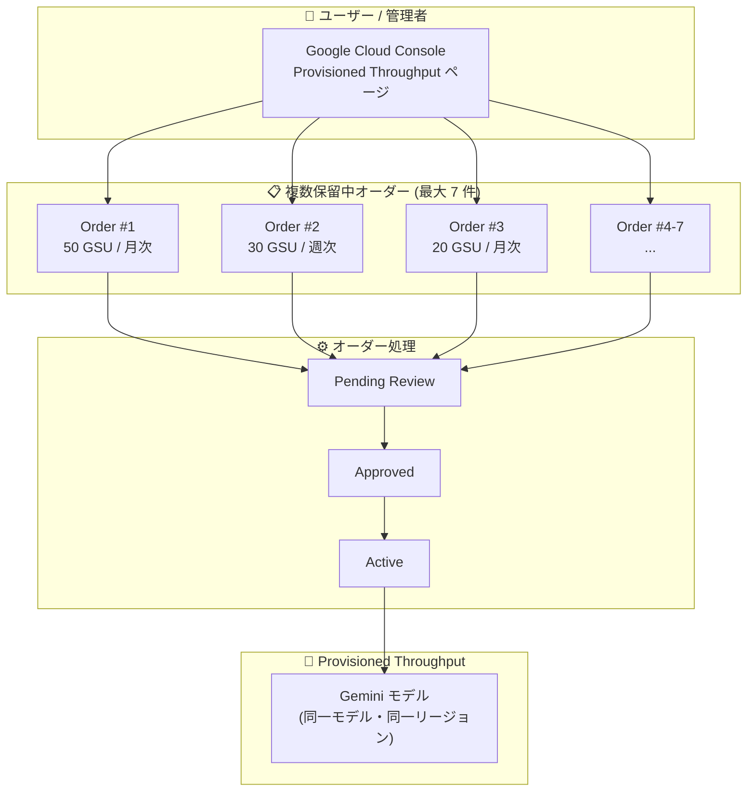

# Gemini Enterprise Agent Platform: Provisioned Throughput 複数保留中オーダーが GA

**リリース日**: 2026-07-01

**サービス**: Gemini Enterprise Agent Platform

**機能**: Provisioned Throughput - Multiple Pending Orders (複数保留中オーダー)

**ステータス**: GA (一般提供)

📊 [このアップデートのインフォグラフィックを見る](https://takech9203.github.io/google-cloud-news-summary/20260701-gemini-agent-platform-provisioned-throughput-multiple-orders.html)

## 概要

Gemini Enterprise Agent Platform の Provisioned Throughput において、同一モデル・同一リージョンに対して複数の保留中オーダーを送信できる機能が一般提供 (GA) となった。これにより、最大 7 つの Google モデルオーダーを同じモデルとリージョンの組み合わせで同時に送信できるようになった。

Provisioned Throughput は、Gemini Enterprise Agent Platform 上で固定コスト・固定期間のサブスクリプションとしてスループットを予約するサービスである。本アップデートにより、キャパシティプランニングの柔軟性が大幅に向上し、大規模な AI ワークロードを段階的にスケールアップする際のオペレーション効率が改善される。

対象ユーザーは、Gemini モデルを本番環境で大規模に利用しており、スループットの予約管理を行う Solutions Architect やプラットフォームエンジニアである。

**アップデート前の課題**

- 同一モデル・同一リージョンの組み合わせに対して、同時に 1 つの保留中オーダーしか送信できなかった
- 追加のキャパシティが必要な場合、既存の保留中オーダーが承認・アクティベートされるまで待つ必要があった
- スケールアップ計画を段階的に実行する際に、オーダーを順次処理する必要があり時間がかかっていた

**アップデート後の改善**

- 同一モデル・同一リージョンに対して最大 7 つの保留中オーダーを同時に送信可能になった
- キャパシティの事前確保を並行して進められるようになり、プランニングの柔軟性が向上した
- 段階的なスケールアップや異なるタームのオーダーを同時に計画・送信できるようになった

## アーキテクチャ図

本図は、ユーザーが同一モデル・同一リージョンに対して複数の Provisioned Throughput オーダーを同時に送信し、それぞれが独立してレビュー・承認・アクティベートされるフローを示している。

## サービスアップデートの詳細

### 主要機能

1. **複数保留中オーダーの同時送信**
   - 同一モデル・同一リージョンの組み合わせに対して、最大 7 つの Google モデルオーダーを同時に送信可能
   - 各オーダーは独立して処理され、個別に承認・アクティベートされる

2. **柔軟なキャパシティプランニング**
   - 異なる GSU 数、異なるターム (週次/月次) のオーダーを並行して計画可能
   - 段階的なスケールアップを事前に一括でオーダーできる

3. **独立したオーダーライフサイクル管理**
   - 各オーダーは独立したステータス (Pending Review → Approved → Active) を持つ
   - 個別のオーダーのキャンセルが可能 (Pending Review 状態の場合)

## 技術仕様

### オーダー管理

| 項目 | 詳細 |
|------|------|
| 最大同時保留中オーダー数 | 7 件 (同一モデル・同一リージョン) |
| 対象モデル | Google モデル (Gemini シリーズ等) |
| オーダーステータス | Pending Review → Approved → Active |
| キャンセル | Pending Review 状態でのみ可能 |
| GSU 最小購入単位 | モデルにより異なる (多くのモデルで 1 GSU) |

### 必要な権限

| Permission | 説明 |
|------------|------|
| `aiplatform.provisionedThroughputs.create` | 新しい Provisioned Throughput オーダーの送信 |
| `aiplatform.provisionedThroughputs.get` | 特定のオーダーの閲覧 |
| `aiplatform.provisionedThroughputs.list` | 全オーダーの一覧表示 |
| `aiplatform.provisionedThroughputs.update` | オーダーの変更 |
| `aiplatform.provisionedThroughputs.cancel` | 保留中オーダーのキャンセル |

必要なロール: `roles/aiplatform.provisionedThroughputAdmin`

## 設定方法

### 前提条件

1. Gemini Enterprise Agent Platform が有効化されたプロジェクト
2. `roles/aiplatform.provisionedThroughputAdmin` ロールの付与
3. QPM が 30,000 を超える見込みの場合はクォータ調整のリクエスト

### 手順

#### ステップ 1: Provisioned Throughput ページにアクセス

Google Cloud Console で [Provisioned Throughput ページ](https://console.cloud.google.com/agent-platform/provisioned-throughput) にアクセスする。

#### ステップ 2: 新規オーダーの作成

1. **New order** をクリック
2. **Order name** を入力
3. **Model** を選択
4. **Region** を選択
5. **Estimation tool** で必要な GSU 数を見積もり

#### ステップ 3: 追加オーダーの送信

同一モデル・同一リージョンに対して、ステップ 2 を繰り返し最大 7 件までオーダーを送信する。各オーダーで異なる GSU 数やタームを指定可能。

## メリット

### ビジネス面

- **キャパシティ確保の迅速化**: 将来の需要増に備えて複数のオーダーを事前に送信し、承認を並行して進められる
- **柔軟な契約管理**: 異なるターム (週次/月次) のオーダーを組み合わせ、コスト最適化が可能
- **スケーリング計画の効率化**: 段階的な成長に合わせて、複数のオーダーを一度に計画・送信できる

### 技術面

- **運用負荷の軽減**: オーダーの承認待ちによるブロッキングが解消される
- **可用性の向上**: 複数のアクティブオーダーにより、より安定したスループット確保が可能
- **計画的なスケールアウト**: 既存オーダーの処理完了を待たずに次のオーダーを送信できる

## デメリット・制約事項

### 制限事項

- 同一モデル・同一リージョンで最大 7 件までの制限がある
- Google モデルのみが対象 (パートナーモデルには適用されない)
- Provisioned Throughput はコミットメントであり、ターム途中でのキャンセルは不可
- バッチ予測や Fine Tuning には Provisioned Throughput は対応していない
- グローバルエンドポイントでは Provisioned Throughput は利用不可

### 考慮すべき点

- 複数オーダーの合計 GSU が実際の必要量を大幅に超えないよう、GSU 見積もりツールで適切に計算すること
- オーダー処理には数分から数週間かかる場合があり、容量の空き状況に依存する
- 超過分はデフォルトで Pay-as-you-go として課金される

## ユースケース

### ユースケース 1: 段階的スケールアップ計画

**シナリオ**: 新サービスのローンチに向けて、3 段階でスループットを増強する必要がある。フェーズ 1 (テスト) で 10 GSU、フェーズ 2 (限定公開) で 30 GSU、フェーズ 3 (一般公開) で 50 GSU を計画。

**実装例**:
- Order #1: 10 GSU (週次ターム、即時開始)
- Order #2: 30 GSU (月次ターム、フェーズ 2 向け)
- Order #3: 50 GSU (月次ターム、フェーズ 3 向け)

3 件のオーダーを同時に送信し、それぞれの承認を並行して進める。

**効果**: 各フェーズの開始時にキャパシティが確保されており、ローンチスケジュールの遅延リスクを低減できる。

### ユースケース 2: マルチテナント環境での分離管理

**シナリオ**: 複数のプロダクトチームが同一モデル (例: Gemini 3.5 Flash) を使用しており、チームごとにスループットを分離して管理したい。

**実装例**:
- Order #1: Team A 向け (20 GSU)
- Order #2: Team B 向け (15 GSU)
- Order #3: Team C 向け (10 GSU)

**効果**: チームごとのコスト配分と使用量管理が容易になり、Split 機能と組み合わせてさらに細かい管理が可能。

## 料金

Provisioned Throughput の料金は、GSU 数とターム (週次/月次) により決定される固定料金制である。

詳細な料金については以下を参照:
- [Provisioned Throughput 料金ページ](https://cloud.google.com/gemini-enterprise-agent-platform/generative-ai/pricing#provisioned-throughput)

複数オーダーの場合、各オーダーの GSU 数に基づいて個別に課金される。超過トラフィックはデフォルトで Pay-as-you-go レートで課金される。

## 利用可能リージョン

Provisioned Throughput がサポートされるリージョンで利用可能。対応リージョンの一覧は以下を参照:
- [Deployments and endpoints - Available locations](https://docs.cloud.google.com/gemini-enterprise-agent-platform/resources/locations)

注: グローバルエンドポイントでは Provisioned Throughput は利用不可。リージョナルエンドポイントを使用する必要がある。

## 関連サービス・機能

- **Priority PayGo**: Provisioned Throughput のコミットメントなしで、標準 PayGo より安定したパフォーマンスを提供する消費オプション (2026年5月 GA)
- **Single Zone Provisioned Throughput**: 特定リージョンの単一ゾーンでスループットを予約するオプション
- **Provisioned Throughput Split 機能**: アクティブオーダーを 2 つに分割し、部分的なマイグレーションを容易にする機能
- **Provisioned Throughput Latency SLA**: Provisioned Throughput でトークン毎秒のレイテンシ SLA を提供 (2026年5月 GA)
- **Cloud Monitoring**: Provisioned Throughput の使用状況モニタリング

## 参考リンク

- 📊 [インフォグラフィック](https://takech9203.github.io/google-cloud-news-summary/20260701-gemini-agent-platform-provisioned-throughput-multiple-orders.html)
- [公式リリースノート](https://docs.cloud.google.com/release-notes#July_01_2026)
- [Multiple pending orders ドキュメント](https://docs.cloud.google.com/gemini-enterprise-agent-platform/models/provisioned-throughput/purchase-provisioned-throughput#multiple)
- [Provisioned Throughput の購入方法](https://docs.cloud.google.com/gemini-enterprise-agent-platform/models/provisioned-throughput/purchase-provisioned-throughput)
- [Provisioned Throughput の使用方法](https://docs.cloud.google.com/gemini-enterprise-agent-platform/models/provisioned-throughput/use-provisioned-throughput)
- [GSU とバーンダウンレートの計算](https://docs.cloud.google.com/gemini-enterprise-agent-platform/models/provisioned-throughput/measure-provisioned-throughput)
- [料金ページ](https://cloud.google.com/gemini-enterprise-agent-platform/generative-ai/pricing#provisioned-throughput)

## まとめ

Gemini Enterprise Agent Platform の Provisioned Throughput で複数保留中オーダー機能が GA となり、同一モデル・同一リージョンに最大 7 件のオーダーを同時送信できるようになった。これにより、大規模 AI ワークロードのキャパシティプランニングが大幅に効率化される。本番環境で Gemini モデルを大規模利用しているユーザーは、段階的スケールアップやマルチテナント管理のシナリオでこの機能を活用することを推奨する。

---

**タグ**: #GeminiEnterpriseAgentPlatform #ProvisionedThroughput #GA #キャパシティプランニング #GSU #スループット管理
