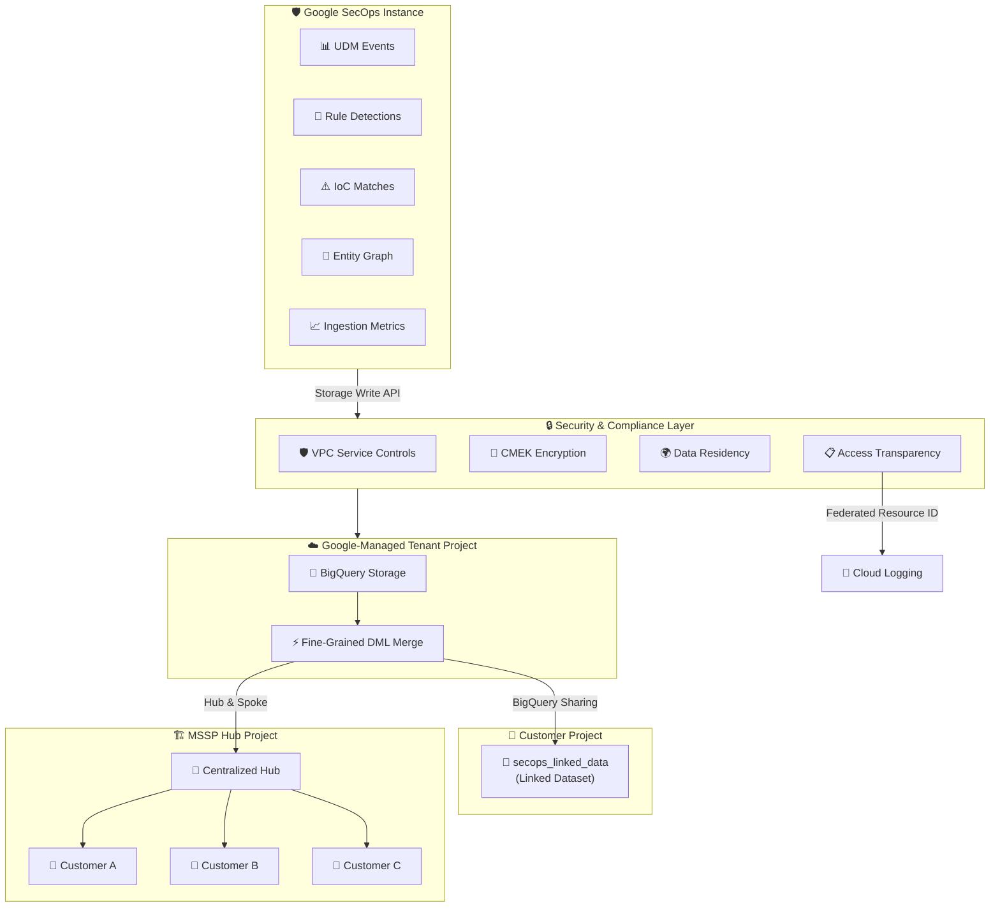

# Google SecOps: Advanced BigQuery Export のセキュリティ・コンプライアンス強化

**リリース日**: 2026-07-01

**サービス**: Google SecOps (Google Security Operations)

**機能**: Advanced BigQuery Export - セキュリティ・コンプライアンス強化とデータセット拡張

**ステータス**: Preview (Enterprise Plus のみ)

📊 [このアップデートのインフォグラフィックを見る](https://takech9203.github.io/google-cloud-news-summary/20260701-google-secops-enhanced-security-compliance.html)

## 概要

Google SecOps の Advanced BigQuery Export 機能に、セキュリティ・コンプライアンスの大幅な強化と新しいデータセットのサポートが追加された。この機能は Preview 段階であり、Enterprise Plus ライセンスを持つ顧客のみが利用可能である。

今回のアップデートでは、VPC Service Controls (VPC-SC)、Customer-Managed Encryption Keys (CMEK)、Data Residency (DRZ) のネイティブサポートが追加された。さらに、エクスポート対象データセットが拡張され、従来の UDM イベント、ルール検出、IoC マッチに加えて Entity Graph と Ingestion Metrics のエクスポートが可能になった。データ整合性の面では Fine-Grained DML マージによる重複排除が実装され、MSSP 向けのハブ・アンド・スポーク型マルチテナント管理もサポートされた。

このアップデートは、規制要件の厳しい業界 (金融、医療、政府機関など) でセキュリティオペレーションを運用する組織や、複数顧客のセキュリティ管理を行う MSSP にとって特に重要である。

**アップデート前の課題**

- Advanced BigQuery Export は CMEK を有効にしたインスタンスでは利用不可という制限があった
- VPC Service Controls との統合には個別の構成が必要だった
- Entity Graph と Ingestion Metrics のデータは Advanced BigQuery Export の対象外であり、別途エクスポート設定が必要だった
- MSSP が複数顧客テナントのデータを一元管理するための効率的な仕組みがなかった
- データの重複排除には複雑な SQL ルーチンを自分で記述する必要があった

**アップデート後の改善**

- VPC-SC、CMEK、DRZ がネイティブサポートされ、エンタープライズレベルのセキュリティ・コンプライアンス要件に対応可能になった
- Entity Graph と Ingestion Metrics が Advanced BigQuery Export の対象に追加され、セキュリティデータの包括的な分析が単一のパイプラインで可能になった
- Fine-Grained DML マージにより、クリーンで重複のないデータが自動的に提供されるようになった
- MSSP がハブ・アンド・スポークモデルで複数顧客テナントのリンクされたデータセットを一元的に管理できるようになった
- Access Transparency の監査ログが Cloud Logging に直接配信されるようになった

## アーキテクチャ図



Advanced BigQuery Export のアーキテクチャは、セキュリティレイヤーを経由したストリーミングパイプラインで構成される。VPC-SC、CMEK、DRZ によるセキュリティ制御の下、データは Google 管理のテナントプロジェクトに書き込まれ、Fine-Grained DML マージで重複排除された後、顧客プロジェクトにリンクされたデータセットとして公開される。

## サービスアップデートの詳細

### 主要機能

1. **データセット拡張 (Entity Graph / Ingestion Metrics)**
   - 従来の UDM イベント、ルール検出、IoC マッチに加え、Entity Graph と Ingestion Metrics のエクスポートが新たにサポートされた
   - Entity Graph: エンティティとその関係性の記述を含むデータ
   - Ingestion Metrics: ログ取り込み数、イベント生成数、パースエラー数などの統計情報

2. **セキュリティ・コンプライアンス強化**
   - **VPC Service Controls (VPC-SC)**: サービス境界内でのデータアクセス制御により、データ流出リスクを軽減
   - **Customer-Managed Encryption Keys (CMEK)**: 顧客が Cloud KMS で管理する暗号鍵によるデータ保護
   - **Data Residency (DRZ)**: データの保存場所を特定リージョンに制限
   - **Access Transparency**: Federated Resource Identification Service を使用して、顧客向け監査ログを Cloud Logging ワークスペースに直接配信

3. **データ整合性と重複排除**
   - Fine-Grained DML マージにより、バックグラウンドでレコードを適切に更新
   - 複雑な SQL ルーチンを記述することなく、クリーンで重複のないデータを自動的に取得可能
   - at-least-once 配信セマンティクスに起因する重複データの問題を解消

4. **MSSP サポート (ハブ・アンド・スポーク)**
   - Managed Security Service Providers (MSSP) が単一の集約された「ハブ」プロジェクトから複数顧客テナントのリンクされたデータセットにプログラマティックにサブスクライブ可能
   - 複数顧客テナントにわたる分析を効率的に管理

5. **Enum マッピングテーブル**
   - `entity_enum_value_to_name_mapping`: Entity Graph テーブルの列挙型の数値を文字列にマッピング
   - `udm_enum_value_to_name_mapping`: Events テーブルの列挙型の数値を文字列にマッピング

## 技術仕様

### エクスポート対象データセット

| データセット | 説明 | データ鮮度 |
|------|------|------|
| UDM Events | ログデータから作成された UDM レコード (エイリアス情報で拡充済み) | 5-10 分 |
| Rule Detections | ルールが 1 つ以上のイベントに一致したインスタンス | ベストエフォート |
| IoC Matches | IoC フィードに一致したアーティファクト | ベストエフォート |
| Entity Graph | エンティティとその関係性の記述 | 約 4 時間 (バッチ) |
| Ingestion Metrics | 取り込みと正規化に関する統計 | ベストエフォート |

### セキュリティ機能の対応状況

| セキュリティ機能 | 対応状況 | 説明 |
|------|------|------|
| VPC Service Controls | ネイティブサポート | サービス境界内でのデータアクセス制御 |
| CMEK | ネイティブサポート | Cloud KMS による顧客管理暗号鍵 |
| Data Residency (DRZ) | ネイティブサポート | データ保存場所の地理的制限 |
| Access Transparency | ネイティブサポート | Cloud Logging への監査ログ配信 |

### IAM 権限

Advanced BigQuery Export のデータをクエリするには、以下の IAM ロールが必要:

| ロール | 用途 |
|------|------|
| `roles/bigquery.dataViewer` | リンクされたデータセットのデータ閲覧 |
| `roles/bigquery.jobUser` | BigQuery ジョブの実行 |

## 設定方法

### 前提条件

1. Google SecOps Enterprise Plus ライセンスを保有していること
2. Advanced BigQuery Export の有効化をリクエスト済みであること (Public Preview のため、リクエストベースでの有効化)
3. Google SecOps インスタンスにリンクされた Google Cloud プロジェクトが存在すること

### 手順

#### ステップ 1: リンクされたデータセットの確認

BigQuery コンソールの Explorer パネルでプロジェクトリソースに移動し、`secops_linked_data` という名前のリンクされたデータセットを確認する。

```sql
-- アクセス確認のテストクエリ
SELECT *
FROM `PROJECT_ID.secops_linked_data.events`
LIMIT 10;
```

#### ステップ 2: VPC Service Controls の構成 (必要に応じて)

VPC-SC を使用する場合、Google SecOps をサービス境界に含め、適切な Ingress/Egress ルールを設定する。Advanced BigQuery Export は VPC-SC 準拠機能としてサポートされている。

#### ステップ 3: CMEK の構成 (必要に応じて)

Cloud KMS で暗号鍵を作成し、Google SecOps インスタンスに適用する。CMEK はすべてのサポートされるリージョンで利用可能である。

## メリット

### ビジネス面

- **規制コンプライアンスの達成**: VPC-SC、CMEK、DRZ のネイティブサポートにより、金融・医療・政府機関などの厳格な規制要件を満たすことが可能
- **MSSP の効率的な運用**: ハブ・アンド・スポークモデルにより、単一プロジェクトから複数顧客のセキュリティデータを一元管理でき、運用コストを削減
- **ゼロメンテナンス**: Google 管理プロジェクトでのデータ管理により、データパイプラインやストレージの運用負荷がゼロ

### 技術面

- **データ整合性の向上**: Fine-Grained DML マージにより、手動での重複排除処理が不要になり、常にクリーンなデータを利用可能
- **包括的なセキュリティデータ分析**: Entity Graph と Ingestion Metrics の追加により、単一のリンクされたデータセットからセキュリティデータの全体像を分析可能
- **監査証跡の強化**: Access Transparency ログが Cloud Logging に直接配信されることで、アクセス監査の可視性が向上

## デメリット・制約事項

### 制限事項

- Enterprise Plus ライセンスが必須であり、他のライセンスティアでは利用不可
- Public Preview 段階のため、リクエストベースでの有効化が必要
- Entity Graph のデータ鮮度は約 4 時間 (バッチプロセスによるエクスポート)
- UDM スキーマは 27,000 以上のフィールドを含むが、BigQuery のテーブルあたりのソフトリミットは 10,000 列
- データ保持期間は Google SecOps プロジェクトと同期され、個別設定は不可
- 再エンリッチされた UDM イベントはエクスポート対象外
- 履歴データは Advanced BigQuery Export 有効化時点からのみエクスポート開始

### 考慮すべき点

- 移行期間中は既存のエクスポートパイプラインと新しいパイプラインの二重運用となる
- Pre-GA 機能のため、サポートが限定的であり、変更が互換性を保たない可能性がある
- 顧客が負担するのは BigQuery クエリ実行時の分析コストのみだが、大規模クエリには注意が必要

## ユースケース

### ユースケース 1: コンプライアンスが厳格な金融機関でのセキュリティ分析

**シナリオ**: 金融業界の規制要件 (データ主権、暗号化管理) を満たしながら、BigQuery 上でセキュリティデータの高度な分析を実行したい。

**実装例**:
```sql
-- VPC-SC 境界内のリンクされたデータセットから
-- 不審なネットワークアクティビティを検出
SELECT
  metadata.event_timestamp,
  principal.hostname,
  target.ip,
  network.dns.questions.name
FROM `PROJECT_ID.secops_linked_data.events`
WHERE hour_time_bucket >= TIMESTAMP_SUB(CURRENT_TIMESTAMP(), INTERVAL 24 HOUR)
  AND network.dns.questions.name IS NOT NULL
ORDER BY metadata.event_timestamp DESC;
```

**効果**: CMEK による暗号化とVPC-SC によるアクセス制御の下で、規制要件を満たしながらニアリアルタイムの脅威検出が可能。

### ユースケース 2: MSSP による複数顧客テナントの一元分析

**シナリオ**: MSSP が複数の顧客テナントのセキュリティデータを単一のハブプロジェクトから横断的に分析し、脅威の傾向を把握したい。

**効果**: プログラマティックなサブスクリプションにより、新規顧客のオンボーディングが迅速化され、統合ダッシュボードでの一元監視が実現。個別にデータパイプラインを構築する必要がなくなる。

### ユースケース 3: データ品質管理と取り込みモニタリング

**シナリオ**: Ingestion Metrics のエクスポートにより、ログの取り込み状況、パースエラー、データ品質を BigQuery 上で可視化し、アラートを設定したい。

**効果**: Entity Graph と Ingestion Metrics を BI ツール (Power BI, Looker) と連携させることで、セキュリティデータパイプラインの健全性を継続的に監視し、データ品質の低下を早期検出可能。

## 料金

Advanced BigQuery Export では、データの取り込みとストレージのコストは Google SecOps が負担する。顧客が負担するのは、BigQuery でクエリを実行する際の分析コストのみである。

料金の詳細については [BigQuery の料金ページ](https://cloud.google.com/bigquery/pricing)および [Google SecOps の料金ページ](https://cloud.google.com/chronicle/pricing)を参照。

## 利用可能リージョン

Google SecOps がサポートするすべてのリージョンで利用可能。CMEK は Multi-region (eu, us) およびサポートされる全リージョンで対応している。Multi-region を選択した場合、追加のリージョン固有の CMEK 設定が必要 (eu の場合は europe-west1、us の場合は us-central1)。

詳細は [SecOps Services Locations Page](https://cloud.google.com/terms/secops/data-residency) を参照。

## 関連サービス・機能

- **BigQuery**: Advanced BigQuery Export のデータ格納先。リンクされたデータセットを通じてクエリ可能
- **Cloud KMS**: CMEK の暗号鍵管理に使用
- **VPC Service Controls**: サービス境界によるデータ流出防止
- **Cloud Logging**: Access Transparency 監査ログの配信先
- **BigQuery Analytics Hub**: データ共有とリンクされたデータセットの管理基盤
- **Security Command Center**: Google SecOps と統合されたセキュリティ管理プラットフォーム

## 参考リンク

- 📊 [インフォグラフィック](https://takech9203.github.io/google-cloud-news-summary/20260701-google-secops-enhanced-security-compliance.html)
- [公式リリースノート](https://docs.google.com/release-notes#July_01_2026)
- [Advanced BigQuery Export ドキュメント](https://docs.cloud.google.com/chronicle/docs/reports/bigquery-export)
- [VPC Service Controls for Google SecOps](https://docs.cloud.google.com/chronicle/docs/secops/vpcsc-for-secops)
- [CMEK for Google SecOps](https://docs.cloud.google.com/chronicle/docs/secops/cmek_for_secops)
- [BigQuery の料金](https://cloud.google.com/bigquery/pricing)

## まとめ

今回の Advanced BigQuery Export の機能強化は、エンタープライズレベルのセキュリティ・コンプライアンス要件への対応を大幅に前進させるものである。VPC-SC、CMEK、DRZ のネイティブサポートにより、従来は利用が困難だった規制の厳しい業界でも Advanced BigQuery Export の活用が可能になった。Enterprise Plus ライセンスを持つ組織は、Google SecOps 担当者に連絡してプレビュー機能の有効化をリクエストし、既存のエクスポート環境からのスムーズな移行を計画することを推奨する。

---

**タグ**: #GoogleSecOps #BigQuery #VPC-SC #CMEK #DataResidency #MSSP #SecurityOperations #EnterpriseSecurityPlus #Preview
