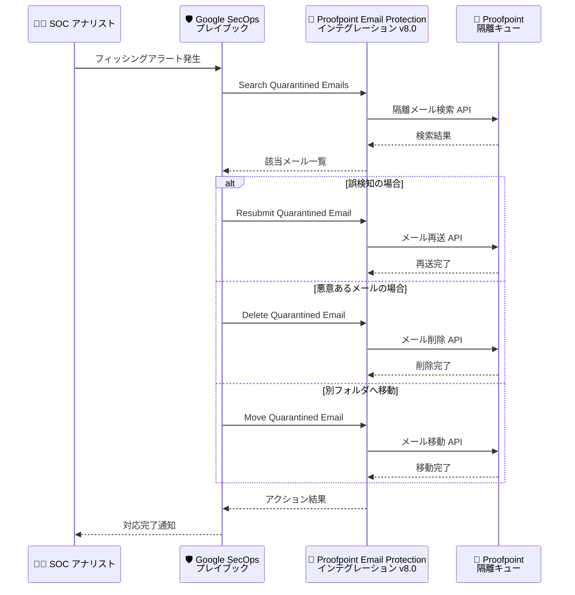

# Google SecOps Marketplace: Proofpoint Email Protection Version 8.0

**リリース日**: 2026-07-01

**サービス**: Google SecOps Marketplace

**機能**: Proofpoint Email Protection インテグレーション v8.0 - 隔離メール管理アクション追加

**ステータス**: Feature

📊 [このアップデートのインフォグラフィックを見る](https://takech9203.github.io/google-cloud-news-summary/20260701-google-secops-marketplace-proofpoint-v8.html)

## 概要

Google SecOps Marketplace の Proofpoint Email Protection インテグレーションがバージョン 8.0 にアップデートされ、隔離メールの検索・管理を行う 4 つの新アクションが追加された。これにより、Google SecOps のプレイブックから Proofpoint の隔離キュー内のメールをプログラム的に操作できるようになる。

従来の Proofpoint Email Protection インテグレーションは、エンティティのエンリッチメントと接続テスト（Ping）のみをサポートしていたが、v8.0 では隔離メールのライフサイクル管理（検索・削除・再送・移動）が可能となった。さらに、既存の Enrich Entities および Ping アクションのバックエンドスクリプトが新フレームワークに対応するよう更新されている。

このアップデートは、メールセキュリティの運用を Google SecOps プラットフォーム上で一元管理したいセキュリティチームにとって重要な機能強化である。

**アップデート前の課題**

- Proofpoint Email Protection の隔離メール管理は Proofpoint 管理コンソールでの手動操作が必要だった
- Google SecOps のプレイブックから隔離キュー内のメールを直接操作する手段がなかった
- インシデント対応時に隔離メールの確認・再送・削除のためにツールを切り替える必要があった
- Enrich Entities と Ping のみでは、検知後の対応アクションが限定的だった

**アップデート後の改善**

- Google SecOps プレイブックから隔離メールの検索・削除・再送・移動をプログラム的に実行可能になった
- インシデント対応ワークフローを Proofpoint 管理コンソールに移動せず Google SecOps 内で完結できる
- 隔離メールの管理を自動化プレイブックに組み込むことで、対応時間を短縮できる
- バックエンドスクリプトが新フレームワークに対応し、今後の機能拡張の基盤が整備された

## アーキテクチャ図



Google SecOps プレイブックから Proofpoint Email Protection の隔離キューに対して、検索・削除・再送・移動の各アクションを実行するフローを示す。インシデントの判定結果に応じて適切なアクションが自動的に選択される。

## サービスアップデートの詳細

### 主要機能

1. **Search Quarantined Emails（隔離メール検索）**
   - Proofpoint の隔離キュー内のメールを条件に基づいて検索
   - インシデント調査時に関連する隔離メールを特定するために使用
   - プレイブック内で後続アクション（削除・再送・移動）の対象を動的に決定可能

2. **Delete Quarantined Email（隔離メール削除）**
   - 隔離キューから特定のメールを完全に削除
   - 確実に悪意があると判定されたメールの処分に使用
   - プレイブックの自動化により、大量の悪意あるメールの一括処理が可能

3. **Resubmit Quarantined Email（隔離メール再送）**
   - 誤って隔離されたメールを元の受信者に再配送
   - 偽陽性（False Positive）への迅速な対応を自動化
   - ビジネスクリティカルなメールの配送遅延を最小化

4. **Move Quarantined Email（隔離メール移動）**
   - 隔離キュー内のメールを別のフォルダやカテゴリに移動
   - トリアージワークフローにおけるメールの分類管理に使用
   - 段階的な審査プロセスの実装が可能

5. **バックエンドフレームワーク更新（Enrich Entities / Ping）**
   - 既存の Enrich Entities アクションと Ping アクションのバックエンドスクリプトを新フレームワークに移行
   - 今後のインテグレーション拡張における互換性と安定性を向上

## 技術仕様

### インテグレーション設定パラメータ

| パラメータ | 必須 | 説明 |
|-----------|------|------|
| API Root | はい | Proofpoint Email Protection インスタンスの API ルート |
| Username | はい | Proofpoint Email Protection インスタンスのユーザー名 |
| Password | はい | Proofpoint Email Protection インスタンスのパスワード |
| Verify SSL | いいえ | Proofpoint サーバーへの SSL 接続証明書を検証する |

### アクション一覧（v8.0 時点）

| アクション | バージョン | 対象エンティティ | 説明 |
|-----------|-----------|-----------------|------|
| Enrich Entities | 更新 | Hostname, User | エンティティのエンリッチメント（新フレームワーク対応） |
| Ping | 更新 | 全エンティティ | 接続テスト（新フレームワーク対応） |
| Search Quarantined Emails | 新規 | - | 隔離メールの検索 |
| Delete Quarantined Email | 新規 | - | 隔離メールの削除 |
| Resubmit Quarantined Email | 新規 | - | 隔離メールの再送 |
| Move Quarantined Email | 新規 | - | 隔離メールの移動 |

## 設定方法

### 前提条件

1. Google SecOps プラットフォームへのアクセス権限（Response 機能を含む）
2. Proofpoint Email Protection インスタンスの API 資格情報（ユーザー名・パスワード）
3. Proofpoint Email Protection の隔離管理 API へのネットワーク接続

### 手順

#### ステップ 1: インテグレーションの更新

Google SecOps Marketplace からインテグレーションをバージョン 8.0 に更新する。

1. Google SecOps で **Content Hub > Response Integrations** に移動
2. Proofpoint Email Protection インテグレーションを検索
3. バージョン 8.0 へのアップデートを適用

#### ステップ 2: 接続テスト

```
Ping アクションを実行して Proofpoint サーバーへの接続を確認
期待される結果: is_success = True
```

#### ステップ 3: プレイブックへの組み込み

新しい隔離管理アクションをプレイブックに追加して、インシデント対応ワークフローを構築する。

1. Google SecOps で **Response > Playbooks** に移動
2. 対象のプレイブックを開く（または新規作成）
3. 適切な位置に新しいアクションを追加
4. 条件フローを使用して、判定結果に応じたアクションを分岐

## メリット

### ビジネス面

- **対応時間の短縮**: 隔離メールの管理をプレイブックで自動化することで、手動対応に比べて大幅に対応時間を短縮
- **運用コストの削減**: ツール切り替えの排除により、SOC アナリストの作業効率が向上
- **偽陽性への迅速な対応**: 誤って隔離されたビジネスメールを自動的に再配送し、業務への影響を最小化

### 技術面

- **ワークフロー統合**: Google SecOps 内でメールセキュリティの検知から対応までを一貫して実行可能
- **プログラム的な制御**: API ベースの隔離メール管理により、大規模環境での一括操作が容易
- **フレームワーク最新化**: 新フレームワークへの移行により、今後のアップデートや新機能追加がスムーズに

## デメリット・制約事項

### 制限事項

- Proofpoint Email Protection の API アクセス権限が必要（隔離管理の権限を含む）
- 隔離メール操作の結果は Proofpoint 側のポリシーや設定に依存する
- 再送アクション実行後のメール配送は Proofpoint のルーティング設定に従う

### 考慮すべき点

- 自動化プレイブックで削除アクションを使用する場合、誤削除防止のための承認フローの組み込みを検討すべき
- 大量の隔離メールに対する一括操作時は API レート制限に注意が必要
- Proofpoint Email Protection インスタンスのバージョンとの互換性を事前に確認すること

## ユースケース

### ユースケース 1: フィッシングメール自動処理

**シナリオ**: フィッシングアラートが発生した際に、同一送信者からの隔離メールを自動的に検索・削除する。

**実装例**:
```
プレイブック フロー:
1. アラートトリガー: フィッシング検知
2. Search Quarantined Emails: 送信者アドレスで検索
3. 条件分岐: 該当メールが存在する場合
4. Delete Quarantined Email: 全該当メールを削除
5. ケースウォールに結果を記録
```

**効果**: フィッシングキャンペーンに関連する隔離メールの処分を自動化し、アナリストの手動作業を排除

### ユースケース 2: 偽陽性メールの自動復旧

**シナリオ**: エグゼクティブからの報告で正当なメールが隔離されていることが判明し、承認フロー後に再送する。

**実装例**:
```
プレイブック フロー:
1. 手動トリガー: 偽陽性報告受信
2. Search Quarantined Emails: メッセージ ID で検索
3. 承認リンク送信: IT マネージャーに承認要求
4. 承認後: Resubmit Quarantined Email 実行
5. 報告者に復旧通知を送信
```

**効果**: 承認プロセスを含む安全な偽陽性対応フローにより、ビジネスメールの配送遅延を最小化

### ユースケース 3: 隔離メールのトリアージ自動化

**シナリオ**: 定期的に隔離キューをスキャンし、脅威レベルに応じてメールを分類・処理する。

**効果**: SOC チームの定常的な隔離キュー管理作業を自動化し、高優先度のインシデントに集中できる環境を実現

## 料金

Google SecOps Marketplace のインテグレーションは Google SecOps のライセンスに含まれる。Proofpoint Email Protection 側の API アクセスについては、Proofpoint のライセンス契約を確認すること。

- [Google SecOps の料金](https://cloud.google.com/chronicle/pricing)

## 関連サービス・機能

- **Google SecOps SOAR プレイブック**: 隔離メール管理アクションを自動化ワークフローに組み込むための基盤
- **Proofpoint Threat Protection インテグレーション**: Proofpoint のブロックリスト・許可リスト管理を提供する関連インテグレーション
- **Proofpoint Cloud Threat Response インテグレーション**: Proofpoint のインシデント取り込みと脅威分析を提供する関連インテグレーション
- **Google SecOps Marketplace**: サードパーティセキュリティツールとの統合を管理するマーケットプレイス

## 参考リンク

- 📊 [インフォグラフィック](https://takech9203.github.io/google-cloud-news-summary/20260701-google-secops-marketplace-proofpoint-v8.html)
- [公式リリースノート](https://docs.cloud.google.com/release-notes#July_01_2026)
- [Proofpoint Email Protection インテグレーション ドキュメント](https://docs.cloud.google.com/chronicle/docs/soar/marketplace-integrations/proofpoint-ps)
- [Google SecOps Marketplace リリースノート](https://docs.cloud.google.com/chronicle/docs/soar/marketplace-integrations/release-notes)
- [インテグレーションの設定](https://docs.cloud.google.com/chronicle/docs/soar/respond/integrations-setup/configure-integrations)
- [Google SecOps の料金](https://cloud.google.com/chronicle/pricing)

## まとめ

Proofpoint Email Protection インテグレーション v8.0 は、隔離メールの検索・削除・再送・移動という実用的なアクションを追加し、Google SecOps プラットフォーム上でのメールセキュリティ運用を大幅に強化する。セキュリティチームは、インシデント対応の自動化プレイブックにこれらのアクションを組み込むことで、対応速度の向上と運用負荷の軽減を実現できる。既存環境でのアップデート適用と、隔離メール管理を含むプレイブックの構築を推奨する。

---

**タグ**: #GoogleSecOps #Marketplace #ProofpointEmailProtection #隔離メール管理 #SOAR #メールセキュリティ #プレイブック自動化
