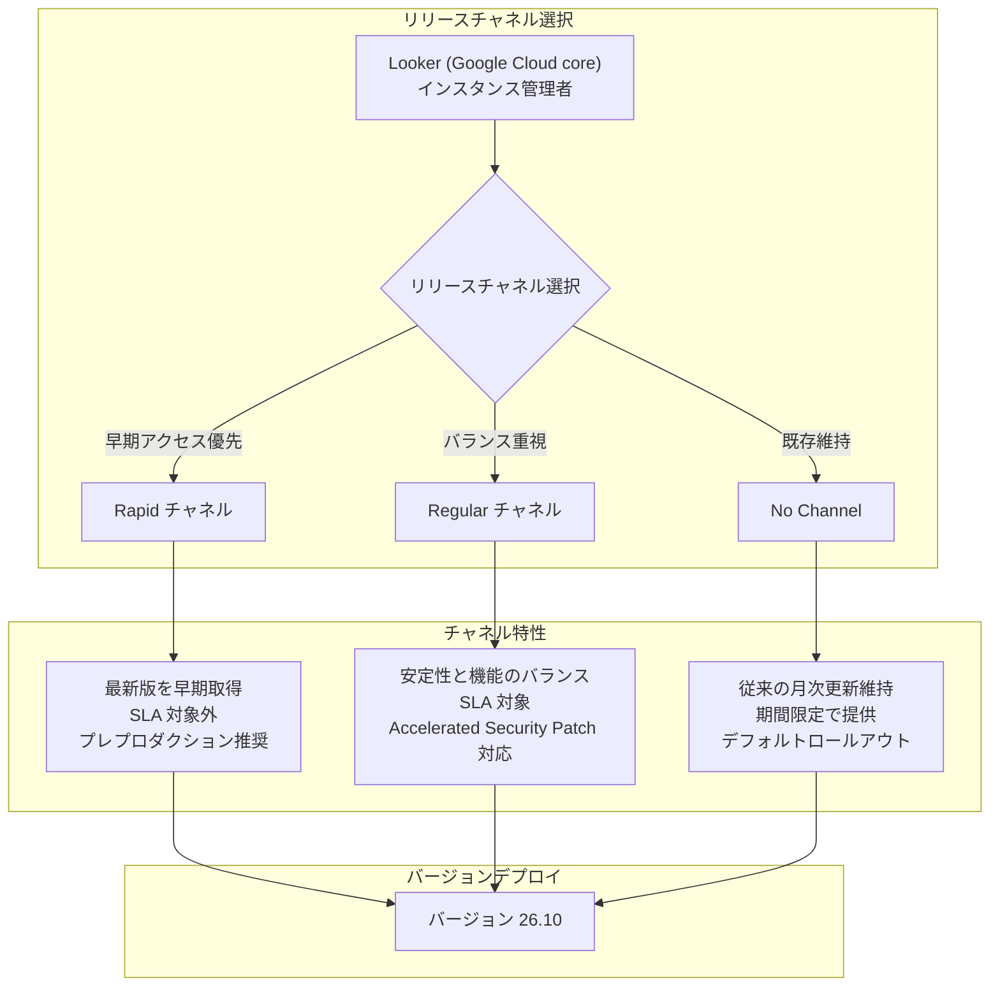

# Looker (Google Cloud core): リリースチャネル機能 (Preview)

**リリース日**: 2026-07-01

**サービス**: Looker (Google Cloud core)

**機能**: リリースチャネル (Release Channels) - Rapid / Regular / No Channel

**ステータス**: Preview

📊 [このアップデートのインフォグラフィックを見る](https://takech9203.github.io/google-cloud-news-summary/20260701-looker-release-channels-preview.html)

## 概要

Looker (Google Cloud core) にリリースチャネル機能が Preview として導入されました。この機能により、ユーザーは Rapid、Regular、No Channel の 3 つのチャネルから選択し、インスタンスへのバージョンアップデートの頻度と安定性のバランスを自ら管理できるようになります。現在、すべてのチャネルで最新バージョン 26.10 がデプロイされています。

この機能は、GKE (Google Kubernetes Engine) や Cloud Service Mesh で既に採用されているリリースチャネルモデルを Looker にも適用したものです。組織の要件に応じて、新機能への早期アクセスを優先するか、安定性を重視するかを選択できます。Rapid チャネルは SLA の対象外となる点に注意が必要です。

対象ユーザーは、Looker (Google Cloud core) のインスタンス管理者およびプラットフォームチームです。特に、本番環境とステージング環境で異なるチャネルを使い分けることで、安全なバージョンアップ戦略を実現できます。

**アップデート前の課題**

- Looker (Google Cloud core) のバージョンアップデートは一律のスケジュールで配信され、ユーザーがアップデート頻度を選択できなかった
- 新機能を早期に試したい場合でも、全ユーザーと同じタイミングでの配信を待つ必要があった
- バージョンアップデートの制御は、メンテナンスウィンドウの設定と最大 60 日間の拒否期間 (Deny Maintenance Period) に限られていた
- 本番環境とステージング環境で異なるバージョン戦略を適用する公式な手段がなかった

**アップデート後の改善**

- 3 つのリリースチャネル (Rapid / Regular / No Channel) から組織のニーズに合ったものを選択可能になった
- Rapid チャネルにより新機能や新 API を本番適用前にテストできるようになった
- Regular チャネルでバランスの取れた安定性と機能アクセスが提供される
- Accelerated Security Patching フラグにより、Regular チャネルでセキュリティパッチの迅速な適用をオプトインできるようになった

## アーキテクチャ図



Looker (Google Cloud core) のリリースチャネルは、インスタンスごとに選択でき、各チャネルの特性に応じたバージョンアップデートが配信されます。将来的にはチャネル間でバージョン差が生じ、段階的にプロモーションされる設計です。

## サービスアップデートの詳細

### 主要機能

1. **Rapid チャネル**
   - 新しいリリースを最も早く取得できるチャネル
   - 新機能や新 API を一般提供 (GA) 前にテスト可能
   - プレプロダクション環境での検証に推奨
   - GKE SLA の対象外 (Looker (Google Cloud core) SLA 非適用)

2. **Regular チャネル**
   - より長期間の検証を経たバージョンが提供される
   - 機能の利用可能性とリリースの安定性のバランスを提供
   - 大多数のユーザーに推奨されるチャネル
   - Accelerated Security Patching フラグによるセキュリティパッチの迅速適用オプション

3. **No Channel**
   - 既存の月次アップデート頻度と機能を維持
   - デフォルトのロールアウトスケジュールに従う
   - 即時のデプロイメント中断を防ぐため、期間限定で提供

4. **Accelerated Security Patching**
   - Regular チャネルで利用可能なオプションフラグ
   - 有効にすると、セキュリティパッチが通常よりも迅速に適用される
   - `--accelerated-security-patch-enabled` フラグで制御

## 技術仕様

### リリースチャネル比較

| 項目 | Rapid | Regular | No Channel |
|------|-------|---------|------------|
| 対象ユーザー | プレプロダクション環境 | 大多数のユーザー (推奨) | 移行準備中のユーザー |
| バージョン入手タイミング | 最速 | Rapid の後に昇格 | デフォルトスケジュール |
| SLA 適用 | 対象外 | 対象 | 対象 |
| 安定性 | 新しいが未検証期間短 | バランス良好 | 従来通り |
| Accelerated Security Patch | - | 利用可能 | - |
| 提供期間 | 恒久 | 恒久 | 期間限定 |

### 現在のチャネルバージョン (2026-07-01 時点)

| チャネル | バージョン |
|---------|-----------|
| Rapid | 26.10 |
| Regular | 26.10 |
| No Channel | 26.10 |

## 設定方法

### 前提条件

1. Looker (Google Cloud core) インスタンスが作成済みであること
2. プロジェクトに対する `roles/looker.admin` (Looker Admin) IAM ロールが付与されていること
3. gcloud CLI がインストールされていること (CLI 経由で設定する場合)

### 手順

#### ステップ 1: インスタンス作成時にリリースチャネルを指定

```bash
gcloud alpha looker instances create INSTANCE_NAME \
  --region=REGION \
  --release-channel=regular \
  --edition=enterprise
```

#### ステップ 2: 既存インスタンスのリリースチャネルを変更

```bash
gcloud alpha looker instances update INSTANCE_NAME \
  --region=REGION \
  --release-channel=rapid
```

#### ステップ 3: Accelerated Security Patching を有効化 (Regular チャネル)

```bash
gcloud alpha looker instances update INSTANCE_NAME \
  --region=REGION \
  --release-channel=regular \
  --accelerated-security-patch-enabled
```

## メリット

### ビジネス面

- **リスク管理の柔軟性**: 本番環境では Regular チャネルで安定性を確保しつつ、ステージング環境では Rapid チャネルで新機能を事前検証できる
- **計画的なアップグレード戦略**: 組織のリリースサイクルに合わせたバージョン管理が可能になり、変更管理プロセスとの整合性を向上
- **セキュリティ対応の迅速化**: Accelerated Security Patching により、セキュリティ脆弱性への対応時間を短縮

### 技術面

- **環境分離の改善**: プレプロダクション環境と本番環境で異なるチャネルを使い分けることで、新バージョンの影響を安全にテスト可能
- **GKE との運用モデル統一**: GKE で既に採用されているリリースチャネルモデルと同じコンセプトにより、運用チームの学習コスト軽減
- **gcloud CLI / Terraform 対応**: インフラストラクチャ as コードで一元管理可能

## デメリット・制約事項

### 制限事項

- 現在 Preview ステータスであり、本番ワークロードでの使用には注意が必要
- Rapid チャネルは SLA の対象外であるため、本番環境での利用は推奨されない
- No Channel は期間限定での提供であり、将来的には Rapid / Regular / Stable のいずれかへの移行が必要
- gcloud alpha コマンド (`gcloud alpha looker instances`) 経由でのみ設定可能 (Preview 段階)

### 考慮すべき点

- チャネル変更後、即座にバージョンが変わるわけではなく、次回メンテナンス時に適用される
- Rapid チャネルのバージョンには既知の問題が含まれる可能性があり、回避策が提供されない場合がある
- セキュリティアップグレードは、チャネル設定やメンテナンスウィンドウに関係なく適用される場合がある

## ユースケース

### ユースケース 1: ステージング環境での新機能事前検証

**シナリオ**: 大企業のデータプラットフォームチームが、本番 Looker インスタンスへのアップグレード前に新機能の影響を評価したい

**実装例**:
```bash
# ステージング環境: Rapid チャネルで新機能を早期テスト
gcloud alpha looker instances update looker-staging \
  --region=us-central1 \
  --release-channel=rapid

# 本番環境: Regular チャネルで安定版を使用
gcloud alpha looker instances update looker-production \
  --region=us-central1 \
  --release-channel=regular \
  --accelerated-security-patch-enabled
```

**効果**: 新バージョンの互換性問題や動作変更を本番適用前に発見でき、ダウンタイムやユーザー影響を最小化

### ユースケース 2: セキュリティ重視の金融機関における運用

**シナリオ**: 金融機関がセキュリティパッチの迅速な適用を求めつつ、機能アップデートは安定性を重視したい

**実装例**:
```bash
# Regular チャネル + Accelerated Security Patching
gcloud alpha looker instances update looker-finance \
  --region=asia-northeast1 \
  --release-channel=regular \
  --accelerated-security-patch-enabled
```

**効果**: セキュリティ脆弱性への対応時間を短縮しつつ、安定したバージョンのみが適用されるためビジネス継続性を確保

## 料金

リリースチャネル機能自体には追加料金は発生しません。Looker (Google Cloud core) のインスタンス料金は選択したエディション (Standard / Enterprise / Embed) に基づきます。

詳細は [Looker (Google Cloud core) 料金ページ](https://cloud.google.com/looker/pricing) を参照してください。

## 関連サービス・機能

- **GKE リリースチャネル**: 同じコンセプト (Rapid / Regular / Stable) で Kubernetes バージョンの更新頻度を管理。Looker のリリースチャネルモデルはこれに準拠した設計
- **Cloud Service Mesh リリースチャネル**: GKE クラスタのチャネルに連動して Cloud Service Mesh のバージョンが決定される類似モデル
- **Looker メンテナンスウィンドウ**: リリースチャネルと組み合わせて、メンテナンスの曜日・時間帯を指定可能
- **Looker Deny Maintenance Period**: 最大 60 日間のメンテナンス拒否期間を設定し、重要なビジネス期間中のアップデートを回避

## 参考リンク

- 📊 [インフォグラフィック](https://takech9203.github.io/google-cloud-news-summary/20260701-looker-release-channels-preview.html)
- [公式リリースノート](https://docs.cloud.google.com/release-notes#July_01_2026)
- [Looker (Google Cloud core) リリースプロセス概要](https://docs.cloud.google.com/looker/docs/looker-core-release-process#release_channels)
- [Looker (Google Cloud core) メンテナンス設定](https://docs.cloud.google.com/looker/docs/looker-core-maintenance)
- [gcloud alpha looker instances update リファレンス](https://docs.cloud.google.com/sdk/gcloud/reference/alpha/looker/instances/update)
- [gcloud alpha looker instances create リファレンス](https://docs.cloud.google.com/sdk/gcloud/reference/alpha/looker/instances/create)
- [Looker (Google Cloud core) 料金](https://cloud.google.com/looker/pricing)

## まとめ

Looker (Google Cloud core) のリリースチャネル機能 (Preview) は、バージョンアップデートの頻度と安定性を組織のニーズに合わせて選択できる重要な運用管理機能です。GKE で実績のあるリリースチャネルモデルが Looker にも適用されたことで、プレプロダクション環境での事前検証と本番環境の安定性確保を両立できるようになりました。Looker 管理者は、まずステージング環境で Rapid チャネルを試し、本番環境では Regular チャネル + Accelerated Security Patching の組み合わせを検討することを推奨します。

---

**タグ**: #Looker #ReleaseChannels #Preview #バージョン管理 #メンテナンス #SLA #セキュリティパッチ #GoogleCloud
