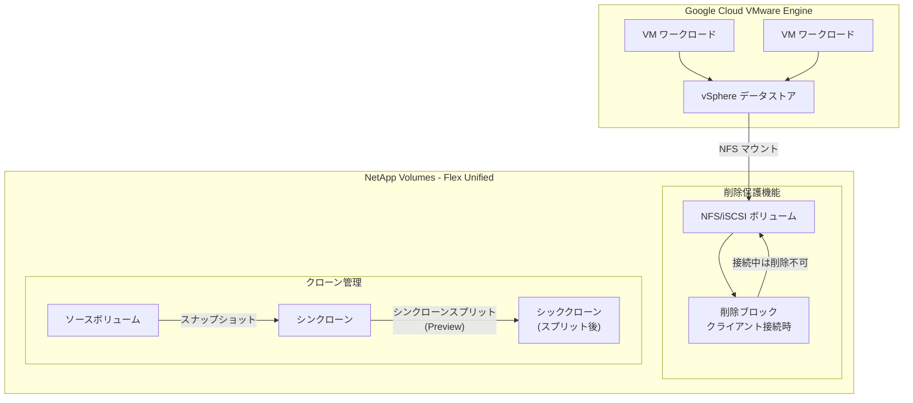

# NetApp Volumes: Flex Unified サービスレベルにおけるボリューム削除保護とシッククローン機能

**リリース日**: 2026-07-02

**サービス**: Google Cloud NetApp Volumes

**機能**: Flex Unified ボリューム削除保護 (GCVE 対応) およびシッククローン (Preview)

**ステータス**: GA (削除保護) / Preview (シッククローン)

[このアップデートのインフォグラフィックを見る](https://takech9203.github.io/google-cloud-news-summary/20260702-netapp-volumes-flex-unified-block-deletion-protection.html)

## 概要

Google Cloud NetApp Volumes の Flex Unified サービスレベルにおいて、2 つの重要な機能強化が発表されました。1 つ目は、クライアント接続時のボリューム削除をブロックするオプション機能が、ブロックボリュームとファイルボリュームの両方で利用可能になったことです。2 つ目は、Flex Unified Default-mode サービスレベルでシッククローン (シンクローンスプリット) 機能が Preview として利用可能になったことです。

ボリューム削除保護機能は、Google Cloud VMware Engine (GCVE) データストアとして NetApp Volumes を使用する際に必須の設定です。この機能を有効にすると、GCVE データストアとしてマウントされているボリュームの誤削除を防止し、本番環境の安定性を確保します。

シッククローン機能は、既存のシンクローンをソースボリュームから独立した完全なコピーに変換 (スプリット) する機能であり、クローンの依存関係を解消してデータ管理の柔軟性を向上させます。

**アップデート前の課題**

- Flex Unified サービスレベルのブロックボリュームでは削除保護機能が利用できず、GCVE データストアとして使用する際に誤削除のリスクがあった
- シンクローンはソースボリュームとスナップショットに依存しており、ソースボリュームやスナップショットを削除するにはクローンを先に削除する必要があった
- GCVE データストアとしてのブロックストレージ利用において、iSCSI プロトコルでの削除保護が提供されていなかった

**アップデート後の改善**

- Flex Unified のファイルボリュームとブロックボリュームの両方で削除保護が利用可能になり、GCVE データストアの安全な運用が実現
- シッククローン (シンクローンスプリット) により、クローンをソースボリュームから独立させ、依存関係を解消可能に
- NFSv3、NFSv4.1 に加え、ブロックプロトコル (iSCSI) でも削除保護がサポートされ、多様なワークロードに対応

## アーキテクチャ図



この図は、GCVE データストアと NetApp Volumes の削除保護機能の関係、およびシンクローンからシッククローンへのスプリット処理の流れを示しています。

## サービスアップデートの詳細

### 主要機能

1. **クライアント接続時のボリューム削除保護 (ブロック + ファイル対応)**
   - Flex Unified サービスレベルのボリュームで、クライアントがマウント中の場合にボリューム削除をブロック
   - NFSv3、NFSv4.1、および iSCSI プロトコルをサポート
   - GCVE データストアとして使用する場合は有効化が必須
   - 設定は永続的であり、後から変更不可
   - ボリューム作成時、スナップショットからの新規ボリューム作成時、バックアップからの復元時に設定可能

2. **シッククローン / シンクローンスプリット (Preview)**
   - Flex Unified Default-mode サービスレベルで利用可能
   - シンクローンをソースボリュームから完全に独立したボリュームに変換
   - スプリット後はソースボリュームやスナップショットの削除制約が解消
   - データブロックが完全にコピーされるため、スプリット完了後は独立した容量消費

3. **GCVE データストア統合の強化**
   - ブロックボリュームへの削除保護拡張により、iSCSI ベースの GCVE データストア構成を保護
   - VMware Engine のストレージインフラストラクチャの堅牢性を向上
   - vSAN ストレージと並行した NFS ストレージのスケーリングが安全に実施可能

## 技術仕様

### 削除保護機能の詳細

| 項目 | 詳細 |
|------|------|
| 対象サービスレベル | Flex Unified (Default-mode / ONTAP-mode) |
| サポートプロトコル | NFSv3, NFSv4.1, iSCSI |
| 設定タイミング | ボリューム作成時 / スナップショットからの作成時 / バックアップからの復元時 |
| 設定の変更 | 不可 (永続的) |
| 削除までの待機時間 | 全クライアントのアンマウント後 52 時間以上 |
| GCVE での必須設定 | はい |

### シッククローン (シンクローンスプリット) の詳細

| 項目 | 詳細 |
|------|------|
| 対象サービスレベル | Flex Unified Default-mode |
| ステータス | Preview |
| 動作 | シンクローンのデータブロックをソースから完全コピーし独立化 |
| スプリット前の依存関係 | ソースボリューム・スナップショットの削除不可 |
| スプリット後 | クローンは完全に独立したボリュームとして動作 |
| 容量への影響 | スプリット後は共有容量が実容量に変換される |

### Flex Unified サービスレベル仕様

| 項目 | 仕様 |
|------|------|
| 料金 | $0.105 / GiB / 月 (カスタムプロビジョニング) |
| ボリュームサイズ | 1 GiB ~ 300 TiB |
| 大容量ボリューム | 4.8 TiB ~ 20 PiB (auto-tiering 使用時) |
| 最大スループット | 5 GiBps / ストレージプール (通常) / 22 GiBps (大容量ボリューム) |
| 最大 IOPS | 160,000 (通常) / 750,000 (大容量ボリューム) |
| プロトコル | NFSv3/v4.1/v4.2, SMB, iSCSI, NVMe/TCP |
| SLA | 99.9% (ゾーン) / 99.99% (リージョン) |

## 設定方法

### 前提条件

1. Google Cloud プロジェクトで NetApp Volumes API が有効化されていること
2. Flex Unified サービスレベルのストレージプールが作成済みであること
3. GCVE データストアとして使用する場合、VMware Engine ピアリングが設定済みであること

### 手順

#### ステップ 1: 削除保護を有効にしたボリュームの作成

```bash
# gcloud CLI を使用してボリュームを作成し、削除保護を有効化
gcloud netapp volumes create VOLUME_NAME \
  --project=PROJECT_ID \
  --location=LOCATION \
  --storage-pool=STORAGE_POOL \
  --capacity=CAPACITY \
  --protocols=PROTOCOLS \
  --share-name=SHARE_NAME \
  --restricted-actions=DELETE
```

削除保護は `--restricted-actions=DELETE` フラグで有効化されます。この設定は永続的であり、後から変更できません。

#### ステップ 2: GCVE データストアとしてのマウント

```bash
# VMware Engine API を使用してボリュームをデータストアとしてマウント
# マウント前に以下を確認:
# - エクスポートルールでサービスサブネットからのアクセスを許可
# - 読み取り/書き込みアクセスの有効化
# - root アクセスの有効化
```

VMware Engine API を使用してボリュームを NFS データストアとしてマウントします。

#### ステップ 3: シンクローンの作成とスプリット (Preview)

```bash
# スナップショットからシンクローンを作成
gcloud netapp volumes create CLONE_NAME \
  --project=PROJECT_ID \
  --location=LOCATION \
  --storage-pool=STORAGE_POOL \
  --capacity=CAPACITY \
  --protocols=PROTOCOLS \
  --share-name=SHARE_NAME \
  --source-snapshot=SOURCE_SNAPSHOT

# シンクローンスプリット (シッククローンへの変換) は
# Google Cloud コンソールまたは API から実行可能 (Preview)
```

シンクローンスプリットの詳細な手順については、公式ドキュメント「Manage volume clones」を参照してください。

## メリット

### ビジネス面

- **データ保護の強化**: GCVE データストアの誤削除を防止し、本番環境のダウンタイムリスクを大幅に軽減
- **VMware ワークロードの安全な移行**: オンプレミスから Google Cloud への VMware ワークロード移行において、ストレージの安全性を確保
- **運用コストの削減**: 誤操作によるデータ損失の復旧コストやビジネス影響を未然に防止

### 技術面

- **マルチプロトコル対応**: NFS と iSCSI の両方でボリューム保護が可能となり、ワークロードの要件に応じた柔軟な構成を実現
- **クローン管理の柔軟性**: シッククローンにより、テスト環境や開発環境のクローンをソースから独立させ、ライフサイクル管理を簡素化
- **ストレージ効率とデータ独立性のバランス**: シンクローンの容量効率を活用しつつ、必要に応じてシッククローンに変換可能

## デメリット・制約事項

### 制限事項

- 削除保護設定は永続的であり、一度有効にすると無効化できない
- 保護されたボリュームを削除するには、全クライアントのアンマウント後 52 時間以上の待機が必要
- シッククローン (シンクローンスプリット) は現在 Preview であり、Default-mode のみで利用可能
- シッククローンへのスプリット時にデータの完全コピーが行われるため、追加のストレージ容量が必要

### 考慮すべき点

- 削除保護を有効にする際は、将来のボリューム管理計画を十分に検討すること
- シッククローンへの変換は不可逆ではないが、変換中のパフォーマンス影響を考慮する必要がある
- Preview 機能は SLA 対象外であり、本番ワークロードでの使用には注意が必要
- GCVE データストア用途では削除保護が必須のため、設計段階からこの要件を組み込む必要がある

## ユースケース

### ユースケース 1: GCVE データストアの保護

**シナリオ**: 企業が VMware Engine 上で本番ワークロードを運用しており、NetApp Volumes を NFS データストアとして使用している。複数の管理者がストレージを管理しているため、誤操作による削除リスクを排除したい。

**実装例**:
```bash
# GCVE データストア用ボリュームの作成
gcloud netapp volumes create gcve-datastore-vol01 \
  --project=my-project \
  --location=us-central1 \
  --storage-pool=flex-unified-pool \
  --capacity=10240 \
  --protocols=NFSV3 \
  --share-name=gcve-ds01 \
  --restricted-actions=DELETE

# エクスポートルールの設定 (GCVE サービスサブネットへのアクセス許可)
```

**効果**: マウント中のボリュームは削除不可となり、管理者の誤操作やスクリプトのバグによるデータ損失を確実に防止できる。

### ユースケース 2: 開発環境のクローン独立化

**シナリオ**: 本番データベースのスナップショットからシンクローンを作成して開発環境として使用しているが、本番ボリュームのスナップショット管理を自由に行いたいため、クローンをソースから独立させたい。

**効果**: シッククローン (シンクローンスプリット) により、開発環境のクローンが完全に独立したボリュームとなり、ソースボリュームのスナップショットを自由に削除・管理できるようになる。本番環境と開発環境のライフサイクル管理が独立して行える。

## 料金

NetApp Volumes の料金はストレージプールの容量とサービスレベルに基づいて課金されます。削除保護機能自体に追加料金は発生しません。

### 料金例

| サービスレベル | 容量 | 月額料金 (概算, us-central1) |
|--------|---------|-----------------|
| Flex Unified 1 TiB | 1,024 GiB | 約 $107.52 |
| Flex Unified 10 TiB | 10,240 GiB | 約 $1,075.20 |
| Flex Unified 100 TiB | 102,400 GiB | 約 $10,752.00 |

注: シッククローンへのスプリット後は、クローンが消費する容量分の追加料金が発生します。スプリット前のシンクローンは新規/変更データ分のみ容量を消費します。

## 利用可能リージョン

Flex Unified サービスレベルは以下のリージョンで利用可能です:

**カスタムパフォーマンス対応リージョン**: asia-northeast2, asia-south1, asia-southeast1, australia-southeast1, europe-west1, europe-west3, europe-west4, me-central2, me-west1, southamerica-east1, us-central1, us-east1, us-east4, us-south1, us-west1, us-west4

**限定パフォーマンスリージョン**: asia-northeast1, europe-west2, europe-west9, us-east5, us-west2, us-west3

## 関連サービス・機能

- **Google Cloud VMware Engine (GCVE)**: NetApp Volumes を NFS データストアとして使用し、vSAN と並行してストレージをスケーリング
- **NetApp Volumes スナップショット**: ボリュームのポイントインタイムコピーを作成し、クローンや復元に利用
- **NetApp Volumes バックアップ**: ボリュームデータの長期保持とディザスタリカバリ
- **NetApp Volumes レプリケーション**: リージョン間のボリューム複製によるディザスタリカバリ
- **NetApp Volumes MCP サーバー**: LLM や AI アプリケーションからのストレージ管理 (GA)

## 参考リンク

- [インフォグラフィック](https://takech9203.github.io/google-cloud-news-summary/20260702-netapp-volumes-flex-unified-block-deletion-protection.html)
- [公式リリースノート](https://docs.cloud.google.com/release-notes#July_02_2026)
- [ドキュメント: ボリューム概要 (削除保護)](https://docs.cloud.google.com/netapp/volumes/docs/configure-and-use/volumes/overview#block-volume-deletion)
- [ドキュメント: ボリュームクローンの管理](https://docs.cloud.google.com/netapp/volumes/docs/configure-and-use/volumes/manage-volume-clones)
- [ドキュメント: GCVE データストア](https://docs.cloud.google.com/vmware-engine/docs/vmware-ecosystem/howto-cloud-volumes-datastores-vmware-engine)
- [料金ページ](https://cloud.google.com/netapp/volumes/pricing)

## まとめ

今回のアップデートにより、NetApp Volumes Flex Unified サービスレベルの GCVE データストア保護がブロックボリュームにも拡張され、iSCSI を含む多様なプロトコルでの安全な運用が可能になりました。また、シッククローン機能 (Preview) により、クローンのライフサイクル管理の柔軟性が大幅に向上しています。GCVE データストアを運用している組織は削除保護を必ず有効にし、クローン管理の効率化が必要な場合はシッククローン機能の評価を検討することを推奨します。

---

**タグ**: #NetAppVolumes #FlexUnified #GCVE #VMwareEngine #DeletionProtection #ThickClone #ThinCloneSplit #StorageProtection #Preview #GA
