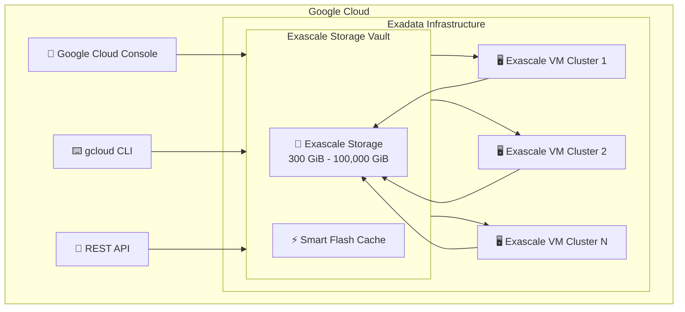

# Oracle Database@Google Cloud: Exascale Storage Vaults が GA (一般提供)

**リリース日**: 2026-07-02

**サービス**: Oracle Database@Google Cloud

**機能**: Exascale Storage Vaults for Exadata on Dedicated Infrastructure and Exadata VM Clusters

**ステータス**: Generally Available (GA)

📊 [このアップデートのインフォグラフィックを見る](https://takech9203.github.io/google-cloud-news-summary/20260702-oracle-database-google-cloud-exascale-storage-vaults.html)

## 概要

Oracle Database@Google Cloud において、Exascale Storage Vaults が Exadata on Dedicated Infrastructure および Exadata VM Clusters で一般提供 (GA) となった。Exascale Storage Vaults は、Oracle の次世代インテリジェントデータアーキテクチャであり、Exadata プラットフォーム上でストレージ管理を分離・簡素化する機能を提供する。

Exascale Storage Vaults は、単一の Exadata Infrastructure 内に共有ストレージプールを作成し、複数の Exadata VM Cluster にまたがって利用できる。これにより、ダウンタイムなしでの即時ストレージ拡張が可能となり、redirect-on-write 技術を使用したクラスタ間やコンテナデータベース間でのデータベースクローンが実現する。

この GA リリースにより、本番環境での利用が正式にサポートされ、SLA の対象となる。Oracle ワークロードを Google Cloud 上で運用する企業にとって、ストレージの柔軟性とスケーラビリティが大幅に向上する重要なアップデートである。

**アップデート前の課題**

- Exadata on Dedicated Infrastructure では、ストレージ管理がインフラストラクチャに密結合しており、柔軟なストレージ拡張が困難だった
- 複数の VM Cluster 間でストレージを共有する仕組みがなく、リソースの有効活用が制限されていた
- ストレージ容量の拡張にはダウンタイムや事前計画が必要であり、即時対応が難しかった
- クラスタ間でのデータベースクローンには時間のかかるデータコピーが必要だった

**アップデート後の改善**

- Exascale Storage Vaults により、ストレージをインフラストラクチャから論理的に分離し、独立した管理が可能になった
- 1 つの Exascale Storage Vault を複数の Exascale VM Cluster で共有でき、リソースの有効活用が実現した
- ダウンタイムなしでの即時ストレージ拡張 (300 GiB から 100,000 GiB) が可能になった
- redirect-on-write 技術による高速なデータベースクローンが可能になった
- Google Cloud コンソール、gcloud CLI、REST API の全方式で作成・管理が可能になった

## アーキテクチャ図



Exascale Storage Vault は Exadata Infrastructure 内に作成され、複数の Exascale VM Cluster から共有アクセスが可能。Google Cloud コンソール、gcloud CLI、REST API のいずれからも管理できる。

## サービスアップデートの詳細

### 主要機能

1. **共有ストレージプール**
   - 1 つの Exascale Storage Vault を複数の Exascale VM Cluster で共有可能
   - ストレージリソースの有効活用とコスト効率の向上
   - 各 VM Cluster は同一ゾーン内の Vault にアクセス

2. **即時・無停止のストレージ拡張**
   - ダウンタイムなしでストレージ容量を即座に拡張
   - 300 GiB から 100,000 GiB の範囲でストレージ容量を指定可能
   - Vault のストレージ容量はクラスタの合計容量以上である必要がある

3. **高速データベースクローン**
   - redirect-on-write 技術を使用したストレージ効率の高いクローン
   - クラスタ間やコンテナデータベース間でのデータベースクローンが可能
   - フルコピー不要で迅速なクローン作成

4. **Smart Flash Cache と Block/Smart Storage の選択**
   - Oracle Grid Infrastructure 26ai リリースでは Exascale Smart Storage または Exascale Block Storage を選択可能
   - 19c リリースでは Exascale Block Storage のみ対応
   - 追加の Flash Cache をストレージ容量の割合で構成可能

5. **Exadata on Dedicated Infrastructure での Vault サポート**
   - 既存の Exadata Infrastructure に対して Exascale Storage を構成可能
   - `gcloud oracle-database cloud-exadata-infrastructures configure-exascale` コマンドで設定
   - Dedicated Infrastructure の堅牢性と Exascale の柔軟性を組み合わせ

## 技術仕様

### Exascale Storage Vault の構成パラメータ

| 項目 | 詳細 |
|------|------|
| ストレージ容量範囲 | 300 GiB - 100,000 GiB |
| 最大 VM 数/クラスタ | 10 |
| 有効 ECPU/VM 範囲 | 8 - 200 (4 の倍数) |
| 予約 ECPU/VM 範囲 | 0 - 192 (4 の倍数) |
| VM ファイルシステム容量/VM | 220 GiB - 1,100 GiB (Smart Storage) / 260 GiB - 1,100 GiB (Block Storage) |
| リソーススコープ | ゾーナル (同一ゾーン内で VM Cluster と Vault を配置) |

### 必要な IAM ロール

| ロール | 用途 |
|--------|------|
| `roles/oracledatabase.exascaleDbStorageVaultAdmin` | Vault の作成・管理・削除 |
| `roles/oracledatabase.exascaleDbStorageVaultViewer` | Vault の参照 |
| `roles/oracledatabase.exadbVmClusterAdmin` | Exascale VM Cluster の作成 |
| `roles/oracledatabase.cloudExadataInfrastructureUser` | Dedicated Infrastructure への Vault 作成 |

### API エンドポイント

```
https://oracledatabase.googleapis.com/v1/projects/{PROJECT_ID}/locations/{REGION}/exascaleDbStorageVaults/{VAULT_ID}
```

## 設定方法

### 前提条件

1. gcloud CLI のセットアップと Oracle Database@Google Cloud API の有効化
2. Google Cloud Marketplace で Oracle Database@Google Cloud のアクティブなオーダーがあること
3. ODB Network と ODB Subnet の作成済みであること
4. 必要な IAM ロールの付与

### 手順

#### ステップ 1: Exascale Storage Vault の作成 (gcloud CLI)

```bash
gcloud oracle-database exascale-db-storage-vaults create my-vault \
  --project=PROJECT_ID \
  --location=us-east4 \
  --display-name="my vault" \
  --exascale-db-storage-details-total-size-gbs=1000 \
  --exadata-infrastructure=projects/PROJECT_ID/locations/us-east4/cloudExadataInfrastructures/EXADATA_INSTANCE_ID \
  --async
```

Exadata Infrastructure 上に新しい Exascale Storage Vault を作成する。ストレージ容量は 300 GiB 以上を指定する。

#### ステップ 2: Exadata Infrastructure への Exascale Storage 構成 (Dedicated Infrastructure の場合)

```bash
gcloud oracle-database cloud-exadata-infrastructures configure-exascale \
  EXADATA_INFRASTRUCTURE_ID \
  --project=PROJECT_ID \
  --location=REGION \
  --total-storage-size-gb=STORAGE_SIZE
```

既存の Exadata Infrastructure に対して Exascale Storage を構成する。

#### ステップ 3: Exascale VM Cluster の作成時に Vault を関連付け

```bash
# REST API を使用した作成例
curl -X POST \
  -H "Authorization: Bearer $(gcloud auth print-access-token)" \
  -H "Content-Type: application/json" \
  "https://oracledatabase.googleapis.com/v1/projects/PROJECT_ID/locations/REGION/exascaleDbStorageVaults/VAULT_ID" \
  -d '{
    "display_name": "VAULT_DISPLAY_NAME",
    "gcp_oracle_zone": "GCP_ORACLE_ZONE",
    "exadata_infrastructure": "projects/PROJECT_ID/locations/REGION/cloudExadataInfrastructures/EXADATA_INSTANCE_ID",
    "properties": {
      "exascale_db_storage_details": {
        "total_size_gbs": "1000"
      }
    }
  }'
```

VM Cluster 作成時に既存の Vault を選択するか、新しい Vault を作成するかを選択できる。

## メリット

### ビジネス面

- **運用コスト削減**: ストレージの共有化により、各 VM Cluster が個別にストレージを確保する必要がなくなり、全体的なストレージコストを最適化できる
- **ダウンタイム回避**: 即時拡張により、ストレージ不足によるサービス影響のリスクを排除し、SLA の維持が容易になる
- **迅速なプロビジョニング**: redirect-on-write によるクローンにより、開発・テスト環境の迅速な構築が可能

### 技術面

- **ストレージの分離**: コンピュートとストレージの論理的分離により、それぞれ独立したスケーリングが可能
- **高可用性**: 複数の VM Cluster からの共有アクセスにより、データの一元管理と高可用性を両立
- **パフォーマンス最適化**: Smart Flash Cache の構成により、ワークロードに応じたキャッシュ設定が可能

## デメリット・制約事項

### 制限事項

- Vault と VM Cluster は同一ゾーン内に配置する必要がある (クロスゾーン不可)
- Vault のストレージ容量は、関連する全 VM Cluster の合計容量以上である必要がある
- Vault の管理変更は OCI (Oracle Cloud Infrastructure) コンソールにリダイレクトされるため、完全な Google Cloud コンソール内完結ではない
- Oracle Grid Infrastructure 19c を使用する場合、Exascale Block Storage のみが利用可能 (Smart Storage は 26ai のみ)

### 考慮すべき点

- ライセンス形態 (BYOL または License Included) の選択が必要
- Vault を削除する前に、関連する全 VM Cluster を解除する必要がある
- ストレージ容量の縮小に関する制約を事前に確認する必要がある
- Shared VPC を使用する場合、ホストプロジェクトの ID が必要

## ユースケース

### ユースケース 1: マルチテナントデータベース環境の構築

**シナリオ**: 大規模企業が複数の事業部門ごとに独立した VM Cluster を運用しつつ、ストレージリソースを効率的に共有したい場合。

**実装例**:
```bash
# 共有 Vault の作成 (大容量)
gcloud oracle-database exascale-db-storage-vaults create shared-vault \
  --location=us-east4 \
  --display-name="Enterprise Shared Vault" \
  --exascale-db-storage-details-total-size-gbs=50000 \
  --exadata-infrastructure=projects/my-project/locations/us-east4/cloudExadataInfrastructures/exa-infra-01

# 各事業部門の VM Cluster 作成時に同一 Vault を指定
```

**効果**: 各事業部門が独自の VM Cluster を持ちながら、ストレージコストを最大 40-60% 削減できる可能性がある。容量計画の一元化により運用負荷も軽減される。

### ユースケース 2: 開発・テスト環境の迅速な構築

**シナリオ**: 本番データベースのクローンを開発・テスト環境に迅速に作成し、リリース前検証を行いたい場合。

**効果**: redirect-on-write 技術により、テラバイト級のデータベースでも数分でクローンを作成でき、開発サイクルを大幅に短縮できる。フルコピーが不要なためストレージ消費も最小限に抑えられる。

### ユースケース 3: 段階的なクラウド移行

**シナリオ**: オンプレミスの Oracle Exadata 環境を Google Cloud に移行する際に、既存の Exadata Infrastructure に Exascale Storage を追加して段階的にモダナイズしたい場合。

**効果**: `configure-exascale` コマンドにより既存 Infrastructure に Exascale Storage を構成でき、大規模な再構築なしにストレージのモダナイズが可能。移行リスクを最小化しながら Exascale のメリットを享受できる。

## 料金

Oracle Database@Google Cloud の料金は、Google Cloud Marketplace オーダーに基づく。具体的な Exascale Storage Vaults の料金については、Oracle Database@Google Cloud の料金ページを参照のこと。

ライセンス形態は以下の 2 種類:
- **License Included**: Oracle ライセンスを含んだ料金
- **Bring Your Own License (BYOL)**: 既存のライセンスを持ち込み

なお、同一リージョン内のアプリケーションと Oracle Exadata データベース間のネットワーキング料金は Oracle Database@Google Cloud の価格に含まれる。

## 利用可能リージョン

Exascale Storage Vaults は以下のリージョンで利用可能:

| リージョン | エリア | ゾーン |
|-----------|--------|--------|
| asia-northeast1 | 東京, 日本 | asia-northeast1-a-r1 |
| asia-northeast2 | 大阪, 日本 | asia-northeast2-a-r1 |
| australia-southeast2 | メルボルン, オーストラリア | australia-southeast2-a-r2 |
| asia-south1 | ムンバイ, インド | asia-south1-b-r1 |
| asia-south2 | デリー, インド | asia-south2-b-r1 |
| northamerica-northeast1 | モントリオール, カナダ | northamerica-northeast1-a-r1 |
| us-central1 | アイオワ, 米国 | us-central1-a-r1 |
| us-east4 | 北バージニア, 米国 | us-east4-a-r2, us-east4-b-r1 |
| us-west3 | ソルトレイクシティ, 米国 | us-west3-a-r1 |
| europe-west2 | ロンドン, 英国 | europe-west2-a-r1, europe-west2-c-r2 |
| europe-west3 | フランクフルト, ドイツ | europe-west3-a-r2, europe-west3-b-r1 |
| europe-west8 | ミラノ, イタリア | europe-west8-b-r1, europe-west8-a-r1 |

## 関連サービス・機能

- **Exadata Database Service on Dedicated Infrastructure**: Exascale Storage Vaults の主要なデプロイ先。既存 Infrastructure に Exascale Storage を構成可能
- **Exadata VM Clusters**: Vault に関連付けられるコンピュートリソース。最大 10 VM/クラスタ
- **ODB Network / ODB Subnet**: VM Cluster のネットワーク要件。同一リージョン・ゾーンに配置が必要
- **Cloud Monitoring / Database Center**: Oracle Database@Google Cloud リソースのフリートワイドな監視・アラート
- **VPC Service Controls**: Oracle Database@Google Cloud リソースへのアクセス制御境界の設定

## 参考リンク

- 📊 [インフォグラフィック](https://takech9203.github.io/google-cloud-news-summary/20260702-oracle-database-google-cloud-exascale-storage-vaults.html)
- [公式リリースノート](https://docs.cloud.google.com/release-notes#July_02_2026)
- [Create an Exascale Storage Vault for an Exadata Infrastructure](https://docs.cloud.google.com/oracle/database/docs/create-exadata-storage-vaults)
- [Configure Exascale Storage Vault for Exadata Infrastructure](https://docs.cloud.google.com/oracle/database/docs/configure-exascale-storage)
- [Create Exadata VM Clusters with Exascale Storage Vaults](https://docs.cloud.google.com/oracle/database/docs/create-clusters#create-cluster-using-vault)
- [Exascale Storage Vault の管理](https://docs.cloud.google.com/oracle/database/docs/manage-exascale-vaults)
- [Exascale Storage Vault の詳細表示](https://docs.cloud.google.com/oracle/database/docs/view-exascale-vault-information)
- [サポートリージョンとゾーン](https://docs.cloud.google.com/oracle/database/docs/regions-and-zones)
- [Oracle Exadata Database Service on Exascale Infrastructure (Oracle ドキュメント)](https://docs.public.content.oci.oraclecloud.com/en-us/iaas/exadb-xs/doc/overview-exadb-xs-service.html)

## まとめ

Oracle Database@Google Cloud における Exascale Storage Vaults の GA は、エンタープライズ Oracle ワークロードのストレージ管理を根本的に改善する重要なマイルストーンである。ストレージの分離・共有化、無停止拡張、高速クローンといった機能により、Oracle データベースのクラウド運用における柔軟性とコスト効率が大幅に向上する。既存の Exadata on Dedicated Infrastructure ユーザーは、`configure-exascale` コマンドを使用して段階的に Exascale Storage を導入することを推奨する。

---

**タグ**: #OracleDatabase #GoogleCloud #ExascaleStorage #Exadata #DedicatedInfrastructure #VMCluster #GA #ストレージ #データベース
