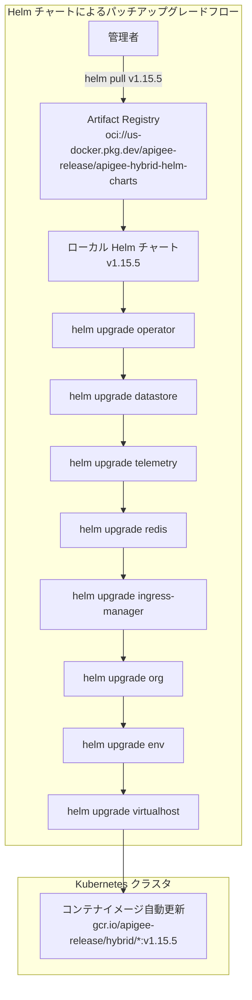

# Apigee hybrid: v1.15.5 パッチリリース

**リリース日**: 2026-07-03

**サービス**: Apigee hybrid

**機能**: v1.15.5 パッチリリース (セキュリティ修正)

**ステータス**: Announcement (パッチリリース)

📊 [このアップデートのインフォグラフィックを見る](https://takech9203.github.io/google-cloud-news-summary/20260703-apigee-hybrid-v1-15-5.html)

## 概要

2026 年 7 月 3 日、Google Cloud は Apigee hybrid ソフトウェアの更新バージョン v1.15.5 をリリースしました。これはパッチリリースであり、主にセキュリティ脆弱性 (CVE) の修正が含まれています。

Apigee hybrid は、API ランタイムをオンプレミスまたはマルチクラウドの Kubernetes クラスタ上で実行しながら、管理プレーンを Google Cloud が提供するハイブリッド API 管理ソリューションです。パッチリリースでは、Helm チャートを通じてコンテナイメージが自動的に更新されるため、手動でのイメージ変更は通常不要です。

このリリースは、Apigee hybrid v1.15 系列を運用しているすべてのユーザーが対象です。v1.15 は 2025 年 6 月 4 日にリリースされ、2026 年 10 月 31 日までサポートされる予定です。セキュリティパッチの適用は、本番環境の安全性を維持するために推奨されます。

**アップデート前の課題**

- v1.15.4 以前のバージョンにはセキュリティ脆弱性 (CVE) が存在していた
- 既知のセキュリティリスクに対する修正が未適用の状態であった

**アップデート後の改善**

- 各種セキュリティ脆弱性 (CVE) が修正され、ランタイム環境の安全性が向上した
- Helm チャート経由のアップグレードにより、コンテナイメージが自動的に最新のセキュリティ修正を含むバージョンに更新される

## アーキテクチャ図



Apigee hybrid のパッチアップグレードは、Helm チャートを順番にアップグレードすることで実行されます。パッチリリースではコンテナイメージが Helm チャートに統合されているため、チャートのアップグレードにより自動的にイメージが更新されます。

## サービスアップデートの詳細

### 主要機能

1. **セキュリティ修正 (CVE 対応)**
   - 各種セキュリティ脆弱性が修正されています
   - コンテナイメージに含まれるライブラリやランタイムのセキュリティパッチが適用されています

2. **Helm チャート統合によるシームレスな更新**
   - パッチリリースのコンテナイメージは Apigee hybrid Helm チャートに統合されています
   - Helm チャートを通じてアップグレードするだけで、イメージが自動的に更新されます
   - 手動でのイメージタグ変更は通常不要です

## 技術仕様

### バージョン情報

| 項目 | 詳細 |
|------|------|
| バージョン | v1.15.5 |
| リリースタイプ | パッチリリース |
| 前バージョン | v1.15.4 (2026-05-30 リリース) |
| リリースライン EOL | 2026-10-31 |
| Helm バージョン要件 | v3.14.2 以上 |

### 対応プラットフォーム (v1.15 系列)

| プラットフォーム | 対応バージョン |
|------|------|
| GKE on Google Cloud | 1.29.x - 1.33.x |
| GKE on AWS | 1.29.x - 1.32.x |
| GKE on Azure | 1.29.x - 1.32.x |
| EKS | 1.29.x - 1.33.x |
| AKS | 1.29.x - 1.35.x |
| OpenShift | 4.16 - 4.20 |
| RKE | 1.28.x - 1.33.x |

### コンポーネント要件 (v1.15 系列)

| コンポーネント | 対応バージョン |
|------|------|
| cert-manager | 1.16.x, 1.17.x |
| Cassandra | 4.0 |
| Kubernetes | 1.29.x - 1.33.x |
| kubectl | 1.29.x - 1.33.x |
| Helm | 3.14.2 以上 |
| Cloud Service Mesh | 1.22.x |

## 設定方法

### 前提条件

1. Apigee hybrid v1.15.x が既にインストールされていること
2. Helm v3.14.2 以上がインストールされていること
3. kubectl がクラスタに接続可能であること

### 手順

#### ステップ 1: Helm チャートの取得

```bash
export CHART_REPO=oci://us-docker.pkg.dev/apigee-release/apigee-hybrid-helm-charts
export CHART_VERSION=1.15.5

helm pull $CHART_REPO/apigee-operator --version $CHART_VERSION --untar
helm pull $CHART_REPO/apigee-datastore --version $CHART_VERSION --untar
helm pull $CHART_REPO/apigee-env --version $CHART_VERSION --untar
helm pull $CHART_REPO/apigee-ingress-manager --version $CHART_VERSION --untar
helm pull $CHART_REPO/apigee-org --version $CHART_VERSION --untar
helm pull $CHART_REPO/apigee-redis --version $CHART_VERSION --untar
helm pull $CHART_REPO/apigee-telemetry --version $CHART_VERSION --untar
helm pull $CHART_REPO/apigee-virtualhost --version $CHART_VERSION --untar
```

#### ステップ 2: CRD の更新

```bash
kubectl apply -k apigee-operator/etc/crds/default/ \
  --server-side \
  --force-conflicts \
  --validate=false
```

#### ステップ 3: Helm チャートの順次アップグレード

```bash
# Apigee Operator
helm upgrade operator apigee-operator/ \
  --install \
  --namespace APIGEE_NAMESPACE \
  -f OVERRIDES_FILE

# Apigee Datastore
helm upgrade datastore apigee-datastore/ \
  --install \
  --namespace APIGEE_NAMESPACE \
  -f OVERRIDES_FILE

# Apigee Telemetry
helm upgrade telemetry apigee-telemetry/ \
  --install \
  --namespace APIGEE_NAMESPACE \
  -f OVERRIDES_FILE

# Apigee Redis
helm upgrade redis apigee-redis/ \
  --install \
  --namespace APIGEE_NAMESPACE \
  -f OVERRIDES_FILE

# Apigee Ingress Manager
helm upgrade ingress-manager apigee-ingress-manager/ \
  --install \
  --namespace APIGEE_NAMESPACE \
  -f OVERRIDES_FILE

# Apigee Organization
helm upgrade ORG_NAME apigee-org/ \
  --install \
  --namespace APIGEE_NAMESPACE \
  -f OVERRIDES_FILE

# Apigee Environment (環境ごとに実行)
helm upgrade ENV_RELEASE_NAME apigee-env/ \
  --install \
  --namespace APIGEE_NAMESPACE \
  --set env=ENV_NAME \
  -f OVERRIDES_FILE

# Apigee VirtualHost (環境グループごとに実行)
helm upgrade ENV_GROUP_RELEASE_NAME apigee-virtualhost/ \
  --install \
  --namespace APIGEE_NAMESPACE \
  --set envgroup=ENV_GROUP_NAME \
  -f OVERRIDES_FILE
```

#### ステップ 4: アップグレードの確認

```bash
# Operator の確認
kubectl -n APIGEE_NAMESPACE get deploy apigee-controller-manager

# Datastore の確認
kubectl -n APIGEE_NAMESPACE get apigeedatastore default

# Organization の確認
kubectl -n APIGEE_NAMESPACE get apigeeorg

# Environment の確認
kubectl -n APIGEE_NAMESPACE get apigeeenv
```

## メリット

### セキュリティ面

- **CVE 脆弱性の修正**: 既知のセキュリティ脆弱性が修正され、ランタイム環境のセキュリティポスチャが向上する
- **コンプライアンス維持**: セキュリティパッチを最新に保つことで、コンプライアンス要件を満たし続けることができる

### 運用面

- **シームレスなアップグレード**: Helm チャート経由でコンテナイメージが自動更新されるため、手動でのイメージ変更作業が不要
- **既存構成との互換性**: パッチリリースは後方互換性が維持されるため、overrides ファイルの変更は通常不要

## デメリット・制約事項

### 制限事項

- パッチリリースにはバグ修正とセキュリティ修正のみが含まれ、新機能は含まれない
- v1.15 系列のサポート期限は 2026 年 10 月 31 日であり、それ以降は v1.16 へのアップグレードが必要

### 考慮すべき点

- アップグレード前に Cassandra データベースのバックアップを推奨
- マルチクラスタ環境では、各クラスタを順次アップグレードする必要がある
- アップグレード中は新しい環境を作成しないこと

## ユースケース

### ユースケース 1: セキュリティコンプライアンス維持

**シナリオ**: 金融機関や医療機関など、厳格なセキュリティコンプライアンス要件を持つ組織で Apigee hybrid を運用している場合

**効果**: 最新のセキュリティパッチを適用することで、PCI DSS や HIPAA などのコンプライアンス基準を満たし続けることができる

### ユースケース 2: 定期的なパッチ適用サイクル

**シナリオ**: 月次のパッチ適用サイクルを持つ DevOps チームが、Apigee hybrid ランタイムのセキュリティを最新に保つ場合

**効果**: Helm チャートを通じた標準的なアップグレードフローにより、CI/CD パイプラインに組み込んだ定期パッチ適用が容易に実現できる

## 料金

Apigee hybrid の料金はサブスクリプションベースで提供されます。パッチリリースの適用自体に追加料金は発生しません。

| プラン | 概要 |
|--------|------|
| Standard | 最大 1.25B Standard API Proxy 呼び出し、3 環境、99% SLA |
| Enterprise | 最大 7.5B Standard API Proxy 呼び出し、6 環境、99.9% SLA |
| Enterprise Plus | 最大 75B Standard API Proxy 呼び出し、12 環境、99.99% SLA |

詳細は [Apigee 料金ページ](https://cloud.google.com/apigee/pricing) を参照してください。

## 関連サービス・機能

- **Apigee hybrid v1.16**: 最新のマイナーバージョン。UDCA の削除、Seccomp プロファイルサポート、Guardrails サービスアカウントなどの新機能を含む
- **Apigee hybrid v1.14**: 前のマイナーバージョン (2026-08-31 に EOL 予定)
- **Google Artifact Registry**: Apigee hybrid Helm チャートのホスティング先
- **cert-manager**: TLS 証明書管理 (v1.15 では 1.16.x または 1.17.x をサポート)
- **Cloud Service Mesh**: Apigee hybrid 1.9 以降で自動インストールされるサービスメッシュ

## 参考リンク

- 📊 [インフォグラフィック](https://takech9203.github.io/google-cloud-news-summary/20260703-apigee-hybrid-v1-15-5.html)
- [公式リリースノート](https://cloud.google.com/release-notes#July_03_2026)
- [Apigee hybrid リリースノート](https://docs.cloud.google.com/apigee/docs/hybrid/release-notes)
- [Apigee hybrid v1.15 アップグレードガイド](https://docs.cloud.google.com/apigee/docs/hybrid/v1.15/upgrade)
- [Apigee hybrid v1.15 新規インストールガイド](https://docs.cloud.google.com/apigee/docs/hybrid/v1.15/big-picture)
- [Apigee リリースプロセス](https://docs.cloud.google.com/apigee/docs/release/apigee-release-process)
- [サポート対象プラットフォームとバージョン](https://docs.cloud.google.com/apigee/docs/hybrid/supported-platforms)
- [料金ページ](https://cloud.google.com/apigee/pricing)

## まとめ

Apigee hybrid v1.15.5 は、セキュリティ脆弱性の修正を含むパッチリリースです。Helm チャートを通じたシームレスなアップグレードが可能であり、v1.15 系列を運用しているすべてのユーザーに対して、セキュリティリスク低減のため速やかな適用が推奨されます。なお、v1.15 のサポート期限は 2026 年 10 月 31 日であるため、中長期的には v1.16 へのマイグレーション計画も検討してください。

---

**タグ**: Apigee, Apigee hybrid, API Management, Security, Patch Release, Helm, Kubernetes, CVE
