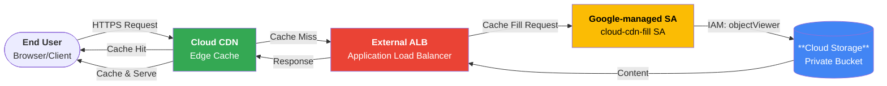

# Cloud CDN: Private Bucket Access for Cloud Storage (GA)

**リリース日**: 2026-07-03

**サービス**: Cloud CDN

**機能**: Private Bucket Access for Cloud Storage

**ステータス**: Generally Available (GA)

📊 [このアップデートのインフォグラフィックを見る](https://takech9203.github.io/google-cloud-news-summary/20260703-cloud-cdn-private-bucket-access.html)

## 概要

Cloud CDN および外部アプリケーションロードバランサ (external Application Load Balancer) が、Cloud Storage バケットに対するセルフサービスの Private Bucket Access をサポートし、GA (一般提供) となった。この機能により、Cloud Storage バケットを公開 (public) にすることなく、Cloud CDN 経由でコンテンツを安全に配信できるようになる。

従来、Cloud CDN でプライベートな Cloud Storage バケットからコンテンツを配信するには、署名付き URL キーの追加や手動での IAM 設定が必要だった。今回の Private Bucket Access 機能では、Google マネージドサービスアカウントを介した IAM 権限による安全なアクセス管理がセルフサービスで提供され、設定が大幅に簡素化された。

この機能は、静的コンテンツ配信、ソフトウェアダウンロード、メディア配信などにおいて、セキュリティとパフォーマンスを両立させたい Solutions Architect やクラウドエンジニアに特に有用である。

**アップデート前の課題**

- Cloud CDN 経由でコンテンツを配信するためには、Cloud Storage バケットを公開 (allUsers に objectViewer を付与) する必要があった
- プライベートバケットを使用する場合は、署名付き URL キーを手動で作成し、Cloud CDN サービスアカウントへの IAM 権限付与を手動で行う必要があった
- Cloud CDN キャッシュフィル用サービスアカウント (`service-PROJECT_NUMBER@cloud-cdn-fill.iam.gserviceaccount.com`) の設定が煩雑で、ドメイン制限共有 (DRS) ポリシーとの競合も課題だった
- バケットを公開にすると、CDN を迂回した直接アクセスも許可されてしまい、セキュリティリスクが存在した

**アップデート後の改善**

- セルフサービスで Private Bucket Access を有効化でき、バケットを公開にする必要がなくなった
- Google マネージドサービスアカウントによる IAM ベースのアクセス管理が自動的に構成される
- CDN を迂回したオリジンへの直接アクセスを防止し、コンテンツ保護が強化された
- 外部アプリケーションロードバランサとの統合がシームレスになった

## アーキテクチャ図



ユーザーからのリクエストは Cloud CDN エッジキャッシュで処理される。キャッシュミス時には外部アプリケーションロードバランサを経由し、Google マネージドサービスアカウントの IAM 権限 (roles/storage.objectViewer) を使用してプライベート Cloud Storage バケットからコンテンツを取得する。

## サービスアップデートの詳細

### 主要機能

1. **セルフサービス Private Bucket Access**
   - Google Cloud コンソールまたは gcloud CLI からプライベートバケットアクセスを直接有効化可能
   - バケットの公開設定 (allUsers) を削除した状態でコンテンツ配信が可能

2. **Google マネージドサービスアカウントによる IAM 管理**
   - Cloud CDN キャッシュフィル用のサービスアカウント (`service-PROJECT_NUMBER@cloud-cdn-fill.iam.gserviceaccount.com`) が自動的に使用される
   - サービスアカウントは Google によって管理され、ユーザーのプロジェクトのサービスアカウント一覧には表示されない
   - `roles/storage.objectViewer` ロールによる最小権限アクセス

3. **外部アプリケーションロードバランサとの統合**
   - グローバル外部アプリケーションロードバランサおよびクラシックアプリケーションロードバランサの両方で利用可能
   - バックエンドバケットの構成でプライベートアクセスを有効化

## 技術仕様

### コンポーネント構成

| 項目 | 詳細 |
|------|------|
| サービスアカウント | `service-PROJECT_NUMBER@cloud-cdn-fill.iam.gserviceaccount.com` |
| 必要な IAM ロール | `roles/storage.objectViewer` |
| 対応ロードバランサ | グローバル外部アプリケーションロードバランサ、クラシックアプリケーションロードバランサ |
| 対応 HTTP メソッド | GET, HEAD, OPTIONS, TRACE |
| バックエンドタイプ | バックエンドバケット (Cloud Storage) |
| 対応ストレージクラス | Standard, Nearline, Coldline, Archive (全クラス) |

### サービスアカウントの特性

- Google マネージドであり、ユーザーのプロジェクトのサービスアカウント一覧には表示されない
- Cloud CDN プロジェクトによって所有される
- バックエンドバケットにキーを追加した時点で自動的に作成される

## 設定方法

### 前提条件

1. Google Cloud プロジェクトで Cloud CDN API が有効化されていること
2. 外部アプリケーションロードバランサが構成済みであること
3. Cloud Storage バケットが作成済みであること
4. Storage Admin ロール (`roles/storage.admin`) の権限を持つこと

### 手順

#### ステップ 1: バックエンドバケットの作成と Cloud CDN の有効化

```bash
# バックエンドバケットを作成
gcloud compute backend-buckets create BACKEND_BUCKET_NAME \
    --gcs-bucket-name=GCS_BUCKET_NAME \
    --enable-cdn
```

#### ステップ 2: Cloud CDN サービスアカウントへの IAM 権限付与

```bash
# Cloud CDN キャッシュフィルサービスアカウントに objectViewer を付与
gcloud storage buckets add-iam-policy-binding gs://BUCKET_NAME \
    --member=serviceAccount:service-PROJECT_NUMBER@cloud-cdn-fill.iam.gserviceaccount.com \
    --role=roles/storage.objectViewer
```

#### ステップ 3: パブリックアクセスの削除

```bash
# allUsers のアクセス権を削除してバケットをプライベートに
gcloud storage buckets remove-iam-policy-binding gs://BUCKET_NAME \
    --member=allUsers \
    --role=roles/storage.objectViewer
```

#### ステップ 4: 動作確認

```bash
# 直接アクセスが拒否されることを確認
curl -I "https://storage.googleapis.com/BUCKET_NAME/object.ext"
# 期待: 403 Forbidden

# ロードバランサ経由のアクセスが成功することを確認
curl -I "https://YOUR_LB_DOMAIN/object.ext"
# 期待: 200 OK
```

## メリット

### ビジネス面

- **セキュリティ強化**: バケットを公開にする必要がなくなり、情報漏洩リスクを低減
- **コンプライアンス対応**: 公開バケットを禁止する組織ポリシーに準拠しつつ CDN 配信が可能
- **運用コスト削減**: セルフサービスで設定可能であり、手動での鍵管理が不要

### 技術面

- **最小権限の原則**: Google マネージドサービスアカウントに objectViewer のみ付与
- **CDN バイパス防止**: 直接のバケットアクセスをブロックし、必ず CDN を経由させることが可能
- **シンプルな構成**: 署名付き URL の設定と組み合わせることで多層防御を実現

## デメリット・制約事項

### 制限事項

- 対応 HTTP メソッドは GET, HEAD, OPTIONS, TRACE に限定される (POST, PUT, DELETE は非対応)
- リージョナル外部アプリケーションロードバランサでは Private Bucket Access は非サポート
- ドメイン制限共有 (DRS) 組織ポリシーが有効な場合、IAM バインディング設定時に一時的な無効化が必要になる場合がある

### 考慮すべき点

- キャッシュされたコンテンツは CDN エッジから直接配信されるため、Private Bucket Access はオリジンへの直接アクセスを制御するものであり、エンドユーザーのアクセス制御には署名付き URL/Cookie との併用が必要
- プライベートバケットは `cache-control: private` ヘッダーを設定する場合があるため、キャッシュモードの適切な設定 (FORCE_CACHE_ALL など) が推奨される
- 既存の公開バケットからの移行時は、設定反映に 10 分程度かかる可能性がある

## ユースケース

### ユースケース 1: エンタープライズの静的ウェブサイトホスティング

**シナリオ**: 企業がプライベートな Cloud Storage バケットに静的アセット (HTML, CSS, JavaScript, 画像) を格納し、Cloud CDN 経由で全世界に高速配信したい。組織ポリシーでパブリックバケットが禁止されている。

**実装例**:
```bash
# バックエンドバケットを作成し CDN 有効化
gcloud compute backend-buckets create website-assets \
    --gcs-bucket-name=my-company-website-assets \
    --enable-cdn \
    --cache-mode=CACHE_ALL_STATIC

# プライベートアクセスを設定
gcloud storage buckets add-iam-policy-binding gs://my-company-website-assets \
    --member=serviceAccount:service-123456789@cloud-cdn-fill.iam.gserviceaccount.com \
    --role=roles/storage.objectViewer
```

**効果**: 組織のセキュリティポリシーに準拠しつつ、グローバルに低レイテンシのコンテンツ配信を実現

### ユースケース 2: ソフトウェアダウンロード配信

**シナリオ**: SaaS プロバイダが大容量のインストーラやアップデートパッケージをプライベートバケットに格納し、認証済みユーザーにのみ CDN 経由で配信したい。

**効果**: 署名付き URL と Private Bucket Access を組み合わせることで、クライアント認証 (署名付き URL) とオリジン保護 (Private Bucket Access) の多層防御を実現

### ユースケース 3: メディアコンテンツの保護配信

**シナリオ**: 動画・音声コンテンツをプライベートバケットに格納し、直接 URL によるコンテンツ窃取を防止しつつ、CDN のキャッシュ機能で大規模配信に対応したい。

**効果**: CDN キャッシュによるオリジンサーバーの負荷軽減と、プライベートバケットによるコンテンツ保護を両立

## 料金

Cloud CDN の Private Bucket Access 機能自体に追加料金はない。標準の Cloud CDN 料金が適用される。

### Cloud CDN 料金体系

| カテゴリ | 料金 (USD) |
|----------|-----------|
| キャッシュ Egress (10 TiB 未満) | $0.08/GiB から |
| キャッシュ Egress (10-150 TiB) | $0.055/GiB から |
| キャッシュ Egress (150-500 TiB) | $0.03/GiB から |
| キャッシュフィル (北米/欧州内) | $0.01/GiB |
| キャッシュフィル (アジア太平洋、南米、中東、アフリカ、オセアニア内) | $0.02/GiB |
| キャッシュフィル (リージョン間) | $0.04/GiB |
| HTTP/HTTPS キャッシュルックアップリクエスト | $0.0075/10,000 リクエスト |

### 追加コスト

- Cloud Storage のオペレーション料金 (Class B: GET リクエスト) がキャッシュミス時に発生
- 外部アプリケーションロードバランサの料金が別途発生

## 利用可能リージョン

Cloud CDN はグローバルサービスであり、Google のエッジネットワーク全体で利用可能。Cloud Storage バケットは以下のロケーションタイプに対応:

- シングルリージョン
- デュアルリージョン
- マルチリージョン

## 関連サービス・機能

- **Cloud Storage**: オリジンとなるストレージサービス。Private Bucket Access の対象
- **外部アプリケーションロードバランサ**: Cloud CDN のフロントエンドとして機能し、トラフィックルーティングとヘルスチェックを提供
- **署名付き URL / 署名付き Cookie**: クライアント側のアクセス制御。Private Bucket Access (オリジン側) と組み合わせて多層防御を実現
- **Cloud Armor**: DDoS 防御とウェブアプリケーションファイアウォール (WAF) による追加のセキュリティレイヤー
- **Media CDN**: 大規模メディア配信向けの CDN サービス。同様のプライベートバケットアクセス機能を提供
- **IAM**: Google マネージドサービスアカウントによるアクセス制御の基盤

## 参考リンク

- 📊 [インフォグラフィック](https://takech9203.github.io/google-cloud-news-summary/20260703-cloud-cdn-private-bucket-access.html)
- [公式リリースノート](https://docs.cloud.google.com/release-notes#July_03_2026)
- [Private Bucket Access ドキュメント](https://cloud.google.com/cdn/docs/private-bucket-access)
- [Cloud CDN を使用したバックエンドバケットのセットアップ](https://cloud.google.com/cdn/docs/setting-up-cdn-with-bucket)
- [署名付き URL の使用](https://cloud.google.com/cdn/docs/using-signed-urls)
- [Cloud CDN 料金ページ](https://cloud.google.com/cdn/pricing)

## まとめ

Cloud CDN の Private Bucket Access for Cloud Storage が GA となったことで、Cloud Storage バケットを公開にすることなく CDN 経由でコンテンツを安全に配信する構成がセルフサービスで容易に実現できるようになった。特にエンタープライズ環境において「パブリックバケット禁止」のセキュリティポリシーと CDN による高速コンテンツ配信を両立させたい場合に、早期の導入を推奨する。既存の公開バケット構成を使用している場合は、Private Bucket Access への移行を検討されたい。

---

**タグ**: Cloud CDN, Cloud Storage, Private Bucket Access, IAM, セキュリティ, 外部アプリケーションロードバランサ, GA, コンテンツ配信
