# Google SecOps SOAR: Release 6.3.91 / 6.3.92 バグ修正リリース

**リリース日**: 2026-07-04 / 2026-07-05

**サービス**: Google SecOps SOAR

**機能**: Release 6.3.91 全リージョン展開 / Release 6.3.92 第1フェーズ展開

**ステータス**: リリース済み

📊 [このアップデートのインフォグラフィックを見る](https://takech9203.github.io/google-cloud-news-summary/20260705-google-secops-soar-release-6-3-91-92.html)

## 概要

Google SecOps SOAR プラットフォームにおいて、2 つのメンテナンスリリースが公開された。Release 6.3.92 (2026年7月5日) は第1フェーズのリージョンへの展開が開始され、内部およびカスタマー向けバグ修正を含む。Release 6.3.91 (2026年7月4日) は全リージョンで利用可能となった (初回リリースは2026年6月28日)。

Google SecOps SOAR は段階的リリースプロセスを採用しており、新バージョンはまず第1フェーズのリージョン (日本、インド、オーストラリア、カナダ、ドイツ、スイス) に展開され、約1週間後に第2フェーズのリージョン (シンガポール、カタール、サウジアラビア、イスラエル、英国、イタリア、EU マルチリージョン、US マルチリージョン) に展開される。

今回のリリースは定期的なバグ修正リリースであり、新機能の追加は含まれていない。SOAR プラットフォームの安定性と信頼性の向上を目的としている。

**アップデート前の課題**

- プラットフォーム内に内部バグおよびカスタマーから報告されたバグが存在していた
- Release 6.3.91 は第1フェーズのリージョンでのみ利用可能で、第2フェーズのリージョンでは旧バージョン (6.3.90) のままだった

**アップデート後の改善**

- Release 6.3.92: 最新のバグ修正が第1フェーズのリージョンに適用された
- Release 6.3.91: 全リージョンでバグ修正が適用され、プラットフォームの一貫性が確保された
- 内部およびカスタマー向けの既知の問題が解消された

## アーキテクチャ図

```mermaid
flowchart LR
    subgraph release["リリースプロセス"]
        NEW["🆕 新バージョン\nリリース"]
    end

    subgraph phase1["第1フェーズ (約1週間先行)"]
        JP["🇯🇵 日本"]
        IN["🇮🇳 インド"]
        AU["🇦🇺 オーストラリア"]
        CA["🇨🇦 カナダ"]
        DE["🇩🇪 ドイツ"]
        CH["🇨🇭 スイス"]
    end

    subgraph phase2["第2フェーズ (1週間後)"]
        SG["🇸🇬 シンガポール"]
        QA["🇶🇦 カタール"]
        SA["🇸🇦 サウジアラビア"]
        IL["🇮🇱 イスラエル"]
        UK["🇬🇧 英国"]
        IT["🇮🇹 イタリア"]
        EU["🇪🇺 EU マルチリージョン"]
        US["🇺🇸 US マルチリージョン"]
    end

    NEW --> phase1
    phase1 -->|"1週間の検証期間"| phase2
```

Google SecOps SOAR の段階的リリースプロセスを示す。新バージョンはまず第1フェーズの6リージョンに展開され、約1週間の検証期間を経て第2フェーズの8リージョンに展開される。

## サービスアップデートの詳細

### 主要内容

1. **Release 6.3.92 (2026年7月5日)**
   - 第1フェーズのリージョンへの展開開始
   - 内部バグ修正を含む
   - カスタマーから報告されたバグ修正を含む
   - 全リージョンへの展開は約1週間後 (7月12日頃) を予定

2. **Release 6.3.91 全リージョン展開 (2026年7月4日)**
   - 2026年6月28日に第1フェーズのリージョンに展開済み
   - 全リージョンで利用可能となった
   - 内部バグ修正およびカスタマー向けバグ修正を含む
   - 同日リリースの Remote Agents Version 2.6.7 も利用可能 (軽微なバグ修正)

## 技術仕様

### リリースタイムライン

| 項目 | Release 6.3.91 | Release 6.3.92 |
|------|----------------|----------------|
| 第1フェーズ展開日 | 2026年6月28日 | 2026年7月5日 |
| 全リージョン展開日 | 2026年7月4日 | 2026年7月12日頃 (予定) |
| リリースタイプ | バグ修正 | バグ修正 |
| 新機能 | なし | なし |

### 段階的リリース対象リージョン

| フェーズ | リージョン |
|----------|-----------|
| 第1フェーズ | 日本、インド、オーストラリア、カナダ、ドイツ、スイス |
| 第2フェーズ | シンガポール、カタール、サウジアラビア、イスラエル、英国 (ロンドン)、イタリア、EU マルチリージョン、US マルチリージョン |

## メリット

### 運用面

- **安定性の向上**: 報告されたバグが修正され、プラットフォームの安定動作が確保される
- **段階的ロールアウト**: 問題が発生した場合に第2フェーズへの展開を中止でき、影響範囲を最小限に抑えられる

### 技術面

- **継続的な品質改善**: 定期的なバグ修正リリースにより、プラットフォームの信頼性が維持される
- **互換性の維持**: バグ修正リリースのため、既存の設定やワークフローへの影響は最小限

## デメリット・制約事項

### 制限事項

- バグ修正の詳細内容は公開されていない (内部バグ修正を含むため)
- 第1フェーズと第2フェーズのリージョン間で約1週間のバージョン差が発生する

### 考慮すべき点

- 第1フェーズのリージョン (日本含む) では Release 6.3.92 が自動的に適用されるため、事前の動作確認は不可
- 特定のバグ修正が自社環境に影響するかどうかは、リリースノートの詳細が限定的なため確認が困難
- 所属リージョンが不明な場合は Google SecOps 担当者に確認が必要

## 利用可能リージョン

段階的リリースにより展開:

- **Release 6.3.92**: 第1フェーズリージョン (日本、インド、オーストラリア、カナダ、ドイツ、スイス) - 2026年7月5日時点
- **Release 6.3.91**: 全リージョンで利用可能 - 2026年7月4日時点

## 関連サービス・機能

- **Google SecOps SIEM**: SOAR と統合されたセキュリティ情報イベント管理。アラートの取り込みやケース管理で連携
- **Remote Agents**: SOAR の Remote Agents Version 2.6.7 も同時期にリリースされ、軽微なバグ修正を含む
- **Google Cloud IAM**: SOAR の権限管理は Google Cloud IAM への移行が進行中 (2026年3月に GA)

## 参考リンク

- 📊 [インフォグラフィック](https://takech9203.github.io/google-cloud-news-summary/20260705-google-secops-soar-release-6-3-91-92.html)
- [Google SecOps SOAR リリースノート](https://docs.cloud.google.com/chronicle/docs/soar/release-notes)
- [SOAR 段階的リリースプロセス](https://docs.cloud.google.com/chronicle/docs/soar/overview-and-introduction/soar-gradual-release)
- [Release 6.3.91 詳細 (June 28, 2026)](https://docs.cloud.google.com/chronicle/docs/soar/release-notes#June_28_2026)
- [Google Cloud Release Notes (July 5, 2026)](https://docs.cloud.google.com/release-notes#July_05_2026)

## まとめ

Google SecOps SOAR の Release 6.3.91 および 6.3.92 は定期的なメンテナンスリリースであり、プラットフォームの安定性向上を目的としたバグ修正が含まれている。日本リージョンは第1フェーズに含まれるため、Release 6.3.92 は即座に適用される。特別な対応は不要だが、SOAR ワークフローの動作に異常がないか通常の監視を継続することを推奨する。

---

**タグ**: #google-secops #soar #bug-fix #release #gradual-release #maintenance
