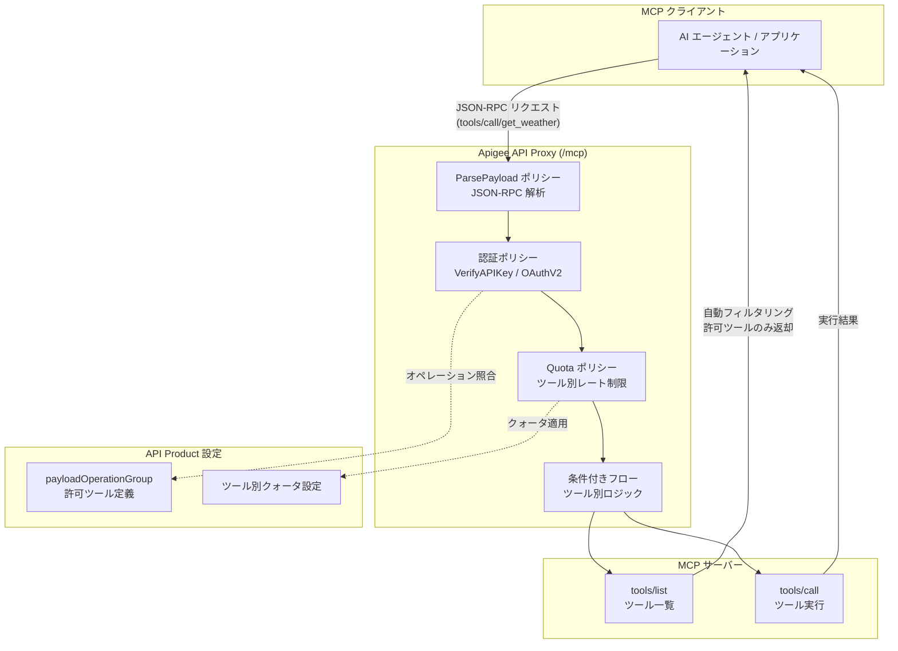

# Apigee X: ParsePayload ポリシーによる MCP ツールアクセス管理

**リリース日**: 2026-07-06

**サービス**: Apigee UI, Apigee X

**機能**: ParsePayload ポリシーおよびペイロードオペレーションマッチング

**ステータス**: GA (一般提供)

📊 [このアップデートのインフォグラフィックを見る](https://takech9203.github.io/google-cloud-news-summary/20260706-apigee-parsepayload-policy.html)

## 概要

Apigee X に新しい ParsePayload ポリシーとペイロードオペレーションマッチング機能が追加されました。この機能により、JSON-RPC ベースのプロトコル (特に Model Context Protocol: MCP) において、リクエストボディに埋め込まれたオペレーション情報を抽出し、ツール単位でのアクセス制御、クォータ管理、ルーティング、課金を実現できます。

従来の REST API では URL パスと HTTP メソッドでオペレーションを識別できましたが、MCP のようなプロトコルでは単一エンドポイント (`/mcp`) で全てのツール呼び出しを処理するため、リクエストボディの解析が必要でした。ParsePayload ポリシーはこのギャップを埋め、Apigee の既存の API 管理機能 (認証、クォータ、ツールフィルタリング) をツール単位で適用可能にします。

この機能は全ての Apigee X 顧客に追加料金なしで提供され、全サポートリージョンで利用可能です。AI エージェントや MCP サーバーを本番運用する企業にとって、ツールレベルのガバナンスを実現する重要なアップデートです。

**アップデート前の課題**

- MCP サーバーは単一エンドポイントで全ツール呼び出しを処理するため、URL パスベースのオペレーション識別ができなかった
- JSON-RPC リクエストのボディを解析してツール名を抽出する仕組みが Apigee に存在しなかった
- MCP ツールごとに異なるクォータ制限やアクセス制御を適用することが困難だった
- API Product によるツール単位の可視性制御やフィルタリングができなかった

**アップデート後の改善**

- ParsePayload ポリシーにより JSON-RPC リクエストからオペレーション名を自動抽出可能になった
- API Product の `payloadOperationGroup` でツール単位のアクセス制御とクォータ設定が可能になった
- `tools/list` レスポンスの自動フィルタリングにより、クライアントに許可されたツールのみが返されるようになった
- 条件付きフローでツールごとの SpikeArrest やルーティングロジックを実装可能になった

## アーキテクチャ図



ParsePayload ポリシーが JSON-RPC リクエストボディからオペレーション名を抽出し、後続の認証・クォータポリシーが API Product の設定に基づいてツール単位のアクセス制御を実行します。レスポンス時には `tools/list` の結果が自動的にフィルタリングされ、クライアントに許可されたツールのみが返されます。

## サービスアップデートの詳細

### 主要機能

1. **ParsePayload ポリシー**
   - JSON-RPC 2.0 ペイロードからオペレーション情報を抽出
   - MCP プロトコルに対応し、`tools/call/{tool_name}` 形式のオペレーション名を生成
   - フロー変数 (`parsepayload.{policyName}.operation`) に抽出結果を格納
   - リクエスト PreFlow の先頭に配置し、後続ポリシーがオペレーション情報を利用可能

2. **ペイロードオペレーションマッチング (API Product)**
   - API Product に `payloadOperationGroup` フィールドを追加
   - ツール単位で許可オペレーションとクォータを定義可能
   - 異なる API Product で異なるツールサブセットを公開し、階層型アクセスを実現
   - `tools/list` と `tools/call/{tool_name}` の両方をオペレーションとして管理

3. **自動ツールフィルタリング**
   - `tools/list` レスポンスから API Product に未登録のツールを自動除外
   - 追加のフィルタリングポリシーは不要
   - ParsePayload + 認証ポリシーの組み合わせで自動的に動作

4. **条件付きフローによるツール別ロジック**
   - `parsepayload.{policyName}.operation` フロー変数を条件に使用
   - ツールごとに異なる SpikeArrest、バックエンドルーティング、リクエスト変換を適用可能

## 技術仕様

### ParsePayload ポリシー設定

| 要素 | 説明 | 値 |
|------|------|-----|
| `<Source>` | 解析対象メッセージ | `request` (デフォルト) |
| `<PayloadType>` | ペイロード形式 | `JSON-RPC-2.0` |
| `<Protocol>` | プロトコル | `MCP` |

### 抽出されるフロー変数

| フロー変数 | 説明 | 値の例 |
|-----------|------|--------|
| `parsepayload.{name}.operation` | 導出されたオペレーション名 | `tools/call/get_weather` |
| `parsepayload.{name}.json-rpc.request.method` | JSON-RPC メソッド | `tools/call` |
| `parsepayload.{name}.json-rpc.request.id` | JSON-RPC リクエスト ID | `1` |
| `parsepayload.{name}.json-rpc.request.params.name` | ツール名 | `get_weather` |
| `parsepayload.{name}.json-rpc.request.params.arguments.{arg}` | ツール引数 | 引数値 |

### ParsePayload ポリシー XML

```xml
<ParsePayload continueOnError="false" enabled="true" name="ParsePayload-MCP">
  <Source>request</Source>
  <PayloadType>JSON-RPC-2.0</PayloadType>
  <Protocol>MCP</Protocol>
</ParsePayload>
```

## 設定方法

### 前提条件

1. Apigee X 組織が構成されていること
2. MCP サーバーへトラフィックをルーティングする API プロキシがデプロイ済みであること
3. Apigee 1-17-0-apigee-7 以降のバージョンであること

### 手順

#### ステップ 1: ParsePayload ポリシーの追加

API プロキシのリクエスト PreFlow に ParsePayload ポリシーを追加します。

```xml
<ProxyEndpoint name="default">
  <PreFlow>
    <Request>
      <Step>
        <Name>ParsePayload-MCP</Name>
      </Step>
      <Step>
        <Name>VerifyAPIKey-1</Name>
      </Step>
      <Step>
        <Name>Quota-PerToolLimit</Name>
      </Step>
    </Request>
  </PreFlow>
  <HTTPProxyConnection>
    <BasePath>/mcp</BasePath>
  </HTTPProxyConnection>
  <RouteRule name="default">
    <TargetEndpoint>default</TargetEndpoint>
  </RouteRule>
</ProxyEndpoint>
```

ParsePayload ポリシーは認証ポリシーおよびクォータポリシーよりも前に配置する必要があります。

#### ステップ 2: API Product の設定

`payloadOperationGroup` を使用して、ツール単位のオペレーションとクォータを定義します。

```bash
curl -X POST \
  "https://apigee.googleapis.com/v1/organizations/ORG_NAME/apiproducts" \
  -H "Authorization: Bearer $(gcloud auth print-access-token)" \
  -H "Content-Type: application/json" \
  -d '{
    "name": "mcp-tools-product",
    "displayName": "MCP Tools Product",
    "approvalType": "auto",
    "payloadOperationGroup": {
      "operationConfigs": [
        {
          "apiSource": "mcp-proxy",
          "operations": [
            { "operation": "tools/call/get_stock_price" },
            { "operation": "tools/call/get_company_news" }
          ],
          "quota": {
            "limit": "100",
            "interval": "1",
            "timeUnit": "minute"
          }
        },
        {
          "apiSource": "mcp-proxy",
          "operations": [
            { "operation": "tools/list" }
          ],
          "quota": {
            "limit": "300",
            "interval": "1",
            "timeUnit": "minute"
          }
        }
      ]
    }
  }'
```

#### ステップ 3: 認証ポリシーの追加

API キー認証の場合:

```xml
<VerifyAPIKey name="VerifyAPIKey-1">
  <DisplayName>Verify API Key</DisplayName>
  <APIKey ref="request.queryparam.apikey"/>
</VerifyAPIKey>
```

#### ステップ 4: クォータポリシーの追加

```xml
<Quota name="Quota-PerToolLimit">
  <DisplayName>Per-Tool Quota</DisplayName>
  <UseQuotaConfigInAPIProduct stepName="VerifyAPIKey-1"/>
  <Distributed>true</Distributed>
</Quota>
```

#### ステップ 5: 動作確認

```bash
# ツール呼び出しのテスト
curl -X POST "https://RUNTIME_HOSTNAME/mcp?apikey=API_KEY" \
  -H "Content-Type: application/json" \
  -d '{
    "jsonrpc": "2.0",
    "method": "tools/call",
    "params": {
      "name": "get_stock_price",
      "arguments": { "ticker": "GOOGL" }
    },
    "id": 1
  }'

# ツールフィルタリングの確認
curl -X POST "https://RUNTIME_HOSTNAME/mcp?apikey=API_KEY" \
  -H "Content-Type: application/json" \
  -d '{
    "jsonrpc": "2.0",
    "method": "tools/list",
    "id": 1
  }'
```

## メリット

### ビジネス面

- **MCP ツールの商用化**: ツール単位の課金・クォータ管理により、MCP ツールを API プロダクトとして商用提供可能
- **階層型アクセス制御**: 異なる API Product で異なるツールセットを公開し、Basic/Premium などの料金プランを構成可能
- **ガバナンス強化**: AI エージェントがアクセスできるツールを組織レベルで制御し、セキュリティリスクを低減

### 技術面

- **プロトコル非依存のポリシー適用**: JSON-RPC ベースのプロトコルでも既存の Apigee ポリシー (認証、クォータ、SpikeArrest) をそのまま適用可能
- **自動ツールフィルタリング**: 追加のカスタムポリシーなしで `tools/list` レスポンスを API Product に基づいてフィルタリング
- **柔軟な条件付きフロー**: ツールごとに異なるバックエンドルーティングやレート制限を実装可能
- **追加料金なし**: 全 Apigee X 顧客が追加費用なしで利用可能

## デメリット・制約事項

### 制限事項

- メッセージストリーミングとの併用は不可 (ParsePayload ポリシーはストリーミング非対応)
- 現時点で対応する PayloadType は `JSON-RPC-2.0` のみ
- 対応プロトコルは `MCP` のみ
- Extensible Policy に分類され、ライセンスによってはコストや使用量への影響がある可能性あり

### 考慮すべき点

- ParsePayload ポリシーは必ず認証ポリシーやクォータポリシーよりも前 (PreFlow の先頭) に配置する必要がある
- MCP システムメソッド (`initialize`, `notifications/initialized`, `ping`) はペイロードオペレーションマッチングをバイパスするが、`logging/setLevel` は明示的な許可が必要
- `tools/list` を API Product に含めない場合、クライアントはツール一覧を取得できない

## ユースケース

### ユースケース 1: AI エージェント向け MCP ツールの階層型アクセス制御

**シナリオ**: 企業が複数の AI エージェントに対して、役割に応じた MCP ツールへのアクセスを制御したい場合。例えば、一般的なエージェントには情報取得ツールのみ、管理者エージェントには全ツールへのアクセスを許可する。

**実装例**:
```json
{
  "name": "basic-agent-product",
  "payloadOperationGroup": {
    "operationConfigs": [
      {
        "apiSource": "mcp-proxy",
        "operations": [
          { "operation": "tools/call/get_stock_price" },
          { "operation": "tools/call/get_company_news" },
          { "operation": "tools/list" }
        ],
        "quota": { "limit": "100", "interval": "1", "timeUnit": "minute" }
      }
    ]
  }
}
```

**効果**: AI エージェントが `tools/list` を呼び出すと、許可されたツールのみが返されるため、エージェントが未許可のツールを呼び出す試みを事前に防止できる。

### ユースケース 2: MCP ツールの従量課金サービス

**シナリオ**: SaaS プロバイダーが MCP サーバーを公開し、ツール呼び出しごとに異なるレート制限と課金を適用したい場合。高コストなツール (データベースクエリ) と低コストなツール (キャッシュ読み取り) で異なるクォータを設定する。

**実装例**:
```json
{
  "payloadOperationGroup": {
    "operationConfigs": [
      {
        "apiSource": "mcp-proxy",
        "operations": [{ "operation": "tools/call/query_database" }],
        "quota": { "limit": "10", "interval": "1", "timeUnit": "minute" }
      },
      {
        "apiSource": "mcp-proxy",
        "operations": [{ "operation": "tools/call/read_cache" }],
        "quota": { "limit": "1000", "interval": "1", "timeUnit": "minute" }
      }
    ]
  }
}
```

**効果**: ツールごとの独立したクォータ管理により、コストの高いオペレーションの乱用を防止しつつ、軽量なオペレーションは高スループットで提供可能。

### ユースケース 3: マルチテナント MCP プラットフォーム

**シナリオ**: プラットフォーム事業者が、テナントごとに異なるツールセットと利用上限を提供する MCP プラットフォームを運用する場合。

**効果**: テナントごとに異なる API Product を割り当てることで、単一の MCP サーバーで複数テナントのアクセス制御とクォータ管理を実現。Apigee の既存のデベロッパーアプリ管理機能を活用して、テナントのオンボーディングとキー管理を効率化。

## 料金

ParsePayload ポリシーおよびペイロードオペレーションマッチング機能の利用に追加料金は発生しません。通常の Apigee X の料金体系が適用されます。ただし、ParsePayload は Extensible Policy に分類されるため、ライセンス形態によっては使用量への影響を確認する必要があります。

## 利用可能リージョン

全ての Apigee X サポートリージョンで利用可能です。

## 関連サービス・機能

- **Apigee MCP Discovery Proxy**: MCP サーバーの自動検出とプロキシ化を提供するクイックスタート機能
- **Model Context Protocol (MCP)**: AI エージェントとツール間の標準化されたインターフェースプロトコル
- **Apigee API Products**: API の商用化、アクセス制御、クォータ管理の基盤
- **Apigee VerifyAPIKey / OAuthV2 ポリシー**: ParsePayload と組み合わせてツール単位の認証を実現
- **Apigee Quota ポリシー**: `UseQuotaConfigInAPIProduct` でツール単位のレート制限を自動適用

## 参考リンク

- 📊 [インフォグラフィック](https://takech9203.github.io/google-cloud-news-summary/20260706-apigee-parsepayload-policy.html)
- [公式リリースノート](https://docs.cloud.google.com/release-notes#July_06_2026)
- [Manage MCP tool access with API products](https://docs.cloud.google.com/apigee/docs/api-platform/apigee-mcp/manage-mcp-tool-access)
- [ParsePayload policy reference](https://docs.cloud.google.com/apigee/docs/api-platform/reference/policies/parse-payload-policy)
- [API Products の作成](https://docs.cloud.google.com/apigee/docs/api-platform/publish/create-api-products)

## まとめ

Apigee X の ParsePayload ポリシーとペイロードオペレーションマッチング機能は、急速に普及する Model Context Protocol (MCP) に対応したツールレベルの API 管理を実現する重要なアップデートです。MCP サーバーを運用している、または運用を検討している組織は、この機能を活用してツール単位の認証、クォータ管理、自動フィルタリングを実装することを推奨します。全 Apigee X 顧客が追加料金なしで利用可能であり、AI エージェントのガバナンス基盤として即座に導入できます。

---

**タグ**: #Apigee #ApigeeX #ParsePayload #MCP #ModelContextProtocol #APIManagement #JSON-RPC #ToolAccess #GA #AIエージェント #ペイロードオペレーション
