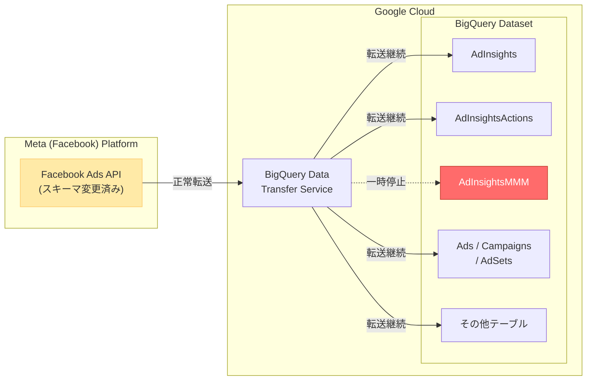

# BigQuery: Facebook Ads AdInsightsMMM レポート一時停止

**リリース日**: 2026-07-06

**サービス**: BigQuery Data Transfer Service

**機能**: Facebook Ads AdInsightsMMM レポートの一時停止

**ステータス**: 変更 (Change)

[このアップデートのインフォグラフィックを見る](https://takech9203.github.io/google-cloud-news-summary/20260706-bigquery-facebook-ads-adinsightsmmm-disabled.html)

## 概要

BigQuery Data Transfer Service の Facebook Ads コネクタにおいて、AdInsightsMMM レポートのサポートが一時的に無効化されました。これは Facebook Ads API 側でスキーマ変更が行われたことに起因するもので、BigQuery Data Transfer Service が新しいスキーマに対応するまでの間、当該レポートのデータ転送が停止されます。

既存の Facebook Ads データ転送設定で AdInsightsMMM レポートを含んでいるものは引き続き実行されますが、転送結果に AdInsightsMMM レポートのデータは含まれなくなります。つまり、転送ジョブ自体はエラーにはならず正常に完了しますが、AdInsightsMMM テーブルへの新規データの書き込みは行われません。

この変更は、Marketing Mix Modeling (MMM) のためのデータパイプラインに依存している組織にとって影響があります。AdInsightsMMM レポートは、広告の地域別・デバイス別・プラットフォーム別のインプレッション数や支出額を集計したデータを提供しており、マーケティング投資の効果分析に活用されるテーブルです。一時的な措置であるため、Facebook Ads API のスキーマ変更への対応が完了次第、再有効化される見込みです。

**変更前の状態**

- AdInsightsMMM レポートは Facebook Ads コネクタでサポートされ、正常にデータ転送が行われていた
- MMM 分析に必要な地域別・デバイス別・プラットフォーム別のインサイトデータが定期的に BigQuery に取り込まれていた
- 2026 年 6 月 1 日に追加されたばかりの新しいレポートタイプであった

**変更後の影響**

- AdInsightsMMM レポートのデータ転送が一時停止され、新規データは BigQuery に取り込まれない
- 既存の転送設定は引き続き動作するが、AdInsightsMMM のデータは転送結果に含まれない
- 既に BigQuery に取り込み済みのデータはそのまま保持され、削除されることはない
- 他のレポート (AdInsights, AdInsightsActions, Ads, Campaigns 等) は影響を受けず正常に転送される

## アーキテクチャ図



Facebook Ads API のスキーマ変更により、BigQuery Data Transfer Service から AdInsightsMMM テーブルへのデータ転送のみが一時的に停止されています。他のすべてのテーブルへの転送は正常に継続しています。

## サービスアップデートの詳細

### 影響範囲

1. **影響を受けるテーブル**
   - `AdInsightsMMM` テーブルのみが影響を受ける
   - 新規のデータ転送設定で AdInsightsMMM レポートを選択することもできない

2. **影響を受けないテーブル**
   - AdInsights (広告インサイトレポート)
   - AdInsightsActions (広告インサイトアクションレポート)
   - Ads, AdSets, Campaigns (広告構造データ)
   - AdAccounts, AdCreatives, AdImages, AdLabels
   - Businesses, CustomAudiences

3. **既存データへの影響**
   - BigQuery に既に取り込まれた AdInsightsMMM のデータは保持される
   - 既存のクエリやビューは引き続き過去データに対して動作する
   - テーブルスキーマの変更は行われない

### 原因

Facebook Ads API 側でスキーマ変更が実施されたため、BigQuery Data Transfer Service の Facebook Ads コネクタが現在の AdInsightsMMM スキーママッピングとの互換性を維持できなくなりました。Google Cloud は新しいスキーマに対応するためのアップデートを準備中です。

## 技術仕様

### AdInsightsMMM テーブルスキーマ (一時停止前)

| BigQuery フィールド名 | 型 | 説明 |
|---|---|---|
| Target | String | インサイト取得対象のアカウント ID |
| TimeIncrement | String | データ集計の日数 |
| AccountId | String | 広告アカウント ID |
| CampaignId | String | キャンペーン ID |
| AdSetId | String | 広告セット ID |
| DateStart | Date | インサイト取得開始日 |
| DateEnd | Date | インサイト取得終了日 |
| Impressions | Long | 広告表示回数 |
| Spend | Decimal | 合計支出額 |
| Country | String | 国 |
| Region | String | 地域 |
| DMA | String | 指定マーケットエリア |
| DevicePlatform | String | デバイスプラットフォーム |
| PlatformPosition | String | プラットフォーム上の位置 |
| PublisherPlatform | String | パブリッシャープラットフォーム |
| CreativeMediaType | String | クリエイティブメディアの種類 |

### 関連する今後の変更

2026 年 7 月 25 日には、Facebook Ads コネクタの AdInsightsActions レポートにおいて `ActionValue` フィールドのデータ型が `INT` から `FLOAT` に変更される予定です。これも Facebook Ads API のスキーマ変更への対応の一環であり、今回の AdInsightsMMM 一時停止と同様の背景を持つ変更です。

## デメリット・制約事項

### 直接的な影響

- **MMM 分析の中断**: AdInsightsMMM データに依存した Marketing Mix Modeling パイプラインが新規データを受け取れなくなる
- **リアルタイム性の喪失**: 一時停止期間中の Facebook Ads の MMM データは BigQuery に蓄積されない
- **復旧時期未定**: 具体的な再有効化のスケジュールは公開されていない

### 考慮すべき点

- 一時停止期間中に蓄積されなかったデータが、再有効化後にバックフィルされるかどうかは不明
- Facebook Ads API のスキーマ変更の内容により、再有効化時にテーブルスキーマが変更される可能性がある
- 下流のデータパイプライン (dbt モデル、Looker ダッシュボード等) で AdInsightsMMM を参照している場合、データの欠損を考慮する必要がある

## ユースケース

### ユースケース 1: MMM 分析パイプラインへの対応

**シナリオ**: マーケティングチームが AdInsightsMMM テーブルをソースとした Marketing Mix Modeling を定期実行している場合

**推奨対応**:
- 一時停止前の最終データ日付を確認し、分析対象期間を調整する
- AdInsights テーブルの集計データで代替分析を検討する
- 再有効化の通知を受け取るため、[BigQuery DTS announcements group](https://groups.google.com/g/bigquery-dts-announcements) に登録する

**効果**: データ欠損期間を明確にし、分析結果の信頼性を維持する

### ユースケース 2: 下流パイプラインのエラーハンドリング

**シナリオ**: Scheduled Query や dbt モデルが AdInsightsMMM テーブルの最新パーティションを参照している場合

**推奨対応**:
```sql
-- データの鮮度を確認するクエリ例
SELECT
  MAX(DateStart) AS latest_data_date,
  CURRENT_DATE() AS today,
  DATE_DIFF(CURRENT_DATE(), MAX(DateStart), DAY) AS days_since_last_update
FROM `project.dataset.AdInsightsMMM`
```

**効果**: データが更新されていないことを検知し、下流のレポートやダッシュボードに適切な注記を表示できる

### ユースケース 3: 代替データソースの活用

**シナリオ**: MMM に必要な地域別・デバイス別の広告効果データが必要な場合

**推奨対応**:
- AdInsights テーブルにも `genericBreakdowns` パラメータで地域やデバイスの内訳を取得可能
- Facebook Ads API から直接データを取得する独自 ETL パイプラインの構築を検討
- Cloud Functions + Facebook Marketing API を使用した一時的なデータ取得ジョブの実装

**効果**: 一時停止期間中も MMM 分析に必要なデータを確保できる

## 関連サービス・機能

- **BigQuery Data Transfer Service**: データ転送の管理基盤。今回の変更はこのサービスの Facebook Ads コネクタに影響
- **BigQuery**: 転送先データウェアハウス。既存データは保持され、クエリは引き続き可能
- **Cloud Monitoring**: DTS の転送ステータスを監視し、転送スキップを検知可能
- **Pub/Sub**: DTS の転送実行通知を受け取り、AdInsightsMMM データの欠損をアラート
- **Looker / Looker Studio**: AdInsightsMMM を参照するダッシュボードが影響を受ける可能性

## 参考リンク

- [このアップデートのインフォグラフィック](https://takech9203.github.io/google-cloud-news-summary/20260706-bigquery-facebook-ads-adinsightsmmm-disabled.html)
- [公式リリースノート](https://cloud.google.com/release-notes#July_06_2026)
- [Facebook Ads データを BigQuery に読み込む](https://docs.cloud.google.com/bigquery/docs/facebook-ads-transfer)
- [Facebook Ads 転送の概要](https://docs.cloud.google.com/bigquery/docs/facebook-ads-transfer-intro)
- [Facebook Ads レポートの変換](https://docs.cloud.google.com/bigquery/docs/facebook-ads-transformation)
- [BigQuery Data Transfer Service のデータソース変更ログ](https://docs.cloud.google.com/bigquery/docs/transfer-changes)
- [BigQuery DTS announcements group](https://groups.google.com/g/bigquery-dts-announcements)

## まとめ

Facebook Ads API のスキーマ変更に伴い、BigQuery Data Transfer Service の AdInsightsMMM レポートが一時的に無効化されました。既存データは保持され、他のレポートタイプは影響を受けませんが、MMM 分析に依存しているワークロードでは代替データソースの検討やデータ欠損期間のハンドリングが必要です。再有効化のスケジュールについては BigQuery DTS announcements group での通知を確認することを推奨します。

---

**タグ**: #BigQuery #DataTransferService #FacebookAds #AdInsightsMMM #MarketingMixModeling #スキーマ変更 #一時停止
