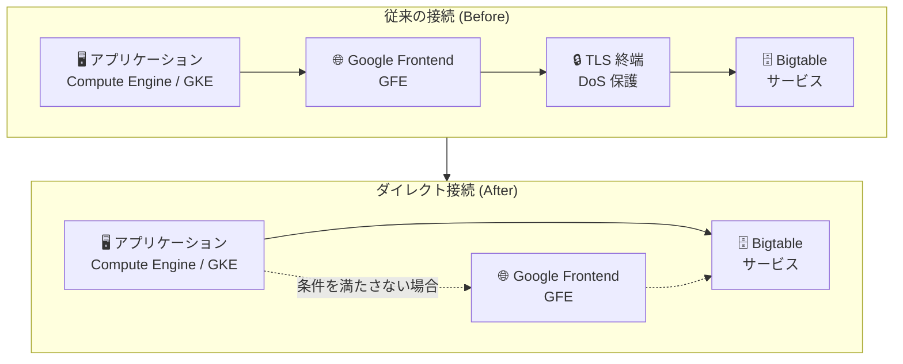

# Bigtable: ダイレクト接続 (Direct Connectivity)

**リリース日**: 2026-07-06

**サービス**: Cloud Bigtable

**機能**: Direct Connectivity (ダイレクト接続)

**ステータス**: GA (一般提供)

📊 [このアップデートのインフォグラフィックを見る](https://takech9203.github.io/google-cloud-news-summary/20260706-bigtable-direct-connectivity.html)

## 概要

Cloud Bigtable がダイレクト接続 (Direct Connectivity) をサポートしました。この機能により、特定の条件を満たすアプリケーショントラフィックが Google Frontend (GFE) をバイパスし、Bigtable に直接接続できるようになります。これにより、スループットの向上とレイテンシの削減が実現されます。

ダイレクト接続は、Compute Engine または GKE 上で動作し、VPC ネットワーク内から対応するクライアントライブラリを使用するアプリケーションに対して、デフォルトで有効化されます。従来は全てのリクエストが Google Frontend を経由していましたが、この機能により中間レイヤーを省略した高性能な接続が可能になります。

この機能は、低レイテンシが要求されるリアルタイムアプリケーションや、高スループットが必要なバッチ処理ワークロードに特に有効です。Cloud Storage や Spanner でも同様のダイレクト接続機能が提供されており、Google Cloud 全体のネットワーキング最適化戦略の一環として位置づけられます。

**アップデート前の課題**

- すべてのアプリケーショントラフィックが Google Frontend (GFE) を経由する必要があり、追加のレイテンシが発生していた
- GFE での TLS 終端やルーティング処理により、特に高 QPS ワークロードでオーバーヘッドが生じていた
- ネットワーキングスタックの中間コンポーネントがレイテンシのボトルネックとなる場合があった

**アップデート後の改善**

- 条件を満たすトラフィックが GFE をバイパスし、Bigtable に直接ルーティングされるようになった
- スループットの向上とレイテンシの削減が実現された
- 対応クライアントライブラリを最新版にアップグレードするだけで自動的に有効化される

## アーキテクチャ図



条件を満たすトラフィックは GFE をバイパスして Bigtable に直接接続し、条件を満たさないトラフィックは従来通り GFE を経由してルーティングされます。

## サービスアップデートの詳細

### 主要機能

1. **GFE バイパスによる低レイテンシ接続**
   - Google Frontend を経由せずに Bigtable へ直接 gRPC 接続を確立
   - 中間レイヤーの処理オーバーヘッドを排除
   - IPv4 および IPv6 の両方をサポート

2. **自動有効化**
   - 対応クライアントライブラリの最新版を使用するだけで自動的に有効化
   - アプリケーションコードの変更は不要
   - 条件を満たさない場合は自動的に従来の GFE 経由のルーティングにフォールバック

3. **VPC Service Controls 対応**
   - ダイレクト接続で使用される IP アドレス範囲 (34.126.0.0/18、2001:4860:8040::/42) は VPC Service Controls をサポート
   - セキュリティ境界を維持したまま性能最適化が可能

## 技術仕様

### ダイレクト接続の要件

| 項目 | 要件 |
|------|------|
| 実行環境 | Compute Engine または GKE の VM (VPC ネットワーク内) |
| クライアントライブラリ | 対応バージョン (下記参照) |
| App Profile | Standard (Data Boost は非対応) |
| ネットワーク | 34.126.0.0/18 および 2001:4860:8040::/42 への egress が許可されていること |
| IP プロトコル | IPv4 および IPv6 をサポート |

### 対応クライアントライブラリ

| 言語 | ライブラリ | 最小バージョン |
|------|-----------|---------------|
| Java | google-cloud-bigtable | 2.76.0 以降 |
| Java (HBase) | java-bigtable-hbase | 2.17.0 以降 |
| Go | cloud.google.com/go/bigtable | 1.50.1 以降 |

### ネットワーク要件

```bash
# ダイレクト接続に必要な IP レンジ
# IPv4: 34.126.0.0/18
# IPv6: 2001:4860:8040::/42

# ファイアウォールルールの例 (egress 許可)
gcloud compute firewall-rules create allow-bigtable-direct \
    --network=NETWORK_NAME \
    --direction=EGRESS \
    --action=ALLOW \
    --rules=all \
    --destination-ranges=34.126.0.0/18

# IPv6 用ファイアウォールルール
gcloud compute firewall-rules create allow-bigtable-direct-ipv6 \
    --network=NETWORK_NAME \
    --direction=EGRESS \
    --action=ALLOW \
    --rules=all \
    --destination-ranges=2001:4860:8040::/42
```

## 設定方法

### 前提条件

1. Compute Engine VM または GKE クラスタが VPC ネットワーク内で動作していること
2. 対応するクライアントライブラリの最小バージョン以降がインストールされていること
3. Standard App Profile を使用していること (Data Boost ではないこと)
4. VPC ネットワークのルートおよびファイアウォールルールが適切に構成されていること

### 手順

#### ステップ 1: クライアントライブラリのアップグレード

```xml
<!-- Java (Maven) の場合 -->
<dependency>
    <groupId>com.google.cloud</groupId>
    <artifactId>google-cloud-bigtable</artifactId>
    <version>2.78.0</version> <!-- 2.76.0 以降 -->
</dependency>
```

```bash
# Go の場合
go get cloud.google.com/go/bigtable@latest
```

クライアントライブラリを対応バージョン以降にアップグレードするだけで、ダイレクト接続が自動的に有効化されます。

#### ステップ 2: ネットワーク構成の確認

```bash
# 既存のルートを確認
gcloud compute routes list \
    --filter="default-internet-gateway NETWORK_NAME"

# 必要に応じてカスタムルートを追加
gcloud compute routes create bigtable-direct-route \
    --network=NETWORK_NAME \
    --destination-range=34.126.0.0/18 \
    --next-hop-gateway=default-internet-gateway
```

ファイアウォールのデフォルトの egress 許可ルールが有効であれば、追加の設定は不要です。カスタムのファイアウォール設定で egress を制限している場合は、上記の IP レンジへの egress を明示的に許可してください。

#### ステップ 3: 動作確認

```bash
# クライアントサイドメトリクスを有効化して接続状態を確認
# Java の場合、以下のメトリクスで確認可能:
# - connectivity_error_count: 接続エラー数
# - attempt_latencies: リクエストレイテンシ
```

ダイレクト接続が有効な場合、レイテンシの改善が確認できます。

## メリット

### ビジネス面

- **レスポンス時間の改善**: エンドユーザー向けアプリケーションのレスポンス時間が短縮され、ユーザー体験が向上
- **コスト効率の向上**: 同じインフラストラクチャでより多くのリクエストを処理可能になり、ノードあたりのコスト効率が改善
- **運用負荷の軽減**: クライアントライブラリのアップグレードのみで有効化でき、追加の運用作業が不要

### 技術面

- **レイテンシ削減**: GFE を経由する中間ホップを排除し、エンドツーエンドのレイテンシが低減
- **スループット向上**: 中間レイヤーのボトルネックを回避し、高スループットワークロードのパフォーマンスが向上
- **IPv4/IPv6 デュアルスタック対応**: 両方の IP プロトコルをサポートし、柔軟なネットワーク構成に対応
- **自動フォールバック**: 条件を満たさない場合は自動的に従来のルーティングに切り替わるため、可用性への影響なし

## デメリット・制約事項

### 制限事項

- Compute Engine または GKE 上の VM からのみ利用可能 (オンプレミスからは利用不可)
- Data Boost App Profile では利用不可 (Standard App Profile のみ対応)
- 対応クライアントライブラリが Java および Go に限定 (Python、Node.js、C++ 等は未対応)
- VPC ネットワーク内からの接続のみサポート

### 考慮すべき点

- ファイアウォールルールで 34.126.0.0/18 および 2001:4860:8040::/42 への egress を制限している環境では、明示的な許可ルールの追加が必要
- DNS レコードの作成は不要だが、ルーティングの設定確認は必要
- ダイレクト接続の有効/無効を明示的に切り替える設定はなく、条件を満たせば自動的に有効化される

## ユースケース

### ユースケース 1: リアルタイム推薦エンジン

**シナリオ**: EC サイトの商品推薦システムで、ユーザーの閲覧履歴を Bigtable から読み取り、サブミリ秒レベルのレイテンシで推薦結果を返す必要がある場合。

**実装例**:
```java
// Java クライアント 2.76.0 以降を使用
// ダイレクト接続は自動的に有効化される
BigtableDataSettings settings = BigtableDataSettings.newBuilder()
    .setProjectId("my-project")
    .setInstanceId("my-instance")
    .build();

try (BigtableDataClient client = BigtableDataClient.create(settings)) {
    Row row = client.readRow(TableId.of("user-recommendations"), "user123");
    // 推薦結果を処理
}
```

**効果**: GFE バイパスにより P50/P99 レイテンシが改善し、推薦結果の表示が高速化。ユーザー体験の向上とコンバージョン率の改善が期待される。

### ユースケース 2: IoT データ高速インジェスト

**シナリオ**: 数万台の IoT デバイスからのセンサーデータを GKE 上のアプリケーションで受信し、Bigtable に高スループットで書き込む場合。

**効果**: ダイレクト接続によりスループットが向上し、同じノード数でより多くのデバイスからのデータを処理可能。インジェスト遅延の削減により、リアルタイムモニタリングの精度が向上。

### ユースケース 3: 金融取引データの低レイテンシ読み取り

**シナリオ**: 金融機関のトレーディングシステムで、取引履歴や市場データを Bigtable から超低レイテンシで読み取る必要がある場合。

**効果**: Enterprise Plus エディション + ダイレクト接続の組み合わせにより、サブミリ秒レベルのレイテンシを実現。取引判断の高速化に貢献。

## 料金

ダイレクト接続の利用に追加料金は発生しません。通常の Bigtable の料金体系が適用されます。

### 料金例

| リソース | 料金 (概算) |
|----------|-------------|
| Enterprise Edition ノード | $0.65/ノード/時間〜 |
| Enterprise Plus ノード | $0.85/ノード/時間〜 |
| SSD ストレージ | $0.17/GB/月 |
| HDD ストレージ | $0.026/GB/月 |
| ネットワーク Egress (リージョン間) | $0.10/GB〜 |

Committed Use Discounts (CUDs) により、1 年契約で 20%、3 年契約で 40% の割引が適用可能です。

## 利用可能リージョン

ダイレクト接続は、Bigtable が利用可能な全リージョンで使用できます。ただし、Compute Engine または GKE の VM が VPC ネットワーク内に存在し、指定の IP レンジへの egress が許可されている必要があります。

## 関連サービス・機能

- **Cloud Spanner Direct Connectivity**: Spanner でも同様のダイレクト接続機能が提供されており、環境変数 `GOOGLE_SPANNER_ENABLE_DIRECT_ACCESS=true` で有効化可能
- **Cloud Storage Direct Connectivity**: Cloud Storage でも gRPC 経由のダイレクト接続が利用可能
- **VPC Service Controls**: ダイレクト接続は VPC Service Controls と互換性があり、セキュリティ境界を維持可能
- **Bigtable Client-side Metrics**: クライアントサイドメトリクスを使用して接続状態やレイテンシを監視可能
- **Bigtable App Profiles**: Standard App Profile 使用時にダイレクト接続が有効化される

## 参考リンク

- 📊 [インフォグラフィック](https://takech9203.github.io/google-cloud-news-summary/20260706-bigtable-direct-connectivity.html)
- [公式リリースノート](https://cloud.google.com/release-notes#July_06_2026)
- [Bigtable パフォーマンスドキュメント](https://cloud.google.com/bigtable/docs/performance)
- [VPC Service Controls - ダイレクト接続](https://cloud.google.com/vpc-service-controls/docs/set-up-private-connectivity#direct-connectivity)
- [Private Google Access の構成](https://cloud.google.com/vpc/docs/configure-private-google-access)
- [Bigtable クライアントライブラリ](https://cloud.google.com/bigtable/docs/reference/libraries)
- [Bigtable 料金](https://cloud.google.com/bigtable/pricing)
- [Bigtable App Profiles](https://cloud.google.com/bigtable/docs/app-profiles)

## まとめ

Bigtable のダイレクト接続は、対応クライアントライブラリをアップグレードするだけで自動的に有効化される、手軽かつ効果的なパフォーマンス最適化機能です。GFE をバイパスすることでレイテンシの削減とスループットの向上が実現されるため、低レイテンシが要求されるリアルタイムアプリケーションや高スループットワークロードを運用している場合は、Java (2.76.0 以降) または Go (1.50.1 以降) のクライアントライブラリへのアップグレードを推奨します。

---

**タグ**: #Bigtable #DirectConnectivity #パフォーマンス最適化 #レイテンシ削減 #VPC #gRPC #NoSQL #GA
