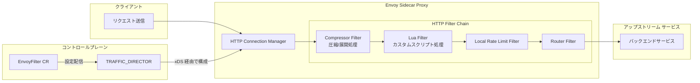

# Cloud Service Mesh: Envoy Compressor Filter GA / Lua Filter Preview

**リリース日**: 2026-07-06

**サービス**: Cloud Service Mesh

**機能**: Envoy Compressor Filter の GA 昇格および Envoy Lua Filter の Preview 提供開始

**ステータス**: GA (Compressor Filter) / Preview (Lua Filter)

📊 [このアップデートのインフォグラフィックを見る](https://takech9203.github.io/google-cloud-news-summary/20260706-cloud-service-mesh-envoy-filters.html)

## 概要

Cloud Service Mesh のデータプレーン拡張機能において、2 つの重要なアップデートが発表されました。Envoy Compressor Filter が Regular リリースチャネルで GA (一般提供) に昇格し、Envoy Lua Filter が同じく Regular リリースチャネルで Preview 機能として利用可能になりました。

Envoy Compressor Filter は HTTP レスポンスおよびリクエストのボディをオンザフライで圧縮・展開する機能を提供します。GA への昇格により、本番環境での利用が正式にサポートされ、SLA の対象となります。一方、Envoy Lua Filter はインラインの Lua スクリプトを使用してリクエスト/レスポンスの処理をカスタマイズできる機能で、より柔軟なデータプレーン拡張を実現します。

これらの機能は EnvoyFilter API を通じて利用され、Cloud Service Mesh の TRAFFIC_DIRECTOR コントロールプレーン実装で動作します。標準の Istio API では対応できないカスタムデータプレーン処理が必要なユーザーに向けた機能です。

**アップデート前の課題**

- Compressor Filter は Preview または限定サポートの状態であり、本番ワークロードでの利用に SLA が適用されなかった
- Lua スクリプトによるカスタム処理は Regular チャネルでは利用不可で、柔軟なリクエスト/レスポンス加工が困難だった
- データプレーンのカスタマイズには WebAssembly (Wasm) などの代替手段が必要で、より軽量なスクリプティングオプションが求められていた

**アップデート後の改善**

- Compressor Filter が GA となり、本番環境での圧縮処理を SLA 付きで安心して利用可能になった
- Lua Filter が Preview として利用可能になり、軽量なスクリプトでリクエスト/レスポンスのカスタム処理を実装できるようになった
- Regular リリースチャネルのユーザーが両機能にアクセスできるようになり、データプレーン拡張の選択肢が拡大した

## アーキテクチャ図



Cloud Service Mesh のデータプレーンでは、Envoy Sidecar Proxy の HTTP Filter Chain に各フィルターが挿入されます。EnvoyFilter カスタムリソースを通じて TRAFFIC_DIRECTOR コントロールプレーンがフィルター設定をプロキシに配信します。

## サービスアップデートの詳細

### 主要機能

1. **Envoy Compressor Filter (GA)**
   - HTTP レスポンスおよびリクエストのボディをオンザフライで圧縮する機能
   - gzip などの圧縮ライブラリをサポート
   - コンテンツタイプ、最小コンテンツ長、ETag ヘッダーの有無に基づく条件付き圧縮が可能
   - レスポンス方向とリクエスト方向の両方の圧縮設定をサポート
   - Regular リリースチャネルで GA として完全サポート

2. **Envoy Lua Filter (Preview)**
   - インライン Lua スクリプトによるリクエスト/レスポンスのカスタム処理
   - `default_source_code.inline_string` でスクリプトを直接指定
   - セキュリティと安定性のため、利用可能な Lua 機能に制限あり
   - Regular リリースチャネルで Preview として提供

## 技術仕様

### Compressor Filter サポートフィールド

| フィールド | Rapid | Regular | Stable |
|------|------|------|------|
| compressor_library | 対応 | 対応 | 対応 |
| choose_first | 対応 | 対応 | 対応 |
| response_direction_config.common_config.min_content_length | 対応 | 対応 | 対応 |
| response_direction_config.common_config.content_type | 対応 | 対応 | 対応 |
| response_direction_config.common_config.enabled | 対応 | 対応 | 対応 |
| response_direction_config.disable_on_etag_header | 対応 | 対応 | 対応 |
| response_direction_config.remove_accept_encoding_header | 対応 | 対応 | 対応 |
| response_direction_config.uncompressible_response_codes | 対応 | 対応 | 対応 |
| request_direction_config.common_config.min_content_length | 対応 | 対応 | 対応 |
| request_direction_config.common_config.content_type | 対応 | 対応 | 対応 |
| request_direction_config.common_config.enabled | 対応 | 対応 | 対応 |

### Lua Filter サポートフィールドと制限事項

| フィールド | Rapid | Regular | Stable |
|------|------|------|------|
| stat_prefix | 対応 | 対応 | - |
| default_source_code.inline_string | 対応 | 対応 | - |

**Lua スクリプトの制限:**

| 項目 | 制限値 |
|------|------|
| 個別スクリプトサイズ上限 | 50KB |
| クラスタ全体の合計スクリプトサイズ上限 | 100KB |
| クラスタ全体の Lua EnvoyFilter configPatches 数上限 | 10 |

**未サポートの Lua 機能:**
- Envoy Wrappers: `httpCall`, `filterContext`
- Lua 標準ライブラリ: `collectgarbage`, `dofile`, `getmetatable`, `loadfile`, `rawset`, `setfenv`, `setmetatable`, `module`
- OS パッケージ: `execute`, `remove`, `rename`, `setlocale`
- I/O およびデバッグライブラリ: `io`, `debug`
- LuaJIT 拡張: `ffi`, `jit`

### Compressor Filter の設定例

```yaml
apiVersion: networking.istio.io/v1alpha3
kind: EnvoyFilter
metadata:
  name: compressor-filter
  namespace: istio-system
spec:
  configPatches:
  - applyTo: HTTP_FILTER
    match:
      context: GATEWAY
      listener:
        filterChain:
          filter:
            name: envoy.filters.network.http_connection_manager
            subFilter:
              name: envoy.filters.http.router
    patch:
      operation: INSERT_BEFORE
      value:
        name: envoy.filters.http.compressor
        typed_config:
          '@type': type.googleapis.com/envoy.extensions.filters.http.compressor.v3.Compressor
          compressor_library:
            name: gzip
            typed_config:
              '@type': type.googleapis.com/envoy.extensions.compression.gzip.compressor.v3.Gzip
          response_direction_config:
            disable_on_etag_header: true
            remove_accept_encoding_header: true
            common_config:
              min_content_length: 1024
              content_type:
              - "application/javascript"
              - "application/json"
              - "text/html"
              enabled:
                default_value: true
                runtime_key: "compressor.enabled"
```

### Lua Filter の設定例

```yaml
apiVersion: networking.istio.io/v1alpha3
kind: EnvoyFilter
metadata:
  name: lua-filter
  namespace: onlineboutique
spec:
  workloadSelector:
    labels:
      app: frontend
  configPatches:
  - applyTo: HTTP_FILTER
    match:
      context: SIDECAR_INBOUND
      listener:
        filterChain:
          filter:
            name: envoy.filters.network.http_connection_manager
            subFilter:
              name: envoy.filters.http.router
    patch:
      operation: INSERT_BEFORE
      value:
        name: envoy.filters.http.lua
        typed_config:
          '@type': type.googleapis.com/envoy.extensions.filters.http.lua.v3.Lua
          stat_prefix: custom_lua
          default_source_code:
            inline_string: |
              function envoy_on_request(request_handle)
                request_handle:headers():add("x-custom-header", "processed")
              end
              function envoy_on_response(response_handle)
                response_handle:headers():add("x-response-time", os.clock())
              end
```

## 設定方法

### 前提条件

1. Cloud Service Mesh が TRAFFIC_DIRECTOR コントロールプレーン実装でプロビジョニングされていること
2. GKE クラスタで Envoy サイドカーインジェクションが有効であること
3. Regular リリースチャネルが選択されていること

### 手順

#### ステップ 1: コントロールプレーン実装の確認

```bash
# コントロールプレーン実装を確認
kubectl get controlplanerevision -n istio-system -o yaml
```

TRAFFIC_DIRECTOR 実装であることを確認します。

#### ステップ 2: EnvoyFilter リソースの適用

```bash
# Compressor Filter の適用
kubectl apply -f compressor-filter.yaml

# リソースのステータス確認
kubectl get envoyfilter -n istio-system compressor-filter -o yaml
```

ステータスの `conditions` で `Accepted: True` が表示されることを確認します。

#### ステップ 3: 動作確認

```bash
# レスポンスヘッダーで圧縮が有効か確認
curl -H "Accept-Encoding: gzip" -v http://<SERVICE_IP>/api/endpoint 2>&1 | grep -i content-encoding
```

`Content-Encoding: gzip` が返されれば正常に動作しています。

## メリット

### ビジネス面

- **帯域幅コストの削減**: Compressor Filter による圧縮でネットワーク転送量を削減し、Cloud NAT や外部通信のコストを低減
- **ユーザー体験の向上**: レスポンス圧縮によりページロード時間が短縮され、エンドユーザーの満足度向上に寄与

### 技術面

- **GA レベルのサポート**: Compressor Filter が正式サポートとなり、SLA の対象として本番利用に適切
- **柔軟なカスタマイズ**: Lua Filter により、ヘッダー操作やリクエスト変換などの軽量なカスタム処理を Wasm なしで実装可能
- **段階的な導入**: Preview の Lua Filter を検証環境で試行し、GA 昇格後に本番導入するという段階的アプローチが可能

## デメリット・制約事項

### 制限事項

- EnvoyFilter API は TRAFFIC_DIRECTOR コントロールプレーン実装でのみサポート
- `configPatches[].applyTo` は `HTTP_FILTER` のみ対応
- `patch.operation` は `INSERT_FIRST` および `INSERT_BEFORE` (router フィルターと併用時) のみ対応
- Lua Filter はセキュリティ上の理由で多くの標準ライブラリ機能が制限されている
- Lua Filter のスクリプトサイズはクラスタ全体で合計 100KB まで

### 考慮すべき点

- EnvoyFilter API は内部実装に依存しているため、不正な設定はメッシュを不安定にする可能性がある
- Google のサポート範囲は設定の配信までであり、フィルター個別の設定内容の正確性は対象外
- Compressor Filter で非推奨フィールドを使用している場合は `response_direction_config` / `request_direction_config` 形式への移行が必要
- Lua Filter は Preview であり、「Pre-GA Offerings Terms」が適用される

## ユースケース

### ユースケース 1: API レスポンスの圧縮によるコスト最適化

**シナリオ**: マイクロサービスアーキテクチャで大量の JSON レスポンスを返す API ゲートウェイにおいて、帯域幅コストを削減したい場合。

**実装例**:
```yaml
response_direction_config:
  common_config:
    min_content_length: 1024
    content_type:
    - "application/json"
    - "application/grpc+proto"
```

**効果**: 1KB 以上の JSON/gRPC レスポンスが自動圧縮され、ネットワーク転送量を 60-80% 削減可能。

### ユースケース 2: Lua スクリプトによるカスタムヘッダー処理

**シナリオ**: 特定のマイクロサービスへのリクエストにカスタムメタデータヘッダーを追加する必要があるが、アプリケーションコードの変更が難しい場合。

**効果**: アプリケーションコードを変更せずに、データプレーンレベルでヘッダー操作を実装でき、デプロイサイクルに影響を与えない。

## 関連サービス・機能

- **Cloud Service Mesh**: サービスメッシュのコントロールプレーンおよびデータプレーン管理
- **GKE (Google Kubernetes Engine)**: EnvoyFilter リソースをデプロイする基盤
- **Envoy Proxy**: データプレーンのプロキシ実装
- **Istio API**: EnvoyFilter はIstio の networking API の一部

## 参考リンク

- 📊 [インフォグラフィック](https://takech9203.github.io/google-cloud-news-summary/20260706-cloud-service-mesh-envoy-filters.html)
- [公式リリースノート](https://docs.cloud.google.com/release-notes#July_06_2026)
- [Data plane extensibility with EnvoyFilter](https://docs.cloud.google.com/service-mesh/docs/data-plane-extensibility)
- [Modernize EnvoyFilter compressor configurations](https://docs.cloud.google.com/service-mesh/docs/migrate/modernize-envoyfilter-compressor)

## まとめ

今回のアップデートにより、Cloud Service Mesh のデータプレーン拡張機能が強化されました。Compressor Filter の GA 昇格は、本番環境での HTTP 圧縮処理を正式にサポートするものであり、帯域幅削減とパフォーマンス向上を実現します。Lua Filter の Preview 提供は、軽量なスクリプティングによるカスタム処理の道を開くものです。既存の Compressor Filter 設定で非推奨フィールドを使用している場合は、早期の移行を推奨します。

---

**タグ**: #CloudServiceMesh #Envoy #EnvoyFilter #Compressor #Lua #DataPlane #ServiceMesh #GA #Preview
