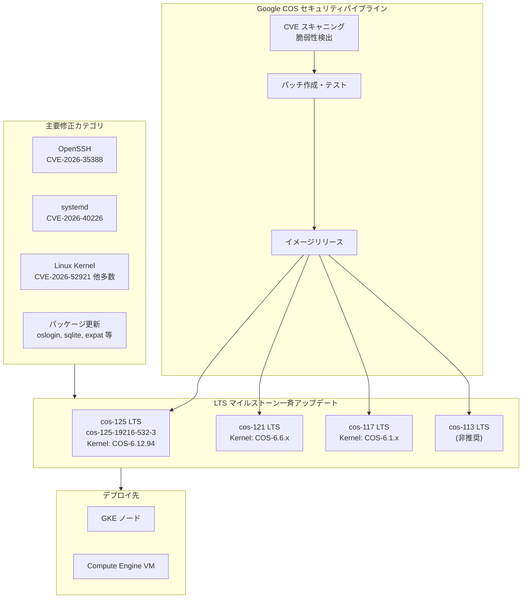

# Container-Optimized OS: 2026年7月セキュリティアップデート (複数マイルストーン一斉パッチ)

**リリース日**: 2026-07-06

**サービス**: Container-Optimized OS (COS)

**機能**: 複数 LTS マイルストーンに対するセキュリティ修正とパッケージアップグレード

**ステータス**: Fixed / Security

📊 [このアップデートのインフォグラフィックを見る](https://takech9203.github.io/google-cloud-news-summary/20260706-container-optimized-os-security-july.html)

## 概要

Google は 2026年7月6日、Container-Optimized OS (COS) の複数の LTS マイルストーン (cos-125, cos-121, cos-117, cos-113) に対して一斉セキュリティアップデートをリリースしました。最も新しい cos-125 マイルストーンでは、イメージバージョン cos-125-19216-532-3 が公開され、カーネル COS-6.12.94、Docker v27.5.1、Containerd v2.1.7 を搭載しています。

今回のアップデートでは、OpenSSH の脆弱性 (CVE-2026-35388)、systemd の脆弱性 (CVE-2026-40226)、および多数の Linux カーネル CVE (CVE-2026-52921, CVE-2026-52927, CVE-2026-52930, CVE-2026-52942, CVE-2026-53033 など) が修正されています。これらの脆弱性はリモートアクセス、権限昇格、サービス拒否などのリスクをもたらすものであり、本番環境で COS を使用しているすべてのユーザーに迅速な適用が推奨されます。

さらに、oslogin v20260626.00、docker-credential-helpers v0.9.8、sqlite v3.53.3、expat v2.8.2、socat v1.8.1.3 といったシステムパッケージのアップグレードも含まれており、セキュリティだけでなく安定性の向上にも寄与します。

**アップデート前の課題**

- OpenSSH に CVE-2026-35388 の脆弱性が存在し、SSH 接続を介したリモート攻撃のリスクがあった
- systemd に CVE-2026-40226 の脆弱性があり、システムサービス管理における権限昇格の可能性があった
- Linux カーネルに多数の CVE が発見され、メモリ管理やネットワーク処理における潜在的な脆弱性が存在していた
- 依存パッケージのバージョンが古く、既知のセキュリティ問題を含んでいた

**アップデート後の改善**

- OpenSSH、systemd、Linux カーネルの既知の脆弱性がすべて修正され、攻撃面が大幅に縮小された
- oslogin、docker-credential-helpers、sqlite、expat、socat が最新バージョンに更新され、安定性が向上した
- 複数のマイルストーン (cos-125, cos-121, cos-117, cos-113) に一斉にパッチが適用され、どのバージョンを使用していても保護される

## アーキテクチャ図



Container-Optimized OS のセキュリティパイプラインでは、継続的な CVE スキャニングにより脆弱性を検出し、パッチを作成・テストした上で、すべてのアクティブな LTS マイルストーンに同時にリリースされます。

## サービスアップデートの詳細

### 主要機能

1. **OpenSSH セキュリティ修正 (CVE-2026-35388)**
   - SSH デーモンにおける脆弱性を修正
   - リモートからの不正アクセスリスクを排除
   - すべてのアクティブな LTS マイルストーンに適用

2. **systemd セキュリティ修正 (CVE-2026-40226)**
   - システムサービス管理コンポーネントの脆弱性を修正
   - ローカル権限昇格の経路を遮断
   - init システムの安全性を強化

3. **Linux カーネルセキュリティ修正 (複数 CVE)**
   - CVE-2026-52921, CVE-2026-52927, CVE-2026-52930, CVE-2026-52942, CVE-2026-53033 を含む多数のカーネル脆弱性を修正
   - メモリ管理、ネットワークスタック、ファイルシステム等の幅広い領域を対象
   - カーネルバージョン COS-6.12.94 (cos-125) に更新

4. **システムパッケージアップグレード**
   - oslogin v20260626.00: OS Login 機能の改善
   - docker-credential-helpers v0.9.8: Docker 認証情報管理の安定性向上
   - sqlite v3.53.3: データベースエンジンの最新化
   - expat v2.8.2: XML パーサーのセキュリティ修正
   - socat v1.8.1.3: ネットワークユーティリティの更新

## 技術仕様

### cos-125-19216-532-3 イメージ仕様

| 項目 | 詳細 |
|------|------|
| マイルストーン | cos-125 |
| ビルド番号 | 19216-532-3 |
| カーネル | COS-6.12.94 |
| Docker | v27.5.1 |
| Containerd | v2.1.7 |
| イメージファミリー (x86) | cos-125-lts |
| イメージファミリー (Arm) | cos-arm64-125-lts |
| サポート終了 | 2027年9月 |

### 対象マイルストーンとサポート状況

| マイルストーン | ステータス | サポート終了 | 備考 |
|---------------|-----------|-------------|------|
| cos-125 LTS | アクティブ | 2027年9月 | 推奨バージョン |
| cos-121 LTS | アクティブ | 2027年3月 | 本番利用可 |
| cos-117 LTS | アクティブ | 2026年9月 | まもなくサポート終了 |
| cos-113 LTS | 非推奨 | 2026年3月 (終了済み) | 早急に移行推奨 |

### セキュリティ修正カテゴリ

| カテゴリ | CVE 数 | 代表的な CVE | 影響範囲 |
|---------|--------|-------------|---------|
| OpenSSH | 1 | CVE-2026-35388 | リモートアクセス |
| systemd | 1 | CVE-2026-40226 | ローカル権限昇格 |
| Linux カーネル | 多数 | CVE-2026-52921 他 | メモリ/ネットワーク/FS |

## 設定方法

### 前提条件

1. Google Cloud プロジェクトへのアクセス権
2. Compute Engine API が有効化されていること
3. gcloud CLI がインストール・認証済みであること

### 手順

#### ステップ 1: 現在のイメージバージョンを確認

```bash
# インスタンスの現在の COS バージョンを確認
gcloud compute instances describe INSTANCE_NAME \
  --zone=ZONE \
  --format="get(disks[0].source)"

# または SSH でインスタンスに接続して確認
cat /etc/os-release
```

#### ステップ 2: 最新の COS イメージに更新 (新規インスタンス)

```bash
# cos-125 LTS の最新イメージでインスタンスを作成
gcloud compute instances create INSTANCE_NAME \
  --zone=ZONE \
  --image-family=cos-125-lts \
  --image-project=cos-cloud
```

#### ステップ 3: GKE ノードプールの更新

```bash
# GKE ノードプールのイメージを更新
gcloud container clusters upgrade CLUSTER_NAME \
  --node-pool=POOL_NAME \
  --zone=ZONE

# または自動アップグレードが有効な場合は自動的に適用される
gcloud container node-pools describe POOL_NAME \
  --cluster=CLUSTER_NAME \
  --zone=ZONE \
  --format="get(management.autoUpgrade)"
```

#### ステップ 4: 既存インスタンスのローリングアップデート (マネージドインスタンスグループ)

```bash
# インスタンステンプレートを最新イメージで更新
gcloud compute instance-templates create TEMPLATE_NAME \
  --image-family=cos-125-lts \
  --image-project=cos-cloud

# マネージドインスタンスグループにローリングアップデートを適用
gcloud compute instance-groups managed rolling-action start-update GROUP_NAME \
  --version=template=TEMPLATE_NAME \
  --zone=ZONE
```

## メリット

### ビジネス面

- **コンプライアンス維持**: 最新のセキュリティパッチを適用することで、PCI DSS、SOC 2 等のコンプライアンス要件を満たし続けることが可能
- **インシデントリスク低減**: 既知の脆弱性を迅速に修正することで、セキュリティインシデントによるビジネス影響を未然に防止
- **運用コスト削減**: 複数マイルストーンへの一斉適用により、個別対応の手間を削減

### 技術面

- **攻撃面の縮小**: OpenSSH、systemd、カーネルの脆弱性修正により、システム全体の攻撃面を大幅に縮小
- **ソフトウェアスタックの最新化**: Docker、Containerd、各種ユーティリティが最新バージョンに更新され、既知のバグや互換性問題を解消
- **カーネルセキュリティの強化**: COS-6.12.94 カーネルにより、メモリ安全性やネットワーク処理の堅牢性が向上

## デメリット・制約事項

### 制限事項

- COS はイミュータブル (読み取り専用) なルートファイルシステムを採用しているため、カスタムパッケージの追加には制約がある
- cos-113 LTS は既にサポート終了 (2026年3月) しているため、今回のパッチは最終的な提供となる可能性がある
- cos-117 LTS は 2026年9月にサポート終了予定のため、計画的な移行が必要

### 考慮すべき点

- セキュリティパッチの適用にはノードの再起動またはインスタンスの再作成が必要
- GKE 環境ではノードの自動アップグレード機能により段階的に適用されるが、即座の適用が必要な場合は手動アップグレードが必要
- LTS Refresh リリースには中低優先度のバグ修正も含まれるため、リグレッションのリスクを考慮したテストが推奨される

## ユースケース

### ユースケース 1: GKE 本番クラスタのセキュリティ強化

**シナリオ**: PCI DSS 準拠が求められる E コマースプラットフォームを GKE で運用しており、既知の CVE に対する迅速なパッチ適用が監査要件として求められている。

**実装例**:
```bash
# ノードプールの自動アップグレードを有効化
gcloud container node-pools update POOL_NAME \
  --cluster=CLUSTER_NAME \
  --zone=ZONE \
  --enable-autoupgrade

# メンテナンスウィンドウを設定して業務影響を最小化
gcloud container clusters update CLUSTER_NAME \
  --zone=ZONE \
  --maintenance-window-start="2026-07-07T02:00:00Z" \
  --maintenance-window-end="2026-07-07T06:00:00Z" \
  --maintenance-window-recurrence="FREQ=WEEKLY;BYDAY=MO"
```

**効果**: 監査要件を満たしながら、ビジネスへの影響を最小限に抑えたセキュリティパッチの自動適用が実現

### ユースケース 2: マルチマイルストーン環境の統一管理

**シナリオ**: 異なるマイルストーン (cos-125, cos-121) の COS イメージを複数のワークロードで使用しており、すべての環境のセキュリティレベルを統一したい。

**効果**: 今回のアップデートでは複数のマイルストーンに同時にパッチが配信されるため、マイルストーンの違いに関わらず一貫したセキュリティ水準を確保できる

### ユースケース 3: cos-117 からの計画的マイグレーション

**シナリオ**: cos-117 LTS を使用しているが、2026年9月のサポート終了に向けて cos-125 LTS への移行を計画している。

**効果**: 今回のパッチで cos-117 のセキュリティを維持しつつ、移行先の cos-125 でも同等以上のセキュリティが担保されていることを確認できる

## 料金

Container-Optimized OS のイメージ利用自体に追加料金は発生しません。通常の Compute Engine インスタンスまたは GKE ノードの料金のみが適用されます。

## 利用可能リージョン

Container-Optimized OS イメージは、Compute Engine が利用可能なすべてのリージョンおよびゾーンで使用できます。イメージプロジェクト `cos-cloud` からグローバルに提供されています。

## 関連サービス・機能

- **Google Kubernetes Engine (GKE)**: COS はGKE のデフォルトノードイメージ (cos_containerd) として使用され、GKE のノード自動アップグレード機能と連携してセキュリティパッチが適用される
- **Compute Engine**: COS イメージは Compute Engine VM のブートディスクとして直接使用可能
- **Shielded VM**: COS は Verified Boot をサポートし、Shielded VM と組み合わせることでブートプロセスの整合性を検証可能
- **Container Registry / Artifact Registry**: COS 上で動作する Docker / Containerd はこれらのレジストリと連携してコンテナイメージを安全に取得
- **OS Login**: 今回アップグレードされた oslogin パッケージにより、IAM ベースの SSH アクセス管理が改善

## 参考リンク

- 📊 [インフォグラフィック](https://takech9203.github.io/google-cloud-news-summary/20260706-container-optimized-os-security-july.html)
- [公式リリースノート](https://docs.cloud.google.com/release-notes#July_06_2026)
- [Container-Optimized OS リリースノート (Milestone 125)](https://docs.cloud.google.com/container-optimized-os/docs/release-notes/m125)
- [Container-Optimized OS セキュリティ概要](https://docs.cloud.google.com/container-optimized-os/docs/concepts/security)
- [Container-Optimized OS バージョニング](https://docs.cloud.google.com/container-optimized-os/docs/concepts/versioning)
- [GKE ノードイメージ](https://docs.cloud.google.com/kubernetes-engine/docs/concepts/node-images)

## まとめ

今回の COS セキュリティアップデートは、OpenSSH、systemd、Linux カーネルにわたる広範な脆弱性修正を含む重要なリリースです。cos-125, cos-121, cos-117, cos-113 の複数マイルストーンに一斉適用されており、COS を使用するすべてのワークロードに影響します。特に本番環境では、GKE のノード自動アップグレード設定を確認し、可能な限り早期にパッチを適用することが推奨されます。また、cos-117 のサポート終了 (2026年9月) が迫っているため、cos-125 LTS への移行計画を併せて検討してください。

---

**タグ**: #ContainerOptimizedOS #COS #Security #CVE #GKE #ComputeEngine #LinuxKernel #OpenSSH #systemd #LTS #PatchManagement
