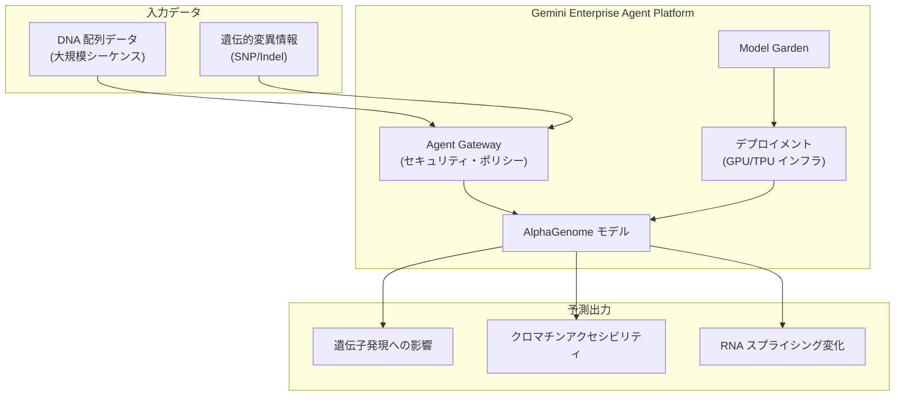

# Gemini Enterprise Agent Platform: AlphaGenome の提供開始

**リリース日**: 2026-07-06

**サービス**: Gemini Enterprise Agent Platform

**機能**: AlphaGenome released for Gemini Enterprise Agent Platform

**ステータス**: Feature

📊 [このアップデートのインフォグラフィックを見る](https://takech9203.github.io/google-cloud-news-summary/20260706-gemini-enterprise-agent-platform-alphagenome.html)

## 概要

Google DeepMind が開発した最先端のゲノミクス基盤モデル「AlphaGenome」が、Gemini Enterprise Agent Platform 上でデプロイおよび利用可能になりました。AlphaGenome は、ヒトゲノムの機能的制御コードを解読するために設計されたモデルであり、大規模な DNA 配列を単一塩基レベルの解像度で解析する能力を持っています。

このモデルは、遺伝的変異が遺伝子発現、クロマチンアクセシビリティ、RNA スプライシングなどの分子・生物学的メカニズムに与える影響を予測できます。Agent Platform の Model Garden を通じてデプロイすることで、ゲノミクス研究者や創薬企業がクラウド上でスケーラブルにゲノム解析を実行できる環境が整いました。

Gemini Enterprise Agent Platform は、200 以上の AI モデルへのアクセスを提供する統合プラットフォームであり、AlphaGenome の追加により、ライフサイエンス・ヘルスケア領域での活用がさらに強化されます。

**アップデート前の課題**

- AlphaGenome を利用するには独自のインフラストラクチャを構築・管理する必要があった
- ゲノミクスモデルのデプロイにはGPU/TPU環境の専門知識が必要だった
- エンタープライズグレードのセキュリティやガバナンスを備えたゲノム解析環境の構築が困難だった

**アップデート後の改善**

- Agent Platform の Model Garden から AlphaGenome をワンクリックまたは SDK でデプロイ可能になった
- VPC 内でのセキュアなモデル実行により、機密性の高いゲノムデータの保護が容易になった
- Agent Platform の統合されたガバナンス機能（Agent Gateway、Agent Identity）を活用できるようになった

## アーキテクチャ図



AlphaGenome は Agent Platform 上にデプロイされ、DNA 配列と遺伝的変異情報を入力として受け取り、単一塩基解像度で分子メカニズムへの影響を予測します。Agent Gateway がすべてのリクエストのセキュリティポリシーを適用します。

## サービスアップデートの詳細

### 主要機能

1. **単一塩基解像度での DNA 配列解析**
   - 大規模な DNA 配列を塩基一つ一つのレベルで解析
   - ヒトゲノムの機能的制御コード（レギュラトリーコード）の解読に特化

2. **遺伝的変異の影響予測**
   - 遺伝子発現（Gene Expression）への影響を定量的に予測
   - クロマチンアクセシビリティの変化を評価
   - RNA スプライシングパターンへの影響を解析

3. **Agent Platform との統合**
   - Model Garden からのデプロイに対応
   - エンタープライズグレードのセキュリティとガバナンス機能を活用可能
   - VPC ネットワーク内でのセキュアな実行環境

## 技術仕様

### モデル特性

| 項目 | 詳細 |
|------|------|
| 開発元 | Google DeepMind |
| モデルカテゴリ | ゲノミクス基盤モデル（Foundation Model） |
| 入力 | 大規模 DNA 配列 |
| 解析解像度 | 単一塩基（Single-base resolution） |
| 主な予測対象 | 遺伝子発現、クロマチンアクセシビリティ、RNA スプライシング |
| デプロイ方式 | Agent Platform Model Garden（セルフデプロイ） |

### デプロイ方式

Agent Platform の Model Garden では、オープンモデルのセルフデプロイが可能です。AlphaGenome はセルフデプロイモデルとして提供され、ユーザーの Google Cloud プロジェクトおよび VPC ネットワーク内でセキュアに実行されます。

## 設定方法

### 前提条件

1. Google Cloud プロジェクトが作成済みであること
2. Gemini Enterprise Agent Platform API が有効化されていること
3. 適切な IAM 権限が付与されていること

### 手順

#### ステップ 1: Model Garden でモデルを検索

Google Cloud コンソールで Model Garden にアクセスし、AlphaGenome のモデルカードを検索します。

#### ステップ 2: モデルのデプロイ

```python
import vertexai
from vertexai import model_garden

vertexai.init(project="PROJECT_ID", location="LOCATION")

model = model_garden.OpenModel("google/alphagenome")
endpoint = model.deploy(
    machine_type="MACHINE_TYPE",
    accelerator_type="ACCELERATOR_TYPE",
    accelerator_count=ACCELERATOR_COUNT,
    endpoint_display_name="alphagenome-endpoint",
)
```

具体的なマシンタイプやアクセラレータの構成については、[AlphaGenome のドキュメント](https://docs.cloud.google.com/gemini-enterprise-agent-platform/models/open-models/alphagenome)を参照してください。

## メリット

### ビジネス面

- **創薬プロセスの加速**: 遺伝的変異の機能的影響を迅速に予測し、創薬ターゲットの同定を効率化
- **インフラ管理の軽減**: Agent Platform のマネージドインフラを利用することで、GPU/TPU 環境の構築・運用コストを削減
- **コンプライアンス対応**: VPC 内でのセキュアな実行とガバナンス機能により、規制要件への対応が容易

### 技術面

- **単一塩基レベルの高解像度予測**: 従来のモデルと比較して、より精密な遺伝的変異の影響評価が可能
- **スケーラビリティ**: Agent Platform のインフラを活用し、大規模なゲノム解析を並列処理可能
- **統合環境**: 他の Agent Platform モデル（Co-Scientist、TxGemma など）との組み合わせによる包括的なバイオインフォマティクスワークフローの構築

## ユースケース

### ユースケース 1: 遺伝性疾患の変異解釈

**シナリオ**: 臨床遺伝学者が患者のゲノムシーケンスデータから検出された意義不明変異（VUS: Variant of Uncertain Significance）の病原性を評価する。

**効果**: AlphaGenome の予測により、変異が遺伝子発現やスプライシングに与える影響を定量的に評価し、臨床判断を支援。

### ユースケース 2: 創薬ターゲットの探索

**シナリオ**: 製薬企業が特定の疾患に関連する遺伝子制御領域の変異を大規模にスクリーニングし、新たな治療標的を同定する。

**効果**: クロマチンアクセシビリティや遺伝子発現への影響予測により、機能的に重要な制御領域を効率的に特定。

### ユースケース 3: 農業バイオテクノロジー

**シナリオ**: 作物のゲノム改良において、特定の遺伝子発現パターンに影響を与える塩基配列変化を予測し、品種改良の方向性を決定する。

**効果**: 従来の実験的アプローチと比較して、候補変異の絞り込みを大幅に効率化。

## 関連サービス・機能

- **Co-Scientist**: Google の科学研究支援 AI エージェント。AlphaGenome の予測結果をもとに仮説生成を行うワークフローが構築可能
- **TxGemma**: 治療薬開発向けオープンモデル。ゲノミクス解析と組み合わせた創薬パイプラインを構築可能
- **Model Garden**: AlphaGenome を含む 200 以上のモデルを発見・テスト・デプロイできる統合カタログ
- **Agent Gateway**: ゲノムデータへのアクセスを制御し、セキュリティポリシーを適用するゲートウェイ

## 参考リンク

- 📊 [インフォグラフィック](https://takech9203.github.io/google-cloud-news-summary/20260706-gemini-enterprise-agent-platform-alphagenome.html)
- [公式リリースノート](https://docs.cloud.google.com/release-notes#July_06_2026)
- [AlphaGenome ドキュメント](https://docs.cloud.google.com/gemini-enterprise-agent-platform/models/open-models/alphagenome)
- [Gemini Enterprise Agent Platform 概要](https://docs.cloud.google.com/gemini-enterprise-agent-platform/overview)
- [Model Garden でのオープンモデルデプロイ](https://docs.cloud.google.com/gemini-enterprise-agent-platform/models/open-models/deploy-model-garden)

## まとめ

AlphaGenome の Gemini Enterprise Agent Platform への統合は、ゲノミクス研究と創薬分野における Google Cloud の存在感を大きく高めるアップデートです。単一塩基解像度での遺伝的変異影響予測という高度な機能を、エンタープライズグレードのセキュリティとスケーラビリティを備えたプラットフォーム上で利用できるようになったことで、ライフサイエンス企業や研究機関は、より迅速かつ安全にゲノム解析を実行できるようになります。

---

**タグ**: #GeminiEnterpriseAgentPlatform #AlphaGenome #GoogleDeepMind #Genomics #MachineLearning #LifeSciences #ModelGarden
