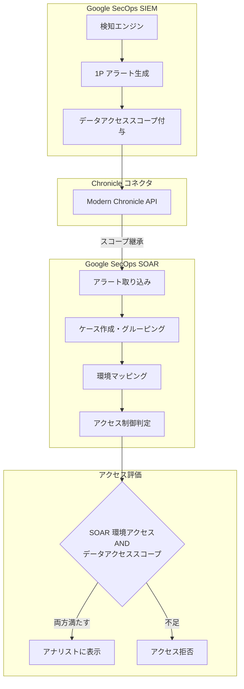

# Google SecOps: 1P ケース・アラートに対する Data RBAC (Public Preview)

**リリース日**: 2026-07-06

**サービス**: Google SecOps

**機能**: Data RBAC for first-party (1P) cases and alerts

**ステータス**: Public Preview

[このアップデートのインフォグラフィックを見る](https://takech9203.github.io/google-cloud-news-summary/20260706-google-secops-data-rbac-1p-cases.html)

## 概要

Google SecOps が、SOAR コンポーネントにおけるファーストパーティ (1P) ケースおよびアラートに対してデータロールベースアクセス制御 (Data RBAC) をサポートするようになりました。この機能は Public Preview として提供されています。

本機能により、Chronicle コネクタを使用して取り込まれたアラートおよびケースに対して、SIEM データアクセススコープが自動的に適用されます。これにより、アナリストは自分がアクセスを許可されたデータのみを閲覧できるようになり、データガバナンスポリシーの適用とセキュリティの強化が実現されます。

**アップデート前の課題**

- SIEM 側で設定したデータアクセススコープが SOAR のケースやアラートに自動的に継承されなかった
- SOAR 環境内でのデータアクセス制御は環境単位のみで、SIEM のスコープと連動していなかった
- アナリストが本来アクセスすべきでないデータに関連するケースやアラートを閲覧できる可能性があった

**アップデート後の改善**

- SIEM で定義されたデータアクセススコープが SOAR のケース・アラートに自動継承されるようになった
- 環境アクセスとデータアクセススコープの二重アクセス制御により、きめ細かなデータガバナンスが実現
- SIEM スコープと SOAR 環境のマッピングにより、アラートルーティングとグルーピングの管理が容易に

## アーキテクチャ図

SIEM 側で検知・生成されたアラートに付与されたデータアクセススコープが、Chronicle コネクタを経由して SOAR コンポーネントに自動的に継承され、環境マッピングとスコープの二重チェックによりアクセス制御が実施される流れを示しています。

## サービスアップデートの詳細

### 主要機能

1. **SIEM スコープから SOAR への継承**
   - SIEM 検知エンジンで生成された 1P アラートには、データアクセススコープが割り当てられる
   - Chronicle コネクタ経由で SOAR に取り込まれる際、スコープが親ケースに自動継承される
   - グローバルユーザーは全データへのフルアクセスを維持

2. **二重アクセス制御 (Dual Access Enforcement)**
   - ケースやアラートを閲覧するには、割り当てられた SOAR 環境へのアクセス権と、関連するすべてのデータアクセススコープの両方が必要
   - いずれかが欠けている場合、該当のケース・アラートは表示されない
   - グローバルユーザー (スコープ未割り当て) は制限なく全データにアクセス可能

3. **スコープと環境のマッピング**
   - 管理者は SOAR Settings > Environments から SIEM データアクセススコープを SOAR 環境にマッピング可能
   - 1 つのスコープは 1 つの環境にのみマッピング可能 (複数スコープを同一環境にマッピングすることは可能)
   - マッピングされていないスコープのアラートはフォールバック環境にルーティングされる

4. **UI でのスコープ表示とフィルタリング**
   - ケースヘッダーおよびケース一覧テーブルで、環境の横にデータアクセススコープが表示される
   - スコープによるフィルタリングが可能

5. **手動ケース作成時のスコープ制御**
   - アナリストが手動でケースを作成する際、自身に許可されたデータアクセススコープと環境マッピングの交差部分からのみ選択可能

## 技術仕様

### アクセス制御モデル

| 項目 | 詳細 |
|------|------|
| 対象 | ファーストパーティ (1P) アラートおよびケース |
| 非対象 | サードパーティ (3P) アラート (SOAR 統合から直接取り込まれるもの) |
| スコープ伝搬 | SIEM アラートのスコープが SOAR ケースに自動継承 |
| アクセス条件 | SOAR 環境アクセス AND 全関連データアクセススコープ |
| グローバルユーザー | 全データへの無制限アクセス |
| マルチインスタンス | プライマリ SIEM インスタンスからのスコープのみ適用 |

### IAM ロール

| ロール | 説明 |
|--------|------|
| Chronicle API Admin | Data RBAC の有効化・設定が可能 |
| Chronicle API Restricted Data Access | スコープ付きユーザーとして識別 |
| Chronicle API Restricted Data Access Viewer | スコープ内の閲覧アクセスを付与 |
| グローバルアクセスロール | 全データへの無制限アクセス |

## 設定方法

### 前提条件

1. 統合された Google SecOps インスタンス (SIEM と SOAR が有効)
2. Chronicle コネクタがモダン Chronicle API を使用していること (レガシー Backstory API からのアップグレードが必要)
3. Chronicle API Admin ロール (Google Cloud IAM 内)

### 手順

#### ステップ 1: SIEM データアクセスが既に有効な場合

1. Google SecOps にサインイン
2. SIEM Settings > Data Access でスコープが正しく設定されていることを確認
3. Google Cloud IAM でユーザーにデータスコープを割り当て
4. SIEM Settings > Data Access で **Enable Data Access in SOAR** をクリック
5. SIEM スコープを SOAR 環境にマッピング

#### ステップ 2: SIEM データアクセスがまだ有効でない場合

1. Google SecOps にサインイン
2. SIEM Settings > Data Access でスコープが正しく設定されていることを確認
3. Google Cloud IAM でユーザーにデータスコープを割り当て
4. SIEM Settings > Data Access で **Enforce Data Access** をクリック (SIEM と SOAR の両方で同時に有効化)
5. SIEM スコープを SOAR 環境にマッピング

#### ステップ 3: スコープと環境のマッピング

1. SOAR Settings > Environments にアクセス
2. 既存の環境を選択するか、**Add Environment** をクリック
3. Data access scopes フィールドで必要な SIEM スコープを選択
4. **Save** をクリック

## メリット

### ビジネス面

- **コンプライアンス強化**: 役割と責任に基づいたデータ可視性の制限により、規制要件への準拠を支援
- **データ漏洩リスクの低減**: アナリストが業務に無関係なデータにアクセスすることを防止
- **運用効率の向上**: 関連するケースのみが表示されるため、アナリストの集中力と生産性が向上

### 技術面

- **自動スコープ伝搬**: SIEM から SOAR への手動設定なしでのスコープ継承
- **一貫したアクセス制御**: SIEM と SOAR 間で統一されたデータガバナンスポリシー
- **柔軟なマッピング**: 複数スコープを単一環境にマッピング可能な柔軟な構成

## デメリット・制約事項

### 制限事項

- Public Preview のため、Pre-GA Offerings Terms が適用される
- サードパーティ (3P) アラートには適用されない (SOAR 統合から直接取り込まれるもの)
- マルチインスタンス SIEM 構成ではプライマリ SIEM インスタンスからのスコープのみ適用
- 1 つのスコープは 1 つの環境にのみマッピング可能
- 有効化は不可逆 (元に戻せない)

### 考慮すべき点

- Chronicle コネクタがモダン Chronicle API を使用している必要がある (レガシー API からの移行が必要な場合あり)
- スコープから環境へのマッピング変更または初期有効化後、伝搬に最大 30 秒かかる
- Data RBAC 有効化後、スコープ付きユーザーはスコープが割り当てられるまでデータにアクセスできない
- キュレーテッド検知は Data RBAC をサポートしておらず、グローバルスコープのユーザーのみアクセス可能

## ユースケース

### ユースケース 1: 部門別データアクセス分離

**シナリオ**: 大規模組織で、財務部門と顧客サービス部門がそれぞれ異なるデータソースを持つ場合。財務アナリストは財務関連のセキュリティアラートのみ、カスタマーサービスのアナリストは顧客データ関連のアラートのみを閲覧する必要がある。

**効果**: SIEM でデータアクセススコープを「finance」と「customer-service」に分離し、それぞれを対応する SOAR 環境にマッピングすることで、各部門のアナリストは自部門に関連するケースのみを閲覧・対応できる。

### ユースケース 2: 地理的データ主権要件への対応

**シナリオ**: 多国籍企業で、各地域のデータが当該地域のセキュリティチームによってのみ処理される必要がある規制要件がある場合。

**効果**: 地域ごとのデータアクセススコープを設定し、各地域の SOAR 環境にマッピングすることで、データ主権要件を満たしつつ、効率的なインシデント対応体制を構築できる。

## 利用可能リージョン

本機能は以下の 18 リージョンで利用可能です:

| リージョン | ロケーション |
|-----------|-------------|
| europe-central2 | ワルシャワ (ポーランド) |
| asia-northeast1 | 東京 (日本) |
| asia-south1 | ムンバイ (インド) |
| australia-southeast1 | シドニー (オーストラリア) |
| northamerica-northeast2 | トロント (カナダ) |
| europe-west3 | フランクフルト (ドイツ) |
| europe-west6 | チューリッヒ (スイス) |
| southamerica-east1 | サンパウロ (ブラジル) |
| asia-southeast1 | シンガポール |
| me-central1 | ドーハ (カタール) |
| me-central2 | ダンマーム (サウジアラビア) |
| me-west1 | テルアビブ (イスラエル) |
| europe-west2 | ロンドン (イギリス) |
| europe-west9 | パリ (フランス) |
| europe-west12 | トリノ (イタリア) |
| asia-southeast2 | ジャカルタ (インドネシア) |
| africa-south1 | ヨハネスブルグ (南アフリカ) |
| asia-east1 | 台湾 |
| asia-northeast3 | ソウル (韓国) |

## 関連サービス・機能

- **Google SecOps SIEM**: 検知エンジンが 1P アラートを生成し、データアクセススコープを付与する基盤
- **Google SecOps SOAR**: ケース管理とインシデント対応を行うコンポーネント。本機能により SIEM スコープが継承される
- **Chronicle コネクタ**: SIEM と SOAR を接続し、スコープ情報を含むアラートを転送する
- **Google Cloud IAM**: ユーザーへのロール・スコープ割り当てを管理する基盤
- **Data RBAC (SIEM)**: SIEM 側のデータアクセス制御。本機能はこれを SOAR に拡張するもの

## 参考リンク

- [インフォグラフィック](https://takech9203.github.io/google-cloud-news-summary/20260706-google-secops-data-rbac-1p-cases.html)
- [公式リリースノート](https://docs.google.com/release-notes#July_06_2026)
- [1P ケースとアラートへのアクセス制御ドキュメント](https://docs.cloud.google.com/chronicle/docs/administration/datarbac-impact-cases)
- [Data RBAC 概要](https://docs.cloud.google.com/chronicle/docs/administration/datarbac-overview)
- [Data RBAC ユーザー設定](https://docs.cloud.google.com/chronicle/docs/administration/configure-datarbac-users)

## まとめ

Google SecOps の Data RBAC が SOAR の 1P ケース・アラートに拡張されたことで、SIEM から SOAR まで一貫したデータガバナンスが実現されました。18 リージョンで Public Preview として利用可能なこの機能は、特にデータ主権要件や部門間のデータ分離が求められる組織にとって重要なアップデートです。統合 Google SecOps インスタンスを運用しており、データアクセス制御の強化を検討している組織は、Chronicle コネクタのモダン API への移行状況を確認し、本機能の有効化を検討することを推奨します。

---

**タグ**: #GoogleSecOps #DataRBAC #SOAR #SIEM #AccessControl #Security #PublicPreview
