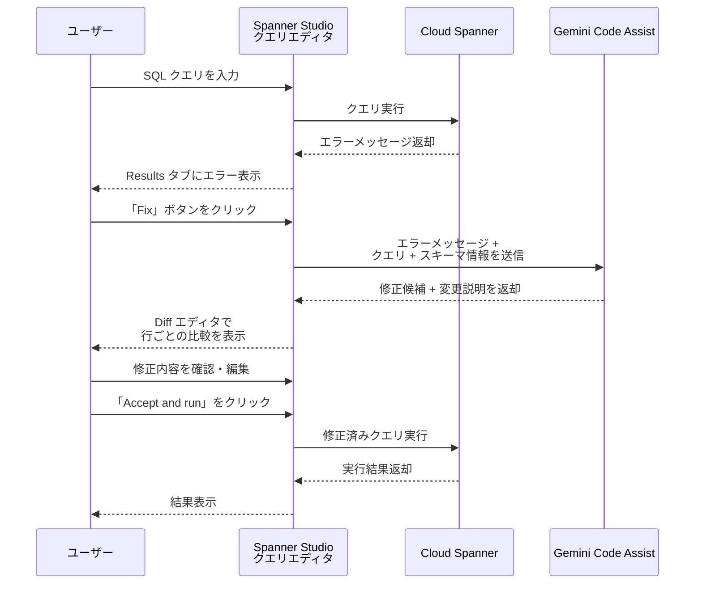

# Spanner: Gemini による SQL クエリエラーの自動修正機能

**リリース日**: 2026-07-06

**サービス**: Cloud Spanner

**機能**: Spanner Studio での Gemini を活用した SQL エラー修正

**ステータス**: Preview

📊 [このアップデートのインフォグラフィックを見る](https://takech9203.github.io/google-cloud-news-summary/20260706-spanner-gemini-sql-fix.html)

## 概要

Cloud Spanner の統合開発環境である Spanner Studio に、Gemini を活用した SQL クエリエラーの自動修正機能が Preview として追加されました。クエリ実行時にエラーが発生した場合、「Fix」ボタンをクリックするだけで、AI がエラーの原因を分析し、修正候補を提示します。

この機能は Gemini Code Assist の一部として提供され、Spanner Studio のクエリエディタ内で完結するため、外部ツールへの切り替えが不要です。エラーメッセージとスキーマ情報を参照して正確な修正を提案するため、汎用的な LLM よりも的確なサポートが得られます。

データベース管理者やデータエンジニアが日常的に直面する SQL のシンタックスエラー、スキーマ関連エラー、ランタイムエラーのトラブルシューティングを大幅に効率化します。

**アップデート前の課題**

- SQL クエリのエラー修正にはエラーメッセージを手動で解析し、原因を特定する必要があった
- 複雑なスキーマを持つデータベースでは、正しいテーブル名やカラム名を確認するために別画面に遷移する必要があった
- 外部の汎用 LLM を使用する場合、スキーマ情報を手動で提供する必要があり、データのセキュリティリスクも存在した

**アップデート後の改善**

- 「Fix」ボタンのワンクリックで AI による修正候補が即座に表示される
- 元のクエリと修正候補の差分比較（diff エディタ）により、変更箇所が一目で把握できる
- エラーメッセージとスキーマ情報を自動的に参照した、コンテキストに基づく正確な修正が得られる
- Spanner Studio 内で完結するため、データが外部に流出するリスクがない

## アーキテクチャ図

ユーザーが SQL クエリを実行してエラーが発生すると、Gemini Code Assist がエラーメッセージとスキーマ情報をコンテキストとして修正候補を生成し、差分エディタで表示します。

## サービスアップデートの詳細

### 主要機能

1. **ワンクリック修正提案**
   - クエリ実行後にエラーが発生した場合、「Fix」ボタンが表示される
   - クリックするだけで Gemini が自動的にエラーを分析し修正候補を生成

2. **差分エディタ（Diff Editor）による比較表示**
   - 元のクエリと修正候補が行ごとに並べて表示される
   - エラーの原因となっている箇所がハイライトされる
   - 変更内容の自然言語による説明が併せて表示される

3. **コンテキスト認識型の修正**
   - クエリに関連するエラーメッセージを正確に参照
   - データベースのスキーマ情報（テーブル名、カラム名、データ型）を考慮した修正
   - シンタックスエラー、スキーマエラー、ランタイムエラーに対応

4. **修正の適用と実行**
   - 修正内容を確認した後、「Accept and run」で即座に修正済みクエリを実行可能
   - 修正内容を手動で編集してから実行することも可能

## 技術仕様

### 必要な権限

| 項目 | 詳細 |
|------|------|
| IAM ロール | `roles/cloudaicompanion.user`（Gemini for Google Cloud User） |
| API 権限 | `cloudaicompanion.googleapis.com/instances.generateCode` |
| Spanner ロール | Spanner Studio の利用に必要な標準ロール |

### 制限事項

| 項目 | 詳細 |
|------|------|
| 利用可能な場所 | Google Cloud コンソール内の Spanner Studio クエリエディタのみ |
| コンテキストウィンドウ | Gemini の現行コンテキストウィンドウ制限が適用 |
| ステータス | Preview（Pre-GA） |

## 設定方法

### 前提条件

1. Gemini Code Assist がプロジェクトで有効化されていること
2. `roles/cloudaicompanion.user` IAM ロールが付与されていること
3. `cloudaicompanion.googleapis.com/instances.generateCode` 権限があること

### 手順

#### ステップ 1: Gemini 機能の有効化

Google Cloud コンソールで Spanner Studio を開き、Gemini Code Assist ボタンをクリックして機能を有効化します。

1. Google Cloud コンソールで Spanner ページに移動
2. インスタンスを選択
3. データベースを選択
4. ナビゲーションメニューから「Spanner Studio」をクリック
5. Gemini Code Assist ボタンをクリックし、機能を有効化

#### ステップ 2: SQL エラーの修正

1. クエリエディタで SQL クエリを入力して実行
2. エラーが発生した場合、Results タブにエラーメッセージが表示される
3. 「Fix」ボタンをクリック
4. Diff エディタで元のクエリと修正候補の比較を確認
5. 変更の説明を確認し、必要に応じて編集
6. 「Accept and run」をクリックして修正済みクエリを実行

## メリット

### ビジネス面

- **開発効率の向上**: SQL エラーの修正時間を大幅に短縮し、開発者の生産性を向上
- **学習コストの削減**: Spanner 固有の SQL 方言やスキーマに不慣れな開発者でも迅速にエラーを解決可能
- **セキュリティの確保**: 外部ツールにデータやスキーマ情報を送信する必要がなく、データガバナンスを維持

### 技術面

- **コンテキスト認識**: エラーメッセージとスキーマ情報を自動参照するため、汎用 LLM より正確な修正を提案
- **統合されたワークフロー**: クエリエディタ内で修正が完結し、画面遷移が不要
- **即座のフィードバック**: 修正候補の適用と実行がワンクリックで可能

## デメリット・制約事項

### 制限事項

- Google Cloud コンソール内の Spanner Studio クエリエディタでのみ利用可能（gcloud CLI やクライアントライブラリからは利用不可）
- Gemini のコンテキストウィンドウ制限により、非常に長いクエリでは正確な修正が得られない場合がある
- Preview 段階のため、サポートが限定的であり、本番環境での利用には注意が必要

### 考慮すべき点

- Pre-GA 機能であるため、今後仕様が変更される可能性がある
- Gemini Code Assist の利用条件（将来的に Gemini Code Assist Standard edition ライセンスが必要になる可能性）
- AI による修正提案は常に正確とは限らないため、実行前に確認が必要

## ユースケース

### ユースケース 1: スキーマ変更後のクエリ修正

**シナリオ**: テーブルのカラム名を変更した後、古いカラム名を参照している既存クエリでエラーが発生する。

**効果**: Gemini がスキーマ情報を参照し、新しいカラム名を使用した修正クエリを自動提案。手動でのスキーマ確認が不要になる。

### ユースケース 2: 複雑な JOIN クエリのシンタックスエラー修正

**シナリオ**: 複数テーブルを結合する複雑なクエリで、JOIN 条件や括弧の対応にエラーがある。

**効果**: Gemini が行ごとの差分で問題箇所を特定し、正しいシンタックスを提案。変更理由の説明により、同様のエラーの再発防止にも役立つ。

### ユースケース 3: Spanner 固有の SQL 方言への対応

**シナリオ**: 他のデータベースから Spanner に移行した開発者が、Spanner 固有の SQL 構文に不慣れでエラーが発生する。

**効果**: Spanner のスキーマとエラー情報を基に、Spanner に適した正しい SQL を提案。学習曲線を緩やかにする。

## 関連サービス・機能

- **Gemini Code Assist**: Spanner Studio 内での AI アシスタンス基盤
- **Spanner Studio**: Google Cloud コンソール内の Spanner 用統合クエリエディタ
- **Gemini による SQL 生成**: 自然言語コメントから SQL クエリを自動生成する機能
- **Gemini による SQL 説明**: 既存の SQL クエリを自然言語で説明する機能

## 参考リンク

- 📊 [インフォグラフィック](https://takech9203.github.io/google-cloud-news-summary/20260706-spanner-gemini-sql-fix.html)
- [公式リリースノート](https://docs.cloud.google.com/release-notes#July_06_2026)
- [Spanner での Gemini を使用した SQL 作成ドキュメント](https://docs.google.com/spanner/docs/write-sql-gemini)
- [Gemini for Google Cloud 概要](https://docs.cloud.google.com/gemini/docs/overview)

## まとめ

Spanner Studio に Gemini による SQL エラー自動修正機能が Preview として追加されたことで、データベース開発者のトラブルシューティング体験が大きく改善されます。ワンクリックで差分比較と修正提案が得られるため、特に複雑なスキーマを扱うチームや Spanner に移行中の組織にとって有用な機能です。Preview 段階のため本番ワークフローへの組み込みには注意が必要ですが、開発・テスト環境での活用を推奨します。

---

**タグ**: #Spanner #GeminiCodeAssist #SpannerStudio #SQL #AI #Preview #クエリエディタ #エラー修正
