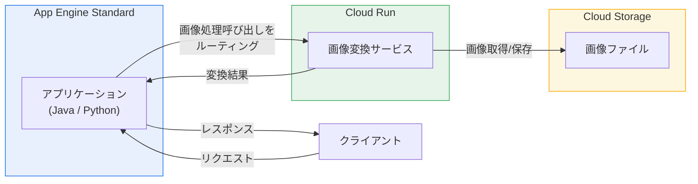

# App Engine standard environment: Images サービスから Cloud Run への移行パス

**リリース日**: 2026-07-07

**サービス**: App Engine standard environment (Java / Python)

**機能**: App Engine Images サービスから Cloud Run 画像変換サービスへの移行

**ステータス**: Preview

[このアップデートのインフォグラフィックを見る](https://takech9203.github.io/google-cloud-news-summary/20260707-app-engine-images-service-cloud-run-migration.html)

## 概要

Google Cloud は、App Engine standard environment の Java および Python ランタイムにおいて、レガシーな Images バンドルサービスから Cloud Run ベースの画像変換サービスへの移行パスを Preview として提供開始しました。この機能により、App Engine 上でアプリケーションを引き続き実行しながら、画像処理の呼び出しを Cloud Run 上の画像変換サービスにルーティングすることが可能になります。

App Engine Images サービスは、画像のリサイズ、回転、クロップ、フォーマット変換などの機能を提供するレガシーバンドルサービスです。今回のアップデートにより、これらの画像処理機能をモダンな Cloud Run 環境で実行できるようになり、App Engine バンドルサービスからの段階的な脱却が容易になります。

**アップデート前の課題**

- App Engine Images サービスはレガシーバンドルサービスであり、App Engine standard environment でのみ利用可能だった
- 画像処理機能を Cloud Run や他のプラットフォームに移行するには、アプリケーション全体のアーキテクチャ変更が必要だった
- Images サービスの代替として Pillow や ImageMagick 等のライブラリへの完全な書き換えが必要で、移行コストが高かった
- `get_serving_url()` による動的画像リサイズ機能の代替手段が限られていた

**アップデート後の改善**

- App Engine アプリを引き続き実行しながら、画像処理呼び出しのみを Cloud Run にルーティング可能になった
- アプリケーション全体を一度に移行する必要がなく、段階的な移行が可能になった
- Cloud Run の柔軟なスケーリングとコンテナベースの画像処理インフラを活用できるようになった
- Java と Python の両方のランタイムで同一の移行パターンが利用可能になった

## アーキテクチャ図

この図は、App Engine アプリケーションが従来の Images バンドルサービスの代わりに Cloud Run 上の画像変換サービスに呼び出しをルーティングする移行パターンを示しています。

## サービスアップデートの詳細

### 主要機能

1. **Images サービスから Cloud Run への呼び出しルーティング**
   - App Engine アプリケーションのコードから、画像処理リクエストを Cloud Run サービスに転送
   - アプリケーション本体は App Engine 上で継続稼働
   - 既存の Images API 呼び出しパターンを段階的に置き換え可能

2. **Java ランタイムサポート**
   - App Engine standard environment Java アプリケーションで利用可能
   - 移行ガイドが公式ドキュメントとして提供

3. **Python ランタイムサポート**
   - App Engine standard environment Python アプリケーションで利用可能
   - Java と同様の移行パターンを適用可能

## 技術仕様

### App Engine Images サービスの主な機能と移行対象

| 機能 | Images サービス | Cloud Run 移行後 |
|------|----------------|------------------|
| リサイズ | 最大 4000px | Cloud Run サービスで処理 |
| 回転 | 90度単位 | Cloud Run サービスで処理 |
| クロップ | バウンディングボックス指定 | Cloud Run サービスで処理 |
| フォーマット変換 | JPEG/PNG/WEBP 出力 | Cloud Run サービスで処理 |
| Serving URL | `get_serving_url()` | Cloud Run エンドポイントに置換 |
| 入力サイズ上限 | 32 MB | Cloud Run サービスの設定に依存 |

### 対象ランタイム

| ランタイム | ドキュメント |
|-----------|-------------|
| Java (standard) | [Images サービスから Cloud Run への移行](https://docs.cloud.google.com/appengine/migration-center/standard/java/images-to-cloud-run) |
| Python (standard) | [Images サービスから Cloud Run への移行](https://docs.google.com/appengine/migration-center/standard/python/images-to-cloud-run) |

## メリット

### ビジネス面

- **段階的移行によるリスク低減**: アプリケーション全体を一度に移行する必要がなく、画像処理部分のみを先行して移行可能
- **運用継続性の確保**: 移行中も既存の App Engine アプリケーションは通常通り稼働を継続

### 技術面

- **モダンインフラへの移行**: Cloud Run のコンテナベース実行環境により、カスタム画像処理ライブラリの自由な選択が可能
- **スケーラビリティの向上**: Cloud Run の自動スケーリングにより、画像処理の負荷に応じた柔軟なリソース制御が可能
- **将来的な完全移行への足がかり**: 画像処理の Cloud Run 移行を皮切りに、アプリケーション全体の Cloud Run 移行を計画的に実施可能

## デメリット・制約事項

### 制限事項

- 現在 Preview ステータスであり、本番環境での利用にはリスクが伴う
- Pre-GA 機能のため、サポートが限定的である可能性がある
- Java と Python のみが対象で、Go や PHP などの他のランタイムは現時点で未対応

### 考慮すべき点

- Cloud Run サービスの追加により、アーキテクチャの複雑性が増す
- Cloud Run サービスへのネットワーク呼び出しが発生するため、レイテンシが増加する可能性がある
- Cloud Run の料金が別途発生する（App Engine Images サービスは追加料金なし）

## ユースケース

### ユースケース 1: レガシー App Engine アプリの段階的モダナイゼーション

**シナリオ**: 長年運用している App Engine Java/Python アプリケーションが Images バンドルサービスに依存しており、将来的に Cloud Run への完全移行を計画しているが、一度に全てを移行するリスクを避けたい場合。

**効果**: 画像処理部分のみを先行して Cloud Run に移行し、動作を検証した上で残りのコンポーネントの移行を計画的に進められる。

### ユースケース 2: 画像処理のカスタマイズ要件

**シナリオ**: App Engine Images サービスの標準機能（リサイズ、クロップ、回転）では不十分で、AI ベースの画像処理やカスタムフィルタなど高度な画像処理が必要な場合。

**効果**: Cloud Run 上で任意の画像処理ライブラリ（OpenCV、ImageMagick、AI モデル等）を利用でき、処理の自由度が大幅に向上する。

## 関連サービス・機能

- **Cloud Run**: 画像変換サービスの実行プラットフォーム
- **App Engine Migration Center**: App Engine から Cloud Run への移行全般を支援するツール群
- **Cloud Storage**: 画像ファイルの保存先として引き続き利用
- **Artifact Registry**: Cloud Run にデプロイするコンテナイメージの保存先

## 参考リンク

- [インフォグラフィック](https://takech9203.github.io/google-cloud-news-summary/20260707-app-engine-images-service-cloud-run-migration.html)
- [公式リリースノート](https://docs.cloud.google.com/release-notes#July_07_2026)
- [Java 移行ガイド](https://docs.cloud.google.com/appengine/migration-center/standard/java/images-to-cloud-run)
- [Python 移行ガイド](https://docs.google.com/appengine/migration-center/standard/python/images-to-cloud-run)
- [App Engine Images サービス ドキュメント](https://docs.cloud.google.com/appengine/docs/standard/services/images)
- [App Engine バンドルサービス移行ガイド](https://docs.cloud.google.com/appengine/migration-center/standard/services/migrating-services)

## まとめ

今回の Preview リリースにより、App Engine Images バンドルサービスに依存する Java/Python アプリケーションに対して、Cloud Run を活用した段階的な移行パスが提供されました。アプリケーション全体の移行を行わずに画像処理のみを先行してモダナイズできるため、リスクを最小限に抑えた移行計画が立てられます。App Engine Images サービスを利用中の開発者は、公式移行ガイドを参照し、Preview 段階での検証を開始することを推奨します。

---

**タグ**: #AppEngine #CloudRun #Migration #ImageProcessing #Java #Python #Preview #BundledServices
