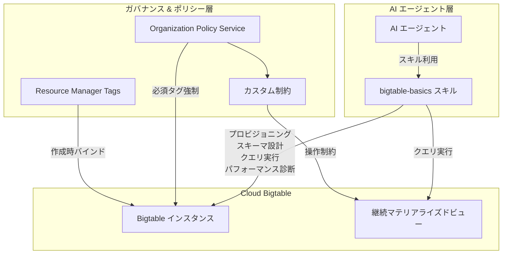

# Bigtable: タグバインディング、エージェントスキル、カスタム組織ポリシーが GA

**リリース日**: 2026-07-07

**サービス**: Cloud Bigtable

**機能**: インスタンス作成時のタグバインディング / Bigtable エージェントスキル (bigtable-basics) / 継続マテリアライズドビューのカスタム組織ポリシー

**ステータス**: GA (一般提供)

📊 [このアップデートのインフォグラフィックを見る](https://takech9203.github.io/google-cloud-news-summary/20260707-bigtable-tags-agent-skill-ga.html)

## 概要

Cloud Bigtable において 3 つの機能が一般提供 (GA) となりました。第一に、Bigtable インスタンスの作成時に既存のタグをバインドし、組織ポリシーで必須タグの割り当てを強制できるようになりました。第二に、AI エージェントに Bigtable 操作機能を付与する Bigtable エージェントスキル (`bigtable-basics`) が Google Agent Skills リポジトリで GA となりました。第三に、Organization Policy Service のカスタム制約を使用して、継続マテリアライズドビューに対する特定の操作を管理できるようになりました。

これらのアップデートにより、Bigtable の運用ガバナンス、AI エージェント統合、リソース管理が大幅に強化されます。タグバインディングのインスタンス作成時サポートにより、リソースのプロビジョニング段階からポリシー準拠を確保できます。エージェントスキルの GA により、本番環境での AI エージェントによる Bigtable 運用が正式にサポートされます。カスタム組織ポリシーの継続マテリアライズドビュー対応により、組織全体のデータガバナンスが強化されます。

**アップデート前の課題**

- インスタンス作成後にタグをバインドする追加の手順が必要であり、作成時に必須タグの強制ができなかった
- AI エージェントに Bigtable 操作を統合するための公式スキルがプレビュー段階で、本番利用に制限があった
- 継続マテリアライズドビューに対するきめ細かなカスタム組織ポリシー制約が GA ではなかった

**アップデート後の改善**

- インスタンス作成時に `--tags` フラグでタグをバインドでき、組織ポリシーで必須タグの割り当てを強制可能
- `bigtable-basics` エージェントスキルが GA となり、AI エージェントが Bigtable のプロビジョニング、スキーマ設計、クエリ実行、パフォーマンス診断を本番環境で実行可能
- 継続マテリアライズドビュー (`bigtableadmin.googleapis.com/MaterializedView`) に対するカスタム組織ポリシー制約が GA で利用可能

## アーキテクチャ図



3 つの GA 機能がそれぞれ異なるレイヤーで Bigtable のリソース管理、ポリシー適用、AI 統合を強化する構成を示しています。

## サービスアップデートの詳細

### 主要機能

1. **インスタンス作成時のタグバインディング**
   - `gcloud bigtable instances create` コマンドの `--tags` フラグでインスタンス作成と同時にタグをバインド可能
   - 組織ポリシーと連携し、必須タグが割り当てられていないインスタンスの作成を防止
   - IAM 条件と組み合わせることで、タグに基づいた条件付きアクセス制御を実現
   - タグの形式は `tagKeys/ID=tagValues/ID` または名前空間形式 `namespace/key=value` をサポート

2. **Bigtable エージェントスキル (bigtable-basics)**
   - Google Agent Skills リポジトリで公開されているオープンソースのスキル
   - AI エージェントに Bigtable の包括的な操作能力を付与
   - 対応タスク: インスタンス/テーブルのプロビジョニング、スキーマ設計、GoogleSQL および Key-Value API によるデータクエリ、パフォーマンス問題やホットスポットの診断
   - Agent Development Kit (ADK) の BigtableToolset と連携して動作

3. **継続マテリアライズドビューのカスタム組織ポリシー**
   - `bigtableadmin.googleapis.com/MaterializedView` リソースに対するカスタム制約を定義可能
   - 削除保護 (`resource.deletionProtection`) や命名規則 (`resource.name`) に対する制約を適用
   - CREATE および UPDATE メソッドに対してポリシーを適用可能
   - 組織、フォルダ、プロジェクトレベルで階層的に適用

## 技術仕様

### タグバインディング

| 項目 | 詳細 |
|------|------|
| 対応リソース | `//bigtable.googleapis.com/projects/PROJECT/instances/INSTANCE_ID` |
| タグ形式 (ID) | `tagKeys/12345=tagValues/6789` |
| タグ形式 (名前空間) | `orgId/environment=production` |
| 必要な IAM ロール | `roles/resourcemanager.tagUser` + `roles/bigtable.admin` |
| API メソッド | `CreateInstance` (タグ付きインスタンス作成) |

### エージェントスキル

| 項目 | 詳細 |
|------|------|
| スキル名 | `bigtable-basics` |
| リポジトリ | `github.com/google/skills/tree/main/skills/cloud/bigtable-basics` |
| ADK ツールセット | `BigtableToolset` |
| 認証 | Application Default Credentials (ADC) |
| 対応モデル | Gemini 2.5 Flash 等 |

### カスタム組織ポリシー (MaterializedView)

| 項目 | 詳細 |
|------|------|
| リソースタイプ | `bigtableadmin.googleapis.com/MaterializedView` |
| 対応フィールド | `resource.deletionProtection`, `resource.name` |
| 対応メソッド | CREATE, UPDATE |
| アクションタイプ | ALLOW, DENY |
| 条件言語 | Common Expression Language (CEL) |

## 設定方法

### 前提条件

1. Google Cloud プロジェクトで Bigtable API が有効化されていること
2. 適切な IAM ロールが付与されていること
3. タグ機能を使用する場合は、事前にタグキーとタグ値が作成されていること

### 手順

#### ステップ 1: タグ付きインスタンスの作成

```bash
# タグを指定してインスタンスを作成
gcloud bigtable instances create my-instance \
    --display-name="My Instance" \
    --cluster-config=id=my-cluster,zone=us-central1-f,nodes=3 \
    --tags=123/environment=production,123/costCenter=marketing
```

タグは ID 形式 (`tagKeys/12345=tagValues/6789`) または名前空間形式 (`namespace/key=value`) で指定します。

#### ステップ 2: エージェントスキルの利用

```python
from google.adk.agents import Agent
from google.adk.tools.bigtable.bigtable_toolset import BigtableToolset
from google.adk.tools.bigtable.settings import BigtableToolSettings
from google.adk.tools.bigtable.bigtable_credentials import BigtableCredentialsConfig
import google.auth

# 認証設定
credentials, _ = google.auth.default()
credentials_config = BigtableCredentialsConfig(credentials=credentials)
tool_settings = BigtableToolSettings()

# Bigtable ツールセットの初期化
bigtable_toolset = BigtableToolset(
    credentials_config=credentials_config,
    bigtable_tool_settings=tool_settings
)

# エージェントの定義
agent = Agent(
    model="gemini-2.5-flash",
    name="bigtable_agent",
    description="Bigtable 操作エージェント",
    instruction="Bigtable に関する質問に回答し、SQLクエリを実行します。",
    tools=[bigtable_toolset],
)
```

#### ステップ 3: マテリアライズドビューのカスタム組織ポリシー設定

```yaml
# constraint-require-mv-deletion-protection.yaml
name: organizations/ORGANIZATION_ID/customConstraints/custom.requireMVDeletionProtection
resourceTypes:
  - bigtableadmin.googleapis.com/MaterializedView
methodTypes:
  - CREATE
  - UPDATE
condition: "resource.deletionProtection == true"
actionType: ALLOW
displayName: Require deletion protection on materialized views
description: All materialized views must have deletion protection enabled.
```

```bash
# カスタム制約の適用
gcloud org-policies set-custom-constraint \
    constraint-require-mv-deletion-protection.yaml

# ポリシーの適用
gcloud org-policies set-policy policy-require-mv-deletion-protection.yaml
```

## メリット

### ビジネス面

- **コンプライアンスの自動化**: インスタンス作成時にタグを強制することで、コスト管理やセキュリティポリシーへの準拠を自動的に確保
- **AI による運用効率化**: エージェントスキルにより、Bigtable の運用タスクを AI エージェントに委任し、運用チームの負荷を軽減
- **ガバナンスの強化**: 継続マテリアライズドビューに対する組織ポリシーにより、重要なデータアセットの保護を組織全体で一元管理

### 技術面

- **Infrastructure as Code 対応**: タグバインディングがインスタンス作成 API に統合され、Terraform 等の IaC ツールとの統合がシームレスに
- **エージェンティック開発**: ADK の BigtableToolset を使用した本番レベルの AI エージェント開発が可能
- **CEL ベースの柔軟なポリシー**: Common Expression Language による条件式でき細かなリソース制約を定義可能

## デメリット・制約事項

### 制限事項

- タグバインディングには `roles/resourcemanager.tagUser` と `roles/bigtable.admin` の両方の IAM ロールが必要
- カスタム組織ポリシーは Authorized Views およびバックアップの有効期限には未対応
- カスタム組織ポリシーの適用には最大 15 分の遅延が発生する場合がある
- 各リソースタイプに対して最大 20 個のカスタム制約まで作成可能

### 考慮すべき点

- 既存のインスタンスに遡及的に必須タグを強制することはできないため、新規作成時のみ有効
- エージェントスキルの利用には適切な IAM 権限の付与が必要であり、最小権限の原則に基づいた設定を推奨
- 組織ポリシーの UPDATE メソッド適用時、既存のポリシー違反リソースの変更がブロックされる可能性がある

## ユースケース

### ユースケース 1: マルチチーム環境でのコスト配分

**シナリオ**: 複数のチームが共有 GCP 組織で Bigtable インスタンスを作成する環境で、各インスタンスにコストセンターとチーム名のタグを必須化したい場合。

**実装例**:
```bash
# 必須タグのポリシーを設定し、タグなしのインスタンス作成を防止
gcloud bigtable instances create team-a-instance \
    --display-name="Team A Instance" \
    --cluster-config=id=cluster-1,zone=asia-northeast1-a,nodes=3 \
    --tags=org123/team=team-a,org123/cost-center=engineering
```

**効果**: インスタンス作成時にコスト配分情報が自動的に付与され、請求レポートでのコスト分析やチーム別予算管理が容易になる。

### ユースケース 2: AI エージェントによるパフォーマンス診断

**シナリオ**: SRE チームが AI エージェントを使用して Bigtable のパフォーマンス問題を自動診断し、ホットスポットの検出やスキーマの改善提案を行いたい場合。

**効果**: `bigtable-basics` スキルにより、エージェントが GoogleSQL でクエリ統計を分析し、ホットスポットを特定して改善策を提案。手動診断に比べて対応速度が大幅に向上。

### ユースケース 3: データガバナンスの組織的な強制

**シナリオ**: 金融機関で継続マテリアライズドビューの削除保護を組織全体で強制し、重要な集計ビューが誤って削除されないようにしたい場合。

**効果**: カスタム組織ポリシーにより、すべてのプロジェクトで削除保護なしのマテリアライズドビュー作成が自動的にブロックされ、データ損失リスクが軽減される。

## 関連サービス・機能

- **Resource Manager Tags**: Google Cloud リソースに対するタグの作成・管理を提供するサービス。IAM 条件との連携により条件付きアクセス制御を実現
- **Organization Policy Service**: 組織全体でリソースに対する制約を一元管理するサービス。カスタム制約により柔軟なポリシー定義が可能
- **Agent Development Kit (ADK)**: Google の AI エージェント開発フレームワーク。BigtableToolset を通じて Bigtable との統合を提供
- **Bigtable MCP Server**: Model Context Protocol 経由で AI アプリケーションに Bigtable 操作を提供するリモートサーバー
- **Bigtable 継続マテリアライズドビュー**: テーブルデータの集計結果をリアルタイムで維持するビュー機能

## 参考リンク

- 📊 [インフォグラフィック](https://takech9203.github.io/google-cloud-news-summary/20260707-bigtable-tags-agent-skill-ga.html)
- [公式リリースノート](https://docs.cloud.google.com/release-notes#July_07_2026)
- [Bigtable タグドキュメント](https://docs.cloud.google.com/bigtable/docs/tags)
- [Bigtable インスタンスの作成](https://docs.cloud.google.com/bigtable/docs/creating-instance)
- [Google Agent Skills リポジトリ (bigtable-basics)](https://github.com/google/skills/tree/main/skills/cloud/bigtable-basics)
- [Bigtable カスタム組織ポリシー](https://docs.cloud.google.com/bigtable/docs/custom-constraints)
- [ADK Bigtable 統合](https://google.github.io/adk-docs/integrations/bigtable/)
- [Bigtable 料金](https://cloud.google.com/bigtable/pricing)

## まとめ

今回の 3 つの GA リリースにより、Bigtable はガバナンス、AI 統合、運用管理の各領域で大きく機能が強化されました。タグバインディングのインスタンス作成時サポートにより、マルチチーム環境でのリソース管理とコスト配分が自動化されます。`bigtable-basics` エージェントスキルの GA により、AI エージェントを活用した Bigtable 運用の自動化が本番レベルで可能になります。また、継続マテリアライズドビューへのカスタム組織ポリシー対応により、重要なデータアセットの保護を組織全体で確保できます。これらの機能を組み合わせることで、セキュアかつ効率的な Bigtable 環境の構築を推奨します。

---

**タグ**: #Bigtable #Tags #AgentSkill #OrganizationPolicy #CustomConstraints #MaterializedView #ADK #AI #ガバナンス #GA
