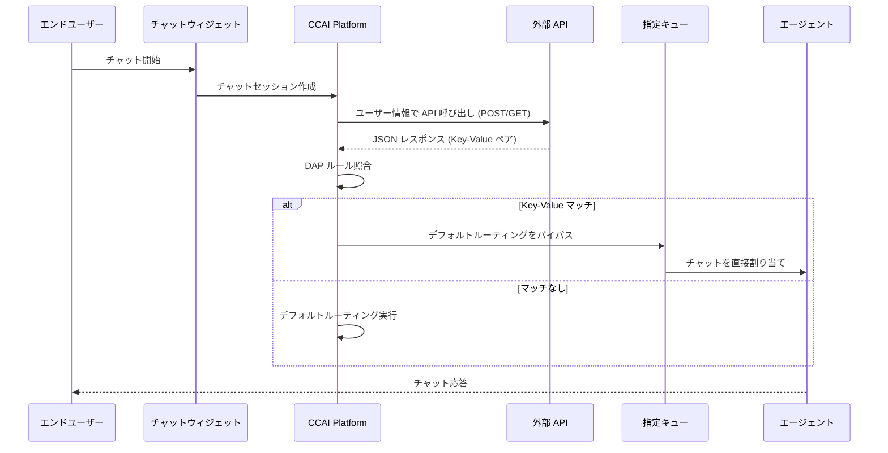

# Google Cloud CCaaS: チャット向け Direct Access Points (DAP)

**リリース日**: 2026-07-07

**サービス**: Google Cloud Contact Center as a Service (CCaaS) / CCAI Platform

**機能**: Direct Access Points for chats

**ステータス**: プレリリース (Prerelease)

📊 [このアップデートのインフォグラフィックを見る](https://takech9203.github.io/google-cloud-news-summary/20260707-ccaas-direct-access-points.html)

## 概要

Google Cloud CCaaS (CCAI Platform) に、チャットチャネル向けの Direct Access Points (DAP) 機能が新たに追加されました。DAP は、API レスポンスに基づいてチャット会話を特定のキューに直接ルーティングする機能です。これにより、API で開始されたチャットがデフォルトのルーティングロジックをバイパスし、意図されたキューに即座に入ることが可能になります。

従来、DAP は IVR (音声)、Web SDK、Mobile SDK チャネルで利用可能でしたが、チャットチャネルでは利用できませんでした。今回のアップデートにより、チャットにおいても API レスポンスの Key-Value ペアに基づく高度なルーティングが実現し、コンタクトセンターの運用効率が大幅に向上します。

また、本リリースには 24 件のバグ修正が含まれており、チャット転送時のタイマーリセット問題、ボイスメールの表示問題、レポーティングダッシュボードの表示不具合など、幅広い改善が行われています。

**アップデート前の課題**

- チャットチャネルでは DAP が利用できず、すべてのチャットがデフォルトのキューツリーを通過する必要があった
- API で開始されたチャットであっても、特定のキューに直接ルーティングする手段がなかった
- エンドユーザーのコンテキスト情報 (顧客属性、購買履歴など) に基づくチャットの即時振り分けができなかった

**アップデート後の改善**

- チャットチャネルで API Response DAP が利用可能になり、API のレスポンスに基づいて特定のキューに直接ルーティングできる
- デフォルトのルーティングロジックをバイパスし、チャットが即座に適切なキューに入る
- 複数の Key-Value ペアを AND 条件で組み合わせた高度なルーティングルールが設定可能

## アーキテクチャ図



API レスポンスの Key-Value ペアが DAP の条件に一致した場合、チャットはデフォルトのキューツリーを経由せず、指定されたキューに直接ルーティングされます。

## サービスアップデートの詳細

### 主要機能

1. **チャット向け Direct Access Points**
   - API レスポンスに基づくチャットの直接キュールーティング
   - POST および GET HTTP リクエストメソッドに対応
   - JSON 形式でのリクエスト・レスポンス処理
   - 複数の Key-Value ペアによる AND ロジックでの条件設定

2. **API Response DAP のチャットチャネル拡張**
   - 従来 IVR のみで利用可能だった API Response DAP がチャットでも利用可能に
   - CRM 内外の条件をキャプチャして評価可能
   - 複合条件 (電話番号 + Key-Value ペア) による高精度ルーティング

3. **バグ修正 (24 件)**
   - バーチャルエージェントからヒューマンエージェントへの転送後、非アクティブチャットの却下タイマーがリセットされない問題を修正
   - ボイスメールを開いた後にキューから消える問題を修正
   - コールドトランスファー中のコール/エージェントステータスがレポーティングダッシュボードで正しく表示されない問題を修正
   - エージェントデスクトップのミニチャットアダプターのレンダリングパフォーマンスを改善
   - スクリーンレコーディングのストレージパスを修正
   - 欠落しているパブリックファイルの CDN キャッシュを修正
   - エージェントが自動的に Closed インボックスビューにリダイレクトされる問題を修正
   - Salesforce 統合の同時データリクエスト問題を修正
   - Zendesk での通話録音リンクの重複を修正
   - 顧客満足度アンケートの重複送信を修正
   - タスクバーチャルエージェントが転送後に「Nobody」と表示される問題を修正

## 技術仕様

### DAP タイプとチャネル対応

| DAP タイプ | IVR | Mobile | Web | Chat (新規) |
|-----------|-----|--------|-----|-------------|
| User Segment DAP | 対応 | 対応 | 対応 | - |
| General DAP | 対応 | 対応 | 対応 | - |
| Support Phone Number DAP | 対応 | - | - | - |
| API Response DAP | 対応 | - | - | 対応 |
| Mobile App DAP | - | 対応 | - | - |

### API DAP の設定パラメータ

| 項目 | 詳細 |
|------|------|
| API URL | JSON レスポンスを返す HTTP エンドポイント |
| HTTP メソッド | POST または GET |
| レスポンス形式 | JSON |
| 認証方式 | Basic 認証 (非 Salesforce) / Salesforce 統合 |
| 条件ロジック | AND 条件による複数 Key-Value ペア |
| マッチング順序 | 複雑な条件から単純な条件の順に評価 |

### API DAP ルーティングロジック

```json
{
  "conditions": [
    {
      "key": "customer_tier",
      "value": "enterprise"
    },
    {
      "key": "issue_type",
      "value": "billing"
    }
  ],
  "target_queue": "enterprise-billing-support"
}
```

条件は複雑なものから順に作成する必要があります。最初にマッチした条件でルーティングが確定し、以降の条件は評価されません。

## 設定方法

### 前提条件

1. Google Cloud CCaaS (CCAI Platform) の有効なインスタンス
2. API DAP 用の外部 API エンドポイント (JSON レスポンスを返すもの)
3. API 認証情報 (Basic 認証 / Salesforce 統合)
4. 管理者権限

### 手順

#### ステップ 1: API エンドポイントの準備

外部 API を構築し、チャットユーザーの情報を受け取って JSON レスポンスを返すエンドポイントを用意します。

```
API URL: https://your-api.example.com/customer-routing
Method: POST
Response: {"customer_tier": "enterprise", "issue_type": "billing"}
```

参考実装: [GitHub - GoogleCloudPlatform/ccaas-dap-api](https://github.com/GoogleCloudPlatform/ccaas-dap-api)

#### ステップ 2: DAP の作成

1. CCAI Platform ポータルで **Settings > Queue** に移動
2. チャットチャネルを選択し、**Edit / Add** をクリック
3. 対象キューを選択し、Settings パネルの **Access Point** セクションで **+ Create direct access point** をクリック
4. アクセスポイントタイプとして **API Response** を選択
5. **Add Key & Value** をクリックし、API レスポンスの Key-Value ペアを入力
6. 必要に応じてグリーティングメッセージを設定
7. **Create** をクリック

#### ステップ 3: ルーティングのテスト

設定した Key-Value ペアの条件を満たすテストチャットを送信し、チャットが正しいキューにルーティングされることを確認します。

## メリット

### ビジネス面

- **顧客体験の向上**: チャットが即座に適切な専門チームに振り分けられるため、顧客の待ち時間が短縮される
- **運用効率の改善**: デフォルトのルーティングツリーをバイパスすることで、不要な転送やナビゲーションが削減される
- **柔軟なセグメンテーション**: API レスポンスに基づく動的なルーティングにより、顧客属性に応じたきめ細かいサービスが可能

### 技術面

- **API 駆動のルーティング**: 外部システムのデータに基づく動的なルーティング判断が可能
- **AND ロジック対応**: 複数条件の組み合わせによる精密なルーティングルール設定
- **既存の DAP インフラの活用**: IVR で実績のある DAP フレームワークをチャットに拡張

## デメリット・制約事項

### 制限事項

- プレリリース段階のため、本番環境での利用にはリリース後の確認が必要
- API Response DAP のみがチャットに対応 (User Segment DAP、General DAP などは未対応)
- 外部 API エンドポイントの可用性がルーティングの信頼性に直結する

### 考慮すべき点

- DAP 条件の作成順序が重要 - 複雑な条件を先に、単純な条件を後に配置する必要がある
- API レスポンスの遅延がチャット開始の待ち時間に影響する可能性がある
- 既存の API DAP との重複がある場合、ルーティングルールの再構成が必要になる場合がある

## ユースケース

### ユースケース 1: VIP 顧客の優先チャットサポート

**シナリオ**: EC サイトのチャットサポートで、API から顧客の購買履歴やサブスクリプションティアを取得し、VIP 顧客を専任チームのキューに直接ルーティングする。

**実装例**:
```
API Response: {"customer_tier": "vip", "annual_spend": "high"}
DAP 条件: customer_tier = vip AND annual_spend = high
ターゲットキュー: VIP専任サポートキュー
```

**効果**: VIP 顧客がデフォルトのキューツリーを経由せず、即座に専任エージェントに接続されるため、顧客満足度とリテンション率が向上する。

### ユースケース 2: 技術的な問題の自動エスカレーション

**シナリオ**: SaaS プロダクトのチャットサポートで、顧客のアカウントステータスや障害情報を API で確認し、既知の障害に該当する場合は専門の技術チームに直接ルーティングする。

**効果**: 既知の問題に対して一次対応を経由せずに専門チームが即座に対応でき、解決時間の短縮と顧客満足度の向上が期待される。

### ユースケース 3: オンボーディングチャットの専用キューへの振り分け

**シナリオ**: 新規登録ユーザーがチャットを開始した際、API でアカウント作成日を確認し、新規ユーザーをオンボーディング専門チームのキューに直接ルーティングする。

**効果**: 新規ユーザーに対してオンボーディング専門のエージェントが対応することで、初期の離脱率を低減し、製品の活用促進につなげる。

## 関連サービス・機能

- **CCAI Platform (Google Cloud Contact Center AI Platform)**: CCaaS の基盤プラットフォーム
- **Dialogflow CX**: バーチャルエージェント構築のための会話 AI プラットフォーム。DAP と組み合わせてチャットフローを設計可能
- **Deltacast Routing**: CCaaS のチャットルーティングロジック。DAP と併用してルーティングの最適化が可能
- **Agent Assist**: エージェント支援機能。DAP でルーティングされた後のエージェント対応を支援

## 参考リンク

- 📊 [インフォグラフィック](https://takech9203.github.io/google-cloud-news-summary/20260707-ccaas-direct-access-points.html)
- [公式リリースノート](https://docs.cloud.google.com/release-notes#July_07_2026)
- [Direct Access Points ドキュメント](https://docs.cloud.google.com/contact-center/ccai-platform/docs/dap)
- [DAP API エンドポイント実装例 (GitHub)](https://github.com/GoogleCloudPlatform/ccaas-dap-api)
- [デプロイメントスケジュール](https://cloud.google.com/contact-center/ccai-platform/docs/deployment-schedules)

## まとめ

Google Cloud CCaaS の Direct Access Points がチャットチャネルに拡張されたことで、API レスポンスに基づくインテリジェントなチャットルーティングが実現しました。コンタクトセンター運用において、顧客属性や外部データに基づいたリアルタイムのルーティング判断が可能になり、顧客体験と運用効率の両面で大きな改善が期待されます。また、24 件のバグ修正により、プラットフォーム全体の安定性も向上しています。現在プレリリース段階のため、正式リリース後に本番環境への導入を検討することを推奨します。

---

**タグ**: #GoogleCloud #CCaaS #CCAIPlatform #ContactCenter #DirectAccessPoints #DAP #ChatRouting #API #CustomerExperience #コンタクトセンター #チャットサポート
