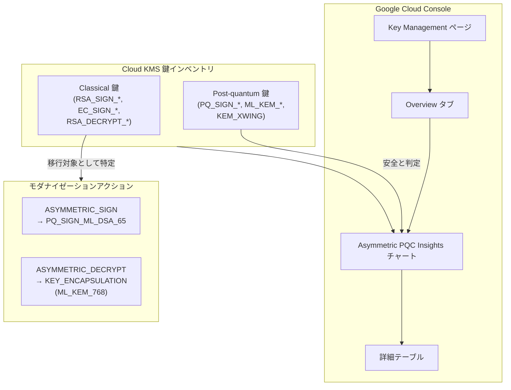

# Cloud Key Management Service: Asymmetric PQC Insights チャートが GA

**リリース日**: 2026-07-07

**サービス**: Cloud Key Management Service (Cloud KMS)

**機能**: Asymmetric PQC Insights チャート (概要ダッシュボード)

**ステータス**: GA (一般提供開始)

📊 [このアップデートのインフォグラフィックを見る](https://takech9203.github.io/google-cloud-news-summary/20260707-cloud-kms-pqc-insights-ga.html)

## 概要

Cloud KMS の概要ダッシュボードに搭載されている Asymmetric PQC (Post-Quantum Cryptography) Insights チャートが一般提供 (GA) となりました。この機能により、組織内の非対称暗号鍵のうち、将来の量子コンピュータによる攻撃に対して脆弱な鍵を特定・可視化できるようになります。

量子コンピュータの実用化が進む中、現在広く利用されている RSA や ECC などの古典的な非対称暗号アルゴリズムは、将来的に量子コンピュータにより解読されるリスクがあります。特に「Harvest Now, Decrypt Later (HNDL)」攻撃 -- 現時点では復号できない暗号文を収集し、将来の量子コンピュータで解読する手法 -- への対策が急務となっています。PQC Insights チャートは、この量子コンピューティング時代に向けた暗号鍵のモダナイゼーション計画において、重要な第一歩となる可視化ツールです。

この機能は、セキュリティ管理者やコンプライアンス担当者が、組織の暗号鍵インベントリを評価し、ポスト量子暗号 (PQC) への移行計画を策定するための基盤情報を提供します。

**アップデート前の課題**

- 組織内のどの非対称暗号鍵が量子コンピュータ攻撃に脆弱であるか、一元的に把握する手段がなかった
- 古典的アルゴリズム (RSA, ECC) を使用する鍵と PQC 対応の鍵を区別するために、個別に鍵の設定を確認する必要があった
- 量子コンピューティングへの移行計画を策定するための定量的なデータを得ることが困難だった

**アップデート後の改善**

- Google Cloud コンソールのダッシュボードで非対称暗号鍵の PQC 対応状況を一目で把握可能になった
- 鍵を「Post-quantum」と「Classical」に自動分類し、暗号目的別・暗号タイプ別にセグメント化して表示
- 詳細テーブルにより、個々の鍵の名前、ロケーション、保護レベル、目的、暗号タイプを一覧で確認可能

## アーキテクチャ図



PQC Insights チャートは Cloud KMS の鍵インベントリを自動的に分析し、古典的アルゴリズムを使用する鍵を特定してモダナイゼーションの対象として可視化します。

## サービスアップデートの詳細

### 主要機能

1. **Asymmetric PQC Insights チャート**
   - 非対称暗号鍵をアルゴリズムの分類に基づいて視覚的に分解して表示
   - 「Post-quantum」(量子耐性あり) と「Classical」(量子攻撃に脆弱) の 2 グループに分類
   - 暗号目的 (ASYMMETRIC_SIGN, ASYMMETRIC_DECRYPT, KEY_ENCAPSULATION) と暗号タイプによるセグメント化

2. **詳細テーブルビュー**
   - チャートのセグメントをクリックして該当する鍵の一覧を表示
   - 鍵名、ロケーション、保護レベル、目的、暗号タイプの情報を一覧化
   - フィルタバーによる属性ベースの絞り込み機能

3. **Cloud Asset Inventory 連携**
   - `gcloud asset list` コマンドによるプログラム的な鍵のリスト取得
   - 組織レベルまたはプロジェクトレベルでの検索が可能
   - PQC アルゴリズム使用鍵と古典的アルゴリズム使用鍵のフィルタリング

## 技術仕様

### 鍵の分類基準

| 目的 | アルゴリズム | 暗号タイプ | PQC 代替手段 |
|------|-------------|-----------|-------------|
| ASYMMETRIC_SIGN | EC_SIGN_* | Classical | PQ_SIGN_* アルゴリズム |
| ASYMMETRIC_SIGN | RSA_SIGN_* | Classical | PQ_SIGN_* アルゴリズム |
| ASYMMETRIC_SIGN | PQ_SIGN_* | PQC | 量子耐性あり (対応不要) |
| ASYMMETRIC_DECRYPT | RSA_DECRYPT_* | Classical | KEY_ENCAPSULATION アルゴリズム |
| KEY_ENCAPSULATION | 全て | PQC | 量子耐性あり (対応不要) |

### 対応する PQC アルゴリズム

| アルゴリズム | API 名 | 種類 | 説明 |
|-------------|--------|------|------|
| ML-DSA-65 | PQ_SIGN_ML_DSA_65 | 署名 (Pure) | モジュール格子ベースのデジタル署名 |
| SLH-DSA-SHA2-128S | PQ_SIGN_SLH_DSA_SHA2_128S | 署名 (Pure) | ステートレスハッシュベースのデジタル署名 |
| ML-KEM-768 | ML_KEM_768 | 鍵カプセル化 | モジュール格子ベースの鍵カプセル化 |
| ML-KEM-1024 | ML_KEM_1024 | 鍵カプセル化 | モジュール格子ベースの鍵カプセル化 (高セキュリティ) |
| X-Wing | KEM_XWING | 鍵カプセル化 | ハイブリッド鍵カプセル化 |

### 必要な IAM 権限

```
roles/cloudkms.viewer (Cloud KMS Viewer)
```

PQC Insights の閲覧には、プロジェクトに対する Cloud KMS Viewer ロール (`roles/cloudkms.viewer`) が必要です。カスタムロールや他の事前定義ロールでも同等の権限を付与できます。

## 設定方法

### 前提条件

1. Google Cloud プロジェクトで Cloud KMS API が有効化されていること
2. `roles/cloudkms.viewer` 以上の IAM ロールが付与されていること

### 手順

#### ステップ 1: PQC Insights チャートの確認

Google Cloud コンソールで Key Management ページに移動し、Overview タブを選択します。Asymmetric PQC insights チャートが表示されます。

1. Google Cloud コンソールにログイン
2. Key Management ページに移動
3. Overview タブをクリック
4. Asymmetric PQC insights チャートを確認

#### ステップ 2: 詳細の確認

チャートのセグメントをクリックすると、対象の鍵数が表示されます。「View」をクリックすると Asymmetric PQC insights details テーブルに移動し、個々の鍵の詳細を確認できます。

#### ステップ 3: Cloud Asset Inventory による プログラム的な確認

```bash
# プロジェクト内の古典的アルゴリズムを使用する鍵を一覧表示
gcloud asset list \
  --project="$(gcloud config get-value project)" \
  --asset-types="cloudkms.googleapis.com/CryptoKey" \
  --content-type=resource \
  --filter='(resource.data.purpose = "ASYMMETRIC_SIGN" OR resource.data.purpose = "ASYMMETRIC_DECRYPT" OR resource.data.purpose = "KEY_ENCAPSULATION") AND NOT (resource.data.versionTemplate.algorithm:PQ_SIGN* OR resource.data.versionTemplate.algorithm:ML_KEM* OR resource.data.versionTemplate.algorithm = "KEM_XWING")' \
  --format='table(name.segment(-3):label=KEY_RING, name.segment(-1):label=CRYPTO_KEY, resource.data.purpose:label=PURPOSE, resource.data.versionTemplate.algorithm:label=ALGORITHM)'
```

このコマンドにより、PQC に移行すべき古典的アルゴリズムの鍵を特定できます。

## メリット

### ビジネス面

- **量子耐性戦略の策定支援**: 組織の暗号鍵インベントリを定量的に把握し、量子コンピューティング時代に向けた移行ロードマップの策定を支援
- **コンプライアンス対応**: NIST のポスト量子暗号標準に基づいた暗号鍵のモダナイゼーション状況を可視化し、規制対応の証跡として活用可能
- **HNDL 攻撃リスクの低減**: 「Harvest Now, Decrypt Later」攻撃に脆弱な鍵を特定し、優先的に対策を実施することで長期的なデータ機密性を確保

### 技術面

- **一元的な可視化**: Google Cloud コンソールから追加設定なしで即座に利用可能
- **自動分類**: 鍵のアルゴリズムに基づいて PQC 対応状況を自動判定し、手動での確認作業を排除
- **API 連携**: Cloud Asset Inventory との連携により、大規模環境での自動化やレポーティングが可能

## デメリット・制約事項

### 制限事項

- 対称暗号鍵 (ENCRYPT_DECRYPT 用途) はダッシュボードの対象外 (量子コンピュータ攻撃に対して一般的に耐性があるため)
- PQC Insights はプロジェクト単位での表示であり、組織全体の横断的な表示には Cloud Asset Inventory のコマンドライン利用が必要
- PQC 署名アルゴリズム (PQ_SIGN_*) は現時点で Preview 段階

### 考慮すべき点

- 既存の鍵の目的 (purpose) を変更することはできないため、PQC への移行には新しい鍵の作成とアプリケーションの更新が必要
- PQC アルゴリズムの公開鍵を取得するには gcloud CLI または Cloud KMS REST API の使用が必要 (コンソールからの取得には `--public-key-format nist-pqc` フラグが必要)
- HMAC-SHA1 を使用する MAC 鍵は対称鍵であるにもかかわらず量子耐性が不十分であるが、このダッシュボードでは追跡されない

## ユースケース

### ユースケース 1: 量子コンピューティング移行計画の策定

**シナリオ**: 大規模な金融機関が、NIST のポスト量子暗号標準の採用に向けた移行計画を策定する必要がある。

**効果**: PQC Insights チャートにより、組織内の数百から数千の非対称暗号鍵のうち、どの程度が古典的アルゴリズムを使用しているかを即座に把握。優先度に基づいた段階的な移行計画を策定できる。

### ユースケース 2: HNDL 攻撃対策の優先度判定

**シナリオ**: 機密性の高いデータを長期間保持するヘルスケア企業が、暗号化に使用している鍵の量子耐性を評価したい。

**効果**: ASYMMETRIC_DECRYPT 目的で RSA_DECRYPT_* アルゴリズムを使用している鍵を特定し、KEY_ENCAPSULATION (ML_KEM_768) への移行を優先的に実施。長期的なデータ機密性を確保する。

### ユースケース 3: セキュリティ監査レポートの自動生成

**シナリオ**: 定期的なセキュリティ監査で、暗号鍵の量子耐性状況をレポートとして提出する必要がある。

**実装例**:
```bash
# 組織全体の PQC 対応状況を一覧取得
gcloud asset list \
  --organization=ORGANIZATION_ID \
  --asset-types="cloudkms.googleapis.com/CryptoKey" \
  --content-type=resource \
  --filter='(resource.data.purpose = "ASYMMETRIC_SIGN" OR resource.data.purpose = "ASYMMETRIC_DECRYPT" OR resource.data.purpose = "KEY_ENCAPSULATION") AND NOT (resource.data.versionTemplate.algorithm:PQ_SIGN* OR resource.data.versionTemplate.algorithm:ML_KEM* OR resource.data.versionTemplate.algorithm = "KEM_XWING")' \
  --format='table(name.segment(1):label=PROJECT, name.segment(-3):label=KEY_RING, name.segment(-1):label=CRYPTO_KEY, resource.data.purpose:label=PURPOSE, resource.data.versionTemplate.algorithm:label=ALGORITHM)'
```

**効果**: 組織全体の古典的アルゴリズム使用鍵をプログラム的に取得し、監査レポートに必要なデータを自動生成。

## 料金

PQC Insights チャート自体の利用に追加料金は発生しません。Cloud KMS の通常料金が適用されます。

### Cloud KMS 料金体系

| 項目 | 月額料金 |
|------|----------|
| ソフトウェア鍵 (アクティブ鍵バージョン) | $0.06 / 鍵バージョン |
| 鍵使用オペレーション (暗号化/復号) | $0.03 / 10,000 オペレーション |
| 鍵管理オペレーション | 無料 |
| Cloud HSM 鍵 (AES256, RSA2048) | $1.00 / 鍵バージョン |
| Cloud HSM 鍵 (RSA 3072/4096, EC P256/P384) | $2.50 / 鍵バージョン (2,000 以下)、$1.00 (2,001 以上) |
| Cloud EKM 鍵 | $3.00 / 鍵バージョン |

PQC アルゴリズムを使用する新しい鍵を作成する場合、保護レベルに応じた上記の料金が適用されます。

## 利用可能リージョン

Cloud KMS PQC Insights チャートは、Cloud KMS が利用可能な全てのリージョンの鍵を対象とします。Google Cloud コンソールの Key Management ページから、プロジェクト内の全ロケーションの鍵を横断的に確認できます。

## 関連サービス・機能

- **Cloud KMS Key Encapsulation Mechanisms (KEM)**: PQC 対応の鍵カプセル化メカニズム。ML_KEM_768、ML_KEM_1024、KEM_XWING アルゴリズムに対応
- **Cloud KMS PQC 署名アルゴリズム**: PQ_SIGN_ML_DSA_65、PQ_SIGN_SLH_DSA_SHA2_128S によるポスト量子デジタル署名
- **Cloud KMS Encryption Metrics ダッシュボード**: CMEK 統合の暗号化メトリクスを可視化 (2026年5月 GA)
- **Cloud Asset Inventory**: プログラム的な鍵のリスト取得とフィルタリングに使用
- **Cloud KMS Autokey**: 鍵の自動プロビジョニングと割り当てによる暗号鍵管理の簡素化

## 参考リンク

- 📊 [インフォグラフィック](https://takech9203.github.io/google-cloud-news-summary/20260707-cloud-kms-pqc-insights-ga.html)
- [公式リリースノート](https://docs.cloud.google.com/release-notes#July_07_2026)
- [PQC Insights ドキュメント](https://docs.cloud.google.com/kms/docs/view-pqc-insights)
- [Cloud KMS アルゴリズム一覧](https://docs.cloud.google.com/kms/docs/algorithms)
- [Key Encapsulation Mechanisms](https://docs.cloud.google.com/kms/docs/key-encapsulation-mechanisms)
- [Cloud KMS 料金](https://cloud.google.com/kms/pricing)

## まとめ

Cloud KMS の Asymmetric PQC Insights チャートの GA 化により、量子コンピューティング時代に向けた暗号鍵のモダナイゼーション計画を策定するための可視化基盤が整いました。組織は、この機能を活用して古典的非対称暗号鍵のインベントリを定量的に把握し、PQC 対応鍵への計画的な移行を開始すべきです。特に「Harvest Now, Decrypt Later」攻撃のリスクがある長期保存データについては、KEY_ENCAPSULATION (ML_KEM_768) への早期移行を推奨します。

---

**タグ**: #CloudKMS #PostQuantumCryptography #PQC #Security #GA #QuantumComputing #KeyManagement #Cryptography #HNDL #CloudSecurity
