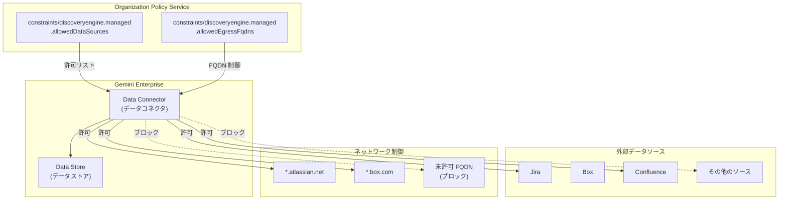

# Gemini Enterprise: データコネクタ向けマネージド組織ポリシー制約

**リリース日**: 2026-07-07

**サービス**: Gemini Enterprise

**機能**: Managed organization policy constraints for data connectors (データコネクタ向けマネージド組織ポリシー制約)

**ステータス**: GA (一般提供)

📊 [このアップデートのインフォグラフィックを見る](https://takech9203.github.io/google-cloud-news-summary/20260707-gemini-enterprise-data-connectors-org-policy.html)

## 概要

Gemini Enterprise のデータコネクタに対して、マネージド組織ポリシー制約が一般提供 (GA) になりました。この機能により、組織管理者は Organization Policy Service を使用して、データコネクタが接続できる外部データソースやエグレス先の FQDN をポリシーベースで一元管理・制御できるようになります。

今回 GA となったのは 2 つの制約です。1 つ目は「許可されたデータソースの制限」で、データストア追加時に使用できる外部データソース (Jira、Box、Confluence など) を制御します。2 つ目は「許可されたエグレス FQDN の制限」で、データストアが接続できる完全修飾ドメイン名 (FQDN) を制御します。

これらのポリシーは、VPC Service Controls (VPC-SC) が有効なプロジェクト、または enforcedProjects リストに含まれるプロジェクトに対して適用されます。企業のセキュリティチームやクラウド管理者が、Gemini Enterprise のデータコネクタ経由のデータフローを組織全体で統制する際に特に有効です。

**アップデート前の課題**

- データコネクタの接続先を組織全体で統一的に制御する手段がなく、プロジェクトごとに個別管理が必要だった
- 許可されていない外部データソースへの接続を事前に防止するポリシーベースの仕組みがなかった
- データコネクタのエグレス先 FQDN を制限する組織レベルの制御が存在せず、データ流出リスクの管理が困難だった

**アップデート後の改善**

- 組織ポリシーにより、許可されたデータソースのみをデータコネクタで使用可能に制限できるようになった
- エグレス先の FQDN をポリシーで制御し、意図しない外部ドメインへの接続を防止できるようになった
- 組織、フォルダ、プロジェクトの階層レベルでポリシーを適用でき、継承による一貫したガバナンスが実現できるようになった

## アーキテクチャ図

Organization Policy Service の 2 つのマネージド制約により、データコネクタが接続できるデータソースとエグレス先 FQDN が制御されます。許可リストに含まれないソースやドメインへの接続はポリシーによりブロックされます。

## サービスアップデートの詳細

### 主要機能

1. **許可されたデータソースの制限 (allowedDataSources)**
   - 制約名: `constraints/discoveryengine.managed.allowedDataSources`
   - データストア追加時に使用できる外部データソースを許可リストで制御
   - VPC-SC が有効なプロジェクト、または enforcedProjects リストのプロジェクトに適用
   - 対応データソース: Jira、Box、Confluence など

2. **許可されたエグレス FQDN の制限 (allowedEgressFqdns)**
   - 制約名: `constraints/discoveryengine.managed.allowedEgressFqdns`
   - データストアが接続できる完全修飾ドメイン名 (FQDN) を許可リストで制御
   - VPC-SC が有効なプロジェクト、または enforcedProjects リストのプロジェクトに適用
   - 許可された FQDN を持つ URL のみ接続可能

3. **組織ポリシー階層による継承**
   - 組織、フォルダ、プロジェクトの各レベルでポリシーを設定可能
   - 上位レベルで設定したポリシーは下位リソースに自動的に継承
   - 必要に応じて下位レベルでオーバーライド可能

## 技術仕様

### マネージド制約一覧

| 制約名 | 説明 | 適用条件 |
|--------|------|----------|
| `constraints/discoveryengine.managed.allowedDataSources` | データコネクタで使用可能な外部データソースを制限 | VPC-SC 有効プロジェクトまたは enforcedProjects |
| `constraints/discoveryengine.managed.allowedEgressFqdns` | データコネクタのエグレス先 FQDN を制限 | VPC-SC 有効プロジェクトまたは enforcedProjects |

### 必要な IAM ロール

| ロール | 用途 |
|--------|------|
| `roles/orgpolicy.policyAdmin` (Organization Policy Administrator) | 組織ポリシーの作成・管理 |

## 設定方法

### 前提条件

1. Google Cloud 組織が設定されていること
2. Organization Policy Administrator ロール (`roles/orgpolicy.policyAdmin`) が付与されていること
3. VPC Service Controls が有効なプロジェクト、または enforcedProjects リストにプロジェクトが含まれていること

### 手順

#### ステップ 1: 許可されたデータソースの設定

Google Cloud コンソールから設定する場合:

1. Google Cloud コンソールで「組織のポリシー」ページに移動
2. ポリシーを適用するプロジェクト、フォルダ、または組織を選択
3. フィルターフィールドに「Restrict allowed data sources for data connectors」と入力
4. ポリシー名をクリックして詳細ページに移動
5. 「ポリシーを管理」をクリック
6. 許可するデータソースのリストを設定
7. 「ポリシーを設定」をクリック

#### ステップ 2: 許可されたエグレス FQDN の設定

Google Cloud コンソールから設定する場合:

1. Google Cloud コンソールで「組織のポリシー」ページに移動
2. 適用対象のリソースを選択
3. フィルターフィールドに「Restrict egress domains for data connectors」と入力
4. ポリシー名をクリックして詳細ページに移動
5. 「ポリシーを管理」をクリック
6. 許可するエグレス FQDN のリストを設定 (例: `your-company.atlassian.net`, `your-company.app.box.com`)
7. 「ポリシーを設定」をクリック

## メリット

### ビジネス面

- **コンプライアンス強化**: 組織全体でデータ接続先を統制し、規制要件やデータガバナンスポリシーへの準拠を支援
- **データ流出リスクの低減**: 許可されていない外部サービスへの接続を事前にブロックし、情報漏洩リスクを軽減
- **ガバナンスの効率化**: 組織レベルで一度設定すれば階層全体に適用されるため、プロジェクトごとの個別管理が不要

### 技術面

- **宣言的なセキュリティ制御**: ポリシーベースで制御するため、アプリケーションコードの変更なしにセキュリティポリシーを適用可能
- **VPC Service Controls との連携**: 既存の VPC-SC ペリメータと組み合わせることで多層防御を実現
- **マネージド制約**: Google Cloud が管理する制約のため、カスタム制約と比較して設定が簡素で保守性が高い

## デメリット・制約事項

### 制限事項

- VPC Service Controls が有効なプロジェクト、または enforcedProjects リストに明示的に追加されたプロジェクトにのみ適用される
- 既存のデータコネクタの設定には遡及的に適用されない (新規作成時にのみチェックされる)
- Organization Policy Administrator ロールが必要であり、プロジェクトオーナーのみに付与される場合がある

### 考慮すべき点

- 過度に制限的なポリシーを設定すると、正当なデータコネクタの作成がブロックされる可能性がある
- ポリシーの変更が反映されるまでに数分程度の遅延が発生する場合がある
- 下位レベルでのオーバーライドの管理を適切に行わないと、意図しないポリシーの穴が発生するリスクがある

## ユースケース

### ユースケース 1: 企業の IT 部門によるデータソース統制

**シナリオ**: 大規模企業の IT 部門が、全社的に Gemini Enterprise で接続を許可する外部データソースを Jira と Confluence のみに限定したい場合。

**効果**: 組織レベルで `allowedDataSources` ポリシーを設定することで、各プロジェクトのユーザーが許可されていないデータソース (例: 未承認のクラウドストレージサービス) を接続することを防止。シャドー IT のリスクを低減し、一貫したデータガバナンスを実現。

### ユースケース 2: 金融機関のデータ流出防止

**シナリオ**: 金融機関が規制要件に基づき、Gemini Enterprise のデータコネクタから接続可能な外部ドメインを自社管理ドメインに限定したい場合。

**効果**: `allowedEgressFqdns` ポリシーで `bank-name.atlassian.net` や `bank-name.app.box.com` のみを許可することで、データが意図しない外部ドメインに流出するリスクを排除。監査対応の際にも、ポリシー設定を証跡として提示可能。

### ユースケース 3: マルチテナント環境でのプロジェクト分離

**シナリオ**: 複数の事業部門が個別のプロジェクトで Gemini Enterprise を利用しており、事業部門ごとに異なるデータソース接続ポリシーを適用したい場合。

**効果**: フォルダレベルでポリシーを設定し、事業部門ごとに許可されるデータソースと FQDN を分離。組織全体のベースラインポリシーを維持しつつ、部門固有の要件に対応可能。

## 関連サービス・機能

- **VPC Service Controls**: データコネクタのポリシーは VPC-SC と連携して動作し、セキュアなペリメータ内でのデータアクセスを制御
- **Organization Policy Service**: 本機能の基盤となるサービスであり、カスタム制約やその他のマネージド制約と組み合わせて包括的なガバナンスを実現
- **Gemini Enterprise カスタム MCP サーバーコネクタ**: 別のマネージド制約 (`disableCustomMcpServerConnector`) により、カスタム MCP サーバーの利用も制御可能
- **Discovery Engine API**: データコネクタの基盤 API であり、組織ポリシーのリソースタイプとして `discoveryengine.googleapis.com/DataConnector` が使用される

## 参考リンク

- 📊 [インフォグラフィック](https://takech9203.github.io/google-cloud-news-summary/20260707-gemini-enterprise-data-connectors-org-policy.html)
- [公式リリースノート](https://docs.cloud.google.com/release-notes#July_07_2026)
- [許可されたデータソースの設定](https://docs.cloud.google.com/gemini/enterprise/docs/connectors/configure-allowed-data-sources)
- [許可されたエグレス FQDN の設定](https://docs.cloud.google.com/gemini/enterprise/docs/connectors/configure-allowed-egress-fqdns)
- [マネージドポリシー制約の概要](https://docs.cloud.google.com/gemini/enterprise/docs/connectors/managed-policy-constraints-overview)
- [組織ポリシー制約リファレンス](https://docs.cloud.google.com/organization-policy/reference/org-policy-constraints)
- [VPC Service Controls と Gemini Enterprise](https://docs.cloud.google.com/gemini/enterprise/docs/use-vpc-service-controls)

## まとめ

Gemini Enterprise のデータコネクタ向けマネージド組織ポリシー制約の GA により、企業は組織全体でデータコネクタのセキュリティとガバナンスをポリシーベースで一元管理できるようになりました。VPC Service Controls と組み合わせることで多層防御が実現でき、特に規制産業やデータガバナンス要件が厳格な組織において、Gemini Enterprise の安全な導入を促進します。Organization Policy Administrator は、まず組織レベルでの `allowedDataSources` と `allowedEgressFqdns` ポリシーの設定を検討することを推奨します。

---

**タグ**: #GeminiEnterprise #OrganizationPolicy #DataConnectors #VPCServiceControls #セキュリティ #ガバナンス #GA
