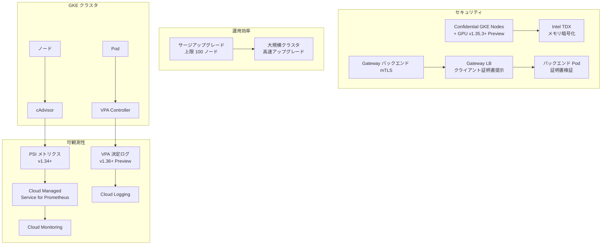

# Google Kubernetes Engine (GKE): PSI メトリクス、Confidential GPU ノード、VPA ログ、Gateway バックエンド mTLS、サージアップグレード上限引き上げ

**リリース日**: 2026-07-07

**サービス**: Google Kubernetes Engine (GKE)

**機能**: PSI メトリクス収集、Confidential GKE Nodes GPU 対応、VPA 決定ログ、Gateway バックエンド mTLS、サージアップグレード上限引き上げ

**ステータス**: GA (PSI メトリクス、Gateway mTLS、サージアップグレード) / Preview (Confidential GPU、VPA ログ)

[このアップデートのインフォグラフィックを見る](https://takech9203.github.io/google-cloud-news-summary/20260707-gke-psi-metrics-confidential-gpu-gateway-mtls.html)

## 概要

2026年7月7日、Google Kubernetes Engine (GKE) において5つの重要なアップデートが発表されました。これらのアップデートは、可観測性の強化 (PSI メトリクス、VPA 決定ログ)、セキュリティの向上 (Confidential GPU ノード、Gateway バックエンド mTLS)、および運用効率の改善 (サージアップグレード上限引き上げ) という3つの柱で構成されています。

PSI (Pressure Stall Information) メトリクスの収集機能により、コンテナやノードのリソース輻輳を詳細に監視できるようになり、VPA 決定ログにより Vertical Pod Autoscaler の動作を透過的に把握できます。セキュリティ面では、GPU ワークロードを Confidential Computing 環境で実行可能になり、Gateway ロードバランサーがバックエンド Pod に対してクライアント証明書を提示する mTLS にも対応しました。

これらの機能は、大規模な本番環境でコンテナワークロードを運用するエンタープライズユーザー、機密データを扱う AI/ML ワークロードを実行する組織、およびゼロトラストセキュリティモデルを採用する企業にとって特に重要です。

**アップデート前の課題**

- PSI メトリクスが GKE のマネージド Prometheus で直接収集できず、CPU・メモリ・I/O のリソース競合状態を正確に把握することが困難だった
- GPU ワークロードを Confidential Computing 環境で実行する手段が限られており、機密データの処理中にメモリ内のデータが保護されない状態だった
- VPA がなぜ特定のスケーリング決定を行ったのかを追跡する標準的な手段がなく、オートスケーリングのデバッグが困難だった
- Gateway ロードバランサーからバックエンド Pod への通信において、ロードバランサー側の身元証明ができなかった
- GKE Standard クラスタのサージアップグレードにおける同時アップグレードノード数に制限があり、大規模クラスタのアップグレードに時間がかかっていた

**アップデート後の改善**

- ClusterNodeMonitoring リソースを使用して PSI メトリクスを Google Cloud Managed Service for Prometheus で収集・可視化できるようになった
- GKE バージョン 1.35.3 以降で、G4 マシンタイプと NVIDIA RTX PRO 6000 GPU を使用した Confidential GKE Nodes が利用可能になった (Preview)
- VPA の推奨決定、Pod 退避、リソース適用の各イベントを Cloud Logging に記録し、Logs Explorer で分析可能になった (Preview)
- Gateway API の spec.tls.backend.clientCertificateRef フィールドを使用してバックエンド mTLS を構成できるようになった
- maxSurge + maxUnavailable の合計上限が 100 に引き上げられ、大規模ノードプールのアップグレードが大幅に高速化された

## アーキテクチャ図



GKE の5つのアップデートを可観測性、セキュリティ、運用効率の3カテゴリに分類し、各機能がどのコンポーネントと連携するかを示しています。

## サービスアップデートの詳細

### 主要機能

1. **PSI (Pressure Stall Information) メトリクス収集 (v1.34+)**
   - Linux カーネルの PSI メトリクスを cAdvisor 経由で収集し、CPU・メモリ・I/O の輻輳時間とストール時間を監視可能
   - ClusterNodeMonitoring カスタムリソースを使用して、Google Cloud Managed Service for Prometheus でメトリクスを収集
   - 収集されるメトリクス: `container_pressure_cpu_stalled_seconds_total`、`container_pressure_memory_stalled_seconds_total`、`container_pressure_io_stalled_seconds_total` など
   - コンテナ、Pod、ノードの各レベルでリソース圧迫状態を可視化

2. **Confidential GKE Nodes での GPU ワークロード (Preview, v1.35.3+)**
   - GKE バージョン 1.35.3-gke.1389000 以降で、特定の G4 マシンタイプと NVIDIA RTX PRO 6000 GPU を使用して Confidential GKE Nodes で GPU ワークロードを実行可能
   - Intel TDX (Trust Domain Extensions) を使用したメモリ暗号化により、GPU メモリ内のデータを使用中も保護
   - Spot VM または Flex-start VM での実行が必要
   - ComputeClass カスタムリソースまたは手動ノードプール構成で設定可能

3. **VPA 決定ログ (Preview, v1.36.0+)**
   - GKE バージョン 1.36.0-gke.1601000 以降で、VerticalPodAutoscaler の決定イベントを Cloud Logging に記録可能
   - 4種類のログを記録: 推奨更新 (Update recommendation)、Pod 退避 (Evict Pod)、退避時の推奨適用 (Apply recommendation on eviction)、インプレース推奨適用 (Apply recommendation in place)
   - `--logging=SYSTEM,KCP_VPA` フラグでクラスタ作成時または既存クラスタで有効化
   - Logs Explorer で VPA 名、ワークロード名、クラスタ名でフィルタリング可能

4. **Gateway バックエンド mTLS**
   - GKE Gateway ロードバランサーがバックエンド Pod にクライアント証明書を提示して自身の身元を証明
   - Gateway API 標準の `spec.tls.backend.clientCertificateRef` フィールドで構成
   - 対応 GatewayClass: `gke-l7-global-external-managed`、`gke-l7-regional-external-managed`、`gke-l7-rilb`
   - バックエンド認証 TLS (サーバー証明書検証) と組み合わせて完全な双方向 TLS を実現

5. **サージアップグレード上限引き上げ (Standard)**
   - GKE Standard クラスタにおいて、同時にアップグレードできるノード数 (maxSurge + maxUnavailable) の上限が 100 に引き上げ
   - 各設定値 (maxSurge、maxUnavailable) は個別に最大 100 まで設定可能だが、合計は 100 を超えられない
   - 大規模ノードプールのアップグレード時間を大幅に短縮可能

## 技術仕様

### PSI メトリクス

| 項目 | 詳細 |
|------|------|
| 必要バージョン | GKE 1.34 以降 |
| 収集方法 | ClusterNodeMonitoring カスタムリソース |
| メトリクスソース | cAdvisor |
| 収集間隔 | 30秒 (デフォルト) |
| 対象リソース | CPU、メモリ、I/O |
| メトリクス形式 | Prometheus counter |

### Confidential GKE Nodes (GPU)

| 項目 | 詳細 |
|------|------|
| 必要バージョン | GKE 1.35.3-gke.1389000 以降 |
| ステータス | Preview |
| 対応 GPU | NVIDIA RTX PRO 6000 |
| 対応マシンタイプ | 特定の G4 マシンタイプ |
| Confidential 技術 | TDX |
| VM タイプ | Spot VM または Flex-start VM |

### VPA 決定ログ

| 項目 | 詳細 |
|------|------|
| 必要バージョン | GKE 1.36.0-gke.1601000 以降 |
| ステータス | Preview |
| ログ出力先 | Cloud Logging |
| ログ名 | `container.googleapis.com/vpa-controller` |
| ログ形式 | JSON (jsonPayload) |
| 有効化フラグ | `--logging=SYSTEM,KCP_VPA` |

### Gateway バックエンド mTLS

| 項目 | 詳細 |
|------|------|
| Gateway API バージョン | 1.5 以降 |
| 構成フィールド | `spec.tls.backend.clientCertificateRef` |
| 証明書形式 | Kubernetes TLS Secret (PEM) |
| 対応 GatewayClass | gke-l7-global-external-managed, gke-l7-regional-external-managed, gke-l7-rilb |

### サージアップグレード

| 項目 | 詳細 |
|------|------|
| 対象 | GKE Standard クラスタ |
| maxSurge 上限 | 100 |
| maxUnavailable 上限 | 100 |
| 合計上限 (maxSurge + maxUnavailable) | 100 |
| デフォルト設定 | maxSurge=1, maxUnavailable=0 |

## 設定方法

### PSI メトリクス収集の設定

#### ステップ 1: ClusterNodeMonitoring の作成

```yaml
apiVersion: monitoring.googleapis.com/v1
kind: ClusterNodeMonitoring
metadata:
  name: psi-collector
spec:
  selector:
    matchLabels: {}
  endpoints:
    - path: /metrics/cadvisor
      scheme: https
      interval: 30s
      tls:
        insecureSkipVerify: true
      metricRelabeling:
        - action: keep
          sourceLabels: [__name__]
          regex: container_pressure_(cpu|memory|io)_(waiting|stalled)_seconds_total
```

```bash
kubectl apply -f psi-prometheus-collector.yaml
```

ClusterNodeMonitoring を作成することで、cAdvisor から PSI メトリクスが Prometheus に収集されます。メトリクスが Cloud Monitoring に表示されるまで最大10分かかります。

#### ステップ 2: メトリクスの確認

Cloud Console の Metrics Explorer で `prometheus/container_pressure_cpu_stalled_seconds_total/counter` メトリクスを選択して確認します。

### VPA 決定ログの有効化

#### 新規クラスタの場合

```bash
gcloud container clusters create CLUSTER_NAME \
  --location=LOCATION \
  --project=PROJECT_ID \
  --logging=SYSTEM,KCP_VPA
```

#### 既存クラスタの場合

```bash
gcloud container clusters update CLUSTER_NAME \
  --location=LOCATION \
  --project=PROJECT_ID \
  --logging=SYSTEM,KCP_VPA
```

### Gateway バックエンド mTLS の設定

#### ステップ 1: クライアント証明書の Secret 作成

```bash
kubectl create secret tls gateway-client-identity \
  --cert=PATH_TO_CERT_FILE \
  --key=PATH_TO_KEY_FILE \
  --namespace=default
```

#### ステップ 2: Gateway リソースで証明書を参照

```yaml
apiVersion: gateway.networking.k8s.io/v1
kind: Gateway
metadata:
  name: my-gateway
  namespace: default
spec:
  gatewayClassName: gke-l7-global-external-managed
  tls:
    backend:
      clientCertificateRef:
        group: ""
        kind: Secret
        name: gateway-client-identity
  listeners:
    - name: https
      protocol: HTTPS
      port: 443
      tls:
        mode: Terminate
```

#### ステップ 3: BackendTLSPolicy の適用

バックエンドサーバーの身元を検証するために、Service にターゲットした BackendTLSPolicy を適用します。

## メリット

### ビジネス面

- **障害の予防的検知**: PSI メトリクスにより、リソース輻輳が実際のパフォーマンス低下に至る前に検知・対処でき、サービスの安定性が向上
- **コンプライアンス対応**: Confidential GKE Nodes の GPU 対応により、規制産業 (金融、医療) でも GPU ベースの AI/ML ワークロードを安全に実行可能
- **運用コスト削減**: サージアップグレード上限の引き上げにより、大規模クラスタのメンテナンスウィンドウを短縮し、運用工数を削減
- **セキュリティ態勢の強化**: Gateway バックエンド mTLS によりゼロトラストアーキテクチャの実装が容易に

### 技術面

- **詳細なリソース監視**: PSI メトリクスは従来の CPU/メモリ使用率よりも正確にリソース競合を検出し、適切なリソース割り当てを支援
- **VPA の透明性**: 決定ログにより VPA の動作理由が明確になり、推奨値の信頼度 (LOW/HIGH) も把握可能
- **標準 API 準拠**: Gateway mTLS は標準の Gateway API 仕様に準拠しており、ポータビリティを確保
- **スケーラビリティ**: 100 ノード同時アップグレードにより、数千ノード規模のクラスタでもアップグレード時間を大幅に短縮

## デメリット・制約事項

### 制限事項

- **Confidential GPU**: Preview 段階であり、本番環境での使用は推奨されない。G4 マシンタイプと NVIDIA RTX PRO 6000 に限定。Spot VM または Flex-start VM が必須
- **VPA ログ**: Preview 段階。GKE 1.36.0-gke.1601000 以降が必要。Cloud Logging の料金が追加で発生
- **PSI メトリクス**: GKE 1.34 以降が必要。ClusterNodeMonitoring の構成が必要で、デフォルトでは収集されない
- **Gateway mTLS**: Gateway API バージョン 1.5 以降が必要。一部の GatewayClass (gke-l7-gxlb など) は非対応
- **サージアップグレード**: maxSurge を高く設定する場合、一時的に追加ノード分のリソースクォータとコストが必要

### 考慮すべき点

- Confidential GKE Nodes の GPU ドライバ自動インストール使用時、コントロールプレーンのバージョンアップグレードが即座にノード再作成をトリガーし、メンテナンスポリシーが無視される
- PSI メトリクスの収集は追加の Prometheus スクレイピングを導入するため、モニタリングコストが増加する可能性がある
- VPA ログのフィールドに機密情報や個人情報を含めないよう注意が必要
- サージアップグレードの高い並列度は、リソースクォータの不足によりアップグレード失敗のリスクを高める可能性がある

## ユースケース

### ユースケース 1: AI/ML ワークロードの機密データ処理

**シナリオ**: 金融機関が顧客の取引データを使用した不正検知モデルを GKE 上で学習させたいが、データ保護規制によりデータが処理中も暗号化されている必要がある。

**実装例**:
```yaml
apiVersion: cloud.google.com/v1
kind: ComputeClass
metadata:
  name: confidential-gpu-ml
spec:
  nodePoolConfig:
    confidentialNodeType: TDX
  priorityDefaults:
    location:
      zones: ['us-central1-a']
    priorities:
      - gpu:
          type: nvidia-rtx-pro-6000
          count: 1
        driverVersion: default
        spot: true
  activeMigration:
    optimizeRulePriority: true
  nodePoolAutoCreation:
    enabled: true
```

**効果**: GPU メモリ内のモデルデータと学習データが Intel TDX により暗号化され、規制要件を満たしながら高性能な GPU 処理が可能。

### ユースケース 2: 大規模 Web アプリケーションのゼロトラストセキュリティ

**シナリオ**: マイクロサービスアーキテクチャの Web アプリケーションにおいて、外部ロードバランサーからバックエンド Pod までの通信を完全に暗号化し、双方向の認証を行いたい。

**実装例**:
```yaml
apiVersion: gateway.networking.k8s.io/v1
kind: Gateway
metadata:
  name: zero-trust-gateway
spec:
  gatewayClassName: gke-l7-global-external-managed
  tls:
    backend:
      clientCertificateRef:
        group: ""
        kind: Secret
        name: gateway-client-cert
  listeners:
    - name: https
      protocol: HTTPS
      port: 443
      tls:
        mode: Terminate
```

**効果**: ロードバランサーとバックエンド Pod 間の通信が mTLS で保護され、中間者攻撃のリスクを排除。

### ユースケース 3: リソースボトルネックの可視化と VPA の最適化

**シナリオ**: マイクロサービス群において、一部の Pod が断続的にレスポンス遅延を引き起こしているが、CPU 使用率は高くない。根本原因の特定と VPA チューニングが必要。

**効果**: PSI メトリクスにより I/O やメモリの圧迫が原因と特定でき、VPA 決定ログによりオートスケーラーが適切にリソースを調整しているかを確認。データに基づいた VPA ポリシーの最適化が可能。

## 料金

### PSI メトリクス

Cloud Monitoring のメトリクス取り込み料金が適用されます。Prometheus メトリクスとして収集されるため、取り込みサンプル数に基づく課金となります。

### VPA 決定ログ

Cloud Logging の標準料金が適用されます。ログ量は VPA の数と更新頻度に依存します (各 VPA が毎分1つの推奨更新ログを生成)。

### Confidential GKE Nodes

Confidential VM のプレミアム料金が適用されます。Spot VM を使用する場合は通常の Spot VM 割引が適用されます。

### サージアップグレード

追加のサージノードに対して、アップグレード中のみ通常のコンピューティング料金が発生します。

## 利用可能リージョン

- **PSI メトリクス**: GKE が利用可能なすべてのリージョンで利用可能 (GKE 1.34 以降)
- **Confidential GKE Nodes (GPU)**: NVIDIA Confidential Computing をサポートするゾーンに限定。詳細はサポート対象ゾーンのドキュメントを参照
- **VPA 決定ログ**: GKE が利用可能なすべてのリージョンで利用可能 (GKE 1.36.0 以降)
- **Gateway バックエンド mTLS**: GKE Gateway が利用可能なすべてのリージョンで利用可能
- **サージアップグレード**: GKE Standard クラスタが利用可能なすべてのリージョンで利用可能

## 関連サービス・機能

- **Google Cloud Managed Service for Prometheus**: PSI メトリクスの収集基盤として使用
- **Cloud Monitoring**: PSI メトリクスの可視化とアラート設定
- **Cloud Logging**: VPA 決定ログの保存と分析
- **Certificate Manager**: Gateway mTLS で使用する証明書の管理
- **Confidential Computing**: Confidential GKE Nodes の基盤技術
- **Vertical Pod Autoscaler**: 決定ログの対象となるオートスケーリング機能
- **Gateway API**: バックエンド mTLS の構成に使用する標準 API

## 参考リンク

- [インフォグラフィック](https://takech9203.github.io/google-cloud-news-summary/20260707-gke-psi-metrics-confidential-gpu-gateway-mtls.html)
- [公式リリースノート](https://docs.cloud.google.com/release-notes#July_07_2026)
- [PSI メトリクス収集ドキュメント](https://docs.cloud.google.com/kubernetes-engine/docs/how-to/collect-specific-prometheus-metrics)
- [Confidential GKE Nodes GPU ドキュメント](https://docs.cloud.google.com/kubernetes-engine/docs/how-to/gpus-confidential-nodes)
- [VPA 決定ログドキュメント](https://docs.cloud.google.com/kubernetes-engine/docs/how-to/view-vertical-pod-autoscaling-events)
- [Gateway バックエンド mTLS ドキュメント](https://docs.cloud.google.com/kubernetes-engine/docs/how-to/secure-gateway#configure-backend-mtls)
- [サージアップグレード戦略ドキュメント](https://docs.cloud.google.com/kubernetes-engine/docs/concepts/node-pool-upgrade-strategies#surge)

## まとめ

今回の GKE アップデートは、可観測性、セキュリティ、運用効率の3領域にわたる包括的な強化です。特に PSI メトリクスと VPA 決定ログの組み合わせにより、リソース管理の透明性が大幅に向上し、Confidential GPU と Gateway mTLS により機密ワークロードとネットワーク通信のセキュリティが強化されました。GKE 1.34 以降を使用している組織は、まず PSI メトリクスの収集を有効化してリソース監視を改善し、セキュリティ要件の高い環境では Gateway mTLS の導入を検討することを推奨します。

---

**タグ**: #GKE #Kubernetes #PSI #PressureStallInformation #Prometheus #ConfidentialComputing #GPU #NVIDIA #VPA #VerticalPodAutoscaler #CloudLogging #Gateway #mTLS #SurgeUpgrade #GKE134 #GKE135 #GKE136 #セキュリティ #可観測性 #オートスケーリング
