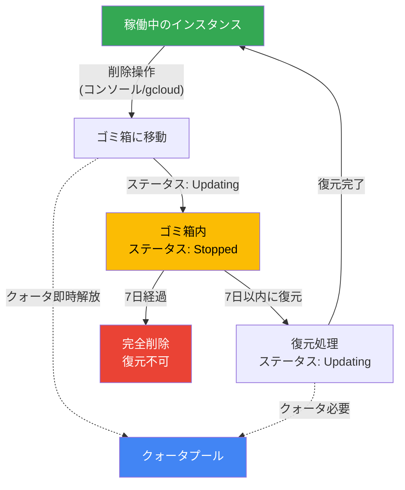

# Looker: インスタンス削除時のゴミ箱機能と復元サポート

**リリース日**: 2026-07-07

**サービス**: Looker (Google Cloud core)

**機能**: インスタンス削除時のゴミ箱移動と7日間の復元猶予期間

**ステータス**: GA (一般提供)

📊 [このアップデートのインフォグラフィックを見る](https://takech9203.github.io/google-cloud-news-summary/20260707-looker-instance-trash-restore.html)

## 概要

Looker (Google Cloud core) インスタンスの削除操作に、ゴミ箱機能が導入されました。これにより、インスタンスを削除すると即座に完全削除されるのではなく、まずゴミ箱に移動され、7日間の猶予期間が設けられます。この期間中であれば、設定、ユーザー、接続情報を含むすべてのデータを保持したままインスタンスを復元できます。

この機能は、誤操作によるインスタンスの意図しない削除や、削除後に再度必要になった場合のリカバリーを可能にする重要なセーフティネットです。特にエンタープライズ環境では、複数の管理者がインスタンスを管理するため、コミュニケーションミスによる誤削除のリスクが存在していましたが、今回のアップデートにより安全性が大幅に向上しました。

7日間の猶予期間が経過すると、インスタンスはゴミ箱から完全に削除され、復元は不可能になります。

**アップデート前の課題**

- インスタンスを削除すると即座に完全削除され、復元が不可能だった
- 誤操作や意図しない削除に対するセーフティネットが存在しなかった
- 削除前に十分な確認プロセスを経ても、後から再度必要になるケースに対応できなかった

**アップデート後の改善**

- インスタンス削除時にゴミ箱へ移動され、7日間の復元猶予期間が提供される
- 猶予期間中はすべてのデータ (設定、ユーザー、接続情報) を保持したまま復元が可能
- ゴミ箱に移動した時点でクォータが解放され、新しいインスタンスの作成に利用可能
- Google Cloud コンソールおよび gcloud CLI の両方から復元操作が可能

## アーキテクチャ図



Looker インスタンスの削除から完全削除までのライフサイクルを示しています。削除操作によりゴミ箱に移動し、7日間の猶予期間内であれば復元が可能です。

## サービスアップデートの詳細

### 主要機能

1. **ゴミ箱への移動 (Soft Delete)**
   - インスタンスを削除すると、即座に完全削除されずゴミ箱に移動
   - ゴミ箱内のインスタンスは使用不可だが、データは保持される
   - 移動中はステータスが「Updating」、完了後は「Stopped」と表示

2. **7日間の復元猶予期間**
   - ゴミ箱に移動してから7日間は復元可能
   - 復元時にはすべてのデータ (設定、ユーザー、接続情報) が元の状態に戻る
   - 7日経過後は自動的に完全削除され、復元不可能

3. **クォータ管理**
   - ゴミ箱に移動した時点でクォータは即座に解放
   - 復元時には十分なクォータが利用可能である必要がある
   - クォータ不足の場合、復元は失敗する

4. **メンテナンスウィンドウとの連携**
   - ゴミ箱内のインスタンスはアップデートを受信しない
   - 復元されたインスタンスは次のメンテナンスウィンドウでアップデートが適用される

## 技術仕様

### インスタンスのステータス遷移

| 状態 | ステータス | 説明 |
|------|-----------|------|
| 削除処理中 | Updating | ゴミ箱への移動中 |
| ゴミ箱内 | Stopped | ゴミ箱に正常に移動完了 |
| 復元処理中 | Updating | インスタンスの復元中 |
| 復元完了 | Active | 正常に復元され稼働中 |

### 必要な IAM ロール

| ロール | リソースレベル | 説明 |
|--------|--------------|------|
| `roles/looker.admin` (Looker Admin) | プロジェクト | インスタンスの削除・復元に必要 |

## 設定方法

### 前提条件

1. Google Cloud プロジェクトで Looker (Google Cloud core) インスタンスが作成済みであること
2. `roles/looker.admin` IAM ロールが付与されていること

### 手順

#### ステップ 1: インスタンスをゴミ箱に移動 (削除)

**Google Cloud コンソールの場合:**

1. Instances ページで対象インスタンスの三点メニューをクリック
2. 「Move to Trash」を選択
3. 確認ダイアログで再度「Move to Trash」を選択

**gcloud CLI の場合:**

```bash
gcloud looker instances delete INSTANCE_NAME \
    --region=REGION \
    --async
```

#### ステップ 2: ゴミ箱内のインスタンスを確認

**Google Cloud コンソールの場合:**

1. Instances ページで「Trashed instances」ボタンをクリック
2. 削除されたインスタンスの一覧を確認

**gcloud CLI の場合:**

```bash
gcloud looker instances list
```

#### ステップ 3: インスタンスの復元

**Google Cloud コンソールの場合:**

1. Instances ページで「Trashed instances」ボタンをクリック
2. 復元したいインスタンスの三点メニューをクリック
3. 「Restore」を選択
4. 確認ダイアログで再度「Restore」を選択

**gcloud CLI の場合:**

```bash
gcloud looker undelete INSTANCE_NAME \
    --region=REGION \
    --async
```

## メリット

### ビジネス面

- **誤削除からの保護**: 管理者の誤操作やコミュニケーションミスによるインスタンスの意図しない削除から保護され、ビジネス継続性が向上
- **意思決定の柔軟性**: インスタンスを削除した後でも7日間の猶予があるため、削除判断を再検討する余地がある
- **ダウンタイムの最小化**: 誤削除が発生しても、復元によりインスタンスの再構築が不要で、ダウンタイムを最小限に抑えられる

### 技術面

- **データ完全性の保証**: 復元時に設定、ユーザー、接続情報が完全に復元されるため、再設定の手間が不要
- **クォータの効率的管理**: ゴミ箱移動時にクォータが即座に解放されるため、新規インスタンスの作成にブロックされない
- **既存ワークフローとの互換性**: コンソールおよび gcloud CLI の両方で操作可能で、既存の運用フローに容易に統合可能

## デメリット・制約事項

### 制限事項

- 7日間の猶予期間は変更不可。7日経過後は復元不可能
- ゴミ箱内のインスタンスはソフトウェアアップデートを受信しないため、復元後に最新バージョンではない可能性がある
- 復元にはインスタンスに対応するクォータが必要であり、クォータ不足時は復元が失敗する
- 変更中 (修正処理中) のインスタンスはゴミ箱に移動できない

### 考慮すべき点

- Data Studio Pro サブスクリプションに関連付けられたインスタンスを削除すると、補完的な Data Studio Pro ライセンスは即座に有料ライセンスに変換される
- ゴミ箱への移動や復元が失敗した場合、インスタンスは以前のステータスに戻る
- 復元後のインスタンスは次のメンテナンスウィンドウまでアップデートが適用されないため、セキュリティパッチの適用が遅れる可能性がある

## ユースケース

### ユースケース 1: 誤操作からのリカバリー

**シナリオ**: 管理者が本番環境のインスタンスを誤ってステージング環境と間違えて削除してしまった

**実装例**:
```bash
# 誤って削除されたインスタンスを確認
gcloud looker instances list

# インスタンスを復元
gcloud looker undelete my-production-instance \
    --region=us-central1 \
    --async
```

**効果**: 本番環境のダウンタイムを最小限に抑え、すべての設定・ユーザー・接続情報を保持したまま迅速に復旧可能

### ユースケース 2: インスタンス統合の見直し

**シナリオ**: コスト最適化のため複数のインスタンスを統合する計画で一部を削除したが、統合後にパフォーマンス上の問題が判明し、元のインスタンスが再度必要になった

**効果**: 7日以内であれば削除したインスタンスを復元でき、統合計画を再検討する時間的余裕が生まれる

### ユースケース 3: コンプライアンス対応

**シナリオ**: インスタンスを削除した後に、そのインスタンス内のデータに対する法的保全要求 (リティゲーションホールド) が発生した

**効果**: 7日以内であればインスタンスを復元し、必要なデータの保全に対応可能

## 料金

ゴミ箱機能自体に追加料金は発生しません。ただし、以下の点に注意が必要です。

- ゴミ箱に移動した時点でインスタンスのクォータは解放される
- 復元時には対応するクォータが必要
- Looker (Google Cloud core) の料金はエディション (Standard / Enterprise / Embed) により異なる

詳細は [Looker (Google Cloud core) pricing](https://cloud.google.com/looker/pricing) を参照してください。

## 利用可能リージョン

本機能は Looker (Google Cloud core) が利用可能なすべてのリージョンで提供されます。Looker (Google Cloud core) はすべてのエディション (Standard、Enterprise、Embed) で利用可能です。

## 関連サービス・機能

- **[Looker (Google Cloud core) バックアップと復元](https://docs.cloud.google.com/looker/docs/looker-core-backup-restore)**: インスタンス全体のバックアップ・リストア機能。ゴミ箱機能とは異なり、特定時点のスナップショットを30日間保持
- **[Looker (Google Cloud core) メンテナンス](https://docs.cloud.google.com/looker/docs/looker-core-maintenance)**: インスタンスのアップデート管理。復元後のインスタンスは次のメンテナンスウィンドウでアップデートが適用される
- **[IAM (Identity and Access Management)](https://docs.cloud.google.com/iam/docs)**: インスタンスの削除・復元に必要な権限管理

## 参考リンク

- 📊 [インフォグラフィック](https://takech9203.github.io/google-cloud-news-summary/20260707-looker-instance-trash-restore.html)
- [公式リリースノート](https://docs.cloud.google.com/release-notes#July_07_2026)
- [Looker (Google Cloud core) インスタンスの削除](https://docs.cloud.google.com/looker/docs/looker-core-delete#instance-delete)
- [ゴミ箱からのインスタンス復元](https://docs.cloud.google.com/looker/docs/looker-core-delete#restore)
- [料金ページ](https://cloud.google.com/looker/pricing)

## まとめ

Looker (Google Cloud core) のゴミ箱機能は、インスタンスの誤削除に対する重要なセーフティネットです。7日間の復元猶予期間により、管理者は安心してインスタンスのライフサイクル管理を行えるようになりました。特にエンタープライズ環境では、複数管理者による運用において誤操作リスクを軽減し、ビジネス継続性を向上させる実用的な機能です。

---

**タグ**: #Looker #GoogleCloudCore #インスタンス管理 #ゴミ箱 #復元 #削除保護 #GA #データ保護
