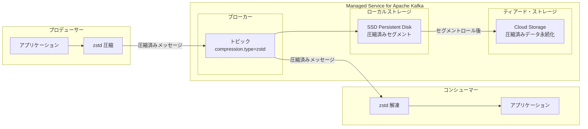

# Google Cloud Managed Service for Apache Kafka: トピック圧縮 zstd サポート

**リリース日**: 2026-07-07

**サービス**: Google Cloud Managed Service for Apache Kafka

**機能**: トピック圧縮における zstd (Zstandard) アルゴリズムのサポート

**ステータス**: Feature (GA)

📊 [このアップデートのインフォグラフィックを見る](https://takech9203.github.io/google-cloud-news-summary/20260707-managed-kafka-zstd-compression.html)

## 概要

Google Cloud Managed Service for Apache Kafka において、トピックレベルの圧縮設定で zstd (Zstandard) アルゴリズムがサポートされました。zstd は Facebook (Meta) が開発した高性能な可逆圧縮アルゴリズムで、従来の gzip や snappy と比較して、圧縮率と速度の両面で優れたバランスを提供します。

この機能追加により、Managed Service for Apache Kafka ユーザーは、トピック作成時または更新時に `compression.type=zstd` を指定することで、ブローカー側でのメッセージ圧縮に zstd を活用できるようになります。大量のメッセージストリーミングを行うワークロードにおいて、ストレージコストの削減とネットワーク帯域幅の効率的な利用が可能になります。

Managed Service for Apache Kafka は 2024 年 11 月に GA となったフルマネージド Apache Kafka サービスであり、ティアード・ストレージ (KIP-405) を活用したストレージ管理の自動化、Private Service Connect による柔軟なネットワーキング、Kafka Connect のサポートなど、エンタープライズ向けの機能を備えています。今回の zstd サポートは、これらの機能と組み合わせることで、より効率的なデータストリーミング基盤の構築を可能にします。

**アップデート前の課題**

- トピック圧縮に zstd を指定できず、高圧縮率と高速処理を両立する選択肢が限られていた
- gzip は圧縮率が高いが処理速度が遅く、snappy は高速だが圧縮率が低いというトレードオフがあった
- 大容量データのストリーミングにおいて、ストレージコストとスループットの最適化に制約があった

**アップデート後の改善**

- `compression.type=zstd` をトピック設定に指定可能になり、圧縮率と速度のバランスが最適化された
- ティアード・ストレージとの組み合わせにより、永続化データのストレージコストをさらに削減可能
- プロデューサー側で zstd 圧縮を使用している場合、ブローカーでの再圧縮が不要になり、CPU 負荷を軽減

## アーキテクチャ図



プロデューサーで zstd 圧縮されたメッセージがブローカーに送信され、ティアード・ストレージに永続化されるまでのデータフローを示しています。圧縮済みのまま保存されるため、ストレージ使用量が削減されます。

## サービスアップデートの詳細

### 主要機能

1. **zstd トピック圧縮**
   - トピックレベルの設定パラメータ `compression.type` に `zstd` を指定可能
   - ブローカー側でメッセージを zstd アルゴリズムで圧縮して保存
   - プロデューサーが zstd で圧縮済みのメッセージはそのまま保存 (再圧縮なし)

2. **既存の圧縮オプションとの共存**
   - `producer` (プロデューサーの圧縮をそのまま保持)、`gzip`、`snappy`、`lz4`、`zstd`、`uncompressed` から選択可能
   - トピック単位で異なる圧縮方式を設定可能
   - 既存トピックの圧縮設定を後から変更可能

3. **ティアード・ストレージとの統合**
   - 圧縮されたセグメントがそのままローカル SSD から Cloud Storage に移動
   - 永続化層でも圧縮効果を維持し、ストレージコストを削減

## 技術仕様

### zstd 圧縮の特性

| 項目 | 詳細 |
|------|------|
| アルゴリズム | Zstandard (zstd) - RFC 8878 |
| 開発元 | Meta (Facebook) |
| 圧縮率 | gzip と同等以上 (データに依存) |
| 圧縮速度 | gzip より高速、snappy に近い |
| 解凍速度 | 非常に高速 (snappy と同等) |
| Kafka 設定キー | `compression.type` |
| 設定値 | `zstd` |

### 圧縮方式の比較

| 圧縮方式 | 圧縮率 | 圧縮速度 | 解凍速度 | 推奨ユースケース |
|----------|--------|----------|----------|------------------|
| zstd | 高い | 高速 | 非常に高速 | 汎用 (バランス重視) |
| gzip | 高い | 低速 | 中程度 | ストレージ削減重視 |
| snappy | 低い | 非常に高速 | 非常に高速 | レイテンシ重視 |
| lz4 | 中程度 | 非常に高速 | 非常に高速 | スループット重視 |

## 設定方法

### 前提条件

1. Google Cloud Managed Service for Apache Kafka クラスタが作成済みであること
2. 適切な IAM 権限 (managedkafka.topics.create または managedkafka.topics.update) を持っていること

### 手順

#### ステップ 1: gcloud CLI でトピック作成時に zstd 圧縮を指定

```bash
gcloud managed-kafka topics create my-topic \
  --cluster=my-cluster \
  --location=us-central1 \
  --partitions=6 \
  --replication-factor=3 \
  --configs=compression.type=zstd
```

この設定により、トピック `my-topic` に書き込まれるメッセージはブローカー側で zstd 圧縮されます。

#### ステップ 2: 既存トピックの圧縮設定を変更

```bash
gcloud managed-kafka topics update my-topic \
  --cluster=my-cluster \
  --location=us-central1 \
  --configs=compression.type=zstd
```

既存のトピックに対して、圧縮方式を zstd に変更します。変更後に書き込まれるメッセージから新しい圧縮方式が適用されます。

#### ステップ 3: Kafka CLI で設定を確認

```bash
kafka-topics.sh --describe \
  --bootstrap-server=BOOTSTRAP_ADDRESS \
  --command-config client.properties \
  --topic my-topic
```

トピックの設定を確認し、`compression.type=zstd` が適用されていることを検証します。

## メリット

### ビジネス面

- **ストレージコスト削減**: zstd の高い圧縮率により、ティアード・ストレージ (Cloud Storage) に保存されるデータ量が減少し、ストレージ料金を削減
- **ネットワーク転送コスト削減**: 圧縮済みデータの転送によりネットワーク帯域幅の使用量を削減
- **運用効率の向上**: フルマネージドサービスとして圧縮設定のみで利用可能。圧縮ライブラリの管理やバージョンアップは不要

### 技術面

- **高スループットと高圧縮率の両立**: zstd は gzip 相当の圧縮率を、snappy に近い速度で実現
- **CPU 効率**: プロデューサー側で zstd 圧縮を行っている場合、ブローカーでの再圧縮が不要
- **柔軟な圧縮レベル**: zstd は複数の圧縮レベルをサポートし、ワークロードに応じた最適化が可能

## デメリット・制約事項

### 制限事項

- コンシューマー側のクライアントライブラリが zstd 解凍をサポートしている必要がある (Apache Kafka 2.1.0 以降)
- 圧縮/解凍には CPU リソースを消費するため、非常に低レイテンシが求められるユースケースでは影響を考慮する必要がある

### 考慮すべき点

- 既存トピックの圧縮方式を変更した場合、変更前後でセグメント内に異なる圧縮方式が混在する可能性がある
- プロデューサーの圧縮方式とトピックの圧縮方式が異なる場合、ブローカーで再圧縮が発生し、CPU 負荷が増加する

## ユースケース

### ユースケース 1: IoT データストリーミング

**シナリオ**: 大量の IoT センサーデータを Managed Kafka に収集し、BigQuery にストリーミングするパイプライン

**実装例**:
```bash
gcloud managed-kafka topics create iot-sensor-data \
  --cluster=iot-cluster \
  --location=asia-northeast1 \
  --partitions=12 \
  --replication-factor=3 \
  --configs=compression.type=zstd,retention.ms=604800000
```

**効果**: センサーデータは反復パターンが多いため zstd で高い圧縮率を達成。7 日間の保持期間でもストレージコストを抑制可能。

### ユースケース 2: ログ集約基盤

**シナリオ**: マイクロサービスアーキテクチャにおける各サービスのアプリケーションログを集約

**効果**: テキストベースのログデータは zstd で 5-10 倍の圧縮率を期待でき、大量ログの長期保存コストを大幅に削減。解凍速度も高速なため、ログ検索時のレイテンシへの影響が最小限。

### ユースケース 3: イベント駆動アーキテクチャ

**シナリオ**: E コマースプラットフォームにおける注文、在庫、配送イベントのストリーミング処理

**効果**: JSON 形式のイベントデータに対して高い圧縮率を実現しつつ、リアルタイム処理に必要な低レイテンシを維持。

## 料金

Managed Service for Apache Kafka の料金は、圧縮方式の選択に関わらず同一の料金体系が適用されます。zstd 圧縮を有効にすることで、実質的にストレージ使用量が減少し、コスト削減につながります。

料金の構成要素:
- vCPU および RAM (コンピュートリソース)
- ローカル SSD ストレージ (100 GiB/vCPU)
- ティアード・ストレージ (Cloud Storage) のデータ量

CUD (確約利用割引) も利用可能:
- 1 年契約: 20% 割引
- 3 年契約: 40% 割引

## 利用可能リージョン

zstd トピック圧縮は、Managed Service for Apache Kafka が利用可能な全リージョンでサポートされます。

**北米・南米**: us-central1, us-east1, us-east4, us-east5, us-south1, us-west1, us-west2, us-west3, us-west4, northamerica-northeast1, northamerica-northeast2, southamerica-east1, southamerica-west1

**アジア太平洋**: asia-east1, asia-east2, asia-northeast1, asia-northeast2, asia-northeast3, asia-south1, asia-south2, asia-southeast1, asia-southeast2, australia-southeast1, australia-southeast2

**ヨーロッパ**: europe-west1, europe-west2, europe-west3, europe-west4, europe-west6, europe-west8, europe-west9, europe-west10, europe-west12, europe-north1, europe-north2, europe-central2, europe-southwest1

**中東・アフリカ**: me-central1, me-central2, me-west1, africa-south1

## 関連サービス・機能

- **Kafka Connect**: Managed Service for Apache Kafka と他システム間のデータストリーミングに利用。圧縮済みデータの効率的な転送に貢献
- **Cloud Storage (ティアード・ストレージ)**: ブローカーのローカル SSD からロールされたセグメントの永続化先。zstd 圧縮により保存コストを削減
- **Dataflow**: Kafka から BigQuery や Cloud Storage へのデータ移動テンプレート。圧縮済みメッセージの効率的なパイプライン処理
- **Schema Registry**: Managed Service for Apache Kafka のスキーマレジストリ機能と組み合わせて、構造化データの効率的な圧縮・転送が可能

## 参考リンク

- 📊 [インフォグラフィック](https://takech9203.github.io/google-cloud-news-summary/20260707-managed-kafka-zstd-compression.html)
- [公式リリースノート](https://docs.cloud.google.com/release-notes#July_07_2026)
- [Managed Service for Apache Kafka - トピック作成ドキュメント](https://docs.cloud.google.com/managed-service-for-apache-kafka/docs/create-topic)
- [Managed Service for Apache Kafka 概要](https://docs.cloud.google.com/managed-service-for-apache-kafka/docs/overview)
- [料金ページ](https://docs.cloud.google.com/managed-service-for-apache-kafka/pricing)
- [Apache Kafka Topic-level configs](https://kafka.apache.org/37/configuration/topic-level-configs/)

## まとめ

Google Cloud Managed Service for Apache Kafka における zstd トピック圧縮のサポートは、高い圧縮率と高速な処理速度を両立する選択肢を提供し、大規模データストリーミング基盤のコスト最適化に貢献します。特にログ集約、IoT データ処理、イベント駆動アーキテクチャなどの大量データを扱うワークロードでは、ストレージコストとネットワーク帯域幅の削減効果が期待できます。既存のトピック設定に `compression.type=zstd` を追加するだけで利用開始できるため、即座に導入を検討することを推奨します。

---

**タグ**: #GoogleCloud #ManagedKafka #ApacheKafka #zstd #Compression #DataStreaming #MessageQueue #CostOptimization
