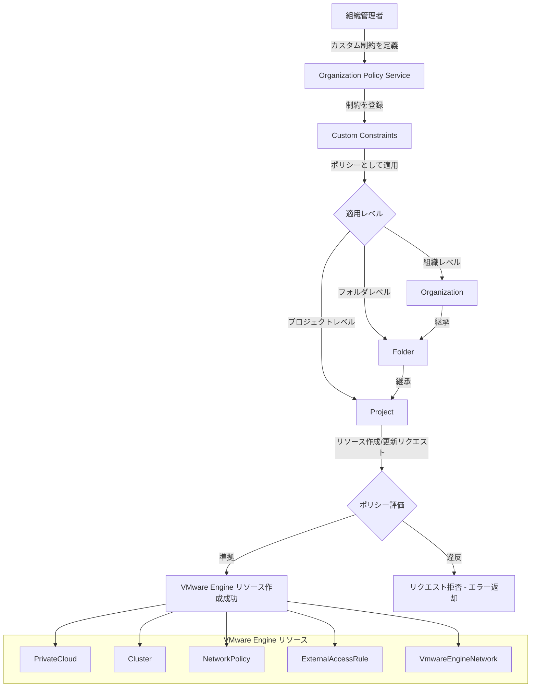

# Google Cloud VMware Engine: カスタム組織ポリシー制約が GA (一般提供)

**リリース日**: 2026-07-07

**サービス**: Google Cloud VMware Engine

**機能**: Custom Organization Policy Constraints (カスタム組織ポリシー制約)

**ステータス**: GA (一般提供)

📊 [このアップデートのインフォグラフィックを見る](https://takech9203.github.io/google-cloud-news-summary/20260707-vmware-engine-custom-org-policies-ga.html)

## 概要

Google Cloud VMware Engine において、カスタム組織ポリシー制約 (Custom Organization Policy Constraints) が一般提供 (GA) となりました。この機能により、組織管理者は VMware Engine リソースに対して独自のセキュリティポリシーを定義・適用し、リソースの構成を細かく制御できるようになります。

カスタム組織ポリシー制約は、Google Cloud Organization Policy Service の拡張機能です。従来の組み込みマネージド制約に加え、Common Expression Language (CEL) を使用して独自の条件式を定義し、VMware Engine リソースの特定フィールドに対する制約を作成できます。これにより、組織全体でセキュリティ基準やコンプライアンス要件を一貫して適用することが可能になります。

対象ユーザーは、VMware Engine を利用する企業のクラウド管理者、セキュリティチーム、およびガバナンス担当者です。特に、複数のプロジェクトやフォルダにまたがる VMware Engine 環境を運用し、統一的なポリシー管理が必要な組織にとって重要なアップデートです。

**アップデート前の課題**

- VMware Engine リソースに対するポリシー制御は組み込みのマネージド制約に限定されており、組織固有の要件に合わせたきめ細かな制約を設定できなかった
- 管理 CIDR 範囲やネットワーク構成など、特定のフィールド値を組織レベルで制限する手段がなく、個別のプロジェクトごとに手動で確認・管理する必要があった
- セキュリティポリシーの一貫した適用が困難で、設定ミスやコンプライアンス違反のリスクが存在した

**アップデート後の改善**

- 8 種類の VMware Engine リソースタイプに対してカスタム制約を作成し、CEL 条件式で細かく制御できるようになった
- 組織・フォルダ・プロジェクトの階層に沿ったポリシー継承により、統一的なガバナンスが実現可能になった
- ドライランモードでポリシーの影響を事前に検証でき、安全にポリシーを導入できるようになった

## アーキテクチャ図



組織ポリシーサービスを通じて定義されたカスタム制約が、リソース階層に沿って継承され、VMware Engine リソースの作成・更新時に自動的に評価される仕組みを示しています。

## サービスアップデートの詳細

### 主要機能

1. **カスタム制約の作成**
   - YAML ファイルまたは Cloud Console から独自の制約を定義可能
   - CEL (Common Expression Language) による柔軟な条件式の記述
   - ALLOW / DENY の2種類のアクションタイプをサポート

2. **8 種類の VMware Engine リソースタイプをサポート**
   - PrivateCloud (プライベートクラウド)
   - Cluster (クラスタ)
   - ExternalAccessRule (外部アクセスルール)
   - ExternalAddress (外部アドレス)
   - NetworkPeering (ネットワークピアリング)
   - NetworkPolicy (ネットワークポリシー)
   - PrivateConnection (プライベート接続)
   - VmwareEngineNetwork (VMware Engine ネットワーク)

3. **ポリシー継承と階層管理**
   - 組織、フォルダ、プロジェクトの各レベルでポリシーを適用可能
   - 上位レベルで設定されたポリシーは下位に自動継承
   - 継承ルールのカスタマイズ (無効化) も可能

4. **ドライランモード**
   - ポリシーの影響を本番適用前に検証可能
   - Policy Simulator でテスト変更のシミュレーションが可能

## 技術仕様

### サポートされるリソースとフィールド

| リソースタイプ | 主なフィールド例 |
|------|------|
| vmwareengine.googleapis.com/PrivateCloud | managementCidr, encryptionConfig, dnsProfile, type |
| vmwareengine.googleapis.com/Cluster | nodeTypeConfigs, autoscalingSettings, vsanType |
| vmwareengine.googleapis.com/ExternalAccessRule | action, ipProtocol, priority, sourcePorts, destinationPorts |
| vmwareengine.googleapis.com/NetworkPolicy | externalIp.enabled, internetAccess.enabled, edgeServicesCidr |
| vmwareengine.googleapis.com/NetworkPeering | peerNetwork, routingMode, exportCustomRoutes |
| vmwareengine.googleapis.com/PrivateConnection | routingMode, serviceNetwork, type |
| vmwareengine.googleapis.com/VmwareEngineNetwork | type, description |
| vmwareengine.googleapis.com/ExternalAddress | internalIp, description |

### 制約の仕様

| 項目 | 詳細 |
|------|------|
| 制約名の最大長 | 70 文字 (custom. プレフィックスを除く) |
| 条件式の最大長 | 1,000 文字 |
| 表示名の最大長 | 200 文字 |
| 説明の最大長 | 2,000 文字 |
| リソースタイプあたりの最大制約数 | 20 |
| サポートされるメソッド | CREATE, UPDATE |
| 条件式言語 | CEL (Common Expression Language) |
| ポリシー反映時間 | 最大 15 分 |

### カスタム制約の YAML 定義例

```yaml
name: organizations/ORGANIZATION_ID/customConstraints/custom.privateCloudManagementCidr
resourceTypes:
  - vmwareengine.googleapis.com/PrivateCloud
methodTypes:
  - CREATE
condition: "!resource.managementCidr.startsWith('192.168.0.0')"
actionType: DENY
displayName: Restrict private cloud management CIDR
description: Private clouds must have a management CIDR range starting with 192.168.0.0.
```

## 設定方法

### 前提条件

1. Google Cloud 組織が設定されていること
2. Organization Policy Administrator (roles/orgpolicy.policyAdmin) IAM ロールが付与されていること
3. 組織 ID を確認済みであること

### 手順

#### ステップ 1: カスタム制約の定義

```bash
# constraint.yaml ファイルを作成
cat > constraint.yaml << 'EOF'
name: organizations/123456789/customConstraints/custom.privateCloudManagementCidr
resourceTypes:
  - vmwareengine.googleapis.com/PrivateCloud
methodTypes:
  - CREATE
condition: "!resource.managementCidr.startsWith('192.168.0.0')"
actionType: DENY
displayName: Restrict private cloud management CIDR
description: Private clouds must have a management CIDR range starting with 192.168.0.0.
EOF
```

ORGANIZATION_ID を実際の組織 ID に置き換えて、制約の内容を要件に合わせてカスタマイズします。

#### ステップ 2: カスタム制約の登録

```bash
# カスタム制約を組織に登録
gcloud org-policies set-custom-constraint constraint.yaml
```

登録後、組織ポリシーの一覧にカスタム制約が表示されます。

#### ステップ 3: 組織ポリシーの作成と適用

```bash
# policy.yaml ファイルを作成
cat > policy.yaml << 'EOF'
name: projects/PROJECT_ID/policies/custom.privateCloudManagementCidr
spec:
  rules:
    - enforce: true
dryRunSpec:
  rules:
    - enforce: true
EOF

# ドライランモードで先にテスト
gcloud org-policies set-policy policy.yaml --update-mask=dryRunSpec
```

ドライランで問題がないことを確認してから本番適用します。

#### ステップ 4: 本番ポリシーの適用

```bash
# 本番ポリシーを適用
gcloud org-policies set-policy policy.yaml --update-mask=spec
```

ポリシーの反映には最大 15 分かかります。

#### ステップ 5: 制約の確認

```bash
# 登録済みカスタム制約の一覧確認
gcloud org-policies list-custom-constraints --organization=ORGANIZATION_ID
```

## メリット

### ビジネス面

- **コンプライアンスの自動化**: 規制要件やセキュリティ基準への準拠を自動的に強制でき、監査対応のコスト削減に貢献
- **ガバナンスの一元化**: 組織全体でVMware Engine の構成基準を統一し、シャドーIT やポリシー逸脱を防止
- **運用リスクの低減**: 設定ミスによるセキュリティインシデントを事前に防止し、インシデント対応コストを削減

### 技術面

- **宣言的なポリシー管理**: YAML 定義とCEL条件式による Infrastructure as Code アプローチでポリシーを管理可能
- **きめ細かな制御**: 8種類のリソースタイプの個別フィールドレベルで制約を定義可能
- **段階的なロールアウト**: ドライランモードとPolicy Simulatorにより、影響を事前に評価してから本番適用可能
- **階層的な継承**: 組織・フォルダ・プロジェクトの階層に沿った自動継承により、大規模環境でも効率的に管理可能

## デメリット・制約事項

### 制限事項

- リソースタイプあたりのカスタム制約数は最大 20 個に制限される
- ポリシーの反映に最大 15 分の遅延が発生する可能性がある
- CEL 条件式は最大 1,000 文字に制限される
- UPDATE メソッドで制約を適用した場合、既存の違反リソースの変更操作は違反を解消する変更以外ブロックされる

### 考慮すべき点

- 過度に厳格な制約は正当な運用作業をブロックする可能性があるため、ドライランモードでの事前検証が重要
- ポリシー階層の設計を慎重に行わないと、意図しない継承による問題が発生する可能性がある
- Organization Policy Administrator ロールの付与範囲を適切に管理する必要がある

## ユースケース

### ユースケース 1: 管理 CIDR 範囲の標準化

**シナリオ**: 企業のネットワークチームが、すべての VMware Engine プライベートクラウドの管理 CIDR 範囲を特定のアドレス空間に限定し、既存のオンプレミスネットワークとの競合を防止したい。

**実装例**:
```yaml
name: organizations/123456789/customConstraints/custom.privateCloudManagementCidr
resourceTypes:
  - vmwareengine.googleapis.com/PrivateCloud
methodTypes:
  - CREATE
condition: "!resource.managementCidr.startsWith('192.168.0.0')"
actionType: DENY
displayName: Restrict private cloud management CIDR
description: Private clouds must have a management CIDR range starting with 192.168.0.0.
```

**効果**: すべてのプライベートクラウドが統一されたアドレス空間を使用し、ネットワーク設計の一貫性が保たれる。

### ユースケース 2: 外部アクセスルールのセキュリティ強制

**シナリオ**: セキュリティチームが、VMware Engine の外部アクセスルールで特定のプロトコルの使用を制限し、不正なネットワークアクセスを防止したい。

**実装例**:
```yaml
name: organizations/123456789/customConstraints/custom.blockInsecureProtocols
resourceTypes:
  - vmwareengine.googleapis.com/ExternalAccessRule
methodTypes:
  - CREATE
  - UPDATE
condition: "resource.ipProtocol == 'TCP' || resource.ipProtocol == 'UDP'"
actionType: ALLOW
displayName: Allow only TCP and UDP protocols
description: External access rules must use TCP or UDP protocols only.
```

**効果**: 許可されたプロトコルのみが使用され、セキュリティ基準に準拠した通信制御が自動的に実施される。

### ユースケース 3: クラスタサイズの最小構成強制

**シナリオ**: 運用チームが、本番環境のクラスタが常に最低限のノード数を確保し、可用性要件を満たすことを保証したい。

**実装例**:
```yaml
name: organizations/123456789/customConstraints/custom.minimumNodeCount
resourceTypes:
  - vmwareengine.googleapis.com/Cluster
methodTypes:
  - CREATE
  - UPDATE
condition: "resource.nodeTypeConfigs.exists(config, config.nodeCount < 3)"
actionType: DENY
displayName: Minimum 3 nodes per cluster
description: Clusters must have at least 3 nodes for high availability.
```

**効果**: すべてのクラスタが最低 3 ノード構成となり、高可用性の要件が組織全体で保証される。

## 料金

カスタム組織ポリシー制約の機能自体には追加料金は発生しません。Organization Policy Service は Google Cloud の無料のガバナンス機能として提供されています。ただし、VMware Engine リソース自体の利用料金は通常通り発生します。

## 利用可能リージョン

カスタム組織ポリシー制約は、Google Cloud VMware Engine が利用可能なすべてのリージョンで使用できます。組織ポリシーはグローバルサービスであり、リージョンに依存せずに適用されます。

## 関連サービス・機能

- **Organization Policy Service**: カスタム制約の基盤となるサービス。組織全体のリソースガバナンスを提供
- **Cloud IAM**: Organization Policy Administrator ロールなど、ポリシー管理に必要な権限を制御
- **Resource Manager**: 組織・フォルダ・プロジェクトのリソース階層を管理し、ポリシー継承の基盤を提供
- **Policy Simulator**: 組織ポリシーの変更による影響を事前にシミュレーション
- **Cloud Audit Logs**: ポリシー違反の監査ログを記録し、コンプライアンス監査に活用

## 参考リンク

- 📊 [インフォグラフィック](https://takech9203.github.io/google-cloud-news-summary/20260707-vmware-engine-custom-org-policies-ga.html)
- [公式リリースノート](https://docs.cloud.google.com/release-notes#July_07_2026)
- [VMware Engine カスタム制約ドキュメント](https://docs.cloud.google.com/vmware-engine/docs/custom-constraints)
- [Organization Policy Service 概要](https://docs.cloud.google.com/organization-policy/overview)
- [カスタム制約対応サービス一覧](https://docs.cloud.google.com/organization-policy/reference/custom-constraint-supported-services)

## まとめ

Google Cloud VMware Engine のカスタム組織ポリシー制約が GA となったことで、企業は VMware Engine 環境に対して組織固有のセキュリティポリシーとコンプライアンス要件を宣言的に適用できるようになりました。8 種類のリソースタイプと多数のフィールドに対してきめ細かな制御が可能であり、ドライランモードによる安全な導入もサポートされています。VMware Engine を利用する組織では、既存のガバナンス要件を洗い出し、カスタム制約として定義することを推奨します。

---

**タグ**: #GoogleCloud #VMwareEngine #OrganizationPolicy #CustomConstraints #Security #Governance #GA #Compliance
