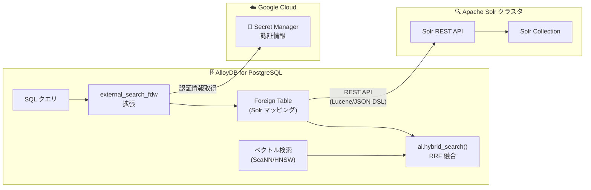

# AlloyDB for PostgreSQL: Apache Solr 外部検索統合

**リリース日**: 2026-07-08

**サービス**: AlloyDB for PostgreSQL

**機能**: external_search_fdw 拡張による Apache Solr 統合

**ステータス**: Preview

📊 [このアップデートのインフォグラフィックを見る](https://takech9203.github.io/google-cloud-news-summary/20260708-alloydb-external-search-solr.html)

## 概要

AlloyDB for PostgreSQL の外部検索機能が Apache Solr に対応した。`external_search_fdw` 拡張を使用することで、AlloyDB から Solr クラスタに接続し、SQL クエリを通じて Solr のデータを直接検索できるようになった。本機能は現在 Preview ステージで提供されている。

この統合により、AlloyDB のリレーショナルデータと Solr の全文検索エンジンを組み合わせたハイブリッド検索が可能となる。PostgreSQL の Foreign Data Wrapper (FDW) メカニズムを活用し、Solr コレクションを PostgreSQL の外部テーブルとしてマッピングすることで、開発者は使い慣れた SQL インターフェースから Solr の強力な検索機能にアクセスできる。

2026 年 4 月に Preview リリースされた Elasticsearch 統合に続き、AlloyDB の外部検索バックエンドが拡充された形となる。Apache Solr は特にエンタープライズ検索や大規模なドキュメント検索に広く利用されており、既存の Solr インフラを活用しながら AlloyDB のデータベース機能と統合したいユーザーにとって重要なアップデートである。

**アップデート前の課題**

- Solr のデータを AlloyDB から利用するには、アプリケーション層で Solr API と PostgreSQL を個別に呼び出し、結果をマージする必要があった
- リレーショナルデータと全文検索データを組み合わせたクエリの実装が複雑で、レイテンシも高くなりがちだった
- AlloyDB の外部検索統合は Elasticsearch のみに限定されており、Solr を使用している組織には選択肢がなかった

**アップデート後の改善**

- AlloyDB から SQL クエリで直接 Solr のデータを検索可能になった
- `external_search_fdw` 拡張により、Solr コレクションを PostgreSQL 外部テーブルとして透過的にアクセスできる
- AlloyDB のベクトル検索と Solr のトークン検索を組み合わせたハイブリッド検索 (RRF) が可能になった
- Secret Manager による安全な認証情報管理が統合されている

## アーキテクチャ図



AlloyDB の `external_search_fdw` 拡張が Solr の REST API を介してクエリを変換・転送し、Secret Manager で認証情報を安全に管理する構成。ハイブリッド検索では AlloyDB 内部のベクトル検索結果と Solr の全文検索結果を RRF アルゴリズムで統合する。

## サービスアップデートの詳細

### 主要機能

1. **SQL による Solr データアクセス**
   - 標準 SQL クエリで Solr のデータを検索可能
   - Lucene 構文をサポートし、`metadata <@> 'QUERY'` 形式で検索式を指定
   - WHERE 句によるフィルタリングも可能

2. **Solr JSON Query DSL サポート**
   - 高度なユースケース向けに Solr ネイティブの JSON Query DSL を利用可能
   - query、filter、sort 式を SQL 内から指定できる
   - `$${ ... }$$` 形式でクエリ DSL を直接記述

3. **ハイブリッド検索 (RRF)**
   - AlloyDB のベクトル検索 (ScaNN/HNSW) と Solr のトークン検索を組み合わせ可能
   - `ai.hybrid_search()` 関数により Reciprocal Rank Fusion でスコアを統合
   - 重み付けパラメータで各検索コンポーネントの寄与率を調整可能

4. **Secret Manager 統合認証**
   - Solr クラスタへの認証情報を Secret Manager で安全に管理
   - Basic 認証をサポート (base64 エンコードされた username:password 形式)
   - AlloyDB サービスアカウントに `secretmanager.secretAccessor` 権限が必要

## 技術仕様

### サポート要件

| 項目 | 詳細 |
|------|------|
| PostgreSQL バージョン | 17 以降が必須 |
| データアクセス | 読み取り専用 (書き込み不可) |
| 認証方式 | Basic 認証 (Secret Manager 経由) |
| ネットワーク | パブリック IP アウトバウンド接続が必要 |
| ステータス | Preview |

### 制限事項

| 項目 | 詳細 |
|------|------|
| スキーマ同期 | 手動 (自動同期なし) |
| データ同期 | ユーザー責任 (自動インデックス作成なし) |
| JSON フィールド | TEXT または jsonb 形式の文字列にマッピングが必要 |
| ページネーション | ソート式にユニークキーが必須 (デフォルト: id フィールド) |

## 設定方法

### 前提条件

1. AlloyDB インスタンスでパブリック IP アウトバウンド接続を有効化
2. Apache Solr クラスタがパブリック URL でアクセス可能な状態で稼働
3. Solr の認証情報を Secret Manager に保存
4. AlloyDB サービスアカウントに `secretmanager.secretAccessor` 権限を付与

### 手順

#### ステップ 1: 拡張の有効化とサーバー設定

```sql
-- external_search_fdw 拡張を有効化
CREATE EXTENSION external_search_fdw;

-- Solr サーバーへの接続を設定
CREATE SERVER my_solr_server
  FOREIGN DATA WRAPPER external_search_fdw
  OPTIONS (
    server 'https://node1.solr.example.com:8983',
    search_provider 'solr',
    auth_mode 'secret_manager',
    auth_method 'Basic',
    secret_path 'projects/123456789012/secrets/solr-creds/versions/1'
  );
```

`search_provider` を `'solr'` に設定することで、AlloyDB が Solr 固有のクエリ変換を行う。

#### ステップ 2: ユーザーマッピングと外部テーブルの作成

```sql
-- ユーザーマッピングの作成 (FDW の要件)
CREATE USER MAPPING FOR CURRENT_USER SERVER my_solr_server;

-- Solr コレクションを外部テーブルとしてマッピング
CREATE FOREIGN TABLE solr_products (
  metadata external_search_fdw_schema.OpaqueMetadata,
  id TEXT,
  title TEXT,
  description TEXT,
  category TEXT,
  price DOUBLE PRECISION
)
SERVER my_solr_server
OPTIONS (
  remote_table_name 'products',
  unique_key_sort_suffix 'id ASC'
);
```

#### ステップ 3: クエリの実行

```sql
-- 標準 SQL + Lucene 構文での検索
SELECT id, title, description
FROM solr_products
WHERE price < 100
ORDER BY metadata <@> 'title:database AND category:software';

-- JSON Query DSL を使用した高度な検索
SELECT id, title
FROM solr_products
ORDER BY metadata <@> $${
  "query": "title:cloud database",
  "filter": ["category:enterprise", "inStock:true"],
  "sort": "price desc"
}$$
LIMIT 10;
```

## メリット

### ビジネス面

- **既存 Solr 投資の活用**: 既に Solr クラスタを運用している組織は、インフラを変更せずに AlloyDB と統合可能
- **開発効率の向上**: アプリケーション層で検索エンジンとデータベースを個別に呼び出す複雑な実装が不要になる
- **検索精度の向上**: ハイブリッド検索により、キーワード検索とセマンティック検索を組み合わせた高精度な検索結果を提供

### 技術面

- **SQL インターフェース統一**: Solr のデータを SQL から透過的にアクセスでき、既存のクエリロジックと統合しやすい
- **セキュアな認証**: Secret Manager 統合により、認証情報のハードコーディングを回避
- **柔軟なクエリ方式**: 標準 SQL、Lucene 構文、Solr JSON Query DSL の 3 種類のクエリ方式から選択可能

## デメリット・制約事項

### 制限事項

- PostgreSQL 17 以降でのみ利用可能 (バージョン 16 以前では使用不可)
- 読み取り専用の統合であり、AlloyDB から Solr へのデータ書き込みは不可
- Solr コレクションのスキーマ変更時は外部テーブルの手動更新が必要
- Elasticsearch とは異なり、Solr には JSON 型フィールドが事前定義されていないため、TEXT または jsonb へのマッピングが必要

### 考慮すべき点

- データの一貫性はユーザー責任 (AlloyDB と Solr 間の自動同期機構なし)
- パブリック IP 経由での接続が必要なため、ネットワークセキュリティの追加設計が必要
- Preview ステージのため、本番利用には制限付きサポートとなる
- Solr クラスタのパフォーマンスが AlloyDB のクエリレイテンシに直接影響する

## ユースケース

### ユースケース 1: E コマースのハイブリッド商品検索

**シナリオ**: EC サイトで Solr による全文検索と AlloyDB のベクトル検索を組み合わせ、商品検索の精度を向上させたい。

**実装例**:
```sql
SELECT * FROM ai.hybrid_search(
  ARRAY[
    '{
      "limit": 10,
      "weight": 0.5,
      "table_name": "solr_products",
      "key_column": "id",
      "query_text_input": "lightweight laptop for developers"
    }'::jsonb
  ]
)
ORDER BY score DESC;
```

**効果**: キーワードマッチングとセマンティック類似度の両方を考慮した検索結果を提供し、ユーザーの検索意図により適合した商品を表示できる。

### ユースケース 2: エンタープライズドキュメント検索

**シナリオ**: 社内ドキュメント管理システムで Solr にインデックスされた文書を、AlloyDB のメタデータ (権限、部門、作成日) と組み合わせてセキュアに検索したい。

**効果**: Solr の強力なテキスト検索と AlloyDB のリレーショナルデータ (アクセス制御情報) を単一の SQL クエリで結合でき、アプリケーション層の複雑性を大幅に削減できる。

## 料金

AlloyDB for PostgreSQL の `external_search_fdw` 拡張自体には追加料金は発生しない。ただし、以下のコストが関連する:

- **AlloyDB インスタンス**: 通常の AlloyDB コンピュート・ストレージ料金 (vCPU: $0.06608/時間〜、メモリ: $0.0112/GB/時間〜)
- **Secret Manager**: シークレットのバージョンごとに $0.06/月、アクセスオペレーション 10,000 回あたり $0.03
- **ネットワーク**: AlloyDB からの外部通信料金
- **Solr クラスタ**: ユーザーが管理する Solr インフラのコスト (AlloyDB とは別)

詳細は [AlloyDB 料金ページ](https://cloud.google.com/alloydb/pricing) を参照。

## 関連サービス・機能

- **AlloyDB AI (ハイブリッド検索)**: `ai.hybrid_search()` 関数で Solr 検索と AlloyDB ベクトル検索を RRF で統合
- **Secret Manager**: Solr 認証情報の安全な保管と取得
- **AlloyDB 外部検索 (Elasticsearch)**: 同じ `external_search_fdw` 拡張で Elasticsearch との統合も可能 (2026 年 4 月 Preview)
- **AlloyDB Omni**: コンテナ版 AlloyDB でも同拡張が利用可能
- **Cloud Monitoring / Cloud Logging**: AlloyDB のクエリパフォーマンスやエラーの監視

## 参考リンク

- 📊 [インフォグラフィック](https://takech9203.github.io/google-cloud-news-summary/20260708-alloydb-external-search-solr.html)
- [公式リリースノート](https://cloud.google.com/release-notes#July_08_2026)
- [Solr 検索ドキュメント](https://docs.cloud.google.com/alloydb/docs/solr-search)
- [external_search_fdw 拡張リファレンス](https://docs.cloud.google.com/alloydb/docs/reference/extensions#external_search_fdw)
- [ハイブリッド検索ドキュメント](https://docs.cloud.google.com/alloydb/docs/ai/run-hybrid-vector-similarity-search)
- [AlloyDB 料金ページ](https://cloud.google.com/alloydb/pricing)

## まとめ

AlloyDB for PostgreSQL の `external_search_fdw` 拡張が Apache Solr に対応したことで、Solr を全文検索バックエンドとして活用している組織が、SQL インターフェースからシームレスにデータアクセスできるようになった。特にハイブリッド検索 (RRF) によりベクトル検索との統合が容易な点が大きな価値であり、Solr を運用中の組織は Preview 段階から評価を開始し、検索精度の向上とアーキテクチャの簡素化を検証することを推奨する。

---

**タグ**: #AlloyDB #PostgreSQL #ApacheSolr #FDW #外部検索 #ハイブリッド検索 #Preview #データベース
