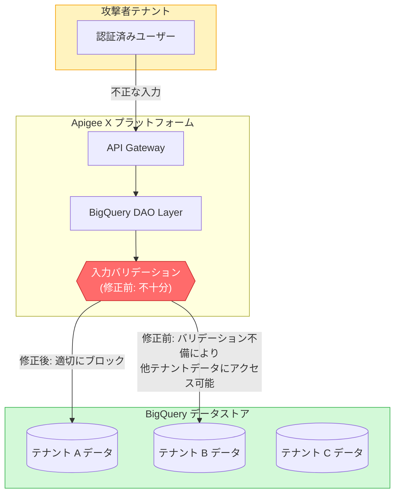

# Apigee X: BigQuery DAO 入力バリデーション脆弱性 (CVE-2026-12879)

**リリース日**: 2026-07-08

**サービス**: Apigee X

**機能**: セキュリティ修正 - BigQuery DAO クロステナントデータ漏洩

**ステータス**: 修正済み (2026年6月12日パッチ適用完了)

[このアップデートのインフォグラフィックを見る](https://takech9203.github.io/google-cloud-news-summary/20260708-apigee-x-security-cve-2026-12879.html)

## 概要

Google Cloud Apigee X の BigQuery Data Access Object (DAO) コンポーネントにおいて、不適切な入力バリデーション (Improper Input Validation) の脆弱性 (CVE-2026-12879) が発見された。この脆弱性により、認証済みの攻撃者がクロステナントのデータを窃取できる可能性があった。

この脆弱性は 2026年6月12日に Apigee サーバー側でパッチが適用され、修正が完了している。顧客側でのアクションは不要であり、Apigee hybrid は影響を受けない。

Apigee X はマルチテナントアーキテクチャを採用しており、BigQuery を内部的にアナリティクスデータの保存・処理に使用している。BigQuery DAO レイヤーにおける入力バリデーションの不備により、テナント間のデータ分離境界が適切に機能しないケースが存在した。

**アップデート前の課題**

- BigQuery DAO コンポーネントにおいて、入力パラメータのバリデーションが不十分であった
- 認証済み攻撃者が不正な入力を利用してテナント境界を越えたデータアクセスが可能であった
- クロステナントデータの漏洩リスクが存在した

**アップデート後の改善**

- BigQuery DAO の入力バリデーションが強化され、不正な入力によるテナント境界の突破が防止された
- サーバー側でのパッチ適用により、すべての Apigee X インスタンスが自動的に保護された
- 顧客側でのアクションは一切不要

## アーキテクチャ図

この図は、攻撃者が認証済みユーザーとして BigQuery DAO レイヤーの入力バリデーション不備を悪用し、他テナントのデータにアクセス可能であった脆弱性の構造を示している。修正後は入力バリデーションが強化され、テナント境界が適切に維持される。

## サービスアップデートの詳細

### 脆弱性の詳細

1. **脆弱性の種類: 不適切な入力バリデーション (CWE-20)**
   - BigQuery DAO コンポーネントに入力値の検証が不十分な箇所が存在
   - 攻撃者が細工した入力により、本来アクセスできないテナントのデータを参照可能

2. **影響範囲**
   - 影響を受けるバージョン: 2026年6月12日以前の Google Cloud Apigee バージョン
   - 影響を受けないプロダクト: Apigee hybrid
   - プラットフォーム: Google Cloud Platform 上の Apigee X

3. **攻撃条件**
   - 攻撃者は認証済みである必要がある (未認証からの攻撃は不可)
   - Google Cloud Platform 上の Apigee X 環境に対して実行

### 修正内容

1. **サーバー側パッチ適用**
   - 2026年6月12日に Apigee サーバー側でパッチが適用済み
   - すべての Apigee X インスタンスに対して自動適用
   - 顧客側でのアクションは不要

## 技術仕様

### 脆弱性情報

| 項目 | 詳細 |
|------|------|
| CVE ID | CVE-2026-12879 |
| 脆弱性タイプ | Improper Input Validation (CWE-20) |
| 影響コンポーネント | BigQuery DAO |
| 攻撃前提条件 | 認証済みアクセスが必要 |
| 影響 | クロステナントデータの窃取 |
| パッチ適用日 | 2026年6月12日 |
| 影響を受ける製品 | Apigee X (2026-06-12 以前のバージョン) |
| 影響を受けない製品 | Apigee hybrid |

### Apigee X と BigQuery の連携

Apigee X はアナリティクスデータの保存と処理に BigQuery を内部的に使用している。BigQuery DAO (Data Access Object) はこのデータアクセスを抽象化するレイヤーであり、テナント間のデータ分離を確保する重要なコンポーネントである。

## メリット

### セキュリティ面

- **テナント分離の強化**: BigQuery DAO レイヤーにおける入力バリデーションが強化され、クロステナントアクセスのリスクが排除された
- **自動修正**: サーバー側パッチにより、すべての顧客が自動的に保護された
- **ゼロダウンタイム**: パッチ適用にサービス停止は不要であった

### 運用面

- **顧客アクション不要**: サーバー側修正のため、顧客側での設定変更やアップグレードは不要
- **Apigee hybrid への影響なし**: ハイブリッド環境を利用している顧客は本脆弱性の影響を受けない

## 関連サービス・機能

- **BigQuery**: Apigee X のアナリティクスデータの保存先として内部的に使用されており、BigQuery DAO レイヤーを通じてアクセスされる
- **Apigee Analytics**: API トラフィックのメトリクスやディメンションを収集・分析する機能。データは BigQuery に保存され、エクスポートも可能
- **Cloud IAM**: テナント間のアクセス制御を担うサービス。Apigee Service Agent サービスアカウントを通じて BigQuery へのアクセスが管理される

## 参考リンク

- [このアップデートのインフォグラフィック](https://takech9203.github.io/google-cloud-news-summary/20260708-apigee-x-security-cve-2026-12879.html)
- [CVE-2026-12879](http://cve.org/CVERecord?id=CVE-2026-12879)
- [Apigee セキュリティ情報](https://cloud.google.com/apigee/docs/security-bulletins)
- [Apigee X ドキュメント](https://cloud.google.com/apigee/docs)
- [Apigee Analytics データエクスポート](https://cloud.google.com/apigee/docs/api-platform/analytics/export-data)

## まとめ

Apigee X の BigQuery DAO における不適切な入力バリデーション脆弱性 (CVE-2026-12879) は、認証済み攻撃者によるクロステナントデータ漏洩を可能にする深刻な問題であったが、2026年6月12日にサーバー側で修正済みである。顧客側でのアクションは不要であり、Apigee hybrid は影響を受けない。Apigee X を利用している組織は、セキュリティ監査や社内セキュリティレポートにおいて本 CVE の修正済みステータスを記録しておくことを推奨する。

---

**タグ**: #Apigee #Security #CVE #BigQuery #InputValidation #CrossTenant #DataExfiltration
