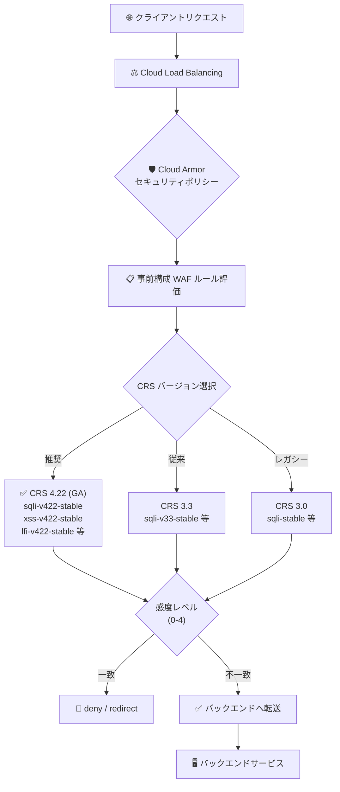

# Google Cloud Armor: 事前構成 WAF ルールの ModSecurity Core Rule Set (CRS) 4.22 サポートが GA

**リリース日**: 2026-07-08

**サービス**: Google Cloud Armor

**機能**: 事前構成ルールが ModSecurity Core Rule Set (CRS) 4.22 をルールソースとして正式サポート (GA)

**ステータス**: GA (Generally Available)

📊 [このアップデートのインフォグラフィックを見る](https://takech9203.github.io/google-cloud-news-summary/20260708-cloud-armor-modsecurity-crs-4-22.html)

## 概要

Google Cloud Armor の事前構成 WAF (Web Application Firewall) ルールにおける ModSecurity Core Rule Set (CRS) 4.22 サポートが、Generally Available (GA) として正式リリースされました。2026 年 4 月に Preview として導入されたこの機能が、本番環境での利用に適した安定版として提供されます。

CRS 4.22 は OWASP ModSecurity Core Rule Set プロジェクトの最新バージョンであり、SQL インジェクション、クロスサイトスクリプティング (XSS)、ローカルファイルインクルージョン (LFI)、リモートコード実行 (RCE) など、主要な Web 攻撃カテゴリに対する検出シグネチャが大幅に改善されています。GA 昇格により、SLA の適用、本番ワークロードでの正式利用、エンタープライズサポートの対象となります。

セキュリティエンジニア、クラウドインフラ管理者、コンプライアンス要件を満たす必要がある組織が主な対象ユーザーです。Google は CRS 3.3 および 3.0 のサポートを継続しつつも、最新の脅威に対する最も包括的な保護のために CRS 4.22 の利用を推奨しています。

**アップデート前の課題**

- CRS 4.22 は Preview 段階であったため、本番環境での利用には SLA が適用されず、プロダクション利用に慎重な判断が必要だった
- CRS 3.x 系 (3.0 / 3.3) のみが GA として利用可能であり、最新の攻撃パターンへの対応に限界があった
- Preview 版では機能の変更・削除の可能性があり、長期運用を前提としたセキュリティポリシー設計が困難だった

**アップデート後の改善**

- CRS 4.22 が GA となり、SLA に基づいた本番環境での利用が可能になった
- 最新の攻撃ベクターに対応した検出シグネチャを安定した環境で活用できるようになった
- CRS 4.22 の全ルールセット (SQL インジェクション、XSS、LFI、RFI、RCE、プロトコル攻撃等) が安定版として利用可能になった

## アーキテクチャ図



Cloud Armor のセキュリティポリシーにおいて、CRS 4.22 ベースの事前構成 WAF ルールがリクエスト評価パイプラインで使用される流れを示しています。感度レベル (sensitivity) の設定により、検出の厳密さを制御できます。

## サービスアップデートの詳細

### 主要機能

1. **CRS 4.22 対応ルールセット (GA)**
   - SQL インジェクション (`sqli-v422-stable`)
   - クロスサイトスクリプティング (`xss-v422-stable`)
   - ローカルファイルインクルージョン (`lfi-v422-stable`)
   - リモートファイルインクルージョン (`rfi-v422-stable`)
   - リモートコード実行 (`rce-v422-stable`)
   - メソッドエンフォースメント (`methodenforcement-v422-stable`)
   - スキャナー検出 (`scannerdetection-v422-stable`)
   - プロトコル攻撃 (`protocolattack-v422-stable`)
   - PHP インジェクション (`php-v422-stable`)
   - セッション固定攻撃 (`sessionfixation-v422-stable`)
   - Java 攻撃 (`java-v422-stable`)
   - 汎用攻撃 (`generic-v422-stable`)

2. **Canary / Stable デプロイモデル**
   - 各ルールセットに `canary` (最新) と `stable` (安定) の2バリアントを提供
   - Canary ルールをプレビューモードで先行検証し、安定を確認後に Stable ルールを本番適用する運用が推奨される

3. **感度レベルによるチューニング**
   - 感度レベル 0〜4 で検出の厳密さを制御
   - レベル 0: ルール無効 (opt-in のみ)
   - レベル 1: 高信頼度シグネチャのみ (誤検知最小)
   - レベル 4: 全シグネチャ有効 (最大カバレッジ、デフォルト)

4. **シグネチャの opt-in / opt-out 制御**
   - `opt_out_rule_ids`: 特定シグネチャを無効化
   - `opt_in_rule_ids`: 感度レベル 0 で特定シグネチャのみ有効化
   - リクエストフィールド除外 (ヘッダー、Cookie、クエリパラメータ、URI) による誤検知回避

## 技術仕様

### CRS 4.22 ルールセット一覧

| Cloud Armor ルール名 | 攻撃カテゴリ | ID プレフィックス |
|------|------|------|
| sqli-v422-stable | SQL インジェクション | owasp-crs-v042200-id942xxx |
| xss-v422-stable | クロスサイトスクリプティング | owasp-crs-v042200-id941xxx |
| lfi-v422-stable | ローカルファイルインクルージョン | owasp-crs-v042200-id930xxx |
| rfi-v422-stable | リモートファイルインクルージョン | owasp-crs-v042200-id931xxx |
| rce-v422-stable | リモートコード実行 | owasp-crs-v042200-id932xxx |
| protocolattack-v422-stable | プロトコル攻撃 | owasp-crs-v042200-id921xxx |
| php-v422-stable | PHP インジェクション | owasp-crs-v042200-id933xxx |
| java-v422-stable | Java 攻撃 | owasp-crs-v042200-id944xxx |
| generic-v422-stable | 汎用攻撃 | owasp-crs-v042200-id934xxx |

### CRS バージョン比較

| 項目 | CRS 3.0 | CRS 3.3 | CRS 4.22 (GA) |
|------|---------|---------|---------------|
| ステータス | GA (レガシー) | GA | GA |
| 推奨度 | 非推奨 | 継続サポート | 推奨 |
| NodeJS ルール | 非対応 | nodejs-v33-stable | generic-v422-stable に統合 |
| シグネチャ ID 形式 | owasp-crs-v030001-id... | owasp-crs-v030301-id... | owasp-crs-v042200-id... |
| リクエストボディ検査 | 最大 64 kB | 最大 64 kB | 最大 64 kB |

## 設定方法

### 前提条件

1. Cloud Armor セキュリティポリシーが作成済みであること
2. セキュリティポリシーがロードバランサーのバックエンドサービスにアタッチされていること

### 手順

#### ステップ 1: CRS 4.22 ルールを使用したセキュリティポリシールールの作成

```bash
# SQL インジェクション対策ルールの作成 (感度レベル 3)
gcloud compute security-policies rules create 1000 \
  --security-policy POLICY_NAME \
  --expression "evaluatePreconfiguredWaf('sqli-v422-stable', {'sensitivity': 3})" \
  --action deny-403
```

感度レベル 3 は、レベル 1〜3 のシグネチャを有効にし、高い検出率と低い誤検知率のバランスを取ります。

#### ステップ 2: 複数の攻撃カテゴリに対するルール追加

```bash
# XSS 対策ルール
gcloud compute security-policies rules create 2000 \
  --security-policy POLICY_NAME \
  --expression "evaluatePreconfiguredWaf('xss-v422-stable', {'sensitivity': 2})" \
  --action deny-403

# RCE 対策ルール
gcloud compute security-policies rules create 3000 \
  --security-policy POLICY_NAME \
  --expression "evaluatePreconfiguredWaf('rce-v422-stable', {'sensitivity': 2})" \
  --action deny-403
```

#### ステップ 3: 特定シグネチャの除外 (チューニング)

```bash
# 誤検知を引き起こすシグネチャを除外
gcloud compute security-policies rules create 1000 \
  --security-policy POLICY_NAME \
  --expression "evaluatePreconfiguredWaf('sqli-v422-stable', {'sensitivity': 4, 'opt_out_rule_ids': ['owasp-crs-v042200-id942350-sqli', 'owasp-crs-v042200-id942360-sqli']})" \
  --action deny-403
```

#### ステップ 4: リクエストフィールド除外の設定

```bash
# 特定の Cookie をインスペクション対象から除外
gcloud compute security-policies rules add-preconfig-waf-exclusion PRIORITY \
  --security-policy POLICY_NAME \
  --target-rule-set "sqli-v422-stable" \
  --request-cookie-to-exclude "op=EQUALS_ANY"
```

## メリット

### ビジネス面

- **コンプライアンス強化**: 最新の OWASP ルールセットの GA 利用により、PCI DSS や SOC 2 などのセキュリティ監査要件への対応が容易になる
- **運用コスト削減**: CRS 4.22 の改善された検出ロジックにより誤検知が減少し、WAF ルールのチューニング工数が削減される
- **SLA による信頼性保証**: GA ステータスにより Google Cloud の SLA が適用され、ミッションクリティカルなワークロードでの利用に適する

### 技術面

- **最新脅威への対応**: CRS 4.22 の最新シグネチャにより、新しい攻撃パターンや CVE に対する検出カバレッジが向上
- **柔軟なルール制御**: opt-in / opt-out、感度レベル、リクエストフィールド除外を組み合わせた精密なチューニングが可能
- **Canary デプロイ**: canary ルールセットでの事前検証により、ルール更新時のリスクを最小化

## デメリット・制約事項

### 制限事項

- リクエストボディの検査は最大 64 kB (8 kB / 16 kB / 32 kB / 48 kB / 64 kB から設定可能) に限定される
- 階層型セキュリティポリシーを継承している場合、そのルールのチューニングは不可
- チューニング除外の上限はターゲットあたり 100 件 (ヘッダー、Cookie、クエリパラメータ、URI それぞれ)

### 考慮すべき点

- CRS 3.x から 4.22 への移行時、シグネチャ ID 形式が変更されているため、既存の opt-out 設定は再構成が必要
- CRS 3.3 の NodeJS ルールセットは CRS 4.22 では generic ルールセットに統合されている (ID プレフィックス 934 は共通)
- 感度レベル 4 (デフォルト) では誤検知のリスクが高まるため、段階的な導入が推奨される

## ユースケース

### ユースケース 1: CRS 3.x からの移行

**シナリオ**: 既存の Cloud Armor セキュリティポリシーで CRS 3.3 を使用しているが、最新の攻撃パターンへの対応を強化したい。

**実装例**:
```bash
# 1. CRS 4.22 canary ルールをプレビューモードで追加
gcloud compute security-policies rules create 500 \
  --security-policy my-policy \
  --expression "evaluatePreconfiguredWaf('sqli-v422-canary', {'sensitivity': 3})" \
  --action deny-403 \
  --preview

# 2. ログを確認して誤検知がないことを検証後、stable ルールを有効化
gcloud compute security-policies rules create 1000 \
  --security-policy my-policy \
  --expression "evaluatePreconfiguredWaf('sqli-v422-stable', {'sensitivity': 3})" \
  --action deny-403

# 3. 旧 CRS 3.3 ルールを削除
gcloud compute security-policies rules delete 1000 \
  --security-policy my-policy
```

**効果**: 最新のシグネチャによる検出精度の向上と、段階的な移行によるリスクの最小化。

### ユースケース 2: OWASP Top 10 対策の包括的な実装

**シナリオ**: 新規 Web アプリケーションのデプロイにあたり、OWASP Top 10 に準拠した包括的な WAF 保護を構成する。

**実装例**:
```bash
# SQL インジェクション
gcloud compute security-policies rules create 1000 \
  --security-policy my-policy \
  --expression "evaluatePreconfiguredWaf('sqli-v422-stable', {'sensitivity': 2})" \
  --action deny-403

# XSS
gcloud compute security-policies rules create 2000 \
  --security-policy my-policy \
  --expression "evaluatePreconfiguredWaf('xss-v422-stable', {'sensitivity': 2})" \
  --action deny-403

# RCE + LFI + RFI
gcloud compute security-policies rules create 3000 \
  --security-policy my-policy \
  --expression "evaluatePreconfiguredWaf('rce-v422-stable', {'sensitivity': 2})" \
  --action deny-403

gcloud compute security-policies rules create 4000 \
  --security-policy my-policy \
  --expression "evaluatePreconfiguredWaf('lfi-v422-stable', {'sensitivity': 2})" \
  --action deny-403
```

**効果**: CRS 4.22 GA の全ルールセットを活用した包括的な Web アプリケーション保護の実現。

## 料金

Cloud Armor の WAF ルール利用料金は、利用するサービスティアによって異なります。

| ティア | WAF 料金 |
|--------|----------|
| Cloud Armor Standard | ポリシーごと、ルールごと、リクエストごとの従量課金 |
| Cloud Armor Enterprise Paygo | WAF 利用料込み ($200/月/プロジェクト + $200/月/保護リソース) |
| Cloud Armor Enterprise Annual | WAF 利用料込み ($3,000/月/請求アカウント + $30/月/保護リソース) |

CRS 4.22 の利用自体に追加料金は発生しません。既存の Cloud Armor 料金体系内で利用可能です。

詳細は [Cloud Armor 料金ページ](https://cloud.google.com/armor/pricing) を参照してください。

## 関連サービス・機能

- **Cloud Load Balancing**: Cloud Armor セキュリティポリシーの適用対象となるロードバランサー (グローバル/リージョナル外部アプリケーションロードバランサー、外部プロキシネットワークロードバランサー等)
- **Cloud Logging**: WAF ルールの評価結果やブロックされたリクエストのログを記録・分析
- **Adaptive Protection**: 機械学習ベースの Layer 7 DDoS 保護 (Cloud Armor Enterprise で利用可能)
- **Google Threat Intelligence**: 脅威インテリジェンスに基づく名前付き IP アドレスリスト (Cloud Armor Enterprise で利用可能)
- **Cloud CDN / Media CDN**: Cloud Armor と統合した CDN レイヤーでのセキュリティ保護

## 参考リンク

- 📊 [インフォグラフィック](https://takech9203.github.io/google-cloud-news-summary/20260708-cloud-armor-modsecurity-crs-4-22.html)
- [公式リリースノート](https://cloud.google.com/release-notes#July_08_2026)
- [Tuning Google Cloud Armor WAF rules](https://cloud.google.com/armor/docs/rule-tuning)
- [Cloud Armor 事前構成 WAF ルール一覧](https://cloud.google.com/armor/docs/waf-rules)
- [WAF ルールの設定](https://cloud.google.com/armor/docs/configure-waf)
- [ModSecurity Core Rule Set v4.22.0 リリース](https://github.com/coreruleset/coreruleset/releases/tag/v4.22.0)
- [Cloud Armor 料金](https://cloud.google.com/armor/pricing)

## まとめ

Google Cloud Armor の事前構成 WAF ルールにおける ModSecurity CRS 4.22 サポートが GA となり、最新の OWASP ルールセットを本番環境で安心して利用できるようになりました。CRS 3.x からの移行を検討している組織は、canary ルールセットをプレビューモードで検証した上で、段階的に CRS 4.22 stable ルールへ移行することを推奨します。

---

**タグ**: #GoogleCloudArmor #WAF #ModSecurity #CRS #OWASP #セキュリティ #GA #WebApplicationFirewall
