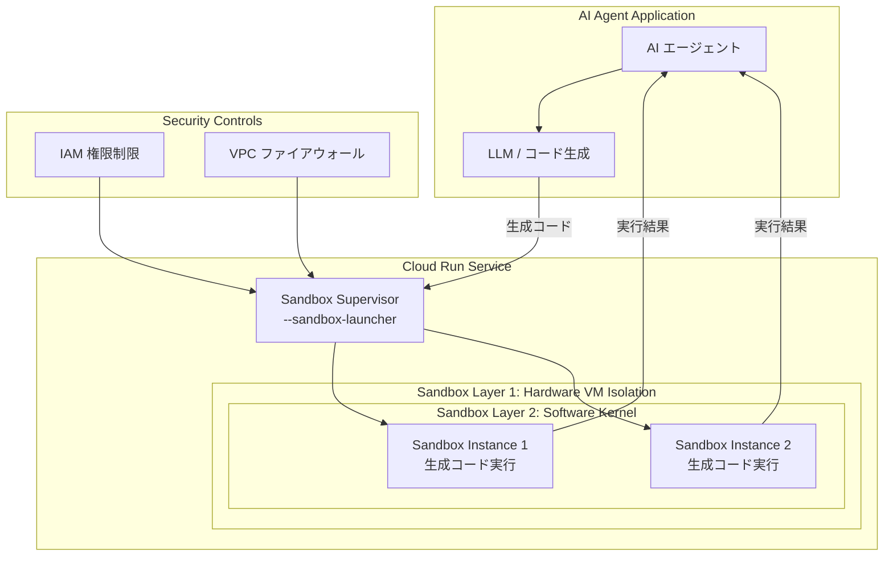

# Cloud Run: Sandboxes によるコード実行環境

**リリース日**: 2026-07-08

**サービス**: Cloud Run

**機能**: Sandboxes (サンドボックスによるセキュアなコード実行環境)

**ステータス**: Preview

📊 [このアップデートのインフォグラフィックを見る](https://takech9203.github.io/google-cloud-news-summary/20260708-cloud-run-sandboxes.html)

## 概要

Cloud Run に新たに「Sandboxes」機能が Preview として追加されました。この機能は、AI エージェントが生成した信頼できないコードを高速かつセキュアに隔離実行するための環境を提供します。LLM (大規模言語モデル) が動的に生成するコードを安全に実行する必要があるユースケースに特化しており、AI エージェント開発者にとって重要な機能となります。

Cloud Run の既存の二層サンドボックス技術 (ハードウェアベースの x86 仮想化レイヤーとソフトウェアカーネルレイヤー) を活用し、各インスタンスを他のインスタンスから強力に分離します。これにより、信頼できないコードの実行時に、ホストシステムや他のワークロードへの影響を防ぎつつ、高速なプロビジョニングを実現します。

対象ユーザーは主に AI エージェントを構築するデベロッパーで、コード生成・実行を伴う AI アプリケーション、自動化ワークフロー、インタラクティブな開発環境などを Cloud Run 上で安全に運用したい組織に最適です。

**アップデート前の課題**

- AI エージェントが生成したコードを実行する際、セキュリティリスクを適切に管理するために独自のサンドボックス環境を構築・運用する必要があった
- コンテナベースの分離だけでは信頼できないコードの実行に対するセキュリティ保証が不十分で、追加のセキュリティ対策が必要だった
- コード実行環境のプロビジョニングに時間がかかり、リアルタイムの AI エージェントワークフローにおいてレイテンシが課題となっていた

**アップデート後の改善**

- Cloud Run のマネージドなサンドボックス機能により、追加のインフラ構築なしで信頼できないコードを安全に実行可能になった
- ハードウェアレベルとソフトウェアカーネルレベルの二層分離により、強力なセキュリティ保証が標準で提供されるようになった
- 高速なサンドボックスプロビジョニングにより、AI エージェントのコード実行ワークフローを低レイテンシで処理できるようになった

## アーキテクチャ図



Cloud Run Sandboxes は二層のサンドボックス技術によりコードを隔離します。AI エージェントが生成したコードは Sandbox Supervisor を経由してセキュアな環境内で実行され、IAM 権限と VPC ファイアウォールによる追加のセキュリティ制御が適用されます。

## サービスアップデートの詳細

### 主要機能

1. **二層サンドボックスによるセキュア隔離**
   - ハードウェアベースの分離: 個別の VM に相当する x86 仮想化レイヤー
   - ソフトウェアカーネルレイヤー: gVisor (第1世代) または Linux microVM (第2世代) による追加の分離
   - 各インスタンスが他のすべてのインスタンスから保護される

2. **コード実行モード**
   - 同期実行: Cloud Run サービスとしてデプロイし、リクエスト/レスポンス形式で即座に結果を返却 (最大タイムアウト 1 時間)
   - 非同期実行: Cloud Run ジョブとして長時間実行タスクやバックグラウンド処理を実行
   - コンカレンシーを 1 に設定することで、インスタンスごとに 1 リクエストずつ処理可能

3. **Sandbox Launcher フラグ**
   - `--sandbox-launcher` フラグによりコンテナをサンドボックススーパーバイザーとして設定
   - サンドボックスの起動・管理を制御するコンテナを指定可能
   - `--no-sandbox-launcher` で無効化

## 技術仕様

### 実行環境

| 項目 | 第1世代 (gen1) | 第2世代 (gen2) |
|------|----------------|----------------|
| サンドボックス技術 | gVisor | Linux microVM |
| システムコール | エミュレーション (一部非対応) | 完全な Linux 互換 |
| コールドスタート | 高速 | やや遅い |
| CPU パフォーマンス | 標準 | 高速 |
| ネットワーク性能 | 標準 | 高速 |
| NFS サポート | なし | あり |
| 最小メモリ | 制限なし | 512 MiB |

### セキュリティ制御

| 項目 | 詳細 |
|------|------|
| インスタンス分離 | VMM (Virtual Machine Monitor) によるインスタンス間境界 |
| 追加セキュリティ | seccomp (Secure Computing Mode) システムコールフィルタリング |
| IAM 制御 | サービスアカウントの権限を最小限に制限推奨 |
| ネットワーク制御 | VPC ファイアウォールルールによるインターネットアクセス制限 |
| ファイルディスクリプタ上限 | 25,000 (ハードリミット) |

## 設定方法

### 前提条件

1. Google Cloud プロジェクトが作成済みであること
2. Cloud Run API が有効化されていること
3. gcloud CLI がインストール・設定済みであること

### 手順

#### ステップ 1: サンドボックスランチャーを有効にしたサービスのデプロイ

```bash
gcloud beta run deploy SERVICE_NAME \
  --image=IMAGE_URL \
  --sandbox-launcher \
  --execution-environment=gen2 \
  --concurrency=1 \
  --region=REGION
```

`--sandbox-launcher` フラグにより、コンテナがサンドボックススーパーバイザーとして設定されます。コンカレンシーを 1 に設定することで、各インスタンスが一度に 1 つのコード実行リクエストを処理します。

#### ステップ 2: IAM 権限の制限

```bash
# サービスアカウントの権限を最小限に設定
gcloud run services update SERVICE_NAME \
  --service-account=SANDBOX_SERVICE_ACCOUNT@PROJECT_ID.iam.gserviceaccount.com \
  --region=REGION
```

信頼できないコードを実行するサービスには、必要最小限の IAM 権限のみを付与してください。

#### ステップ 3: VPC ファイアウォールルールの設定

```bash
# サンドボックスからのインターネットアクセスを制限
gcloud compute firewall-rules create deny-sandbox-egress \
  --direction=EGRESS \
  --priority=1000 \
  --network=VPC_NETWORK \
  --action=DENY \
  --rules=all \
  --target-service-accounts=SANDBOX_SERVICE_ACCOUNT@PROJECT_ID.iam.gserviceaccount.com
```

VPC ファイアウォールルールを使用して、サンドボックス内のコードがインターネットに接続することを防止します。

## メリット

### ビジネス面

- **AI エージェント開発の加速**: マネージドなサンドボックス環境により、セキュアなコード実行基盤の構築にかかる開発工数を大幅に削減
- **セキュリティコンプライアンスの簡素化**: Google Cloud が提供するハードウェアレベルの分離により、信頼できないコード実行に関するセキュリティ要件を容易に満たすことが可能
- **運用コストの削減**: インフラストラクチャの管理が不要なサーバーレス実行により、運用負荷を最小化

### 技術面

- **二層分離の堅牢性**: x86 仮想化 + カーネルレベルの分離により、コンテナエスケープのリスクを大幅に低減
- **柔軟な実行モード**: 同期・非同期の両方に対応し、ユースケースに応じた最適な実行方式を選択可能
- **任意言語対応**: コンテナベースの実行環境のため、任意のプログラミング言語でコードを実行可能

## デメリット・制約事項

### 制限事項

- 現在 Preview ステータスのため、本番環境での利用には SLA が適用されない可能性がある
- 第1世代実行環境では一部のシステムコールが非対応 (gVisor の制約)
- ファイルディスクリプタのハードリミットが 25,000 に制限される
- Cloud Run インスタンスはステートレスであり、実行結果の永続化には外部ストレージが必要

### 考慮すべき点

- 信頼できないコードの実行時は、IAM 権限の最小化と VPC ファイアウォールの設定が必須
- コールドスタートのレイテンシが AI エージェントのリアルタイム性に影響する可能性がある (最小インスタンス数の設定で緩和可能)
- コンカレンシー 1 設定時は、同時リクエスト増加に伴いインスタンス数が増加し、コストに影響する

## ユースケース

### ユースケース 1: AI コードレビューエージェント

**シナリオ**: AI エージェントが Pull Request のコードを解析し、修正提案のコードを生成して実際にテスト実行する。

**実装例**:
```python
# AI エージェントからのコード実行リクエスト
import requests

def execute_generated_code(code: str) -> dict:
    response = requests.post(
        "https://sandbox-service-xxx.run.app/execute",
        json={
            "code": code,
            "language": "python",
            "timeout": 30
        }
    )
    return response.json()
```

**効果**: 生成されたコードの動作検証をセキュアに実行し、コードレビューの品質と信頼性を向上。

### ユースケース 2: インタラクティブなデータ分析エージェント

**シナリオ**: ユーザーの自然言語クエリに基づき、AI がデータ分析コード (Python/SQL) を生成し、サンドボックス内で実行して結果を返却する。

**効果**: ユーザーが直接コードを書くことなく、安全な環境でデータ分析を実行可能。悪意あるコードの混入リスクを排除。

### ユースケース 3: 教育・学習プラットフォーム

**シナリオ**: オンライン学習プラットフォームで、受講者が提出したコードをサンドボックス内で実行し、自動採点を行う。

**効果**: 受講者のコードによるシステムへの影響を完全に防止しつつ、リアルタイムのフィードバックを提供。

## 料金

Cloud Run Sandboxes の料金は、標準の Cloud Run 料金体系に準拠します。サンドボックス機能自体に追加料金は発生しません。

| リソース | 料金 |
|----------|------|
| vCPU | Cloud Run 標準料金に準拠 |
| メモリ | Cloud Run 標準料金に準拠 |
| リクエスト | Cloud Run 標準料金に準拠 |
| サンドボックス機能 | 追加料金なし |

注: Preview 期間中の料金体系は変更される可能性があります。最新の情報は [Cloud Run 料金ページ](https://cloud.google.com/run/pricing) を参照してください。Compute flexible CUD (確約利用割引) の適用も可能です。

## 利用可能リージョン

Cloud Run が利用可能なすべてのリージョンで利用可能と想定されますが、Preview 期間中はリージョンが限定される可能性があります。最新のリージョン対応状況は公式ドキュメントを参照してください。

## 関連サービス・機能

- **Cloud Run Jobs**: 非同期のコード実行に使用。長時間実行タスクやバックグラウンド処理に最適
- **VPC Service Controls**: サンドボックスのネットワーク分離を強化するために使用
- **IAM (Identity and Access Management)**: サンドボックスサービスの権限を最小限に制御
- **Cloud Run Threat Detection**: サンドボックス内の不審な実行を検知・監視
- **Secret Manager**: サンドボックスが必要とする認証情報の安全な管理
- **GKE Agent Sandbox**: Kubernetes 環境で同様のサンドボックス機能を提供 (より細かいカスタマイズが必要な場合)

## 参考リンク

- 📊 [インフォグラフィック](https://takech9203.github.io/google-cloud-news-summary/20260708-cloud-run-sandboxes.html)
- [公式リリースノート](https://docs.google.com/release-notes#July_08_2026)
- [Configure sandboxes for services](https://docs.cloud.google.com/run/docs/configuring/services/sandboxes)
- [Code execution in Cloud Run](https://docs.cloud.google.com/run/docs/code-execution)
- [Cloud Run セキュリティ設計概要](https://docs.cloud.google.com/run/docs/securing/security)
- [Cloud Run 料金ページ](https://cloud.google.com/run/pricing)

## まとめ

Cloud Run Sandboxes は、AI エージェントが生成する信頼できないコードを安全かつ高速に実行するためのマネージド環境を提供する重要なアップデートです。二層サンドボックスによる強力なセキュリティ分離と、サーバーレスの運用簡素性を両立しており、AI エージェント開発の生産性とセキュリティを同時に向上させます。現在 Preview 段階であるため、本番適用前に制約事項を確認し、GA リリースに備えて評価・検証を開始することを推奨します。

---

**タグ**: #CloudRun #Sandbox #AIAgent #コード実行 #セキュリティ #サーバーレス #Preview #gVisor #LLM
