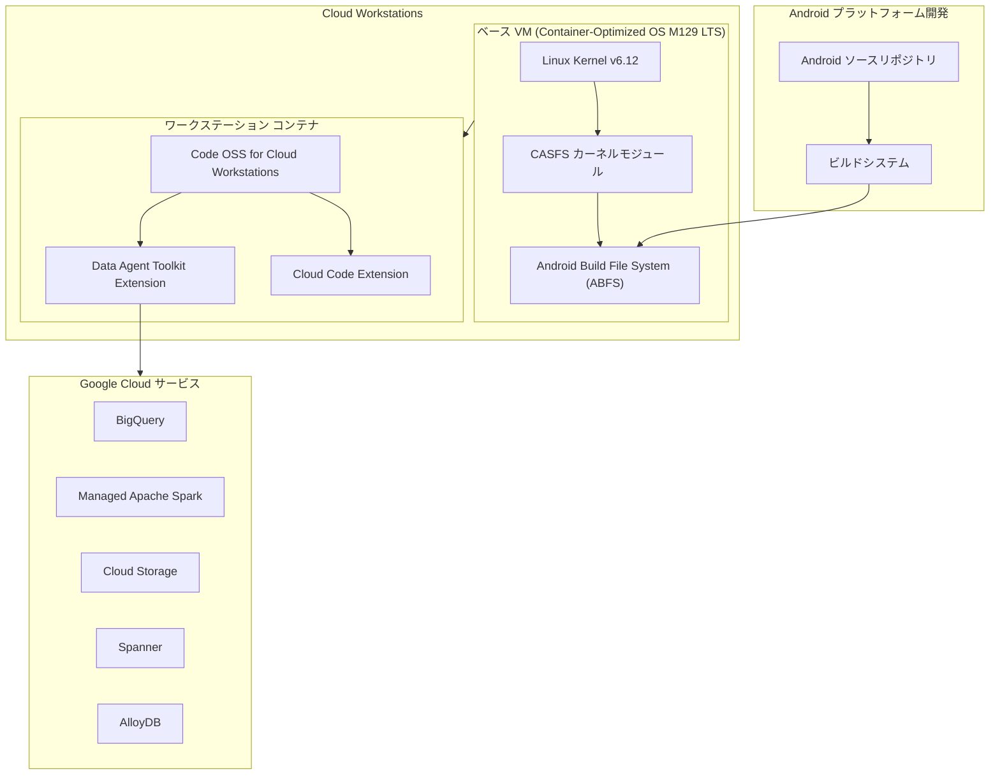

# Cloud Workstations: CASFS カーネルモジュール追加と Data Agent Toolkit Extension のデフォルトインストール

**リリース日**: 2026-07-08

**サービス**: Cloud Workstations

**機能**: CASFS (Content-Addressable Storage File System) カーネルモジュールの追加、Data Agent Toolkit Extension のデフォルトインストール

**ステータス**: GA (CASFS) / Preview (Data Agent Toolkit Extension)

📊 [このアップデートのインフォグラフィックを見る](https://takech9203.github.io/google-cloud-news-summary/20260708-cloud-workstations-casfs-data-agent-toolkit.html)

## 概要

Cloud Workstations に対して 2 つの重要なアップデートが発表された。第一に、ワークステーションのベース VM に Content-Addressable Storage File System (CASFS) カーネルモジュールが組み込まれ、Android Build File System (ABFS) が利用可能になった。これは Container-Optimized OS Milestone 129 LTS のアップデートに関連するもので、Android プラットフォーム開発者がクラウドベースのワークステーション上で効率的にビルド作業を行えるようになる。

第二に、Google Cloud Data Agent Kit Extension が Code OSS for Cloud Workstations にデフォルトでインストールされるようになった。これにより、データサイエンティスト、データエンジニア、データアプリケーション開発者は、追加の設定なしに IDE 上から直接 BigQuery、Dataflow、Apache Spark、Cloud Storage などの Google Cloud データサービスにアクセスし、データワークロードのライフサイクル全体を管理できるようになる。

**アップデート前の課題**

- CASFS/ABFS を利用するには、カーネルモジュールを手動でビルド・インストールする必要があり、Android プラットフォーム開発のセットアップが複雑だった
- Cloud Workstations 上で Android ビルドを実行する際、コンテンツアドレス方式のファイルシステムが利用できず、大規模リポジトリのビルド効率に制約があった
- Data Agent Toolkit Extension を利用するには、開発者が手動でマーケットプレイスから検索・インストールする必要があった
- データワークフロー (BigQuery クエリ、Spark パイプライン構築など) のために Google Cloud コンソールや CLI との間で頻繁なコンテキストスイッチが発生していた

**アップデート後の改善**

- ベース VM に CASFS カーネルモジュールが標準搭載され、ワークステーション起動時から ABFS が即座に利用可能になった
- Android ビルドシステムがコンテンツアドレス方式でファイルを効率的に管理でき、大規模コードベースのビルドパフォーマンスが向上した
- Data Agent Toolkit Extension がデフォルトインストールされ、初回起動からデータサービスとの統合環境が利用可能になった
- IDE 上から自然言語でデータを探索・分析でき、エージェント型の自動化スキルを活用した開発ワークフローが実現された

## アーキテクチャ図



CASFS カーネルモジュールはベース VM レイヤーで動作し Android ビルドワークフローを支え、Data Agent Toolkit Extension はコンテナ内の Code OSS で動作し Google Cloud データサービスとの統合を提供する。

## サービスアップデートの詳細

### 主要機能

1. **CASFS (Content-Addressable Storage File System) カーネルモジュール**
   - ベース VM の Linux カーネルにモジュールとして組み込まれ、Android Build File System (ABFS) を有効化
   - Container-Optimized OS Milestone 129 LTS (2026 年 2 月 20 日リリース) で最初に導入されたカーネルモジュール
   - コンテンツアドレス方式によりファイルをハッシュベースで管理し、重複排除と効率的なキャッシュを実現
   - 大規模な Android ソースツリーのビルド・同期処理を最適化

2. **Data Agent Toolkit Extension のデフォルトインストール**
   - Code OSS for Cloud Workstations の全てのベースイメージにプリインストール
   - データサイエンティスト・データエンジニア向けの統合開発環境を即座に提供
   - 自然言語によるデータ探索・分析、パイプライン開発、ML モデルのトレーニング・デプロイに対応
   - エージェント型 AI スキルによるタスク自動化機能を搭載

3. **Data Agent Toolkit Extension の主要機能**
   - データ探索: BigQuery、Spanner、AlloyDB、Cloud SQL のデータを IDE 上で直接クエリ・分析
   - パイプライン開発: Managed Service for Apache Spark または BigQuery 上でのデータパイプラインの構築・テスト・デプロイ
   - AI/ML: データの前処理から ML モデルのトレーニング・デプロイまでのワークフロー
   - エージェントスキル: 定型作業の自動化と開発アクセラレーション

## 技術仕様

### CASFS カーネルモジュール

| 項目 | 詳細 |
|------|------|
| モジュール名 | CASFS (Content-Addressable Storage File System) |
| カーネルバージョン | Linux v6.12.67 以降 (COS M129) |
| 関連機能 | Android Build File System (ABFS) |
| 提供形態 | カーネルモジュール (自動ロード) |
| 初回リリース | Container-Optimized OS Milestone 129 (2026-02-03 dev, 2026-02-20 LTS) |
| CASFS バージョン | v0.1.2 以降 (M129 Beta 2026-03-17 時点) |

### Data Agent Toolkit Extension

| 項目 | 詳細 |
|------|------|
| 拡張機能名 | Google Cloud Data Agent Kit |
| ステータス | Preview |
| 対応 IDE | Code OSS for Cloud Workstations (VS Code 互換) |
| 対応サービス (Analytics) | BigQuery, Dataflow, Managed Service for Apache Spark, Apache Airflow, Knowledge Catalog |
| 対応サービス (DB) | AlloyDB, Cloud SQL for MySQL, Cloud SQL for PostgreSQL, Spanner |
| 対応サービス (Storage) | Cloud Storage |
| 認証方式 | gcloud CLI + Application Default Credentials (ADC) |

### 必要な IAM ロール (Data Agent Toolkit)

```
roles/bigquery.dataViewer
roles/bigquery.jobUser
roles/bigquery.metadataViewer
roles/bigquery.readSessionUser
roles/dataproc.editor
```

## 設定方法

### CASFS/ABFS の利用

#### 前提条件

1. Cloud Workstations の最新ベースイメージを使用していること
2. ワークステーション構成が Container-Optimized OS M129 LTS ベースの VM を使用していること

#### ステップ 1: ワークステーション構成の確認

```bash
# ワークステーション構成一覧を取得
gcloud workstations configs list \
  --cluster=CLUSTER_NAME \
  --region=REGION
```

最新のベースイメージを使用している場合、CASFS カーネルモジュールは自動的に利用可能になる。

#### ステップ 2: CASFS モジュールの確認

```bash
# ワークステーション内で CASFS モジュールの存在を確認
lsmod | grep casfs
```

ABFS は CASFS の上に構築されたファイルシステムレイヤーであり、Android ビルドツールから透過的に使用される。

### Data Agent Toolkit Extension の利用

#### 前提条件

1. Code OSS for Cloud Workstations を使用するワークステーション構成
2. Google Cloud プロジェクトで必要な API が有効化されていること
3. 必要な IAM ロールが付与されていること

#### ステップ 1: ワークステーションの起動

```bash
# Code OSS ベースのワークステーションを起動
gcloud workstations start WORKSTATION_NAME \
  --cluster=CLUSTER_NAME \
  --config=CONFIG_NAME \
  --region=REGION
```

Data Agent Toolkit Extension はデフォルトでインストール済みのため、追加作業は不要。

#### ステップ 2: Extension へのサインイン

ワークステーション起動後、アクティビティバーの Google Cloud Data Agent Kit アイコンをクリックし、Google Cloud アカウントでサインインする。

#### ステップ 3: 必要な API の有効化

```bash
# 必要な API を有効化
gcloud services enable \
  bigquery.googleapis.com \
  dataproc.googleapis.com \
  storage.googleapis.com \
  spanner.googleapis.com \
  alloydb.googleapis.com
```

## メリット

### ビジネス面

- **Android 開発のクラウド移行促進**: CASFS/ABFS のネイティブサポートにより、Android プラットフォーム開発チームがオンプレミスの高性能ワークステーションからクラウドベースの開発環境に移行しやすくなる
- **開発者オンボーディングの短縮**: Data Agent Toolkit がプリインストールされることで、新規開発者が初日からデータワークフローに参加できる
- **ライセンスコスト削減**: 個別のデータ分析ツールのライセンスが不要になり、IDE 内で統一的にデータ操作が可能になる

### 技術面

- **ビルドパフォーマンス向上**: CASFS のコンテンツアドレス方式により、Android ソースツリーの重複ファイルが効率的に管理され、ビルド時間が短縮される
- **統合開発体験**: Data Agent Toolkit により、BigQuery クエリ、Spark ジョブ実行、ML モデルデプロイがすべて IDE 上で完結する
- **AI アシスト開発**: エージェント型スキルによるコード生成・タスク自動化で開発生産性が向上する

## デメリット・制約事項

### 制限事項

- Data Agent Toolkit Extension は Preview ステータスであり、本番環境での使用には注意が必要
- Data Agent Toolkit からの AlloyDB/Cloud SQL 接続は IAM 認証のみ対応 (組み込み認証や Auth Proxy は非対応)
- Data Agent Toolkit のオーケストレーションパイプラインの自動デプロイは GitHub Actions のみ対応
- CASFS/ABFS の利用は Android ビルドシステムとの組み合わせが前提であり、汎用ファイルシステムとしての利用は想定されていない

### 考慮すべき点

- Data Agent Toolkit Extension がプリインストールされることで、コンテナイメージサイズがわずかに増加する可能性がある
- CASFS カーネルモジュールは自動的にロードされるが、Android ビルドツールの追加セットアップは別途必要
- Preview プロダクトのため、Data Agent Toolkit の機能や API は今後変更される可能性がある

## ユースケース

### ユースケース 1: Android プラットフォーム開発のクラウド移行

**シナリオ**: 大規模な Android プラットフォーム開発チームが、オンプレミスの開発ワークステーションから Cloud Workstations への移行を検討している。Android ソースツリー (数百 GB) のチェックアウトとビルドに高い I/O パフォーマンスが必要。

**効果**: CASFS/ABFS により、コンテンツアドレス方式でファイルが管理されるため、同一ファイルの重複格納が回避され、ストレージ使用量の削減とビルドキャッシュの効率化が実現される。チームメンバー間でのビルドアーティファクトの共有も効率的に行える。

### ユースケース 2: データサイエンティストの統合開発環境

**シナリオ**: データサイエンスチームが BigQuery のデータを探索し、Managed Service for Apache Spark でパイプラインを構築し、Vertex AI でモデルをトレーニングするワークフローを日常的に行っている。

**効果**: Data Agent Toolkit Extension がデフォルトで利用可能なため、ワークステーション起動直後から自然言語でデータを探索し、Python/SQL でクエリを実行し、パイプラインの構築・テスト・デプロイまでを IDE 上で完結できる。コンテキストスイッチが大幅に削減される。

## 料金

Cloud Workstations の料金は、ワークステーション VM のマシンタイプ、ストレージ、ネットワーク使用量に基づく従量課金制。CASFS カーネルモジュールや Data Agent Toolkit Extension 自体による追加料金は発生しない。

ワークステーション VM は Compute Engine の VM 料金に準拠し、使用した vCPU とメモリに対して秒単位 (最低 1 分) で課金される。

詳細は [Cloud Workstations の料金ページ](https://cloud.google.com/workstations/pricing) を参照。

## 関連サービス・機能

- **Container-Optimized OS**: ワークステーション VM のベース OS であり、CASFS カーネルモジュールを提供する (Milestone 129 LTS)
- **BigQuery**: Data Agent Toolkit Extension から直接クエリ・分析が可能なデータウェアハウス
- **Managed Service for Apache Spark**: Data Agent Toolkit からパイプラインを構築・実行できる Spark マネージドサービス
- **Gemini Code Assist**: Cloud Workstations に統合された AI コーディング支援。Data Agent Toolkit の AI スキルと補完的に機能する
- **Cloud Code Extension**: Google Cloud アプリケーションの開発・デプロイを支援する IDE 拡張機能 (デフォルトインストール済み)

## 参考リンク

- 📊 [インフォグラフィック](https://takech9203.github.io/google-cloud-news-summary/20260708-cloud-workstations-casfs-data-agent-toolkit.html)
- [公式リリースノート](https://docs.cloud.google.com/release-notes#July_08_2026)
- [Container-Optimized OS M129 リリースノート](https://docs.cloud.google.com/container-optimized-os/docs/release-notes/m129#February_20_2026)
- [Data Agent Toolkit Extension ドキュメント](https://docs.cloud.google.com/data-cloud-extension)
- [Cloud Workstations 概要](https://cloud.google.com/workstations/docs/overview)
- [Cloud Workstations ベースエディタ概要](https://cloud.google.com/workstations/docs/base-editor-overview)
- [Cloud Workstations 料金ページ](https://cloud.google.com/workstations/pricing)

## まとめ

今回の Cloud Workstations アップデートは、Android プラットフォーム開発者とデータプロフェッショナルの 2 つの重要なユーザー層に向けた強化である。CASFS カーネルモジュールの標準搭載により Cloud Workstations が Android 開発のクラウドプラットフォームとしてより実用的になり、Data Agent Toolkit Extension のデフォルトインストールにより開発者が初日からデータワークフロー全体を IDE 上で管理できるようになった。特に Data Agent Toolkit はまだ Preview であるが、BigQuery、Spark、Spanner などの主要サービスとのシームレスな統合を提供しており、早期に評価・導入を検討する価値がある。

---

**タグ**: #CloudWorkstations #CASFS #ABFS #AndroidBuild #ContainerOptimizedOS #DataAgentToolkit #CodeOSS #BigQuery #DataEngineering #DeveloperTools
