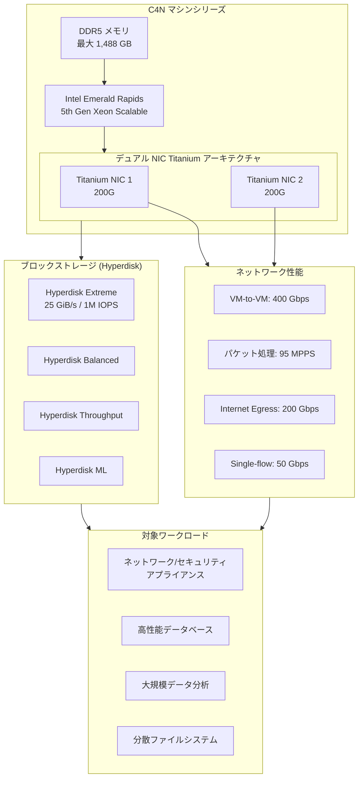

# Compute Engine / Google Kubernetes Engine: ネットワーク最適化 C4N マシンシリーズが一般提供開始

**リリース日**: 2026-07-08

**サービス**: Compute Engine / Google Kubernetes Engine

**機能**: C4N マシンシリーズ (ネットワーク最適化)

**ステータス**: GA (一般提供)

📊 [このアップデートのインフォグラフィックを見る](https://takech9203.github.io/google-cloud-news-summary/20260708-compute-engine-c4n-machine-series-ga.html)

## 概要

Google Cloud は、ネットワーク最適化マシンファミリーとして新たに C4N マシンシリーズを一般提供 (GA) として Compute Engine および Google Kubernetes Engine (GKE) の顧客に提供開始しました。C4N は第5世代 Intel Xeon Scalable プロセッサ (Emerald Rapids) を搭載し、デュアル NIC Titanium オフロードアーキテクチャを採用した、ネットワーク集約型およびブロックストレージ集約型ワークロード向けに特化した新しいマシンシリーズです。

C4N は Compute Engine で利用可能な最高の I/O パフォーマンスを提供し、最大 400 Gbps のネットワーク帯域幅、最大 95 MPPS (百万パケット/秒) の持続パケット処理性能を実現します。さらに、Hyperdisk Extreme との組み合わせにより、最大 25 GiB/s のブロックストレージスループットと 100万 IOPS を達成します。

対象ユーザーは、ネットワークおよびセキュリティアプライアンス、高性能データベース、大規模データ分析、分散ファイルシステムなど、I/O バウンドなワークロードを運用する組織です。

**アップデート前の課題**

- 高帯域ネットワークを必要とするワークロードでは、per VM Tier_1 ネットワークパフォーマンスの追加購入が必要だった
- C4 インスタンスでは最大 200 Gbps のネットワーク帯域幅にとどまり、ネットワーク集約型アプリケーションにはボトルネックとなっていた
- ブロックストレージの I/O パフォーマンスが不足し、ディスク上のデータベースワークロードで性能が制限されていた

**アップデート後の改善**

- Tier_1 ネットワークパフォーマンスのアドオン不要で、最大 400 Gbps の標準帯域幅を利用可能になった
- vCPU あたり4倍のネットワーク帯域幅を実現し、ネットワーク集約型ワークロードの性能が大幅に向上した
- Hyperdisk Extreme との組み合わせで C4 比 2.5 倍のストレージパフォーマンスを実現
- 同サイズの C4 インスタンスと比較して MySQL で 45% 高い QPS、Nginx で 55% 高いリクエスト/秒を達成

## アーキテクチャ図



C4N は Titanium オフロードアーキテクチャにより、ネットワークとストレージの管理を CPU から完全にオフロードし、アプリケーションに最大限のコンピュートリソースを提供します。

## サービスアップデートの詳細

### 主要機能

1. **業界最高水準のネットワーク帯域幅**
   - VM-to-VM ネットワーク帯域幅: 最大 400 Gbps
   - 同一 VPC 内の単一フロー帯域幅: 最大 50 Gbps
   - Internet Egress 帯域幅: 最大 200 Gbps
   - Internet Egress パケット処理: 最大 48 MPPS

2. **業界最高水準のパケット処理性能**
   - 持続パケット処理: 最大 95 MPPS (DPDK Pktgen 測定)
   - per VM Tier_1 ネットワークパフォーマンスのアドオンが不要
   - gVNIC ネットワークインターフェースの Tx/Rx キューがデフォルトで増加

3. **最先端のブロックストレージ性能**
   - Hyperdisk Extreme: 最大 25 GiB/s スループット、最大 1M IOPS
   - C4 比 2.5 倍のストレージパフォーマンス向上
   - Hyperdisk ポートフォリオ全体をサポート (Balanced, Balanced HA, Extreme, Throughput, ML)

4. **デュアル NIC Titanium アーキテクチャ**
   - 2基の 200G Titanium ネットワークアダプタ搭載
   - ネットワークとストレージ管理の完全オフロード
   - NUMA アーキテクチャに完全に整合した予測可能なパフォーマンス

5. **GKE サポート**
   - GKE バージョン 1.36.0-gke.3009002 以降で利用可能
   - Standard モードおよび Autopilot モードの両方で利用可能

## 技術仕様

### マシンタイプ構成

| 構成タイプ | vCPU 範囲 | メモリ/vCPU | 最大メモリ |
|------|------|------|------|
| c4n-highcpu | 2 - 192 vCPUs | 2 GB/vCPU | 384 GB |
| c4n-standard | 2 - 192 vCPUs | 4 GB/vCPU | 768 GB |
| c4n-highmem | 2 - 192 vCPUs | 約 7.75 GB/vCPU | 1,488 GB |

### ネットワーク帯域幅 (マシンサイズ別)

| マシンタイプ | 内部帯域幅 | 外部帯域幅 | 物理 NIC 数 |
|------|------|------|------|
| c4n-*-2 | 最大 25 Gbps | 最大 7 Gbps | 1 |
| c4n-*-4 | 最大 30 Gbps | 最大 7 Gbps | 1 |
| c4n-*-8 | 最大 40 Gbps | 最大 15 Gbps | 1 |
| c4n-*-16 | 最大 50 Gbps | 最大 25 Gbps | 1 |
| c4n-*-48 | 100 Gbps | 最大 50 Gbps | 1 |
| c4n-*-96 | 200 Gbps | 最大 100 Gbps | 1 |
| c4n-*-192 | 400 Gbps | 最大 200 Gbps | 2 |

### ストレージサポート

| ディスクタイプ | サポート状況 |
|------|------|
| Hyperdisk Balanced | サポート |
| Hyperdisk Balanced High Availability | サポート |
| Hyperdisk Extreme | サポート |
| Hyperdisk Throughput | サポート |
| Hyperdisk ML | サポート |
| ローカル SSD | プレビュー (申請制) |

## 設定方法

### 前提条件

1. gVNIC 対応の OS イメージを使用していること
2. 192 vCPU インスタンスの場合、最低 2 つのネットワークインターフェース (vNIC) を構成すること
3. GKE の場合、クラスタバージョンが 1.36.0-gke.3009002 以降であること

### 手順

#### ステップ 1: C4N インスタンスの作成

```bash
gcloud compute instances create my-c4n-instance \
    --zone=us-central1-a \
    --machine-type=c4n-standard-48 \
    --image-family=ubuntu-2404-lts \
    --image-project=ubuntu-os-cloud \
    --network-interface=nic-type=GVNIC
```

#### ステップ 2: 192 vCPU インスタンス (デュアル NIC 構成)

```bash
gcloud compute instances create my-c4n-192 \
    --zone=us-central1-a \
    --machine-type=c4n-standard-192 \
    --image-family=ubuntu-2404-lts \
    --image-project=ubuntu-os-cloud \
    --network-interface=nic-type=GVNIC,network=my-vpc,subnet=subnet-1 \
    --network-interface=nic-type=GVNIC,network=my-vpc,subnet=subnet-2
```

最大帯域幅 (400 Gbps) を達成するには、異なる物理 NIC にマッピングされた少なくとも 2 つの vNIC を構成し、ジャンボフレーム (8896B MTU) を使用する必要があります。

#### ステップ 3: GKE で C4N ノードプールを作成

```bash
gcloud container node-pools create c4n-pool \
    --cluster=my-cluster \
    --zone=us-central1-a \
    --machine-type=c4n-standard-48 \
    --num-nodes=3
```

## メリット

### ビジネス面

- **コスト効率の向上**: Tier_1 ネットワークパフォーマンスの追加料金なしで最高レベルのネットワーク帯域幅を利用可能
- **ワークロード統合**: 高い I/O 性能により、従来複数インスタンスに分散していたワークロードを統合可能
- **柔軟な割引オプション**: リソースベース CUD、Flexible CUD、Spot VM、予約、Sole-tenancy に対応

### 技術面

- **ネットワーク性能**: C4 比 4 倍のネットワーク帯域幅 (vCPU あたり) で、ネットワーク集約型アプリのボトルネック解消
- **ストレージ性能**: C4 比 2.5 倍のブロックストレージ性能で、ディスク I/O 集約型ワークロードの高速化
- **Titanium オフロード**: ネットワーク/ストレージ管理の CPU オフロードにより、アプリケーションへの CPU リソース最大化
- **NUMA 整合**: 予測可能で一貫したパフォーマンスを提供

## デメリット・制約事項

### 制限事項

- カスタムマシンタイプは利用不可 (事前定義のマシンタイプのみ)
- GPU のアタッチは不可
- ローカル SSD はプレビュー段階 (別途申請が必要)
- NVMe ディスクインターフェースのみサポート (SCSI 非対応)
- Hyperdisk ボリューム数は VM あたり最大 64
- 全ディスクの合計容量は 512 TiB まで

### 考慮すべき点

- 192 vCPU インスタンスで最大帯域幅を活用するには、デュアル vNIC + ジャンボフレーム構成が必要
- gVNIC 対応の OS イメージが必要 (移行前に互換性を確認すること)
- 利用可能なリージョン/ゾーンが限定的 (全ゾーンでは利用不可)

## ユースケース

### ユースケース 1: ネットワークセキュリティアプライアンス

**シナリオ**: 大規模なトラフィックを処理する次世代ファイアウォールや IDS/IPS をクラウド上で運用する場合。

**実装例**:
```bash
# 高パケット処理性能が必要なセキュリティアプライアンス用
gcloud compute instances create nva-firewall \
    --zone=us-central1-a \
    --machine-type=c4n-highcpu-96 \
    --image-family=my-nva-image \
    --image-project=my-project \
    --network-interface=nic-type=GVNIC,network=external-vpc \
    --network-interface=nic-type=GVNIC,network=internal-vpc \
    --can-ip-forward
```

**効果**: 95 MPPS のパケット処理性能により、大規模トラフィックのインスペクションを単一インスタンスで処理可能。

### ユースケース 2: 高性能データベース (MySQL/PostgreSQL)

**シナリオ**: ディスク上に大規模データを保持するデータベースで、高いストレージ IOPS とスループットが求められる場合。

**実装例**:
```bash
# Hyperdisk Extreme を使用した高性能 DB 構成
gcloud compute instances create db-primary \
    --zone=us-central1-a \
    --machine-type=c4n-highmem-96 \
    --image-family=ubuntu-2404-lts \
    --image-project=ubuntu-os-cloud \
    --network-interface=nic-type=GVNIC \
    --create-disk=type=hyperdisk-extreme,size=1000,provisioned-iops=500000,provisioned-throughput=5000
```

**効果**: C4 比で MySQL のクエリ/秒が 45% 向上。Hyperdisk Extreme で低レイテンシ・高スループットのストレージアクセスを実現。

### ユースケース 3: 分散ファイルシステム / データ分析

**シナリオ**: 大量のデータを複数ノード間で高速に転送する分散ストレージシステムや大規模データ分析基盤。

**効果**: 400 Gbps の VM-to-VM 帯域幅により、ノード間データ転送のボトルネックを解消し、クラスタ全体のスループットを最大化。

## 料金

C4N マシンシリーズはネットワーク最適化カテゴリの料金が適用されます。詳細な料金は [Network-optimized pricing](https://cloud.google.com/products/compute/pricing/network-optimized) を参照してください。

### 割引オプション

| 割引タイプ | 内容 |
|--------|-----------------|
| リソースベース CUD (1年) | オンデマンド比 最大 37% 割引 |
| リソースベース CUD (3年) | オンデマンド比 最大 55% 割引 |
| Flexible CUD | 時間あたり最低利用額コミットメント |
| Spot VM | 最大 91% 割引 (中断あり) |

## 利用可能リージョン

2026年7月時点で C4N が確認されているゾーン:

- **北米**: us-central1-a, us-central1-b, us-east1-c, us-east5-b, us-west1-b
- **ヨーロッパ**: europe-west2-a (London)

利用可能ゾーンは今後拡大予定です。最新情報は以下のコマンドで確認できます:

```bash
gcloud compute machine-types list --filter="name=c4n-standard-48"
```

## 関連サービス・機能

- **[Google Cloud Titanium](https://cloud.google.com/titanium)**: C4N のネットワーク/ストレージオフロードを支える基盤テクノロジー
- **[Hyperdisk](https://docs.cloud.google.com/compute/docs/disks/hyperdisks)**: C4N と組み合わせて最大性能を発揮するブロックストレージ
- **[Google Kubernetes Engine](https://cloud.google.com/kubernetes-engine)**: C4N をノードプールとして利用可能 (v1.36.0-gke.3009002+)
- **[gVNIC](https://docs.cloud.google.com/compute/docs/networking/using-gvnic)**: C4N で必須のネットワークインターフェースドライバ

## 参考リンク

- 📊 [インフォグラフィック](https://takech9203.github.io/google-cloud-news-summary/20260708-compute-engine-c4n-machine-series-ga.html)
- [公式リリースノート](https://cloud.google.com/release-notes)
- [C4N マシンシリーズ ドキュメント](https://docs.cloud.google.com/compute/docs/network-optimized-machines#c4n_series)
- [料金ページ (Network-optimized)](https://cloud.google.com/products/compute/pricing/network-optimized)
- [マシンファミリー比較ガイド](https://docs.cloud.google.com/compute/docs/machine-resource)

## まとめ

C4N マシンシリーズの GA リリースにより、Google Cloud はネットワークおよびブロックストレージ集約型ワークロードに対して業界最高水準のパフォーマンスを標準提供するようになりました。Tier_1 ネットワークのアドオン不要で 400 Gbps を実現する点は、コスト効率の面でも大きな進歩です。ネットワークアプライアンス、高性能データベース、大規模分析基盤を運用する組織は、C4N への移行を検討することで大幅なパフォーマンス向上が期待できます。

---

**タグ**: #ComputeEngine #GKE #C4N #NetworkOptimized #IntelEmeraldRapids #Titanium #HyperdiskExtreme #GA #HighPerformance #Networking
