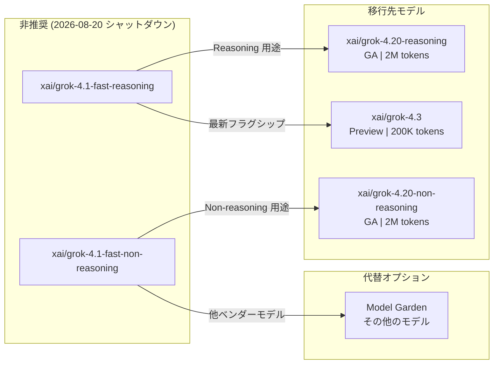

# Gemini Enterprise Agent Platform: Grok 4.1 モデルファミリーの非推奨化

**リリース日**: 2026-07-08

**サービス**: Gemini Enterprise Agent Platform

**機能**: Grok 4.1 モデルファミリーの非推奨化 (Deprecated)

**ステータス**: Deprecated

📊 [このアップデートのインフォグラフィックを見る](https://takech9203.github.io/google-cloud-news-summary/20260708-gemini-agent-platform-grok-4-1-deprecation.html)

## 概要

Gemini Enterprise Agent Platform 上で提供されていた xAI の Grok 4.1 モデルファミリー (`xai/grok-4.1-fast-reasoning` および `xai/grok-4.1-fast-non-reasoning`) が非推奨 (Deprecated) となり、2026 年 8 月 20 日にシャットダウンされることが発表された。シャットダウン後は、Model as a Service (MaaS) エンドポイントへの Grok 4.1 モデル ID を使用した API リクエストは `400` エラーを返すようになる。

Grok 4.1 Fast は xAI の最もコスト効率の高いモデルとして 2026 年 4 月 7 日にリリースされたが、わずか約 3 か月で非推奨となった。ユーザーはサービスの継続性を維持するため、より新しい xAI モデル (Grok 4.2、Grok 4.3、Grok 4.20) への移行、または Google Cloud Model Garden から代替モデルの選択が必要となる。

**アップデート前の課題**

- Grok 4.1 Fast (Reasoning/Non-reasoning) は Preview ステージのモデルであり、コスト効率は高いがコンテキスト長が 128,000 トークンに制限されていた
- Fixed quota のみサポートされ、Standard pay-as-you-go や Provisioned Throughput には未対応だった
- 後継モデル (Grok 4.20、Grok 4.3) の登場によりモデルラインナップが冗長化していた

**アップデート後の改善**

- Grok 4.20 (GA) への移行により、コンテキスト長が 128,000 から 2,000,000 トークンに大幅拡大
- Grok 4.20 は GA ステータスであり、Preview よりも安定したサービスレベルが保証される
- Grok 4.20 は業界最低レベルのハルシネーション率を実現し、品質面でも向上

## アーキテクチャ図



Grok 4.1 モデルファミリーからの移行パスを示す図。Reasoning 用途は Grok 4.20 (Reasoning) または Grok 4.3 へ、Non-reasoning 用途は Grok 4.20 (Non-reasoning) またはModel Garden の代替モデルへ移行する。

## サービスアップデートの詳細

### 主要機能

1. **非推奨化対象モデル**
   - `xai/grok-4.1-fast-reasoning`: ツールコール機能に優れたコスト効率重視の推論モデル
   - `xai/grok-4.1-fast-non-reasoning`: 低レイテンシに最適化されたノンシンキングモデル

2. **シャットダウンスケジュール**
   - 非推奨化発表日: 2026 年 7 月 8 日
   - サービス停止日: 2026 年 8 月 20 日
   - 移行猶予期間: 約 43 日間

3. **シャットダウン後の影響**
   - `https://aiplatform.googleapis.com/v1/projects/<your-project>/locations/global/endpoints/openapi/chat/completions` エンドポイントで Grok 4.1 モデル ID を使用した場合、`400` エラーが返される
   - 既存のアプリケーションが即座に動作停止する可能性がある

## 技術仕様

### 非推奨モデルと移行先の比較

| 項目 | Grok 4.1 Fast (非推奨) | Grok 4.20 (推奨移行先) | Grok 4.3 |
|------|------------------------|------------------------|----------|
| ステータス | Deprecated | GA | Preview |
| コンテキスト長 | 128,000 トークン | 2,000,000 トークン | 200,000 トークン |
| QPM | 160 | 100 | 100 |
| Input TPM | 880,000 | 540,000 | 540,000 |
| Output TPM | 40,000 | 80,000 | 80,000 |
| Function Calling | Preview | GA | Preview |
| Structured Output | Preview | GA | Preview |
| Reasoning | Preview (Reasoning版のみ) | GA (Reasoning版のみ) | Preview |
| リリース日 | 2026-04-07 | 2026-04-14 | 2026-05-27 |

### 影響を受ける API エンドポイント

```bash
# このエンドポイントで Grok 4.1 モデル ID を使用すると 2026-08-20 以降 400 エラー
POST https://aiplatform.googleapis.com/v1/projects/{PROJECT_ID}/locations/global/endpoints/openapi/chat/completions

# リクエストボディ内のモデル指定 (影響を受ける)
{
  "model": "xai/grok-4.1-fast-reasoning",  // 400 エラーになる
  "messages": [...]
}
```

## 設定方法

### 前提条件

1. Grok 4.1 を使用中のアプリケーションの特定
2. 移行先モデルの選定 (ユースケースに応じて Grok 4.20 または Grok 4.3 を選択)

### 手順

#### ステップ 1: 現在の使用箇所を特定

```bash
# プロジェクト内で Grok 4.1 モデル ID を使用しているコードを検索
grep -r "grok-4.1-fast" --include="*.py" --include="*.js" --include="*.yaml" .
```

#### ステップ 2: モデル ID を更新

```python
# Before (非推奨)
response = client.chat.completions.create(
    model="xai/grok-4.1-fast-reasoning",
    messages=[{"role": "user", "content": "Hello"}]
)

# After (Grok 4.20 Reasoning に移行)
response = client.chat.completions.create(
    model="xai/grok-4.20-reasoning",
    messages=[{"role": "user", "content": "Hello"}]
)
```

#### ステップ 3: 動作確認

```bash
# 移行先モデルでの API 呼び出しテスト
curl -X POST \
  -H "Authorization: Bearer $(gcloud auth print-access-token)" \
  -H "Content-Type: application/json" \
  https://aiplatform.googleapis.com/v1/projects/${PROJECT_ID}/locations/global/endpoints/openapi/chat/completions \
  -d '{
    "model": "xai/grok-4.20-reasoning",
    "messages": [{"role": "user", "content": "Test migration"}]
  }'
```

## メリット

### ビジネス面

- **サービス継続性の確保**: 早期の移行により、8 月 20 日のサービス停止による業務影響を回避できる
- **品質向上**: Grok 4.20 は業界最低レベルのハルシネーション率を実現しており、出力の信頼性が向上する

### 技術面

- **コンテキスト長の大幅拡大**: 128K から 2M トークンへの拡大により、大規模ドキュメント処理や長時間のエージェントセッションが可能に
- **GA レベルの安定性**: Grok 4.20 は GA ステータスであり、Function Calling や Structured Output も GA サポート
- **Output TPM の倍増**: 40,000 から 80,000 TPM に増加し、スループットが向上

## デメリット・制約事項

### 制限事項

- 移行猶予期間が約 43 日間と比較的短い
- Grok 4.20/4.3 は QPM が 100 に減少するため (Grok 4.1 は 160 QPM)、高頻度リクエストのワークロードでは制約が生じる可能性がある
- Input TPM も 880,000 から 540,000 に減少するため、入力トークン量が多いアプリケーションでは注意が必要

### 考慮すべき点

- モデルの出力特性が異なるため、プロンプトの調整やテストが必要な場合がある
- Grok 4.3 は Preview ステータスであるため、本番環境での利用は Grok 4.20 (GA) が推奨される
- コスト構造が変わる可能性があるため、料金ページで最新の料金を確認すること

## ユースケース

### ユースケース 1: 検索タスクの移行

**シナリオ**: Grok 4.1 Fast (Reasoning) を Web データや社内ナレッジベースの検索タスクに使用しているケース

**実装例**:
```python
# モデル ID の変更のみで移行可能
# Grok 4.20 (Reasoning) はドキュメント理解と長期間のエージェントツールコールに優れる
response = client.chat.completions.create(
    model="xai/grok-4.20-reasoning",
    messages=[{"role": "user", "content": "Search query..."}],
    tools=[{"type": "function", "function": {"name": "search_knowledge_base", ...}}]
)
```

**効果**: コンテキスト長の拡大 (128K -> 2M) により、より多くの検索結果をコンテキストに含められるようになる

### ユースケース 2: 高ボリュームタスクの移行

**シナリオ**: Grok 4.1 Fast (Non-reasoning) を要約やカテゴリ分類などの大量処理に使用しているケース

**効果**: Grok 4.20 (Non-reasoning) への移行で、低ハルシネーション率による分類精度の向上が期待できる。ただし QPM 制限が 160 から 100 に減少するため、レート制限対策が必要な場合がある

## 料金

料金の詳細は [Gemini Enterprise Agent Platform Pricing](https://cloud.google.com/gemini-enterprise-agent-platform/generative-ai/pricing) ページを参照。

## 利用可能リージョン

Grok モデルファミリーは global エンドポイントのみで利用可能。

## 関連サービス・機能

- **Google Cloud Model Garden**: 代替モデルの検索・デプロイに使用。Grok 以外にも Anthropic Claude、Mistral 等のパートナーモデルが利用可能
- **Chat Completions API**: OpenAI 互換の API エンドポイント。モデル ID の変更のみで移行が可能
- **Gemini Enterprise Agent Platform MaaS**: サードパーティモデルをマネージド API として提供するサービス基盤

## 参考リンク

- 📊 [インフォグラフィック](https://takech9203.github.io/google-cloud-news-summary/20260708-gemini-agent-platform-grok-4-1-deprecation.html)
- [公式リリースノート](https://cloud.google.com/release-notes#July_08_2026)
- [Grok 4.1 Fast モデルドキュメント](https://docs.cloud.google.com/gemini-enterprise-agent-platform/models/partner-models/grok/grok-4-1-fast)
- [xAI Grok モデル一覧](https://docs.cloud.google.com/gemini-enterprise-agent-platform/models/partner-models/grok)
- [パートナーモデルの使用ガイド](https://docs.cloud.google.com/gemini-enterprise-agent-platform/models/partner-models/use-partner-models)
- [料金ページ](https://cloud.google.com/gemini-enterprise-agent-platform/generative-ai/pricing)

## まとめ

Grok 4.1 モデルファミリーの非推奨化に伴い、2026 年 8 月 20 日までに移行を完了する必要がある。移行先としては、GA ステータスで 2M トークンのコンテキスト長と低ハルシネーション率を実現する Grok 4.20 が最も推奨される。影響を受けるアプリケーションの特定とモデル ID の更新を早期に実施し、十分なテスト期間を確保することが重要である。

---

**タグ**: #GeminiEnterpriseAgentPlatform #xAI #Grok #Deprecated #ModelMigration #MaaS #ModelGarden
