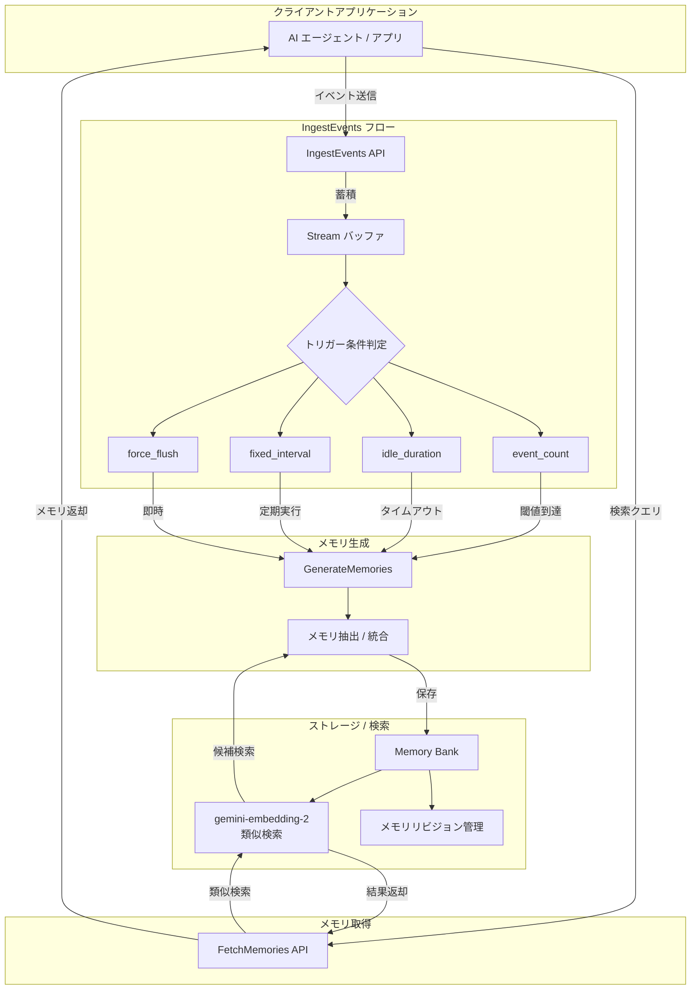

# Gemini Enterprise Agent Platform: Memory Bank IngestEvents GA / Gemini Embedding 2 対応 / Grok 4.1 非推奨化

**リリース日**: 2026-07-08

**サービス**: Gemini Enterprise Agent Platform

**機能**: Memory Bank IngestEvents GA、Gemini Embedding 2 対応、Grok 4.1 モデル非推奨化

**ステータス**: GA (一般提供) / Deprecated (非推奨)

📊 [このアップデートのインフォグラフィックを見る](https://takech9203.github.io/google-cloud-news-summary/20260708-gemini-agent-platform-memory-bank-ga.html)

## 概要

Gemini Enterprise Agent Platform において、Memory Bank の IngestEvents API が一般提供 (GA) となり、AI エージェントのメモリ管理がプロダクション環境で本格的に利用可能になりました。同時に、Memory Bank の類似検索設定で gemini-embedding-2 モデルがサポートされ、マルチモーダルな埋め込みによる高精度な記憶の検索・統合が実現されます。

IngestEvents API は、イベントの取り込みとメモリ生成を非同期に分離する仕組みを提供します。従来の GenerateMemories API ではイベント送信とメモリ生成が同期的に行われていましたが、IngestEvents ではイベントを継続的にストリーミングし、指定したトリガー条件（イベント数、アイドル時間、固定間隔）を満たした時点で自動的にメモリ生成が実行されます。GA では overlap_event_count によるコンテキスト引き継ぎ、revision_labels / revision_ttl / disable_memory_revisions によるリビジョン管理設定、metadata および metadata_merge_strategy による構造化情報の付与が新たに追加されました。

また、xAI の Grok 4.1 モデルファミリー（grok-4.1-fast-reasoning および grok-4.1-fast-non-reasoning）が非推奨となり、2026年8月20日にシャットダウンされることが発表されました。利用者は Grok 4.2 または Grok 4.3 への移行、あるいは Google Cloud Model Garden から代替モデルを選択する必要があります。

**アップデート前の課題**

- IngestEvents API は Preview 段階であり、プロダクション環境での利用に SLA の保証がなかった
- Memory Bank の類似検索は text-embedding-005 がデフォルトで、マルチモーダルな埋め込みに対応していなかった
- Grok 4.1 モデルを利用しているワークロードは将来のサポート終了に備える必要がなかった

**アップデート後の改善**

- IngestEvents API が GA となり、SLA 付きのプロダクション利用が可能になった
- gemini-embedding-2 によるマルチモーダル対応の高精度な類似検索が Memory Bank で利用可能になった
- GA 版で overlap_event_count、リビジョン設定、メタデータ機能が追加され、より柔軟なメモリ管理が実現した

## アーキテクチャ図



Memory Bank の IngestEvents API を通じたデータフローを示しています。クライアントからイベントが Stream バッファに蓄積され、トリガー条件に応じてメモリ生成が非同期実行されます。生成されたメモリは gemini-embedding-2 による類似検索インデックスに格納され、FetchMemories API を通じて取得できます。

## サービスアップデートの詳細

### 主要機能

1. **IngestEvents API の GA 化**
   - イベント取り込みとメモリ生成の非同期分離がプロダクション対応
   - overlap_event_count: ストリーム間でのコンテキスト引き継ぎ（前回のイベントを次回のメモリ生成に含める）
   - revision_labels / revision_ttl / disable_memory_revisions: メモリリビジョンの細粒度制御
   - metadata / metadata_merge_strategy: メモリに構造化メタデータを付与し、マージ戦略を指定可能

2. **Memory Bank の Gemini Embedding 2 対応**
   - similarity_search_config で gemini-embedding-2 モデルを指定可能
   - 3072 次元のマルチモーダル埋め込みベクトルによる高精度な類似検索
   - テキスト、画像、音声、動画の統一的な意味空間での検索が可能
   - global、us、eu エンドポイントで利用可能

3. **Grok 4.1 モデルファミリーの非推奨化**
   - grok-4.1-fast-reasoning: 2026年8月20日にシャットダウン
   - grok-4.1-fast-non-reasoning: 2026年8月20日にシャットダウン
   - 移行先として Grok 4.2、Grok 4.3、または Google Cloud Model Garden の他モデルを推奨

## 技術仕様

### IngestEvents API パラメータ（GA 新機能）

| 項目 | 詳細 |
|------|------|
| overlap_event_count | 前回のストリームから引き継ぐイベント数。コンテキストの継続性を確保 |
| revision_labels | メモリリビジョンに付与するラベル（キーバリューペア） |
| revision_ttl | メモリリビジョンの有効期限（秒単位） |
| disable_memory_revisions | メモリリビジョンの保存を無効化（リクエストレベルで制御可能） |
| metadata | メモリに付与する構造化情報 |
| metadata_merge_strategy | 既存メタデータとのマージ戦略の指定 |

### Gemini Embedding 2 仕様

| 項目 | 詳細 |
|------|------|
| モデル ID | gemini-embedding-2 |
| 出力次元数 | 最大 3,072（MRL サポートで低次元も可能） |
| 対応モダリティ | テキスト、画像、音声、動画 |
| 最大入力トークン | 8,192 |
| 利用可能エンドポイント | global、us、eu |
| リリースステージ | GA（2026年4月22日） |

### トリガー条件

| トリガー種別 | パラメータ | 説明 |
|-------------|-----------|------|
| イベント数 | event_count | 蓄積イベント数が閾値に達したら生成 |
| アイドル時間 | idle_duration | 新規イベントが指定時間来なければ生成（60秒の倍数） |
| 固定間隔 | fixed_interval | 定期的にデルタイベントをポーリングして生成（60秒の倍数） |
| 即時フラッシュ | force_flush | 条件を無視して即座にフラッシュ |
| 自動フラッシュ | - | 最初のイベントから24時間後に自動処理 |

## 設定方法

### 前提条件

1. Google Cloud プロジェクトで Agent Platform API が有効化されていること
2. IAM ロール `roles/aiplatform.user` が付与されていること
3. Agent Platform SDK (`google-cloud-aiplatform>=1.111.0`) がインストールされていること

### 手順

#### ステップ 1: Memory Bank インスタンスの作成（gemini-embedding-2 対応）

```python
import vertexai
from vertexai.types import (
    ReasoningEngineContextSpecMemoryBankConfig as MemoryBankConfig,
    ReasoningEngineContextSpecMemoryBankConfigSimilaritySearchConfig as SimilaritySearchConfig,
    ReasoningEngineContextSpecMemoryBankConfigGenerationConfig as GenerationConfig,
)

client = vertexai.Client(
    project="YOUR_PROJECT_ID",
    location="global"  # global, us, または eu を指定
)

memory_bank_config = MemoryBankConfig(
    similarity_search_config=SimilaritySearchConfig(
        embedding_model="projects/YOUR_PROJECT_ID/locations/global/publishers/google/models/gemini-embedding-2"
    ),
    generation_config=GenerationConfig(
        model="projects/YOUR_PROJECT_ID/locations/global/publishers/google/models/gemini-3.5-flash"
    )
)

memory_bank = client.agent_engines.create(
    display_name="my-memory-bank",
    config={
        "context_spec": {
            "memory_bank_config": memory_bank_config
        }
    }
)
```

gemini-embedding-2 を類似検索モデルとして指定し、Memory Bank インスタンスを作成します。

#### ステップ 2: IngestEvents API でイベントを取り込む

```python
client.agent_engines.memories.ingest_events(
    name=memory_bank.api_resource.name,
    stream_id="user-session-stream",
    direct_contents_source={
        "events": [
            {
                "content": {
                    "role": "user",
                    "parts": [{"text": "私の好きな言語は Python です。"}]
                },
                "event_id": "event-001"
            }
        ]
    },
    generation_trigger_config={
        "generation_rule": {
            "event_count": 10
        }
    },
    scope={"user_id": "user-123"}
)
```

イベント数トリガーを設定し、10件のイベントが蓄積された時点でメモリ生成を自動実行します。

#### ステップ 3: Grok 4.1 からの移行

```bash
# 現在の Grok 4.1 利用箇所の確認
gcloud ai models list --filter="model_id:grok-4.1*" --project=YOUR_PROJECT_ID

# Grok 4.20 への移行例（curl）
curl -X POST \
  -H "Authorization: Bearer $(gcloud auth print-access-token)" \
  -H "Content-Type: application/json" \
  "https://aiplatform.googleapis.com/v1/projects/YOUR_PROJECT_ID/locations/global/endpoints/openapi/chat/completions" \
  -d '{
    "model": "xai/grok-4.20-reasoning",
    "messages": [{"role": "user", "content": "Hello"}]
  }'
```

Grok 4.1 を利用しているワークロードを Grok 4.20 または Grok 4.3 に移行します。

## メリット

### ビジネス面

- **プロダクション対応の信頼性**: IngestEvents API が GA となり、SLA 付きでミッションクリティカルなワークロードに利用可能
- **パーソナライズの高度化**: マルチモーダルな記憶管理により、テキスト以外のコンテキスト（画像、音声）も含めたユーザー体験のパーソナライズが実現
- **運用コストの削減**: 非同期処理とトリガーベースの自動メモリ生成により、手動管理の負担を軽減

### 技術面

- **非同期アーキテクチャ**: イベント取り込みとメモリ生成の分離により、レイテンシを気にせず継続的にデータを送信可能
- **自動重複排除**: event_id ベースの重複排除により、同じイベントの二重処理を防止
- **高精度な類似検索**: gemini-embedding-2 の 3072 次元ベクトルにより、従来の text-embedding-005 よりも精度の高いメモリ検索を実現
- **柔軟なリビジョン管理**: revision_ttl や revision_labels により、メモリの履歴管理とライフサイクル制御が可能

## デメリット・制約事項

### 制限事項

- gemini-embedding-2 を Memory Bank で使用する場合、global、us、eu エンドポイントのみ対応（個別リージョンエンドポイントは非対応）
- global エンドポイント使用時は CMEK（顧客管理暗号鍵）を利用できない
- IngestEvents のトリガー条件で idle_duration と fixed_interval は60秒の倍数で指定する必要がある
- トリガー条件が満たされない場合、最初のイベントから24時間後に自動フラッシュされる

### 考慮すべき点

- Grok 4.1 を利用中のワークロードは 2026年8月20日までに移行が必須
- gemini-embedding-2 はグローバルクオータを共有するため、大規模利用時はクオータ制限に注意
- Memory Bank のデフォルト生成モデルが gemini-3.5-flash に変更されており（2026年6月29日以降の新規インスタンス）、既存インスタンスとの動作差異に注意

## ユースケース

### ユースケース 1: カスタマーサポートエージェントのパーソナライズ

**シナリオ**: EC サイトのカスタマーサポート AI エージェントが、過去の問い合わせ履歴やユーザーの好みを記憶し、パーソナライズされた対応を提供する。

**実装例**:
```python
# 各セッションの会話イベントを継続的に取り込み
client.agent_engines.memories.ingest_events(
    name=memory_bank.api_resource.name,
    stream_id="support-session-456",
    direct_contents_source={
        "events": [
            {
                "content": {
                    "role": "user",
                    "parts": [{"text": "前回注文した青いスニーカーのサイズ交換をしたいです。"}]
                },
                "event_id": "support-event-001"
            }
        ]
    },
    generation_trigger_config={
        "generation_rule": {
            "idle_duration": "300s"  # 5分間のアイドルでメモリ生成
        }
    },
    scope={"user_id": "customer-789"}
)
```

**効果**: 次回の問い合わせ時に「青いスニーカーのサイズ交換を希望していた」という記憶が自動的に想起され、スムーズな対応が可能になる。

### ユースケース 2: マルチモーダルなナレッジワーカーエージェント

**シナリオ**: 設計レビューエージェントが、テキストだけでなく画像やドキュメントの埋め込みを活用して、過去の設計パターンとの類似性を検索する。

**効果**: gemini-embedding-2 のマルチモーダル対応により、テキストの説明だけでなく画像データを含めた統一的な意味空間でのメモリ検索が可能になり、設計レビューの精度と効率が向上する。

## 料金

Memory Bank および IngestEvents API の料金は Gemini Enterprise Agent Platform の料金体系に準じます。

| 項目 | 詳細 |
|------|------|
| gemini-embedding-2 | Standard Pay-as-you-go で利用可能 |
| メモリ生成 (gemini-3.5-flash) | 生成に使用するモデルのトークン料金が適用 |
| IngestEvents API 呼び出し | Agent Platform API 利用料金に含まれる |

詳細は [Gemini Enterprise Agent Platform 料金ページ](https://cloud.google.com/gemini-enterprise-agent-platform/generative-ai/pricing) を参照してください。

## 利用可能リージョン

### Memory Bank (IngestEvents API / gemini-embedding-2 対応)

| エンドポイント | 説明 |
|---------------|------|
| global | グローバルエンドポイント（CMEK 非対応） |
| us | 米国マルチリージョン |
| eu | 欧州マルチリージョン |

Memory Bank は上記のマルチリージョン・グローバルエンドポイントに加え、us-central1、europe-west2 などの個別リージョンでも利用可能ですが、gemini-embedding-2 は global、us、eu でのみサポートされます。

### Grok モデル

| モデル | エンドポイント |
|--------|---------------|
| Grok 4.1 Fast (非推奨) | global のみ |
| Grok 4.20 (移行先推奨) | global のみ |
| Grok 4.3 (移行先推奨) | global のみ |

## 関連サービス・機能

- **Agent Platform Sessions**: Memory Bank と統合してセッション管理とメモリ生成を連携
- **GenerateMemories API**: IngestEvents の下流で呼び出されるメモリ生成 API
- **FetchMemories API**: 生成されたメモリを類似検索またはスコープベースで取得
- **Gemini Embedding 2**: マルチモーダル埋め込みモデル（テキスト、画像、音声、動画対応）
- **Google Cloud Model Garden**: Grok 4.1 からの移行先モデルを選択可能

## 参考リンク

- 📊 [インフォグラフィック](https://takech9203.github.io/google-cloud-news-summary/20260708-gemini-agent-platform-memory-bank-ga.html)
- [Memory Bank セットアップ（類似検索設定）](https://docs.cloud.google.com/gemini-enterprise-agent-platform/scale/memory-bank/setup#similarity-search-config)
- [IngestEvents API ドキュメント](https://docs.cloud.google.com/gemini-enterprise-agent-platform/scale/memory-bank/ingest-events)
- [Gemini Embedding 2 モデルページ](https://docs.cloud.google.com/gemini-enterprise-agent-platform/models/gemini/embedding-2)
- [Grok モデルページ](https://docs.cloud.google.com/gemini-enterprise-agent-platform/models/partner-models/grok)
- [料金ページ](https://cloud.google.com/gemini-enterprise-agent-platform/generative-ai/pricing)

## まとめ

今回のアップデートにより、Gemini Enterprise Agent Platform の Memory Bank が IngestEvents API の GA 化と gemini-embedding-2 対応でプロダクション対応の本格的なメモリ管理基盤となりました。AI エージェントのパーソナライズやコンテキスト保持を実装する開発者は、非同期イベント取り込みとマルチモーダル類似検索を活用して、より高度なユーザー体験を構築できます。Grok 4.1 を利用中の場合は、2026年8月20日のシャットダウンまでに Grok 4.20 以降への移行を計画してください。

---

**タグ**: #GeminiEnterpriseAgentPlatform #MemoryBank #IngestEvents #GeminiEmbedding2 #Grok #ModelDeprecation #GA #AIAgent #マルチモーダル #埋め込みモデル
