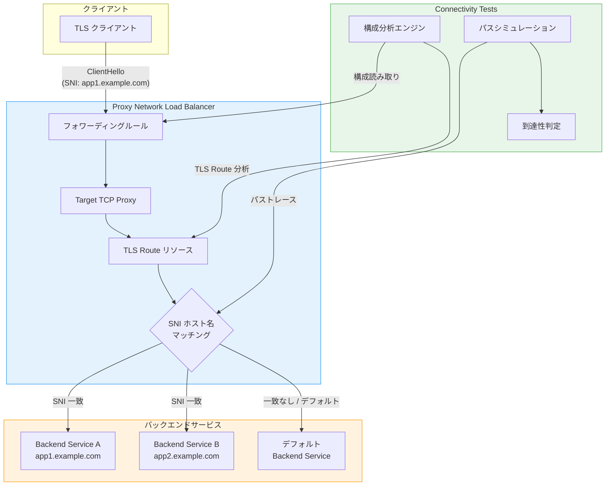

# Network Intelligence Center: Connectivity Tests が Proxy Network Load Balancer の SNI ルーティング分析に対応

**リリース日**: 2026-07-08

**サービス**: Network Intelligence Center

**機能**: Connectivity Tests による Proxy Network Load Balancer の SNI ルーティング分析

**ステータス**: Feature (機能追加)

📊 [このアップデートのインフォグラフィックを見る](https://takech9203.github.io/google-cloud-news-summary/20260708-network-intelligence-center-sni-routing.html)

## 概要

Network Intelligence Center の Connectivity Tests が、Server Name Indication (SNI) ルーティングを構成した Proxy Network Load Balancer の TLS トラフィック分析に対応しました。これにより、TLS パススルー環境におけるネットワーク接続性の診断・トラブルシューティングが大幅に強化されます。

Connectivity Tests は Google Cloud のネットワーク接続性を診断するツールで、VPC ネットワーク構成の分析とライブデータプレーン分析の両方を提供します。今回のアップデートにより、2026年3月に Preview として導入された Proxy Network Load Balancer の SNI ベースルーティング機能と組み合わせて使用する際の構成検証が可能になりました。SNI ルーティングでは、TLS ハンドシェイク時の ClientHello メッセージに含まれる SNI ホスト名に基づいてトラフィックを適切なバックエンドサービスにルーティングします。

このアップデートは、マルチテナント TLS 環境を運用するプラットフォームエンジニアやネットワーク管理者に特に有用です。SNI ルーティングの構成ミスによる接続障害を事前に検出し、エンドツーエンド暗号化を維持しながらのトラブルシューティングが可能になります。

**アップデート前の課題**

- Connectivity Tests は SNI ルーティングが設定された Proxy Network Load Balancer の構成を分析できなかった
- SNI ベースのルーティング設定に問題がある場合、実際のトラフィックで確認するしか手段がなかった
- TLS パススルー環境での接続性問題の原因切り分けが困難だった

**アップデート後の改善**

- Connectivity Tests が SNI ルーティング構成を含む Proxy Network Load Balancer のパス分析に対応した
- TLS トラフィックのルーティング経路を事前にシミュレーションし、構成ミスを検出できるようになった
- SNI ホスト名に基づくバックエンドサービスへの到達性を構成分析で検証可能になった

## アーキテクチャ図



Connectivity Tests が Proxy Network Load Balancer の構成を読み取り、SNI ホスト名に基づく TLS Route のルーティング経路をシミュレーションして到達性を判定する流れを示しています。

## サービスアップデートの詳細

### 主要機能

1. **SNI ルーティング構成の分析**
   - Connectivity Tests が TLS Route リソースの構成を解析し、SNI ホスト名とバックエンドサービスのマッピングを検証
   - ClientHello メッセージ内の SNI ホスト名に基づくルーティングパスのシミュレーション

2. **TLS パススルー環境のパストレース**
   - ロードバランサが TLS を終端せずにパススルーする構成での接続経路を追跡
   - エンドツーエンド暗号化を維持した状態でのネットワーク構成検証

3. **到達性判定の拡張**
   - SNI ホスト名が TLS Route に一致する場合の正常パスの確認
   - 一致しない場合のデフォルトルートまたは拒否動作の検証
   - ファイアウォールルール、ルーティング、バックエンドヘルスを含む総合的な到達性分析

## 技術仕様

### SNI ルーティングの動作概要

| 項目 | 詳細 |
|------|------|
| 対象リソース | Proxy Network Load Balancer (Regional External / Regional Internal / Cross-region Internal) |
| ルーティング方式 | TLS Route リソースによる SNI ホスト名ベースのマッチング |
| TLS 処理 | TLS パススルー (ロードバランサでの復号なし) |
| マッチング対象 | ClientHello メッセージ内の SNI ホスト名 (暗号化前に送信される) |
| 不一致時の動作 | デフォルトバックエンドへのルーティングまたは接続拒否 |

### Connectivity Tests の実行例

```bash
# VM から SNI ルーティングが設定された Proxy NLB への接続テスト
gcloud network-management connectivity-tests create test-sni-routing \
    --source-instance=projects/my-project/zones/us-central1-a/instances/client-vm \
    --source-ip-address=10.0.1.2 \
    --destination-ip-address=10.0.2.100 \
    --destination-port=443 \
    --protocol=TCP
```

## 設定方法

### 前提条件

1. Network Intelligence Center API (Network Management API) が有効であること
2. テスト対象の Proxy Network Load Balancer に TLS Route が構成されていること
3. `networkmanagement.connectivitytests.create` 権限を持つ IAM ロールが付与されていること

### 手順

#### ステップ 1: Proxy Network Load Balancer の SNI ルーティング構成を確認

```bash
# TLS Route リソースの確認
gcloud network-services tls-routes list --location=REGION

# 特定の TLS Route の詳細表示
gcloud network-services tls-routes describe TLS_ROUTE_NAME \
    --location=REGION
```

TLS Route が適切に構成され、SNI ホスト名とバックエンドサービスのマッピングが正しいことを確認します。

#### ステップ 2: Connectivity Tests の作成と実行

```bash
# 外部クライアントから Proxy NLB への接続テスト
gcloud network-management connectivity-tests create sni-test \
    --source-ip-address=SOURCE_IP \
    --source-network-type=INTERNET \
    --destination-ip-address=LB_FORWARDING_RULE_IP \
    --destination-port=443 \
    --protocol=TCP
```

テストを作成すると自動的に実行され、構成分析の結果が返されます。

#### ステップ 3: テスト結果の確認

```bash
# テスト結果の表示
gcloud network-management connectivity-tests describe sni-test \
    --format="yaml(reachabilityDetails)"
```

結果にはパスのトレース情報、到達性ステータス (Reachable / Unreachable / Ambiguous)、各ステップの詳細が含まれます。

## メリット

### ビジネス面

- **障害の予防的検出**: SNI ルーティングの構成ミスを本番トラフィック到達前に発見し、サービス障害を未然に防止
- **トラブルシューティング時間の短縮**: TLS パススルー環境での接続問題の原因を迅速に特定し、MTTR を削減

### 技術面

- **構成変更の安全な検証**: TLS Route やバックエンドサービスの変更後、実トラフィックを流す前に接続性を確認可能
- **マルチテナント環境の管理性向上**: 複数の SNI ホスト名に対するルーティングを一括してテスト可能
- **エンドツーエンド暗号化との両立**: TLS を終端せずに接続性を検証できるため、セキュリティ要件を満たしながらの運用が可能

## デメリット・制約事項

### 制限事項

- Connectivity Tests の構成分析は構成の静的解析であり、実際の TLS ハンドシェイクの成功を保証するものではない
- ライブデータプレーン分析で SNI ホスト名を指定した動的テストには対応していない可能性がある
- テスト結果の反映に構成変更後 20〜120 秒の遅延が生じる場合がある

### 考慮すべき点

- SNI ルーティングは Preview 機能のため、Connectivity Tests による分析結果も Preview 段階の構成に依存する
- 複数の TLS Route が存在する場合、ECMP に類似したルーティング動作により全パスがテストされない可能性がある

## ユースケース

### ユースケース 1: マルチテナント SaaS プラットフォームの接続性検証

**シナリオ**: 単一の Proxy Network Load Balancer IP アドレスで複数のテナントアプリケーションを SNI ルーティングで提供している環境で、新しいテナント追加時にルーティングが正しく機能するか検証する。

**実装例**:
```bash
# 新テナントの SNI ルーティング追加後にテスト
gcloud network-management connectivity-tests create tenant-c-test \
    --source-ip-address=203.0.113.10 \
    --source-network-type=INTERNET \
    --destination-ip-address=34.120.0.1 \
    --destination-port=443 \
    --protocol=TCP
```

**効果**: テナント追加のデプロイメントパイプラインに Connectivity Tests を組み込むことで、構成ミスによるテナント間のルーティング障害を防止できる。

### ユースケース 2: ハイブリッドクラウド環境でのオンプレミスからの TLS 接続診断

**シナリオ**: オンプレミスクライアントから Cloud VPN 経由で内部 Proxy Network Load Balancer に接続する際、SNI ルーティングが正しく機能しない問題を診断する。

**効果**: VPN トンネル、VPC ルーティング、ファイアウォールルール、ロードバランサ構成を含むエンドツーエンドのパス分析により、問題の原因箇所を特定できる。

## 料金

Network Intelligence Center の Connectivity Tests の料金体系に従います。

| 項目 | 料金 |
|------|------|
| 構成分析 (Configuration analysis) | テストあたりの料金が適用 |
| ライブデータプレーン分析 | 対応シナリオで自動的に実行 |

詳細は [Network Intelligence Center の料金ページ](https://cloud.google.com/network-intelligence-center/pricing) を参照してください。

## 関連サービス・機能

- **[Proxy Network Load Balancer](https://cloud.google.com/load-balancing/docs/tcp)**: SNI ルーティングの対象となるロードバランササービス
- **[TLS Route リソース](https://cloud.google.com/load-balancing/docs/tcp/set-up-ext-reg-tcp-proxy-migs#configure-lb-tls-routes)**: SNI ホスト名とバックエンドサービスのマッピングを定義するリソース
- **[Network Analyzer](https://cloud.google.com/network-intelligence-center/docs/network-analyzer/overview)**: ネットワーク構成のインサイトと推奨事項を提供する関連モジュール
- **[VPC Flow Logs / Flow Analyzer](https://cloud.google.com/network-intelligence-center/docs/flow-analyzer/overview)**: 実際のトラフィックフローの分析に使用

## 参考リンク

- 📊 [インフォグラフィック](https://takech9203.github.io/google-cloud-news-summary/20260708-network-intelligence-center-sni-routing.html)
- [公式リリースノート](https://cloud.google.com/network-intelligence-center/docs/release-notes)
- [Connectivity Tests 概要](https://cloud.google.com/network-intelligence-center/docs/connectivity-tests/concepts/overview)
- [Connectivity Tests の実行方法](https://cloud.google.com/network-intelligence-center/docs/connectivity-tests/how-to/running-connectivity-tests)
- [Proxy Network Load Balancer の SNI ルーティング設定](https://cloud.google.com/load-balancing/docs/tcp/set-up-ext-reg-tcp-proxy-migs#configure-lb-tls-routes)
- [料金ページ](https://cloud.google.com/network-intelligence-center/pricing)

## まとめ

今回のアップデートにより、Connectivity Tests が SNI ルーティングを使用した Proxy Network Load Balancer の構成分析に対応し、TLS パススルー環境でのネットワーク診断能力が向上しました。マルチテナント環境やエンドツーエンド暗号化が求められるワークロードを運用している場合は、Connectivity Tests を活用して構成変更後の接続性検証をワークフローに組み込むことを推奨します。

---

**タグ**: #NetworkIntelligenceCenter #ConnectivityTests #ProxyNetworkLoadBalancer #SNI #TLS #ネットワーク診断 #ロードバランサ #TLSPassthrough
