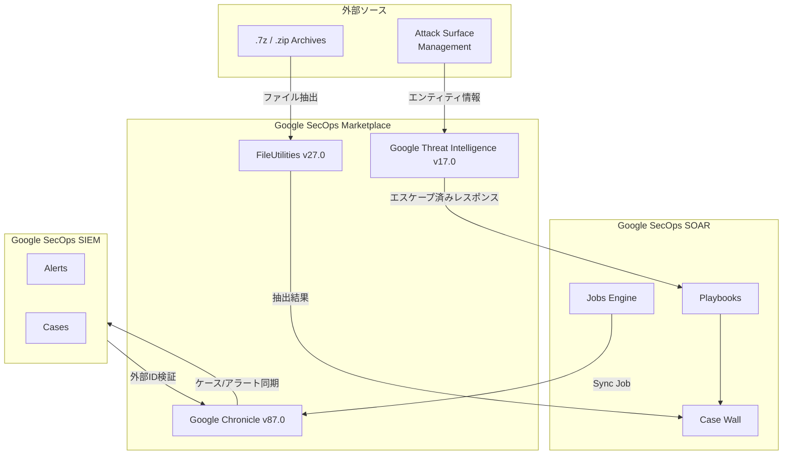

# Google SecOps Marketplace: インテグレーション アップデート (2026年7月)

**リリース日**: 2026-07-08

**サービス**: Google SecOps Marketplace

**機能**: FileUtilities v27.0 / Google Threat Intelligence v17.0 / Google Chronicle v87.0

**ステータス**: Change

📊 [このアップデートのインフォグラフィックを見る](https://takech9203.github.io/google-cloud-news-summary/20260708-secops-marketplace-updates-july-2026.html)

## 概要

Google SecOps Marketplace において、3つの主要インテグレーションがアップデートされました。FileUtilities が v27.0 に更新され .7z アーカイブからのファイル抽出に対応、Google Threat Intelligence が v17.0 に更新されウィジェット描画障害の修正、Google Chronicle が v87.0 に更新されケースとアラートの同期ロジックが改善されています。

これらのアップデートは、セキュリティオペレーションチームが日常的に使用する SOAR プレイブック内のアクションやジョブの信頼性と機能性を向上させるものです。特にインシデントレスポンスにおけるファイル解析、脅威インテリジェンスの可視化、SIEM-SOAR 間のデータ整合性に関わる改善が含まれています。

**アップデート前の課題**

- FileUtilities の Extract Zip Files アクションでは .7z 形式のアーカイブを展開できず、別途ツールや手動対応が必要だった
- Google Threat Intelligence の Get ASM Entity Details アクションにおいて、レスポンスボディに含まれる生の HTML script タグが原因でウィジェットの描画が失敗することがあった
- Google Chronicle Sync Job において、外部 ID 値の検証処理に不具合があり、ケースとアラートの同期が正しく行われないケースが存在した

**アップデート後の改善**

- FileUtilities v27.0 により、.7z アーカイブからのファイル抽出がプレイブック内で直接実行可能になった
- Google Threat Intelligence v17.0 により、extended_response_body 内の HTML script タグが適切にエスケープされ、ウィジェットが正常に描画されるようになった
- Google Chronicle v87.0 により、有効な外部 ID 値の検証ハンドリングが修正され、ケースとアラートの同期が正確に行われるようになった

## アーキテクチャ図

Google SecOps Marketplace のインテグレーションが SOAR プラットフォームと SIEM の間でどのように連携するかを示しています。FileUtilities はプレイブック内でファイル操作を担い、Google Threat Intelligence は外部脅威情報を取得し、Google Chronicle はSIEM-SOAR間のデータ同期を管理します。

## サービスアップデートの詳細

### 主要機能

1. **FileUtilities v27.0 - .7z アーカイブサポート**
   - Extract Zip Files アクションが .7z (7-Zip) 形式のアーカイブファイルからの抽出に対応
   - 既存の ZIP、パスワード保護付き ZIP と同様のパラメータ (パスワード指定、ブルートフォース、ケースウォールへの追加等) が利用可能
   - マルウェア解析やフォレンジック調査において、攻撃者が使用する .7z 圧縮ファイルの展開がプレイブック内で自動化可能に

2. **Google Threat Intelligence v17.0 - HTML エスケープ修正**
   - Get ASM Entity Details アクションの `extended_response_body` 内に含まれる生の HTML script タグを適切にエスケープ
   - これにより、ASM エンティティの詳細情報をウィジェットで表示する際の描画失敗が解消
   - Attack Surface Management のエンティティ情報を正常に可視化できるようになり、SOC アナリストの調査効率が向上

3. **Google Chronicle v87.0 - 同期ジョブ修正**
   - Google Chronicle Sync Job における有効な外部 ID 値の検証ハンドリングを修正
   - SOAR で管理されるケースとアラートが SIEM 側と正確に同期されるようになった
   - 同期失敗によるデータ不整合やアラートの取りこぼしリスクを低減

## 技術仕様

### インテグレーション バージョン情報

| インテグレーション | バージョン | 変更種別 | 影響範囲 |
|------|------|------|------|
| FileUtilities | 27.0 | 機能追加 | Extract Zip Files アクション |
| Google Threat Intelligence | 17.0 | バグ修正 | Get ASM Entity Details アクション |
| Google Chronicle | 87.0 | バグ修正 | Google Chronicle Sync Job |

### FileUtilities - Extract Zip Files アクション パラメータ

| パラメータ | 型 | 説明 |
|------|------|------|
| Include Data in JSON Result | Checkbox | 抽出データを Base64 で JSON 結果に含めるか |
| Create Entities | Checkbox | 抽出ファイルからエンティティを作成するか |
| Zip File Password | String | パスワード保護されたファイルのパスワード |
| Bruteforce Password | Checkbox | パスワードのブルートフォースを試行するか |
| Add to Case Wall | Checkbox | 抽出ファイルをケースウォールに追加するか |
| Zip Password List Delimiter | String | 複数パスワード指定時の区切り文字 |

### Google Chronicle Sync Job の同期対象

| 同期対象 | トラッキングフィールド | 同期フィールド |
|------|------|------|
| ケース | Priority, Status, Title | Priority, Status, Title, Stage, Case ID |
| アラート | Priority, Status, Case ID | Priority, Status, Alert ID, Case ID, Verdict |

## 設定方法

### 前提条件

1. Google SecOps インスタンスへのアクセス権限
2. Content Hub (Marketplace) からのインテグレーションインストール権限

### 手順

#### ステップ 1: Marketplace でインテグレーションを更新

Google SecOps コンソールにログインし、Content Hub に移動します。対象のインテグレーションを選択し、最新バージョンへの更新を実行します。

#### ステップ 2: オントロジーマッピングの確認

インテグレーション更新時に表示されるダイアログで、オントロジーマッピングの処理方法を選択します。

- **Override (マッピング置換)**: 既存のオントロジーマッピングを新しいバージョンのルールで完全に置き換える
- **Retain (既存保持)**: カスタム変更を維持したい場合に既存マッピングを保持する

#### ステップ 3: 動作確認

更新後、各インテグレーションの動作を確認します。

- FileUtilities: .7z ファイルを使用した Extract Zip Files アクションのテスト
- Google Threat Intelligence: Get ASM Entity Details アクションのウィジェット表示確認
- Google Chronicle: Sync Job のログで同期が正常に完了していることを確認

## メリット

### ビジネス面

- **インシデントレスポンスの効率化**: .7z 形式のマルウェアサンプルや証拠ファイルを追加ツールなしにプレイブック内で自動展開でき、対応時間を短縮
- **SOC アナリストの生産性向上**: ASM エンティティ情報のウィジェット描画問題が解消され、脅威の全体像を迅速に把握可能

### 技術面

- **データ整合性の向上**: Chronicle Sync Job の修正により、SIEM と SOAR 間のケース/アラートデータの一貫性が確保される
- **プレイブック自動化の範囲拡大**: .7z サポートにより、より多くのファイル形式をカバーする自動化ワークフローの構築が可能

## デメリット・制約事項

### 制限事項

- FileUtilities の .7z サポートは Extract Zip Files アクションのみが対象であり、Extract Archive アクションでの対応は明記されていない
- SaaS 環境では抽出ファイルが一時ストレージに保存されるため、永続的な保存が必要な場合は Remote Agent での実行を推奨

### 考慮すべき点

- インテグレーション更新時にオントロジーマッピングの Override を選択すると、既存のカスタムマッピングが失われる可能性がある
- 大規模環境では Chronicle Sync Job の修正後、一時的に同期バックログの処理が増加する可能性がある

## ユースケース

### ユースケース 1: マルウェア解析における .7z ファイルの自動展開

**シナリオ**: SOC チームがフィッシングメールに添付された .7z アーカイブを受信し、内部のマルウェアサンプルを解析する必要がある。

**効果**: FileUtilities v27.0 の .7z サポートにより、プレイブック内で自動的にアーカイブを展開し、抽出されたファイルをケースウォールに追加、後続のサンドボックス解析アクションに受け渡すことが可能。手動介入なしにインシデントレスポンスの初動が完了する。

### ユースケース 2: ASM エンティティの脅威可視化

**シナリオ**: セキュリティチームが外部攻撃面の監視として Google Threat Intelligence の ASM 機能を使用し、検出されたエンティティの詳細をダッシュボード上で確認する。

**効果**: v17.0 の修正により、HTML script タグを含むレスポンスでもウィジェットが正常に描画され、ASM エンティティの脆弱性情報やネットワーク詳細を中断なく確認できるようになる。

### ユースケース 3: マルチプラットフォーム環境でのアラート同期

**シナリオ**: 大規模な SOC において、サードパーティコネクタからのアラートが SOAR で処理された後、SIEM 側とケース/アラートの状態を同期する必要がある。

**効果**: Google Chronicle v87.0 の修正により、外部 ID の検証が正しく行われ、SIEM-SOAR 間でのケースとアラートの同期が確実に実行される。Priority や Status の変更がリアルタイムで反映され、両システム間の情報の一貫性が保たれる。

## 関連サービス・機能

- **Google SecOps SOAR**: セキュリティオーケストレーション、自動化、レスポンスのプラットフォーム。Marketplace インテグレーションの実行基盤
- **Google SecOps SIEM**: セキュリティ情報・イベント管理。Chronicle Sync Job によるデータ同期先
- **Google Threat Intelligence**: 脅威インテリジェンスサービス。ASM 機能によるアタックサーフェス管理を提供
- **Content Hub**: Marketplace のインテグレーション管理インターフェース

## 参考リンク

- 📊 [インフォグラフィック](https://takech9203.github.io/google-cloud-news-summary/20260708-secops-marketplace-updates-july-2026.html)
- [公式リリースノート](https://cloud.google.com/release-notes#July_08_2026)
- [FileUtilities ドキュメント](https://cloud.google.com/chronicle/docs/soar/marketplace/power-ups/file-utilities)
- [Google Threat Intelligence インテグレーション](https://cloud.google.com/chronicle/docs/soar/marketplace-integrations/google-threat-intelligence)
- [Google Chronicle インテグレーション](https://cloud.google.com/chronicle/docs/soar/marketplace-integrations/google-chronicle)
- [Content Hub の使用方法](https://cloud.google.com/chronicle/docs/soar/marketplace/using-the-marketplace)

## まとめ

今回のアップデートは Google SecOps Marketplace の 3 つの主要インテグレーションにおける機能追加とバグ修正です。特に FileUtilities の .7z サポートはインシデントレスポンスの自動化範囲を拡大し、Chronicle Sync Job の修正は SIEM-SOAR 間のデータ整合性を強化します。既存ユーザーは Content Hub から各インテグレーションを最新バージョンに更新することを推奨します。

---

**タグ**: #GoogleSecOps #SOAR #Marketplace #FileUtilities #ThreatIntelligence #Chronicle #SecurityOperations #SIEM
