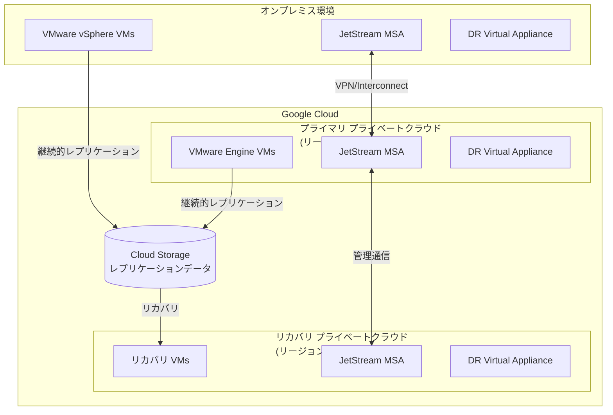
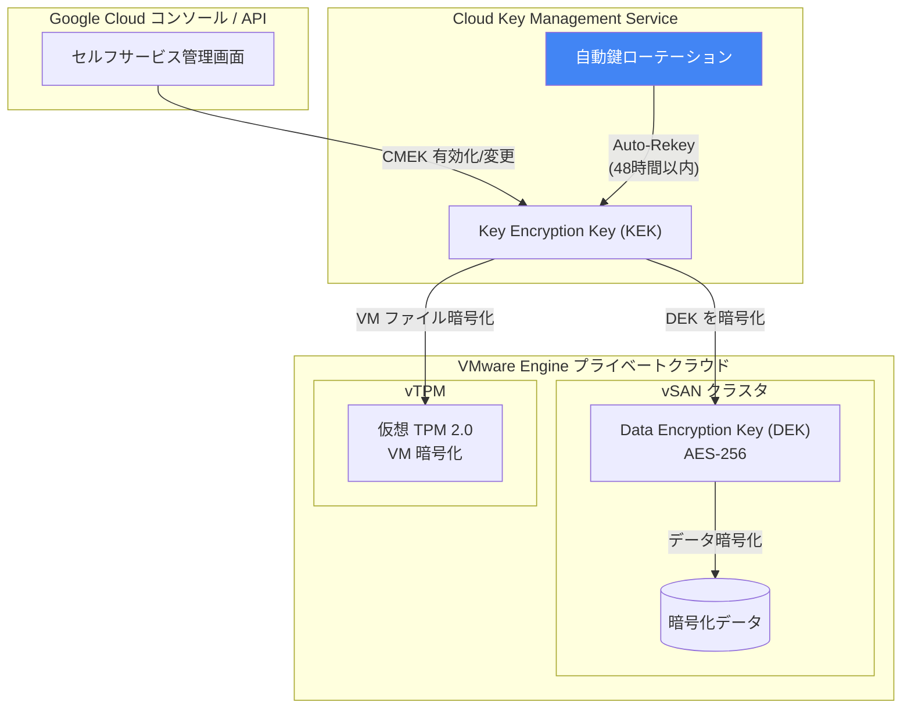

# Google Cloud VMware Engine: JetStream DR (Preview) & CMEK セルフサービス管理 (GA)

**リリース日**: 2026-07-08

**サービス**: Google Cloud VMware Engine

**機能**: JetStream によるディザスタリカバリ構成 / 顧客管理暗号鍵 (CMEK) セルフサービス管理

**ステータス**: Preview (JetStream DR) / Generally Available (CMEK セルフサービス)

[このアップデートのインフォグラフィックを見る](https://takech9203.github.io/google-cloud-news-summary/20260708-vmware-engine-jetstream-dr-cmek.html)

## 概要

Google Cloud VMware Engine に 2 つの重要なアップデートが発表された。1 つ目は JetStream を使用したディザスタリカバリ (DR) 構成のプレビュー提供開始であり、オンプレミス VMware 環境から Google Cloud への DR、および Google Cloud 内のプライベートクラウド間での DR が可能になる。2 つ目は顧客管理暗号鍵 (CMEK) のセルフサービス管理が GA となり、Google Cloud コンソールおよび VMware Engine API から vSAN と vTPM の暗号鍵を Cloud KMS で直接管理できるようになった。

JetStream DR は、物理的なセカンダリデータセンターの必要性を排除しながら、ビジネス継続性を確保するためのソリューションを提供する。CMEK セルフサービス管理は、暗号鍵のライフサイクル管理をユーザー自身で完結できるようにし、Auto-Rekey 機能により手動介入なしでの鍵ローテーションを実現する。

**アップデート前の課題**

- JetStream DR は VMware Engine で公式にサポートされておらず、オンプレミスから Google Cloud への DR 構成に追加の手動設定や検証が必要だった
- CMEK の設定・変更にはサービスチケットを通じた Google サポートへの依頼が必要で、対応に時間がかかっていた
- 暗号鍵のローテーションは手動で実施する必要があり、運用負荷が高かった
- CMEK と GMEK (Google 管理鍵) 間の切り替えにも Google サポートの介入が必要だった

**アップデート後の改善**

- JetStream を使用して、オンプレミス VMware 環境から Google Cloud VMware Engine プライベートクラウドへの DR を公式にサポート (Preview)
- Google Cloud コンソールと VMware Engine API から CMEK の有効化・変更・GMEK への切り替えをセルフサービスで実行可能に
- Auto-Rekey 機能により、Cloud KMS の鍵ローテーションと連携した自動 KEK ローテーションが実現
- ダウンタイムなしでバックグラウンドでの鍵管理が可能に

## アーキテクチャ図

### JetStream DR トポロジ



JetStream DR は、オンプレミスから Google Cloud、または Google Cloud 内のリージョン間で VM の継続的レプリケーションを実現し、Cloud Storage をレプリケーションデータの保管先として使用する。

### CMEK アーキテクチャ



CMEK アーキテクチャでは、Cloud KMS の KEK が vSAN の DEK を暗号化し、Auto-Rekey 機能が Cloud KMS の鍵ローテーションを検知して自動的に KEK を更新する。

## サービスアップデートの詳細

### 主要機能

1. **JetStream DR (Preview)**
   - オンプレミス VMware 環境から Google Cloud VMware Engine プライベートクラウドへの DR 構成
   - Google Cloud 内のプライベートクラウドを別リージョンまたはオンプレミスのリカバリサイトで保護
   - Cloud Storage を活用したレプリケーションデータの保管
   - JetStream バージョン 5.0.8 以降、vSphere 8.0 が必要
   - JetStream ソリューションのライセンスはユーザー自身で調達が必要

2. **CMEK セルフサービス管理 (GA)**
   - Google Cloud コンソールおよび VMware Engine API から CMEK の設定・管理が可能
   - プライベートクラウドごとに個別の CMEK 鍵を割り当て可能
   - vSAN データ暗号化と vTPM の両方に対応
   - CMEK と GMEK の双方向切り替えをセルフサービスで実行可能

3. **Auto-Rekey 機能**
   - Cloud KMS の鍵ローテーションを自動検知
   - バックグラウンドで浅い KEK ローテーション (shallow re-key) を実行
   - サービスダウンタイムなしで完了 (通常 48 時間以内)
   - vSAN データ全体の再暗号化は不要 (DEK は変更されない)

## 技術仕様

### JetStream DR 要件

| 項目 | 詳細 |
|------|------|
| JetStream バージョン | 5.0.8 以降 |
| vSphere バージョン | 8.0 |
| ネットワーク接続 | VPN または Cloud Interconnect |
| ストレージ | Cloud Storage (リージョナルバケット、HMAC 認証) |
| ライセンス | JetStream ライセンス + VCF ライセンス (ユーザー調達) |

### CMEK 技術仕様

| 項目 | 詳細 |
|------|------|
| 暗号化アルゴリズム | AES-256 (FIPS 140-2 Level 1 準拠) |
| KEK 管理 | Cloud Key Management Service |
| 対象 | vSAN データ暗号化、vTPM |
| 鍵のスコープ | プライベートクラウド単位 |
| リージョン要件 | プライベートクラウドと同一リージョンの Cloud KMS 鍵が必要 |
| グローバル鍵 | 非サポート |

### CMEK API 設定例

```bash
# プライベートクラウド作成時に CMEK を有効化
curl -X POST \
  -H "Authorization: Bearer $(gcloud auth print-access-token)" \
  -H "Content-Type: application/json; charset=utf-8" \
  "https://vmwareengine.googleapis.com/v1/projects/PROJECT_ID/locations/LOCATION/privateClouds?private_cloud_id=PC_ID" \
  -d '{
    "networkConfig": {
      "vmwareEngineNetwork": "projects/PROJECT_ID/locations/global/vmwareEngineNetworks/NETWORK_ID",
      "managementCidr": "CIDR_RANGE"
    },
    "managementCluster": {
      "clusterId": "CLUSTER_ID",
      "nodeTypeConfigs": {
        "NODE_TYPE": { "nodeCount": COUNT }
      }
    },
    "encryptionConfig": {
      "cryptoKeyName": "projects/PROJECT_ID/locations/LOCATION/keyRings/RING/cryptoKeys/KEY"
    }
  }'
```

```bash
# 既存プライベートクラウドの CMEK 鍵を更新
curl -X PATCH \
  -H "Authorization: Bearer $(gcloud auth print-access-token)" \
  -H "Content-Type: application/json; charset=utf-8" \
  "https://vmwareengine.googleapis.com/v1/projects/PROJECT_ID/locations/LOCATION/privateClouds/PC_ID?updateMask=encryptionConfig" \
  -d '{
    "encryptionConfig": {
      "cryptoKeyName": "projects/PROJECT_ID/locations/LOCATION/keyRings/RING/cryptoKeys/KEY"
    }
  }'
```

## 設定方法

### JetStream DR の設定

#### 前提条件

1. オンプレミスネットワークと VMware Engine プライベートクラウド間の接続 (VPN/Interconnect)
2. DNS フォワーディングの構成 (gve.goog ドメイン)
3. JetStream バージョン 5.0.8 以降のライセンス
4. Cloud Storage HMAC アクセスキーの作成
5. VMware Engine ソリューションユーザーアカウントの権限昇格

#### ステップ 1: JetStream MSA のデプロイ

JetStream Management Server Appliance (MSA) の OVA をダウンロードし、プライベートクラウドの vCenter にデプロイする。

#### ステップ 2: vCenter プラグインのインストール

ソリューションユーザーアカウント (権限昇格済み) を使用して vCenter にサインインし、JetStream vCenter プラグインをインストールする。

#### ステップ 3: サービスアカウントの構成

```bash
# MSA にサインインしてサービスアカウント構成スクリプトを実行
cd /opt/fio/vme2/python/
pwsh ./manage_iofrest_user.ps1
```

#### ステップ 4: Cloud Storage リージョンの設定

```bash
# MSA で Cloud Storage リージョンを設定
sudo echo "jss.dr.rs.cloudian.region=<cloud-storage-region>" | \
  sudo tee -a /var/lib/vme2/conf/server.properties
sudo systemctl restart msa-tomcat
```

#### ステップ 5: ストレージサイトと VM 保護の構成

vCenter の JetStream UI からストレージサイト (Cloud Storage) を追加し、保護対象の VM を選択する。

### CMEK セルフサービスの設定

#### 前提条件

1. Cloud KMS に暗号鍵が作成済みであること
2. VMware Engine サービスアカウントに `roles/cloudkms.cryptoKeyEncrypterDecrypter` ロールが付与済みであること

#### ステップ 1: IAM 権限の付与

```bash
# VMware Engine サービスアカウントに Cloud KMS 暗号化/復号権限を付与
gcloud kms keys add-iam-policy-binding KEY_NAME \
  --keyring=KEY_RING \
  --location=LOCATION \
  --member="serviceAccount:service-PROJECT_NUMBER@gcp-sa-vmwareengine.iam.gserviceaccount.com" \
  --role="roles/cloudkms.cryptoKeyEncrypterDecrypter"
```

#### ステップ 2: CMEK の有効化

Google Cloud コンソールの Private clouds ページから対象のプライベートクラウドを選択し、Encryption セクションで「Customer-managed encryption keys (CMEK)」を選択して Cloud KMS 鍵のリソース名を入力する。

## メリット

### ビジネス面

- **DR コスト削減**: 物理的なセカンダリデータセンターが不要になり、TCO を削減
- **運用効率の向上**: CMEK のセルフサービス管理により、サポートチケット不要で即座に暗号鍵を管理可能
- **コンプライアンス対応の迅速化**: プライベートクラウドごとに個別の暗号鍵を割り当てることで、データレジデンシー要件に柔軟に対応
- **グローバル展開**: Google Cloud の世界各地のリージョンを活用した地理的なレジリエンスを実現

### 技術面

- **継続的レプリケーション**: JetStream が VM を継続的にレプリケートし、RPO を最小化
- **ゼロダウンタイム鍵管理**: Auto-Rekey がバックグラウンドで KEK ローテーションを完了
- **浅い再暗号化**: DEK は変更せず KEK のみを更新するため、vSAN 全体の再暗号化が不要
- **柔軟な暗号化切り替え**: CMEK と GMEK を必要に応じて相互に切り替え可能

## デメリット・制約事項

### 制限事項

- JetStream DR は Preview 段階であり、「Pre-GA Offerings Terms」が適用される
- JetStream DR にはバージョン 5.0.8 以降と vSphere 8.0 が必要
- JetStream ライセンスおよび VCF ライセンスはユーザー自身で調達が必要
- CMEK セルフサービスは、サービスチケット経由で CMEK を設定済みのプライベートクラウドでは利用不可
- Cloud KMS のグローバル鍵は vSAN 暗号化に使用不可 (同一リージョンの鍵が必要)

### 考慮すべき点

- Cloud KMS 鍵が無効化・取り消しされた場合、依存する vSAN 操作がすべて失敗する
- vTPM を使用する VM では、KMS 鍵ローテーション後に各 VM の Re-encrypt (浅い再暗号化) を手動実行する必要がある
- Re-encrypt を実施せずに古い鍵バージョンを削除すると、vMotion 失敗や VM 起動失敗のリスクがある
- JetStream DR では Cloud Storage のリージョナルバケットのみサポート (Preview 期間中)
- Auto-Rekey の完了には最大 48 時間かかる場合がある

## ユースケース

### ユースケース 1: オンプレミスから Google Cloud への DR

**シナリオ**: オンプレミスのデータセンターで VMware vSphere 環境を運用している企業が、セカンダリ DR サイトの維持コストを削減しつつ、ビジネス継続性を確保したい。

**実装例**:
- オンプレミス環境に JetStream MSA と DRVA をデプロイ
- Google Cloud VMware Engine プライベートクラウドをリカバリサイトとして構成
- Cloud Storage に VM レプリケーションデータを保管
- 災害時にリカバリサイトで VM をフェイルオーバー

**効果**: 物理 DR サイトの維持コストを排除しながら、Google Cloud のグローバルインフラストラクチャを活用した地理的冗長性を実現。

### ユースケース 2: コンプライアンス要件に応じた暗号鍵管理

**シナリオ**: 金融機関が規制要件に基づき、VMware Engine 上のワークロードに対して自社管理の暗号鍵を使用する必要があり、かつ定期的な鍵ローテーションを自動化したい。

**実装例**:
- プライベートクラウドごとに個別の Cloud KMS 鍵を割り当て
- Cloud KMS の自動ローテーションポリシーを設定 (例: 90 日ごと)
- Auto-Rekey により vSAN の KEK が自動更新

**効果**: 規制要件を満たしつつ、手動の鍵管理作業を排除し、ダウンタイムなしでセキュリティを維持。

### ユースケース 3: マルチリージョン DR とデータ主権

**シナリオ**: グローバル企業がリージョンごとにデータ主権要件が異なるワークロードを運用しており、各リージョンで独立した DR と暗号鍵管理が必要。

**効果**: プライベートクラウドごとの CMEK 割り当てにより、リージョン固有のコンプライアンス要件に対応しながら、JetStream DR で異なるリージョン間の保護を実現。

## 料金

### VMware Engine ノード料金

VMware Engine のノード料金はオンデマンドおよび 1 年/3 年の確約利用割引 (CUD) で提供される。詳細な料金は [VMware Engine pricing](https://cloud.google.com/vmware-engine/pricing) を参照。

### 追加コスト

| 項目 | 料金 |
|------|------|
| Cloud KMS 鍵操作 | Cloud KMS の標準料金が適用 |
| JetStream ライセンス | サードパーティからの別途調達 |
| VCF ライセンス | ポータブルライセンスまたは Google 経由調達 |
| Cloud Storage (DR データ保管) | Cloud Storage の標準料金が適用 |

## 関連サービス・機能

- **Cloud Key Management Service (Cloud KMS)**: CMEK の鍵管理基盤。暗号鍵の作成、ローテーション、アクセス制御を提供
- **Cloud Storage**: JetStream DR のレプリケーションデータ保管先。HMAC 認証による S3 互換アクセスをサポート
- **Cloud Interconnect / Cloud VPN**: オンプレミスと VMware Engine プライベートクラウド間のネットワーク接続
- **Backup and DR Service**: VMware Engine ワークロードのバックアップ保護 (JetStream DR とは別のソリューション)
- **VMware Site Recovery Manager (SRM)**: VMware Engine がサポートする別の DR ソリューション (vSphere Replication ベース)

## 参考リンク

- [このアップデートのインフォグラフィック](https://takech9203.github.io/google-cloud-news-summary/20260708-vmware-engine-jetstream-dr-cmek.html)
- [公式リリースノート](https://cloud.google.com/release-notes#July_08_2026)
- [Configure disaster recovery using JetStream](https://docs.cloud.google.com/vmware-engine/docs/vmware-ecosystem/howto-disaster-recovery-jetstream)
- [vSAN encryption (CMEK)](https://docs.cloud.google.com/vmware-engine/docs/vmware-ecosystem/howto-vsan-encryption)
- [vTPM ドキュメント](https://docs.cloud.google.com/vmware-engine/docs/vmware-ecosystem/howto-vtpm)
- [VMware Engine 料金](https://cloud.google.com/vmware-engine/pricing)
- [Cloud KMS ドキュメント](https://cloud.google.com/kms/docs)

## まとめ

今回のアップデートにより、Google Cloud VMware Engine のディザスタリカバリと暗号鍵管理の両面で大幅な改善が実現された。JetStream DR (Preview) はオンプレミスからクラウドへの移行パスを提供し、CMEK セルフサービス管理 (GA) はセキュリティ運用の自動化と簡素化を実現する。特に CMEK の Auto-Rekey 機能は、鍵ローテーションのコンプライアンス要件を満たしつつ運用負荷を最小化する点で、エンタープライズユーザーにとって価値が高い。VMware Engine を利用する組織は、CMEK セルフサービスへの移行と JetStream DR の評価を検討すべきである。

---

**タグ**: #GoogleCloud #VMwareEngine #JetStream #DisasterRecovery #CMEK #CloudKMS #vSAN #vTPM #暗号化 #Preview #GA
