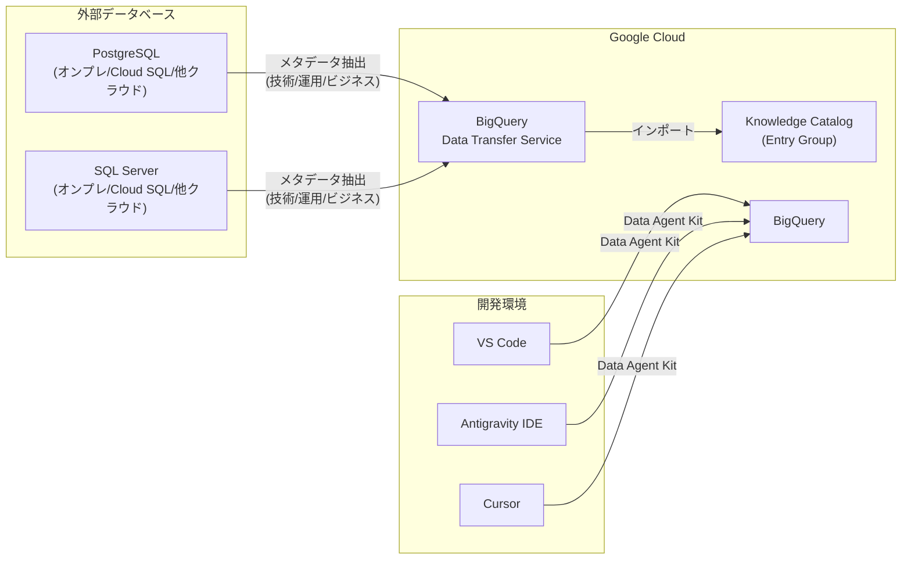

# BigQuery: Data Transfer Service メタデータ転送 / Data Agent Kit / ハイブリッド検索一時無効化

**リリース日**: 2026-07-09

**サービス**: BigQuery

**機能**: Data Transfer Service メタデータ転送 (PostgreSQL/SQL Server)、Data Agent Kit IDE 拡張機能、VECTOR_SEARCH ハイブリッド検索一時無効化

**ステータス**: Preview (メタデータ転送・Agent Kit) / 一時無効化 (ハイブリッド検索)

:bar_chart: [このアップデートのインフォグラフィックを見る](https://takech9203.github.io/google-cloud-news-summary/20260709-bigquery-data-transfer-metadata-agent-kit.html)

## 概要

2026年7月9日、BigQuery に関連する3つのアップデートが発表された。第一に、BigQuery Data Transfer Service を活用した Knowledge Catalog (旧 Dataplex Universal Catalog) コネクタが PostgreSQL および Microsoft SQL Server からのメタデータインポートに対応した (Preview)。第二に、Data Agent Kit 拡張機能が VS Code、Antigravity IDE、Cursor で利用可能となり、IDE 内から直接 BigQuery リソースを操作できるようになった (Preview)。第三に、VECTOR_SEARCH 関数のハイブリッド検索 (セマンティック検索 + レキシカル検索の組み合わせ) サポートが一時的に無効化された。

メタデータ転送機能は、外部データベースのスキーマ情報やテーブル定義を Knowledge Catalog に自動的にインポートし、データガバナンスの一元管理を実現する。Data Agent Kit は開発者がコンテキストスイッチなしにデータワークロードを管理できる統合 IDE 環境を提供する。ハイブリッド検索の一時無効化は、機能改善のための一時的措置と考えられる。

**アップデート前の課題**

- PostgreSQL や SQL Server のメタデータを Knowledge Catalog に登録するには、カスタムコネクタの開発や手動での登録が必要だった
- 開発者は BigQuery の操作のために Google Cloud コンソール、CLI、IDE 間を頻繁に切り替える必要があった
- VECTOR_SEARCH でセマンティック検索とキーワード検索を組み合わせたハイブリッド検索が利用可能だった

**アップデート後の改善**

- BigQuery Data Transfer Service のプリビルトコネクタにより、PostgreSQL/SQL Server からのメタデータ自動インポートが可能になった
- Data Agent Kit 拡張機能により、VS Code/Antigravity/Cursor 内から直接 BigQuery リソースの操作、クエリ実行、パイプライン管理が可能になった
- ハイブリッド検索は一時的に利用不可となったため、セマンティック検索のみ、またはレキシカル検索のみでの運用が必要になった

## アーキテクチャ図



BigQuery Data Transfer Service が外部データベースからメタデータを抽出し Knowledge Catalog にインポートするフロー (左側) と、Data Agent Kit 拡張機能が各 IDE から BigQuery に接続する構成 (右側) を示す。

## サービスアップデートの詳細

### 主要機能

1. **Knowledge Catalog コネクタ (PostgreSQL/SQL Server メタデータ転送)**
   - BigQuery Data Transfer Service を活用したプリビルトコネクタ
   - 以下のメタデータタイプを自動抽出・インポート:
     - **技術メタデータ**: データベース、スキーマ、テーブル、ビューの定義
     - **運用メタデータ**: アセットの作成日時・最終更新日時
     - **ビジネスメタデータ**: アセットオーナー、アノテーション
   - スケジュール設定による定期的なメタデータ同期
   - オンプレミス、Cloud SQL、他クラウド環境の PostgreSQL/SQL Server インスタンスに対応
   - Private Service Connect 経由のネットワークアタッチメントによるプライベート接続をサポート

2. **Data Agent Kit 拡張機能 (VS Code/Antigravity/Cursor)**
   - IDE 内から BigQuery リソースを直接操作可能
   - 主要な機能領域:
     - **データ探索**: Google Cloud に接続してデータをブラウズ・クエリ・分析 (Python/SQL/自然言語)
     - **パイプライン開発**: Managed Service for Apache Spark または BigQuery 上でデータエンジニアリングパイプラインを構築・テスト・デプロイ
     - **AI/ML**: データの探索・クレンジング、ML モデルのトレーニング・デプロイ
     - **エージェントスキル**: AI スキルとツールによる反復タスクの自動化
   - 対応サービス: BigQuery, Dataflow, Managed Service for Apache Spark, Managed Service for Apache Airflow, Knowledge Catalog, AlloyDB, Cloud SQL, Spanner, Cloud Storage
   - CLI エージェント (Gemini CLI, Claude Code, Codex) 向けスタータパックも提供

3. **VECTOR_SEARCH ハイブリッド検索の一時無効化**
   - `VECTOR_SEARCH` 関数の `lexical_search_columns` および `lexical_search_query_value` パラメータを使用したハイブリッド検索が一時的に無効化
   - セマンティック検索 (ベクトル検索) 単体の機能には影響なし
   - 問い合わせ先: bq-vector-search@google.com

## 技術仕様

### Knowledge Catalog コネクタ

| 項目 | 詳細 |
|------|------|
| 対応ソース | PostgreSQL, SQL Server (今回追加)、Oracle, MySQL (既存) |
| メタデータ種類 | 技術メタデータ、運用メタデータ、ビジネスメタデータ |
| 接続方式 | パブリック IP / Private Service Connect (ネットワークアタッチメント) |
| 同期方式 | フルオーバーライト (差分更新は非対応) |
| スケジュール | カスタムスケジュール / オンデマンド |
| 実行履歴保持 | 90日間 |
| TLS サポート | あり (PEM 証明書指定可能) |
| CMEK | サポート (一時データの暗号化用) |

### Data Agent Kit 必要権限

| IAM ロール | 用途 |
|------|------|
| BigQuery Data Viewer (`roles/bigquery.dataViewer`) | データ閲覧 |
| BigQuery Job User (`roles/bigquery.jobUser`) | ジョブ実行 |
| BigQuery Metadata Viewer (`roles/bigquery.metadataViewer`) | メタデータ閲覧 |
| BigQuery Read Session User (`roles/bigquery.readSessionUser`) | 読み取りセッション |
| Dataproc Editor (`roles/dataproc.editor`) | Spark 操作 |

### VECTOR_SEARCH ハイブリッド検索 (一時無効化)

```sql
-- 以下の構文は一時的に利用不可
VECTOR_SEARCH(
  TABLE mydataset.base_table,
  "my_embedding",
  query_value => [1.0, -1.0],
  lexical_search_columns => ["description"],     -- 一時無効化
  lexical_search_query_value => "search term",   -- 一時無効化
  top_k => 10
);
```

## 設定方法

### 前提条件 (Knowledge Catalog コネクタ)

1. Knowledge Catalog API と BigQuery Data Transfer Service API の有効化
2. 必要な IAM ロールの付与:
   - Dataplex Catalog Admin/Editor または Entry Group Owner
   - BigQuery Admin
   - Logs Viewer
3. BigQuery Data Transfer Service サービスエージェントへの `roles/dataplex.entryGroupImporter` 付与
4. PostgreSQL/SQL Server の接続情報 (ホスト、ポート、DB名、ユーザー名、パスワード)
5. プライベート接続の場合: ネットワークアタッチメントの作成

### 手順

#### ステップ 1: Knowledge Catalog コネクタの設定

1. Google Cloud コンソールで Knowledge Catalog ページを開く
2. ナビゲーションメニューの「Manage」セクションで「Connectors」をクリック
3. 「Add connection」をクリック
4. コネクタリストから PostgreSQL または SQL Server を選択
5. データソース接続情報を入力 (ホスト、ポート、DB名、認証情報、TLS 設定)
6. インポート対象のメタデータオブジェクトを選択
7. 宛先の Knowledge Catalog Entry Group を選択または新規作成
8. スケジュールを設定して保存

#### ステップ 2: Data Agent Kit のインストール (VS Code)

```bash
# gcloud CLI のインストールと認証
gcloud init
gcloud auth login && gcloud auth application-default login
gcloud components update
```

1. VS Code で Extensions (Ctrl/Cmd+Shift+X) を開く
2. 「Google Cloud Data Agent Kit」を検索
3. Install をクリック
4. プロジェクト ID とリージョンを設定

## メリット

### ビジネス面

- **データガバナンスの一元管理**: 外部データベースのメタデータを Knowledge Catalog で一元管理し、データリネージの可視化やコンプライアンス対応を効率化
- **開発生産性の向上**: IDE を離れることなく BigQuery リソースを操作できるため、コンテキストスイッチによる生産性低下を防止
- **データ資産の発見性向上**: PostgreSQL/SQL Server のテーブルやビューが Knowledge Catalog で検索可能になり、組織全体でのデータ活用を促進

### 技術面

- **自動メタデータ同期**: スケジュール設定による定期実行で、カタログとソースシステムの同期を自動化
- **セキュアな接続**: Private Service Connect によるプライベートネットワーク経由の接続をサポート
- **マルチ IDE 対応**: VS Code、Antigravity、Cursor、さらに CLI エージェント (Gemini CLI, Claude Code, Codex) にも対応

## デメリット・制約事項

### 制限事項

- **メタデータのみの転送**: Knowledge Catalog コネクタはメタデータのみをインポートし、実データの転送は行わない
- **フルオーバーライト同期**: 差分更新は非対応。毎回全エントリを上書きする方式
- **ハイブリッド検索の一時無効化**: VECTOR_SEARCH のレキシカル検索パラメータが使用不可。再有効化の時期は未定
- **Data Agent Kit の IAM 認証制約**: AlloyDB や Cloud SQL への接続はビルトイン認証や Auth Proxy 非対応。IAM 認証の有効化が必須
- **パイプラインのデプロイ制約**: Data Agent Kit の自動デプロイは GitHub Actions のみ対応

### 考慮すべき点

- Knowledge Catalog コネクタは Preview 段階であり、本番環境での利用には限定的なサポートとなる
- Data Agent Kit も Preview 段階であり、機能や API が変更される可能性がある
- ハイブリッド検索を利用していたワークロードは、セマンティック検索のみ、または代替のレキシカル検索手段への切り替えが必要

## ユースケース

### ユースケース 1: マルチクラウド環境のデータカタログ統合

**シナリオ**: オンプレミスの PostgreSQL と AWS 上の SQL Server にデータ資産が分散している組織が、Google Cloud の Knowledge Catalog で統合的なデータカタログを構築する。

**実装例**:
1. PostgreSQL コネクタでオンプレ DB のテーブル定義・スキーマ情報を Knowledge Catalog にインポート
2. SQL Server コネクタで AWS 上の DB メタデータを同様にインポート
3. BigQuery ネイティブテーブルと合わせて、組織全体のデータ資産を一元検索可能に

**効果**: データスチュワードが組織全体のデータ資産を単一のカタログで管理・検索でき、データガバナンスの強化とデータ活用の促進を同時に実現。

### ユースケース 2: データエンジニアの IDE 統合ワークフロー

**シナリオ**: データエンジニアが VS Code 内で BigQuery のデータセット探索からパイプライン開発・デプロイまでを一貫して実行する。

**実装例**:
1. Data Agent Kit でプロジェクトのデータセットをブラウズ
2. 自然言語で「売上データの前年比を計算するクエリを作成して」と指示
3. 生成されたクエリを実行・検証
4. Managed Service for Apache Spark 上にパイプラインとしてデプロイ

**効果**: IDE とコンソール間の切り替えが不要になり、開発サイクルが短縮。エージェント機能によりボイラープレートコードの自動生成も可能。

## 料金

### Knowledge Catalog コネクタ

Knowledge Catalog および BigQuery Data Transfer Service からのメタデータインポートに追加料金は発生しない。Knowledge Catalog の標準利用料金 (メタデータストレージ等) が適用される。

### Data Agent Kit

Data Agent Kit 拡張機能自体は無料。BigQuery のクエリ実行や Managed Service for Apache Spark の利用には標準料金が適用される。

### BigQuery VECTOR_SEARCH

オンデマンドまたはエディション料金に基づく BigQuery コンピュート料金が適用される。

詳細は [BigQuery 料金ページ](https://cloud.google.com/bigquery/pricing) および [Knowledge Catalog 料金ページ](https://cloud.google.com/dataplex/pricing) を参照。

## 利用可能リージョン

- **Knowledge Catalog コネクタ**: BigQuery Data Transfer Service がサポートする全リージョンで利用可能。転送先データセットのロケーションと同じリージョンに構成が作成される。
- **Data Agent Kit**: Google Cloud プロジェクトがサポートする全リージョンで利用可能。BigQuery リージョンの設定は拡張機能内で個別に指定可能。

## 関連サービス・機能

- **Knowledge Catalog (旧 Dataplex Universal Catalog)**: メタデータ管理とデータガバナンスのためのサービス。今回のコネクタの宛先となる
- **BigQuery Data Transfer Service**: データ転送の自動化サービス。コネクタの実行基盤として利用される
- **Private Service Connect**: プライベートネットワーク経由でのセキュアな接続を提供
- **Managed Service for Apache Spark**: Data Agent Kit からパイプラインをデプロイする実行環境
- **Cloud Logging**: コネクタジョブの実行ログの確認に利用
- **Vertex AI Embeddings**: VECTOR_SEARCH で使用するエンベディング生成に利用

## 参考リンク

- :bar_chart: [インフォグラフィック](https://takech9203.github.io/google-cloud-news-summary/20260709-bigquery-data-transfer-metadata-agent-kit.html)
- [公式リリースノート](https://docs.cloud.google.com/release-notes#July_09_2026)
- [PostgreSQL メタデータ転送ドキュメント](https://docs.cloud.google.com/bigquery/docs/postgresql-transfer#transfer_metadata)
- [SQL Server メタデータ転送ドキュメント](https://docs.cloud.google.com/bigquery/docs/sqlserver-transfer#transfer_metadata)
- [Data Agent Kit 拡張機能](https://docs.cloud.google.com/data-cloud-extension)
- [Knowledge Catalog コネクタ概要](https://docs.cloud.google.com/dataplex/docs/connectors)
- [VECTOR_SEARCH 関数リファレンス](https://docs.cloud.google.com/bigquery/docs/reference/standard-sql/search_functions#vector_search)
- [BigQuery 料金ページ](https://cloud.google.com/bigquery/pricing)
- [Knowledge Catalog 料金ページ](https://cloud.google.com/dataplex/pricing)

## まとめ

今回のアップデートにより、BigQuery エコシステムのデータガバナンスと開発者体験が大幅に強化された。Knowledge Catalog コネクタの PostgreSQL/SQL Server 対応は、マルチクラウド・ハイブリッド環境でのメタデータ統合管理を容易にする。Data Agent Kit は開発者の日常ワークフローに BigQuery を自然に統合する。ハイブリッド検索の一時無効化については、利用中のワークロードがある場合はセマンティック検索のみへの切り替えを検討し、bq-vector-search@google.com で最新状況を確認することを推奨する。

---

**タグ**: #BigQuery #DataTransferService #KnowledgeCatalog #メタデータ管理 #DataAgentKit #IDE #VSCode #ハイブリッド検索 #VECTOR_SEARCH #Preview
