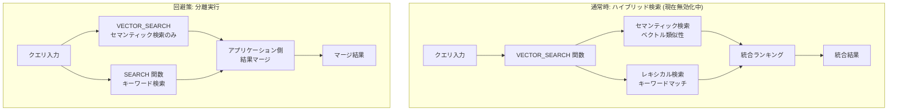

# BigQuery: ハイブリッド検索機能の一時的な無効化

**リリース日**: 2026-07-09

**サービス**: BigQuery

**機能**: VECTOR_SEARCH ハイブリッド検索 (セマンティック検索 + レキシカル検索の統合)

**ステータス**: Preview (一時的に無効化)

[このアップデートのインフォグラフィックを見る](https://takech9203.github.io/google-cloud-news-summary/20260709-bigquery-hybrid-search-disabled.html)

## 概要

BigQuery の VECTOR_SEARCH 関数において、セマンティック検索とレキシカル (キーワード) 検索を組み合わせるハイブリッド検索機能が一時的に無効化されました。Google Cloud はこの機能の復旧に取り組んでおり、可能な限り早期の復元を予定しています。

ハイブリッド検索は Preview ステータスの機能であり、VECTOR_SEARCH 関数の単一クエリ構文で `lexical_search_columns` および `lexical_search_query_value` パラメータを使用することで、ベクトル類似性検索とキーワードベースの検索を単一のクエリで実行できる機能です。RAG (Retrieval-Augmented Generation) パイプラインや情報検索アプリケーションで活用されていたこの機能が一時的に利用できなくなるため、影響を受けるユーザーは代替手段を検討する必要があります。

**一時無効化前の状態**

VECTOR_SEARCH 関数のハイブリッド検索モードが正常に動作していた状態では、以下が可能でした。

- セマンティック検索とキーワード検索を単一の VECTOR_SEARCH クエリで同時実行できた
- `lexical_search_columns` パラメータで検索対象の STRING カラムを指定可能だった
- ベクトルインデックスにレキシカル情報を含めることで高速なハイブリッド検索が実現できた

**一時無効化後の影響**

今回の一時的な無効化により、以下の対応が必要になります。

- VECTOR_SEARCH のハイブリッド検索パラメータ (`lexical_search_columns`, `lexical_search_query_value`) を使用したクエリが実行不可になった
- セマンティック検索とキーワード検索を別々のクエリとして分離実行する回避策が必要になった
- 統合検索結果のランキングやマージロジックをアプリケーション側で実装する必要が生じた

## アーキテクチャ図



上図は、ハイブリッド検索が有効な場合 (上段、現在無効化中) と、回避策として分離実行する場合 (下段) のデータフローを示しています。

## サービスアップデートの詳細

### 主要な影響範囲

1. **VECTOR_SEARCH ハイブリッド検索モード**
   - `lexical_search_columns` パラメータを指定した VECTOR_SEARCH クエリが実行不可
   - `lexical_search_query_value` パラメータを使用した統合検索が利用不可
   - 単一クエリ構文 (`query_value` を使用する形式) でのハイブリッド検索のみが影響対象

2. **影響を受けないモード**
   - VECTOR_SEARCH のバッチ検索 (通常のセマンティック検索) は引き続き利用可能
   - 単一クエリ構文でのセマンティック検索のみの利用は影響なし
   - AI.SEARCH 関数による検索は影響なし

3. **ステータスと復旧見通し**
   - Google Cloud は機能復旧に取り組んでいることを公表
   - 復旧時期の明確なタイムラインは未公開
   - フィードバックや問い合わせ先: bq-vector-search@google.com

## 技術仕様

### 影響を受けるクエリ構文

| 項目 | 詳細 |
|------|------|
| 対象関数 | `VECTOR_SEARCH` |
| 対象構文 | 単一クエリ構文 (single search syntax) |
| 無効化パラメータ | `lexical_search_columns`, `lexical_search_query_value` |
| ステータス | Preview (Pre-GA) |
| バッチ検索 | 影響なし (引き続き利用可能) |

### 無効化されたクエリ例

```sql
-- このクエリは現在実行できません
SELECT *
FROM VECTOR_SEARCH(
  TABLE mydataset.base_table,
  "my_embedding",
  query_value => [1.0, -1.0],
  lexical_search_columns => ["description"],
  lexical_search_query_value => "striped hunter",
  top_k => 10
);
```

## 回避策

### 前提条件

1. BigQuery プロジェクトへのアクセス権限
2. VECTOR_SEARCH 関数および SEARCH 関数の利用権限

### 手順

#### ステップ 1: セマンティック検索を単独実行

```sql
-- セマンティック検索のみを実行
SELECT *
FROM VECTOR_SEARCH(
  TABLE mydataset.base_table,
  "my_embedding",
  query_value => [1.0, -1.0],
  top_k => 20
);
```

`lexical_search_columns` パラメータを除外し、セマンティック検索のみを実行します。top_k を通常より多めに設定し、後段のフィルタリングに備えます。

#### ステップ 2: キーワード検索を別途実行

```sql
-- SEARCH 関数によるキーワード検索
SELECT *
FROM mydataset.base_table
WHERE SEARCH(description, "striped hunter");
```

BigQuery の SEARCH 関数を使用して、テキストカラムに対するキーワードベースの検索を別途実行します。

#### ステップ 3: アプリケーション側で結果をマージ

```python
# Python での結果マージ例
from google.cloud import bigquery

client = bigquery.Client()

# セマンティック検索結果
semantic_results = client.query(semantic_query).to_dataframe()

# キーワード検索結果
keyword_results = client.query(keyword_query).to_dataframe()

# 結果のマージ (Reciprocal Rank Fusion など)
merged = merge_results(semantic_results, keyword_results)
```

両方の検索結果をアプリケーション層で統合し、適切なランキングアルゴリズム (RRF など) を適用します。

## メリット

### 今回の対応による利点

- **可用性の確保**: セマンティック検索単体は引き続き利用可能であり、完全なサービス停止ではない
- **透明性**: Google Cloud が問題を公表し、復旧に向けた取り組みを明示している

### 回避策のメリット

- **柔軟なランキング**: アプリケーション側でランキングロジックをカスタマイズできる
- **段階的な移行**: ハイブリッド検索復旧後にスムーズに元の構成に戻せる

## デメリット・制約事項

### 制限事項

- ハイブリッド検索を利用中のアプリケーションは即座にクエリ修正が必要
- 分離実行では BigQuery 内部での最適化されたランキング統合が利用不可
- 2 つのクエリを実行するためコストおよびレイテンシが増加する可能性あり

### 考慮すべき点

- Preview 機能であるため SLA の対象外であることに留意
- 復旧時期が未定のため、回避策の長期運用を計画に含める必要がある
- 回避策では、ハイブリッド検索が提供していた統合スコアリングの品質を完全に再現することは難しい

## ユースケース

### ユースケース 1: RAG パイプラインでの文書検索

**シナリオ**: LLM アプリケーションの RAG パイプラインで、BigQuery に格納した文書データに対してハイブリッド検索を実行し、セマンティックな関連性とキーワードの正確性を両立した検索結果を LLM のコンテキストとして提供していた場合。

**回避策の実装例**:
```sql
-- 1. セマンティック検索で関連文書を取得
CREATE TEMP TABLE semantic_hits AS
SELECT base.doc_id, base.content, distance
FROM VECTOR_SEARCH(
  TABLE mydataset.documents, "embedding",
  query_value => AI.EMBED("製品仕様書のセキュリティ要件", 
    endpoint => 'text-embedding-005'),
  top_k => 50
);

-- 2. キーワード検索で正確なマッチを取得
CREATE TEMP TABLE keyword_hits AS
SELECT doc_id, content
FROM mydataset.documents
WHERE SEARCH(content, "セキュリティ要件 認証");

-- 3. 両方の結果を統合
SELECT COALESCE(s.doc_id, k.doc_id) AS doc_id,
       COALESCE(s.content, k.content) AS content
FROM semantic_hits s
FULL OUTER JOIN keyword_hits k ON s.doc_id = k.doc_id
ORDER BY s.distance ASC NULLS LAST;
```

**効果**: ハイブリッド検索復旧までの間、検索品質をある程度維持しつつ RAG パイプラインを継続運用できる

### ユースケース 2: EC サイトの商品検索

**シナリオ**: 商品名やブランド名 (キーワード) と商品説明の意味的類似性 (セマンティック) を組み合わせて検索していた EC サイトのバックエンド。

**効果**: 分離実行とアプリケーション側のマージにより、商品検索の可用性を維持

## 料金

ハイブリッド検索の無効化自体に追加料金は発生しません。ただし回避策として 2 つのクエリを実行する場合、以下のコスト増加が考えられます。

### 料金への影響

| 項目 | 影響 |
|------|------|
| クエリスキャン量 | 2 回のクエリ実行により増加の可能性 |
| VECTOR_SEARCH (セマンティック) | 従来通りの課金 |
| SEARCH 関数 (キーワード) | 追加のスキャンコスト発生 |
| アプリケーション側処理 | Compute リソース (Cloud Run 等) のコスト |

## 利用可能リージョン

本件はリージョンに依存しない全リージョン共通の一時無効化です。ハイブリッド検索が利用可能であった全てのリージョンおよびマルチリージョン (US, EU) が影響を受けます。

## 関連サービス・機能

- **BigQuery VECTOR_SEARCH (セマンティック検索)**: 引き続き利用可能。ハイブリッドモード以外は影響なし
- **BigQuery SEARCH 関数**: キーワード検索の回避策として利用可能
- **BigQuery AI.SEARCH 関数**: 自律的エンベディング生成を使用した検索。本件との直接的な関連は未確認
- **Vertex AI Vector Search**: BigQuery 外でのベクトル検索代替手段。ハイブリッド検索もサポート
- **BigQuery ベクトルインデックス**: インデックス自体は引き続き有効。レキシカル情報を含むインデックスの新規作成への影響は未確認

## 参考リンク

- [インフォグラフィック](https://takech9203.github.io/google-cloud-news-summary/20260709-bigquery-hybrid-search-disabled.html)
- [公式リリースノート](https://docs.cloud.google.com/release-notes#July_09_2026)
- [VECTOR_SEARCH 関数ドキュメント](https://docs.cloud.google.com/bigquery/docs/reference/standard-sql/search_functions)
- [BigQuery ベクトル検索概要](https://docs.cloud.google.com/bigquery/docs/vector-search-intro)
- [サポート問い合わせ先](mailto:bq-vector-search@google.com)

## まとめ

BigQuery の VECTOR_SEARCH ハイブリッド検索機能 (Preview) が一時的に無効化されました。この機能を利用していた RAG パイプラインや情報検索アプリケーションは、セマンティック検索とキーワード検索を分離実行する回避策への切り替えが必要です。Google Cloud は復旧作業中であり、復旧次第リリースノートで告知されることが想定されます。影響を受けるワークロードがある場合は、bq-vector-search@google.com への問い合わせも検討してください。

---

**タグ**: #BigQuery #VectorSearch #HybridSearch #SemanticSearch #LexicalSearch #ServiceDisruption #Preview #RAG
