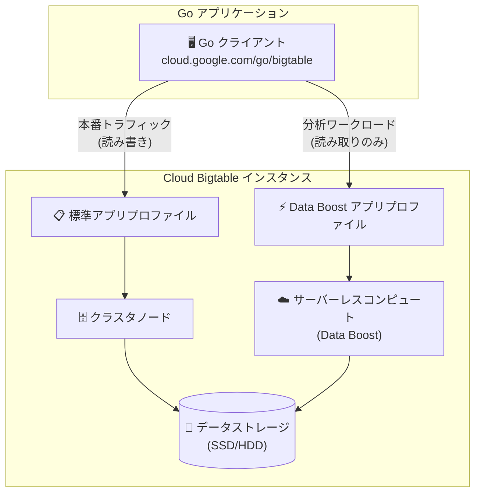

# Bigtable: Go クライアントライブラリで Data Boost が利用可能に

**リリース日**: 2026-07-09

**サービス**: Cloud Bigtable

**機能**: Go クライアントライブラリでの Data Boost サポート

**ステータス**: Feature

📊 [このアップデートのインフォグラフィックを見る](https://takech9203.github.io/google-cloud-news-summary/20260709-bigtable-go-data-boost.html)

## 概要

Bigtable の Go クライアントライブラリ (`cloud.google.com/go/bigtable`) が Data Boost に対応し、Go アプリケーションからサーバーレスコンピュートを使用した高スループットの読み取りジョブとクエリの実行が可能になった。

Data Boost は、アプリケーショントラフィックを処理するクラスタのパフォーマンスに影響を与えることなく、Bigtable データに対して高スループットの読み取りジョブを実行できるサーバーレスコンピュートサービスである。これまで Data Boost を利用するには Java クライアントライブラリ (バージョン 2.31.0 以降) が必要だったが、今回のアップデートにより Go 開発者も Data Boost の恩恵を受けられるようになった。

**アップデート前の課題**

- Go クライアントライブラリでは Data Boost を利用できず、サーバーレスコンピュートによる読み取りジョブの実行ができなかった
- Go で大規模な分析ワークロードを実行する場合、クラスタノードのリソースを消費し、アプリケーションの本番トラフィックに影響を与える可能性があった
- Data Boost を使用するためには Java への言語変更や、別途 Dataflow/Spark 経由での利用が必要だった

**アップデート後の改善**

- Go クライアントライブラリから直接 Data Boost アプリプロファイルを使用して読み取りジョブを実行可能になった
- Go アプリケーションからサーバーレスコンピュートを使用し、本番クラスタに負荷をかけずに分析ワークロードを実行できるようになった
- Go エコシステムの開発者が、言語を変更することなく Data Boost の高スループット読み取り機能を活用できるようになった

## アーキテクチャ図



Go クライアントは用途に応じて標準アプリプロファイルと Data Boost アプリプロファイルを使い分け、分析ワークロードを本番トラフィックから分離できる。

## サービスアップデートの詳細

### 主要機能

1. **Go クライアントからの Data Boost 読み取り**
   - `cloud.google.com/go/bigtable` パッケージを使用して Data Boost アプリプロファイル経由で読み取りリクエストを送信可能
   - ReadRows API を使用した高スループットスキャンに対応
   - サーバーレスコンピュートにより、クラスタノードのキャパシティに影響を与えない

2. **SQL クエリのサポート (Enterprise Plus)**
   - Enterprise Plus エディションでは、Data Boost 経由でアクセスされるデータに対して SQL クエリを実行可能
   - ExecuteQuery および PrepareQuery API メソッドに対応

3. **ワークロード分離**
   - Data Boost アプリプロファイルを使用することで、分析トラフィックと本番アプリケーショントラフィックを完全に分離
   - クラスタのノード数を分析ワークロードのために調整する必要がない

## 技術仕様

### Data Boost の要件と仕様

| 項目 | 詳細 |
|------|------|
| 対応エディション | Enterprise / Enterprise Plus |
| Go パッケージ | `cloud.google.com/go/bigtable` |
| 課金単位 | Serverless Processing Units (SPU) |
| 最小課金 | リクエストあたり 60 SPU 秒 |
| 最小 SPU レート | 10 SPU/秒 |
| データ整合性 | 書き込み後 35 分以上経過したデータが読み取り可能 |
| ルーティング | 単一クラスタルーティングのみ |

### Go での Data Boost アプリプロファイル接続設定

```go
package main

import (
    "context"
    "log"

    "cloud.google.com/go/bigtable"
)

func main() {
    ctx := context.Background()
    project := "my-project-id"
    instance := "my-instance-id"

    // Data Boost アプリプロファイルを指定してクライアントを作成
    clientConf := bigtable.ClientConfig{
        AppProfile: "data-boost-profile",
    }
    client, err := bigtable.NewClientWithConfig(ctx, project, instance, clientConf)
    if err != nil {
        log.Fatalf("Could not create client: %v", err)
    }
    defer client.Close()

    tbl := client.Open("my-table")

    // Data Boost を使用した高スループット読み取り
    err = tbl.ReadRows(ctx, bigtable.PrefixRange("row-prefix"),
        func(row bigtable.Row) bool {
            // 行の処理
            return true
        })
    if err != nil {
        log.Fatalf("Could not read rows: %v", err)
    }
}
```

## 設定方法

### 前提条件

1. Bigtable インスタンスが Enterprise または Enterprise Plus エディションであること
2. Go 開発環境がセットアップされていること
3. `cloud.google.com/go/bigtable` パッケージの最新バージョンがインストールされていること

### 手順

#### ステップ 1: Data Boost アプリプロファイルの作成

```bash
gcloud bigtable app-profiles create data-boost-profile \
    --instance=INSTANCE_ID \
    --data-boost \
    --data-boost-compute-billing-owner=HOST_PAYS \
    --route-to=CLUSTER_ID
```

指定するクラスタは、Data Boost で読み取り対象とするデータが格納されているクラスタを選択する。

#### ステップ 2: Go クライアントライブラリのインストール

```bash
go get cloud.google.com/go/bigtable@latest
```

#### ステップ 3: アプリケーションコードの更新

`bigtable.ClientConfig` の `AppProfile` フィールドに Data Boost アプリプロファイル ID を指定してクライアントを作成する。

```go
clientConf := bigtable.ClientConfig{
    AppProfile: "data-boost-profile",
}
client, err := bigtable.NewClientWithConfig(ctx, project, instance, clientConf)
```

## メリット

### ビジネス面

- **Go エコシステムの活用**: Go で構築された既存のデータパイプラインやバッチ処理システムから、言語変更なしに Data Boost を利用可能
- **コスト最適化**: サーバーレスで使用した分だけ課金されるため、常時ノードをプロビジョニングする必要がない
- **SLA への影響なし**: 分析ワークロードが本番アプリケーションのパフォーマンスに影響しないため、安定した SLA を維持

### 技術面

- **ワークロード分離**: サーバーレスコンピュートにより、分析トラフィックと本番トラフィックを完全に分離
- **スケーラビリティ**: ノード数の事前プロビジョニング不要で、大規模なスキャンジョブを実行可能
- **シンプルな実装**: 既存の Go コードに対してアプリプロファイルの設定を追加するだけで Data Boost を利用開始可能

## デメリット・制約事項

### 制限事項

- 書き込みおよび削除リクエストには使用できない (読み取り専用)
- ポイントリード (単一行読み取り) には不向き (コスト面で非効率)
- クラスタあたり 1,000 リード/秒を超えるトラフィックには非対応
- リバーススキャン非対応
- マルチクラスタルーティング非対応
- CMEK 暗号化を使用するインスタンスでは利用不可
- 書き込み後 35 分以内のデータは読み取り保証がない

### 考慮すべき点

- レイテンシ重視のワークロードには不向き (スループット最適化のため、クラスタノード経由よりレイテンシは高い)
- Data Boost は Bigtable SLA の対象外
- Enterprise または Enterprise Plus エディションが必要 (無料トライアルインスタンスでは利用不可)

## ユースケース

### ユースケース 1: Go ベースの ETL パイプライン

**シナリオ**: Go で構築されたバッチ処理システムが、定期的に Bigtable から大量のデータを読み取り、Cloud Storage にエクスポートする。本番アプリケーションのパフォーマンスへの影響を排除したい。

**実装例**:
```go
// Data Boost プロファイルで ETL 用クライアントを作成
clientConf := bigtable.ClientConfig{
    AppProfile: "etl-data-boost",
}
client, err := bigtable.NewClientWithConfig(ctx, project, instance, clientConf)
if err != nil {
    log.Fatal(err)
}

tbl := client.Open("events-table")

// 大規模スキャンを実行 (本番クラスタに影響なし)
err = tbl.ReadRows(ctx, bigtable.PrefixRange("2026-07"),
    func(row bigtable.Row) bool {
        // データの変換・エクスポート処理
        return true
    })
```

**効果**: 本番アプリケーションの低レイテンシ読み書きを維持しつつ、大規模な ETL ジョブを並行して実行可能

### ユースケース 2: アドホック分析と ML 前処理

**シナリオ**: データサイエンスチームが Go で構築した ML パイプラインから、Bigtable に格納された時系列データを大量に読み取り、モデルのトレーニングデータを準備する。

**効果**: 分析ジョブのためにクラスタのノード数を増やす必要がなく、サーバーレスコンピュートで必要なときだけリソースを使用してコストを最適化

## 料金

Data Boost の料金はサーバーレス処理ユニット (SPU) に基づく従量課金制である。

### 料金例

| 項目 | 料金 |
|------|------|
| Data Boost (SPU) | $0.000845/SPU/時間 |
| 最小課金単位 | リクエストあたり 60 SPU 秒 |
| 最小レート | 10 SPU/秒 |

- 1,000 SPU はノード 1 台分のパフォーマンスに相当
- プロビジョニング済みノードの課金とは別に計算される
- 使用した分だけ課金 (アイドル時のコストなし)

詳細は [Bigtable 料金ページ](https://cloud.google.com/bigtable/pricing) を参照。

## 利用可能リージョン

Data Boost は Bigtable がサポートするすべてのリージョンで利用可能。ただし、リージョナルエンドポイントは非対応。詳細は [Bigtable ロケーション](https://cloud.google.com/bigtable/docs/locations) を参照。

## 関連サービス・機能

- **BigQuery (外部テーブル)**: BigQuery から Bigtable データを Data Boost 経由で読み取り、アドホッククエリを実行
- **Dataflow**: Apache Beam の BigtableIO を使用した大規模バッチ読み取りジョブで Data Boost を活用
- **Cloud Storage**: Data Boost を使用した Bigtable データのエクスポート先として連携
- **Bigtable Spark コネクタ**: Spark アプリケーションからの読み取りで Data Boost を使用
- **Cloud Monitoring**: Data Boost アプリプロファイルのメトリクス (SPU 使用量) を監視

## 参考リンク

- 📊 [インフォグラフィック](https://takech9203.github.io/google-cloud-news-summary/20260709-bigtable-go-data-boost.html)
- [公式リリースノート](https://cloud.google.com/release-notes#July_09_2026)
- [Bigtable クライアントライブラリ](https://cloud.google.com/bigtable/docs/reference/libraries)
- [Data Boost 概要](https://cloud.google.com/bigtable/docs/data-boost-overview)
- [アプリプロファイルの設定](https://cloud.google.com/bigtable/docs/configuring-app-profiles)
- [料金ページ](https://cloud.google.com/bigtable/pricing)

## まとめ

今回のアップデートにより、Go 開発者は Bigtable の Data Boost サーバーレスコンピュートを直接利用できるようになった。これにより、Go エコシステムで構築された ETL パイプラインや分析ワークロードが、本番アプリケーションのパフォーマンスに影響を与えることなく、大規模な読み取りジョブを実行可能になる。Data Boost を活用する Go アプリケーションを構築する場合は、まず Data Boost アプリプロファイルを作成し、`bigtable.ClientConfig` の `AppProfile` フィールドにプロファイル ID を指定することから始めることを推奨する。

---

**タグ**: #Bigtable #DataBoost #Go #サーバーレス #分析 #ETL #クライアントライブラリ
