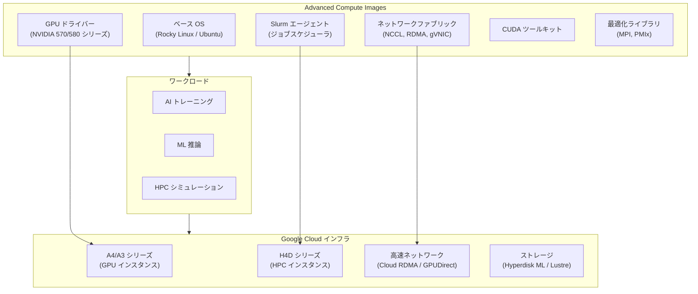

# Compute Engine: Advanced Compute Images

**リリース日**: 2026-07-09

**サービス**: Compute Engine

**機能**: Advanced Compute Images

**ステータス**: Preview

📊 [このアップデートのインフォグラフィックを見る](https://takech9203.github.io/google-cloud-news-summary/20260709-compute-engine-advanced-compute-images.html)

## 概要

Google Cloud は Compute Engine の新機能として Advanced Compute Images をプレビュー公開しました。これは AI（人工知能）、ML（機械学習）、HPC（高性能コンピューティング）ワークロード向けに最適化された高性能 OS イメージを提供する機能です。

Advanced Compute Images は、信頼性が高くパフォーマンスチューニング済みの OS イメージを単一のソースとして提供し、専門的なワークロード向けの手動イメージ構築の必要性を排除します。各イメージバージョンには、ワークロード実行に必要なドライバー、ネットワークファブリック、Slurm エージェントがプリインストールされており、すぐに本番環境で利用可能な状態で提供されます。

この機能は、これまで Google Cloud が提供してきた HPC VM イメージやアクセラレータ OS イメージの進化版として位置づけられ、AI/ML/HPC ワークロードに必要なソフトウェアスタックを統合的に管理する新しいアプローチです。

**アップデート前の課題**

- GPU ドライバー、CUDA ツールキット、ネットワークドライバー（NCCL プラグイン、RDMA ドライバー等）を個別にインストール・設定する必要があった
- Slurm クラスタの構築時にカスタムイメージのビルドに専門知識と時間が必要だった
- ドライバーバージョンの互換性管理やセキュリティパッチの適用を手動で行う必要があった
- ネットワークファブリック設定（GPUDirect、Cloud RDMA 等）の最適化に高度なシステム知識が求められた

**アップデート後の改善**

- プリインストール済みのドライバー・ネットワークファブリック・Slurm エージェントにより、イメージ構築の手間が不要に
- Google が検証・チューニングした単一ソースのイメージにより、信頼性とパフォーマンスが保証される
- AI/ML/HPC ワークロードの環境構築時間が大幅に短縮される
- バージョン管理された一貫したソフトウェアスタックにより、運用の複雑性が低減される

## アーキテクチャ図



Advanced Compute Images はベース OS の上にドライバー、ネットワークファブリック、Slurm エージェントを統合し、AI/ML/HPC ワークロードが Google Cloud の高性能インフラストラクチャ上で最適に動作する環境を提供します。

## サービスアップデートの詳細

### 主要機能

1. **プリインストール済み GPU ドライバー**
   - NVIDIA ドライバー（570/580 シリーズ）がインストール済み
   - CUDA ツールキット（バージョン 12/13）との互換性が検証済み
   - NVIDIA Fabric Manager、nvidia-imex、Data Center GPU Manager (DCGM) を含む

2. **ネットワークファブリック構成**
   - NCCL プラグインによる GPU 間高速通信の最適化
   - Cloud RDMA (IRDMA ドライバー) による低レイテンシ通信
   - GPUDirect-TCPXO によるネットワークスループットの向上
   - gVNIC (Google Virtual NIC) のサポート
   - RDMA ライブラリ（ibverbs-utils、rdma-core）のプリインストール

3. **Slurm エージェント統合**
   - SchedMD Slurm ワークロードマネージャとの連携
   - Slurm 依存関係（munge、MariaDB、libjwt、lmod）のプリインストール
   - NVIDIA Enroot / Pyxis によるコンテナ化ワークロードのサポート
   - Prolog/Epilog スクリプトによるジョブ実行管理の自動化

4. **パフォーマンスチューニング**
   - カーネルおよびネットワークチューニングパラメータの最適化
   - MPI コレクティブ通信のチューニング
   - 自動更新の無効化オプションによる HPC ワークロード性能の安定化

## 技術仕様

### 対応マシンシリーズとコンポーネント

| マシンシリーズ | 用途 | 主要コンポーネント |
|------|------|------|
| A4/A4X | AI トレーニング・推論 | NVIDIA B200/GB200 GPU、NCCL プラグイン |
| A3 Ultra/Mega/High | 大規模 AI/ML ワークロード | NVIDIA H100/H200 GPU、GPUDirect |
| H4D | HPC ワークロード | AMD EPYC Turin、Cloud RDMA 200 Gbps |

### プリインストールソフトウェア構成

| カテゴリ | コンポーネント |
|------|------|
| GPU ドライバー | NVIDIA 570/580 シリーズ |
| CUDA | ツールキット 12.x / 13.x |
| ネットワーク | NCCL プラグイン、RDMA ドライバー、gVNIC |
| オーケストレーション | Slurm 25.05、munge、MariaDB |
| 並列計算 | Open MPI 5.0.x、PMIx |
| コンテナ | NVIDIA Enroot、Pyxis、nvidia-container-toolkit |
| モニタリング | Ops Agent |
| ストレージ | Cloud Storage FUSE |

## 設定方法

### 前提条件

1. Google Cloud プロジェクトで Compute Engine API が有効化されていること
2. 適切な IAM 権限（Compute Instance Admin、Service Account User）が付与されていること
3. 対応するマシンシリーズが利用可能なリージョン/ゾーンであること

### 手順

#### ステップ 1: HPC VM インスタンスの作成

```bash
gcloud compute instances create INSTANCE_NAME \
    --zone=ZONE \
    --image-family=IMAGE_FAMILY \
    --image-project=cloud-hpc-image-public \
    --maintenance-policy=TERMINATE \
    --machine-type=MACHINE_TYPE
```

IMAGE_FAMILY には `hpc-rocky-linux-8` または `hpc-rocky-linux-9` を指定します。

#### ステップ 2: Cluster Toolkit を使用した Slurm クラスタのデプロイ

```bash
# Cluster Toolkit のインストール
cd cluster-toolkit

# デプロイメントフォルダの作成
./gcluster create examples/hpc-slurm.yaml \
    -l ERROR --vars project_id=PROJECT_ID

# クラスタのデプロイ
./gcluster deploy hpc-slurm
```

Cluster Toolkit を使用することで、Advanced Compute Images を活用した Slurm クラスタを自動構築できます。

#### ステップ 3: GPU クラスタの場合（A3/A4 シリーズ）

```bash
# A4X Max Slurm クラスタのデプロイ例
./gcluster deploy -d a4xmax-bm-slurm-deployment.yaml \
    examples/machine-learning/a4x-maxgpu-4g-metal/a4xmax-bm-slurm-blueprint.yaml
```

ブループリントが自動的に Advanced Compute Images を使用して、必要なドライバーとファブリックを構成します。

## メリット

### ビジネス面

- **環境構築時間の大幅短縮**: 手動でのイメージ構築が不要になり、数時間から数分単位でのクラスタ立ち上げが可能に
- **運用コストの削減**: ドライバー互換性の管理やパッチ適用の手間が Google マネージドに移行
- **Time-to-Value の向上**: AI/ML 研究者やデータサイエンティストがインフラ構築ではなく本業に集中可能

### 技術面

- **一貫したソフトウェアスタック**: バージョン検証済みのコンポーネントにより互換性問題を回避
- **最適化されたパフォーマンス**: Google によるチューニングパラメータの適用で最大限のハードウェア性能を引き出す
- **セキュリティの向上**: Google が管理するイメージにより、セキュリティパッチの適用が迅速化
- **スケーラビリティ**: Slurm エージェント統合により、数千ノード規模のクラスタ管理が容易に

## デメリット・制約事項

### 制限事項

- プレビュー段階であり、本番環境での使用には注意が必要
- 対応するマシンシリーズおよびリージョンが限定される可能性がある
- カスタムドライバーバージョンの指定には制約がある場合がある

### 考慮すべき点

- 既存のカスタムイメージからの移行には、ソフトウェア互換性の検証が必要
- 自動更新無効化時は Cloud RDMA ドライバーの手動更新が必要（H4D インスタンス）
- VM Manager との併用時にパフォーマンスへの影響がある可能性（OS Config エージェントの無効化を推奨）

## ユースケース

### ユースケース 1: 大規模言語モデル (LLM) の分散トレーニング

**シナリオ**: 数百億パラメータの LLM を複数の GPU ノードにまたがって分散トレーニングする場合。NCCL による GPU 間通信の最適化と Slurm によるジョブスケジューリングが必須。

**実装例**:
```bash
# A4 クラスタで NCCL ベンチマークを実行
srun --nodes=4 --ntasks-per-node=8 --gpus-per-node=8 \
    /opt/nccl-tests/build/all_reduce_perf -b 8 -e 8G -f 2
```

**効果**: Advanced Compute Images により NCCL プラグインとドライバーが最適構成でプリインストールされ、分散トレーニングの GPU 間通信帯域幅が最大化される。

### ユースケース 2: HPC シミュレーション（気象モデリング・分子動力学）

**シナリオ**: H4D インスタンスを使用した大規模な気象シミュレーションやドラッグディスカバリーのための分子動力学計算。Cloud RDMA による低レイテンシ MPI 通信が重要。

**効果**: Cloud RDMA ドライバーと MPI ライブラリがプリインストールされ、ノード間通信レイテンシが最小化されることで、大規模並列計算のスケーリング効率が向上する。

### ユースケース 3: AI 推論サービスの迅速なスケールアウト

**シナリオ**: 生成 AI モデルの推論リクエスト増加に応じて GPU クラスタを迅速に拡張する必要がある場合。

**効果**: Advanced Compute Images を使用することで、新規ノードの追加時にドライバーインストールやネットワーク設定の待ち時間がなくなり、スケールアウト時間が大幅に短縮される。

## 関連サービス・機能

- **AI Hypercomputer**: Advanced Compute Images は AI Hypercomputer エコシステムの OS イメージレイヤーとして位置づけられる
- **Cluster Toolkit**: Slurm クラスタのデプロイに使用するツールで、Advanced Compute Images と連携してクラスタを構築
- **Cluster Director**: 大規模アクセラレータクラスタの管理プラットフォームとして、カスタム OS イメージを提供
- **Cloud RDMA**: H4D インスタンス上での低レイテンシ通信を実現し、Advanced Compute Images に IRDMA ドライバーがプリインストール
- **Hyperdisk ML**: AI/ML ワークロード向け高スループットストレージとの組み合わせで最大性能を発揮

## 参考リンク

- 📊 [インフォグラフィック](https://takech9203.github.io/google-cloud-news-summary/20260709-compute-engine-advanced-compute-images.html)
- [公式リリースノート](https://cloud.google.com/compute/docs/release-notes)
- [HPC VM インスタンスの作成](https://docs.cloud.google.com/compute/docs/instances/create-hpc-vm)
- [AI Hypercomputer イメージ概要](https://docs.cloud.google.com/ai-hypercomputer/docs/images)
- [Cluster Toolkit ブループリントカタログ](https://docs.cloud.google.com/cluster-toolkit/docs/setup/cluster-blueprint-catalog)
- [Cloud RDMA の使用](https://docs.cloud.google.com/compute/docs/networking/using-irdma)

## まとめ

Advanced Compute Images は、AI/ML/HPC ワークロード向けの環境構築を劇的に簡素化する重要なアップデートです。手動でのドライバーインストールやネットワーク設定が不要になり、Google が検証・最適化したイメージを即座にデプロイできるようになります。現在プレビュー段階ですが、大規模な GPU/HPC クラスタを運用する組織は早期に評価を開始し、既存のカスタムイメージ構築パイプラインからの移行を計画することを推奨します。

---

**タグ**: #ComputeEngine #AdvancedComputeImages #AI #ML #HPC #GPU #Slurm #RDMA #Preview
