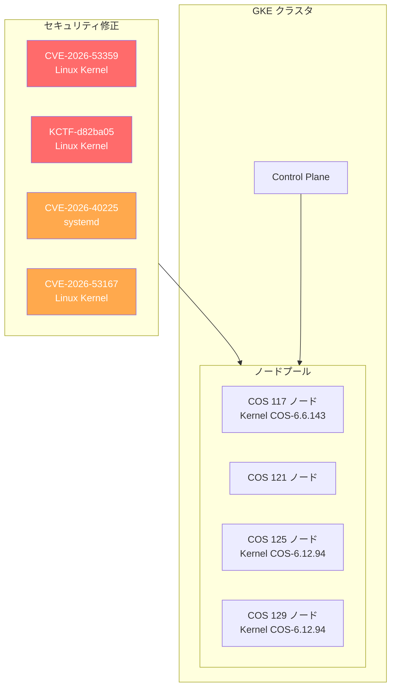

# Container-Optimized OS: 複数マイルストーンのセキュリティ・バグ修正アップデート

**リリース日**: 2026-07-09

**サービス**: Container-Optimized OS (COS)

**機能**: マイルストーン 117/121/125/129 セキュリティアップデート

**ステータス**: Change / Fixed / Security

[このアップデートのインフォグラフィックを見る](https://takech9203.github.io/google-cloud-news-summary/20260709-container-optimized-os-security-july-9.html)

## 概要

2026年7月9日、Google は Container-Optimized OS (COS) の4つのアクティブな LTS マイルストーン (117, 121, 125, 129) に対してセキュリティアップデートとバグ修正を含むリリースを公開した。今回のアップデートでは、Linux カーネルの脆弱性 (CVE-2026-53359, KCTF-d82ba05) やsystemd の脆弱性 (CVE-2026-40225) など、複数のセキュリティ問題が修正されている。

COS は GKE (Google Kubernetes Engine) のデフォルトノード OS イメージであり、これらのセキュリティ修正は GKE クラスタを運用するすべてのユーザーに影響する。特に Linux カーネルの脆弱性は権限昇格につながる可能性があるため、早急なアップデートが推奨される。

各マイルストーンでは Docker、Containerd のランタイムバージョン、NVIDIA GRID ドライバー、oslogin、sqlite、expat など多数のパッケージも更新されており、コンテナ基盤の安定性とセキュリティが包括的に強化されている。

**アップデート前の課題**

- Linux カーネルに CVE-2026-53359 および KCTF-d82ba05 の脆弱性が存在し、特権昇格のリスクがあった
- systemd に CVE-2026-40225 の脆弱性が存在していた (COS 125 以降に影響)
- Linux カーネルに CVE-2026-53167 の脆弱性が存在していた (COS 125 に影響)
- oslogin、sqlite、expat、acl などのパッケージが古いバージョンのままだった
- NVIDIA GRID ドライバーが最新ではなかった (COS 125/129)

**アップデート後の改善**

- CVE-2026-53359 が全4マイルストーン (117/121/125/129) で修正された
- KCTF-d82ba05 が COS 117 と COS 125 で修正された
- CVE-2026-40225 (systemd) が COS 125 で修正された
- CVE-2026-53167 が COS 125 で修正された
- NVIDIA GRID ドライバーが 580.159.03 にアップグレードされた (COS 125/129)
- oslogin が v20260626.00 に、sqlite が v3.53.3 に、expat が v2.8.2 にアップグレードされた (COS 117)

## アーキテクチャ図



今回のアップデートは GKE のノードプールで使用される COS イメージの全アクティブ LTS マイルストーンに対して横断的にセキュリティ修正を適用している。

## サービスアップデートの詳細

### マイルストーン別バージョン比較

| コンポーネント | COS 117 | COS 121 | COS 125 | COS 129 |
|---|---|---|---|---|
| **イメージ名** | cos-117-18613-675-7 | cos-121-18867-528-7 | cos-125-19216-532-9 | cos-129-19506-299-8 |
| **Kernel** | COS-6.6.143 | - | COS-6.12.94 | COS-6.12.94 |
| **Docker** | v24.0.9 | - | v27.5.1 | v27.5.1 |
| **Containerd** | v1.7.31 | - | v2.1.7 | v2.2.3 |
| **NVIDIA GRID** | - | - | 580.159.03 | 580.159.03 |
| **サポート期限** | 2026年9月 | 2027年3月 | 2027年9月 | 2028年3月 |

### セキュリティ修正の適用範囲

| CVE / ID | 影響コンポーネント | COS 117 | COS 121 | COS 125 | COS 129 |
|---|---|:---:|:---:|:---:|:---:|
| CVE-2026-53359 | Linux Kernel | 修正済 | 修正済 | 修正済 | 修正済 |
| KCTF-d82ba05 | Linux Kernel | 修正済 | - | 修正済 | - |
| CVE-2026-40225 | systemd | - | - | 修正済 | - |
| CVE-2026-53167 | Linux Kernel | - | - | 修正済 | - |

### 主要機能

1. **カーネルセキュリティ修正 (CVE-2026-53359)**
   - Linux カーネルの脆弱性を修正
   - 全4つのアクティブ LTS マイルストーンに適用
   - Container-Optimized OS のセキュリティ強化カーネルの一部として修正

2. **KCTF-d82ba05 修正**
   - Linux カーネルのセキュリティ問題を修正
   - KCTF (Kubernetes CTF) プログラムを通じて発見された脆弱性
   - COS 117 および COS 125 に適用

3. **systemd 脆弱性修正 (CVE-2026-40225)**
   - COS 125 における systemd の脆弱性を修正
   - システムのサービス管理に影響する問題を解決

4. **パッケージアップグレード (COS 117)**
   - oslogin v20260626.00: OS Login 認証メカニズムの更新
   - docker-credential-helpers v0.9.8: Docker 認証情報ヘルパーの更新
   - sqlite v3.53.3: データベースエンジンの更新
   - expat v2.8.2: XML パーサーライブラリの更新
   - acl v2.4.0: アクセス制御リスト管理の更新

5. **NVIDIA GRID ドライバー更新 (COS 125/129)**
   - NVIDIA GRID ドライバーを 580.159.03 にアップグレード
   - GPU ワークロードを実行するノードの安定性向上

## 技術仕様

### カーネルバージョン体系

| マイルストーン | カーネルシリーズ | 今回のバージョン |
|---|---|---|
| COS 117 | Linux 6.6 LTS | COS-6.6.143 |
| COS 125 | Linux 6.12 LTS | COS-6.12.94 |
| COS 129 | Linux 6.12 LTS | COS-6.12.94 |

### コンテナランタイム世代

| マイルストーン | Docker | Containerd | 備考 |
|---|---|---|---|
| COS 117 | v24.0.9 | v1.7.31 | Containerd 1.x 系 (レガシー) |
| COS 125 | v27.5.1 | v2.1.7 | Containerd 2.x 系 |
| COS 129 | v27.5.1 | v2.2.3 | Containerd 2.x 最新系 |

COS 125 と COS 129 では Containerd 2.x 系が採用されており、Kubernetes の CRI (Container Runtime Interface) との統合が強化されている。COS 117 は旧世代の Containerd 1.7 系を維持しているが、2026年9月のサポート終了に向けた安定性を重視している。

## 設定方法

### 前提条件

1. GKE クラスタまたは Compute Engine インスタンスで COS を使用していること
2. 対象マイルストーンのイメージを使用していること

### 手順

#### ステップ 1: 現在の COS バージョンを確認

```bash
# GKE ノードの OS イメージバージョンを確認
gcloud container nodes describe NODE_NAME \
  --cluster=CLUSTER_NAME \
  --zone=ZONE \
  --format="value(status.nodeInfo.osImage)"
```

#### ステップ 2: GKE ノードプールのアップグレード

```bash
# ノードプールを最新の COS イメージにアップグレード
gcloud container clusters upgrade CLUSTER_NAME \
  --node-pool=NODE_POOL_NAME \
  --zone=ZONE
```

#### ステップ 3: Compute Engine インスタンスの場合

```bash
# 最新の COS イメージでインスタンスを作成
gcloud compute instances create INSTANCE_NAME \
  --image-family=cos-129-lts \
  --image-project=cos-cloud \
  --zone=ZONE
```

#### ステップ 4: 特定バージョンの指定

```bash
# 特定の COS イメージバージョンを指定して作成
gcloud compute instances create INSTANCE_NAME \
  --image=cos-129-19506-299-8 \
  --image-project=cos-cloud \
  --zone=ZONE
```

## メリット

### ビジネス面

- **コンプライアンス維持**: 既知の CVE が修正されることで、セキュリティ監査やコンプライアンス要件を継続的に満たすことができる
- **リスク低減**: カーネルレベルの脆弱性修正により、権限昇格攻撃のリスクが軽減される

### 技術面

- **カーネルセキュリティ強化**: COS のセキュリティ強化カーネルに最新の修正が反映される
- **コンテナランタイムの安定性**: Docker および Containerd の最新パッチ適用による安定性向上
- **GPU ワークロード対応**: NVIDIA GRID ドライバーの更新により、GPU を使用する AI/ML ワークロードの安定性が向上
- **全マイルストーン横断的対応**: アクティブな全 LTS マイルストーンに対して一貫したセキュリティ修正が適用される

## デメリット・制約事項

### 制限事項

- ノードの再作成が必要なため、一時的なワークロードの中断が発生する可能性がある
- GKE のノード自動アップグレードが有効でない場合は手動でのアップグレードが必要
- COS 117 は 2026年9月にサポート終了予定のため、新しいマイルストーンへの移行計画が必要

### 考慮すべき点

- COS 117 から COS 125/129 への移行時に Containerd のメジャーバージョンが 1.x から 2.x に変更されるため、互換性の確認が必要
- NVIDIA GRID ドライバーのアップデートは GPU ノードの再起動を伴う
- GKE Auto-upgrade が有効な場合、自動的に最新の COS イメージに更新されるが、タイミングの制御が必要な場合は手動アップグレードを検討する

## ユースケース

### ユースケース 1: GKE クラスタのセキュリティ強化

**シナリオ**: 本番環境の GKE クラスタで COS 125 を使用しており、セキュリティスキャンで CVE-2026-53359 と CVE-2026-40225 が検出された。

**実装例**:
```bash
# ノードプールのアップグレード (ローリングアップデート)
gcloud container clusters upgrade my-production-cluster \
  --node-pool=default-pool \
  --zone=asia-northeast1-a

# アップグレード状況の確認
gcloud container operations list \
  --filter="targetLink:my-production-cluster" \
  --zone=asia-northeast1-a
```

**効果**: セキュリティスキャンでの CVE 検出が解消され、コンプライアンス要件を満たすことができる。

### ユースケース 2: GPU ワークロードの安定化

**シナリオ**: COS 129 上で NVIDIA GPU を使用した AI/ML 推論ワークロードを実行しており、NVIDIA GRID ドライバーの更新が必要。

**実装例**:
```bash
# GPU ノードプールを最新イメージに更新
gcloud container clusters upgrade ml-cluster \
  --node-pool=gpu-pool \
  --image-type=COS_CONTAINERD \
  --zone=us-central1-a
```

**効果**: NVIDIA GRID ドライバー 580.159.03 への更新により、GPU ワークロードの安定性と互換性が向上する。

## 関連サービス・機能

- **Google Kubernetes Engine (GKE)**: COS はデフォルトのノード OS イメージ。GKE のノード自動アップグレード機能と連携して自動的にセキュリティ修正が適用される
- **Compute Engine**: COS イメージは Compute Engine VM として直接使用可能。コンテナワークロードに最適化された軽量 OS として利用できる
- **GKE Sandbox (gVisor)**: COS ノード上で gVisor ベースのサンドボックスを使用している場合、カーネルの脆弱性の影響を受けにくいが、基盤 OS のアップデートは引き続き推奨
- **Cloud Monitoring / Cloud Logging**: COS の fluent-bit ベースのロギングエージェントと連携してノードのヘルスモニタリングが可能

## 参考リンク

- [このアップデートのインフォグラフィック](https://takech9203.github.io/google-cloud-news-summary/20260709-container-optimized-os-security-july-9.html)
- [公式リリースノート](https://docs.cloud.google.com/release-notes#July_09_2026)
- [COS リリースノート (マイルストーン 129)](https://docs.cloud.google.com/container-optimized-os/docs/release-notes/m129)
- [COS リリースノート (マイルストーン 125)](https://docs.cloud.google.com/container-optimized-os/docs/release-notes/m125)
- [COS リリースノート (マイルストーン 121)](https://docs.cloud.google.com/container-optimized-os/docs/release-notes/m121)
- [COS リリースノート (マイルストーン 117)](https://docs.cloud.google.com/container-optimized-os/docs/release-notes/m117)
- [COS セキュリティ概要](https://docs.cloud.google.com/container-optimized-os/docs/concepts/security)
- [GKE ノードイメージ](https://docs.cloud.google.com/kubernetes-engine/docs/concepts/node-images)
- [GKE ノードプールアップグレード](https://docs.cloud.google.com/kubernetes-engine/docs/how-to/upgrading-a-cluster)

## まとめ

今回の Container-Optimized OS アップデートは、アクティブな全 LTS マイルストーン (117/121/125/129) に対する包括的なセキュリティ修正リリースである。特に CVE-2026-53359 (Linux カーネル) は全マイルストーンに影響するため、GKE クラスタや COS ベースの Compute Engine インスタンスを運用しているユーザーは速やかなアップデートを推奨する。GKE ノード自動アップグレードが有効な環境では順次適用されるが、セキュリティ要件の高い環境では手動アップグレードによる即時適用を検討すべきである。

---

**タグ**: #ContainerOptimizedOS #COS #GKE #Security #CVE #LinuxKernel #Docker #Containerd #NVIDIA #セキュリティアップデート
