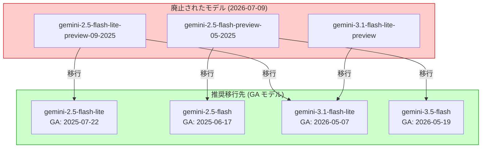

# Gemini Enterprise Agent Platform: Preview モデルエンドポイントの廃止

**リリース日**: 2026-07-09

**サービス**: Gemini Enterprise Agent Platform

**機能**: Preview モデルエンドポイントの廃止 (2.5 Flash, 2.5 Flash-Lite, 3.1 Flash-Lite)

**ステータス**: Feature (Retirement)

📊 [このアップデートのインフォグラフィックを見る](https://takech9203.github.io/google-cloud-news-summary/20260709-gemini-agent-platform-preview-model-retirement.html)

## 概要

Gemini Enterprise Agent Platform において、以下の Preview モデルエンドポイントが廃止され、アクセス不可となった。対象は gemini-2.5-flash-lite-preview-09-2025、gemini-2.5-flash-preview-05-2025、gemini-3.1-flash-lite-preview の 3 つのモデルである。これらのモデルを使用していたアプリケーションは即座に API エラーが発生するため、最新の GA (Generally Available) モデルへの移行が必要となる。

この廃止は、Google Cloud のモデルライフサイクルポリシーに基づくものであり、Preview モデルは安定版 (GA) モデルのリリース後に段階的に廃止される。ユーザーは公式のマイグレーションガイドに従い、推奨される後継モデルへの移行を速やかに完了する必要がある。

**アップデート前の課題**

- Preview モデル (gemini-2.5-flash-lite-preview-09-2025、gemini-2.5-flash-preview-05-2025、gemini-3.1-flash-lite-preview) を本番環境で使用していたユーザーが存在
- Preview モデルは安定性やサポートの保証がないにもかかわらず、長期間使用され続けるケースがあった
- 複数世代の Preview モデルが並行して存在することで、エンドポイント管理の複雑さが増加

**アップデート後の改善**

- 廃止された Preview モデルへのリクエストはエラーを返すため、意図しない Preview モデルの使用継続を防止
- GA モデル (gemini-2.5-flash、gemini-2.5-flash-lite、gemini-3.1-flash-lite) への移行により、SLA に基づく安定したサービスを利用可能
- 後継の GA モデルは Preview 版と比較して品質が向上しており、思考機能 (Thinking) やファインチューニングなど追加機能もサポート

## アーキテクチャ図



廃止された 3 つの Preview モデルから、対応する GA 安定版モデルへのマイグレーションパスを示す。用途やパフォーマンス要件に応じて、最新の Gemini 3.x 系モデルへの移行も推奨される。

## サービスアップデートの詳細

### 廃止対象モデル

1. **gemini-2.5-flash-lite-preview-09-2025**
   - 2025 年 9 月リリースの Preview 版
   - GA 版 gemini-2.5-flash-lite (2025-07-22 リリース) が後継
   - さらに高性能な gemini-3.1-flash-lite への移行も推奨

2. **gemini-2.5-flash-preview-05-2025**
   - 2025 年 5 月リリースの Preview 版
   - GA 版 gemini-2.5-flash (2025-06-17 リリース) が後継
   - 最高性能を求める場合は gemini-3.5-flash への移行を推奨

3. **gemini-3.1-flash-lite-preview**
   - Gemini 3.1 Flash-Lite の Preview 版
   - GA 版 gemini-3.1-flash-lite (2026-05-07 リリース) が後継
   - コスト効率と性能のバランスに優れたモデル

### 推奨移行先モデルの特徴

1. **gemini-3.1-flash-lite (推奨)**
   - 最もコスト効率の高い Gemini モデル
   - Gemini 2.5 Flash と同等の品質を実現
   - Thinking 機能対応 (minimal, low, medium, high)
   - コンテキストウィンドウ: 1,048,576 トークン
   - ファインチューニング対応 (SFT, continuous tuning)

2. **gemini-2.5-flash**
   - 価格と性能のバランスに優れたモデル
   - Thinking 機能搭載の初の Flash モデル
   - Provisioned Throughput 対応
   - 退役予定: 2026 年 10 月 16 日

3. **gemini-3.5-flash**
   - 最新世代の高性能モデル
   - 2026 年 5 月 19 日リリース
   - 退役予定: 2027 年 5 月 19 日以降

## 技術仕様

### 廃止モデルと推奨移行先の比較

| 廃止モデル | 推奨移行先 | 移行先リリース日 | 移行先退役予定日 |
|------|------|------|------|
| gemini-2.5-flash-lite-preview-09-2025 | gemini-2.5-flash-lite / gemini-3.1-flash-lite | 2025-07-22 / 2026-05-07 | 2026-10-16 / 2027-05-07 以降 |
| gemini-2.5-flash-preview-05-2025 | gemini-2.5-flash / gemini-3.5-flash | 2025-06-17 / 2026-05-19 | 2026-10-16 / 2027-05-19 以降 |
| gemini-3.1-flash-lite-preview | gemini-3.1-flash-lite | 2026-05-07 | 2027-05-07 以降 |

### GA モデルの主要スペック

| 項目 | gemini-2.5-flash | gemini-2.5-flash-lite | gemini-3.1-flash-lite |
|------|------|------|------|
| コンテキストウィンドウ | 1,048,576 | 1,048,576 | 1,048,576 |
| 最大出力トークン | 65,535 | 65,535 | 65,535 |
| Thinking 機能 | 対応 | 対応 | 対応 |
| Function Calling | 対応 | 対応 | 対応 |
| Grounding | 対応 | 対応 | 対応 |
| ファインチューニング | SFT, continuous, preference | SFT, continuous, preference | SFT, continuous |
| Provisioned Throughput | 対応 | 対応 | 対応 |
| バッチ推論 | 対応 | 対応 | 対応 |

## 設定方法

### 前提条件

1. Gemini Enterprise Agent Platform API が有効化されたプロジェクト
2. 適切な IAM 権限 (サービスアカウント)
3. 現在のアプリケーションで使用しているモデル ID の確認

### 手順

#### ステップ 1: 現在使用中のモデルエンドポイントを確認

```bash
# アプリケーションコード内で廃止モデルを検索
grep -r "gemini-2.5-flash-lite-preview-09-2025\|gemini-2.5-flash-preview-05-2025\|gemini-3.1-flash-lite-preview" .
```

#### ステップ 2: モデル ID を GA 版に更新

```python
# 変更前 (エラーが発生する)
model = "gemini-2.5-flash-preview-05-2025"

# 変更後 (推奨)
model = "gemini-2.5-flash"  # または "gemini-3.5-flash"
```

#### ステップ 3: エンドポイント URL の更新

```bash
# API エンドポイントの形式
# グローバルエンドポイント
curl -X POST \
  "https://aiplatform.googleapis.com/v1/projects/${PROJECT_ID}/locations/global/publishers/google/models/gemini-3.1-flash-lite:generateContent" \
  -H "Authorization: Bearer $(gcloud auth print-access-token)" \
  -H "Content-Type: application/json" \
  -d '{
    "contents": [{"parts": [{"text": "Hello"}]}]
  }'
```

#### ステップ 4: 動作確認とデプロイ

```bash
# テスト実行で正常動作を確認
# ミッションクリティカルな機能を重点的にテスト
gcloud ai models describe gemini-3.1-flash-lite \
  --project=${PROJECT_ID} \
  --region=global
```

## メリット

### ビジネス面

- **SLA 保証**: GA モデルは正式なサービスレベル契約に基づき提供されるため、本番環境での安定運用が可能
- **長期サポート**: GA モデルはリリースから最低 12 ヶ月の利用期間が保証されている (gemini-3.1-flash-lite は 2027 年 5 月 7 日以降まで)
- **コスト最適化**: gemini-3.1-flash-lite は高品質ながら最もコスト効率の高いモデルとして設計されている

### 技術面

- **品質向上**: GA 安定版は Preview 版のフィードバックを反映し、性能と品質が改善されている
- **追加機能**: Thinking 機能、ファインチューニング、Provisioned Throughput など、Preview 版にはなかった機能をサポート
- **セキュリティコントロール**: Data residency、CMEK、VPC-SC、AXT など enterprise-grade のセキュリティ機能を完全サポート

## デメリット・制約事項

### 制限事項

- 廃止は即時であり、既にエンドポイントへのアクセスは不可能 (移行猶予期間なし)
- Preview モデルで作成したファインチューニング済みモデルは GA モデルで再トレーニングが必要
- 一部の応答特性 (トーン、出力フォーマットなど) が Preview 版と GA 版で異なる場合がある

### 考慮すべき点

- gemini-2.5-flash および gemini-2.5-flash-lite は 2026 年 10 月 16 日に退役予定のため、中長期的には gemini-3.1-flash-lite または gemini-3.5-flash への移行を推奨
- モデル移行時はプロンプトの最適化が必要な場合がある (特に Thinking 機能のレベル設定)
- Provisioned Throughput を利用する場合、新しいモデルでの再契約が必要

## ユースケース

### ユースケース 1: チャットボットアプリケーションの移行

**シナリオ**: gemini-2.5-flash-preview-05-2025 を使用した顧客対応チャットボットを運用していたが、エンドポイント廃止により API エラーが発生

**実装例**:
```python
import vertexai
from vertexai.generative_models import GenerativeModel

# プロジェクト初期化
vertexai.init(project="your-project-id", location="global")

# 移行後のモデル指定
model = GenerativeModel("gemini-3.1-flash-lite")

# Thinking レベルを設定してレスポンス品質を調整
response = model.generate_content(
    "顧客の問い合わせに回答してください",
    generation_config={
        "temperature": 0.7,
        "max_output_tokens": 2048,
    }
)
```

**効果**: gemini-3.1-flash-lite は instruction following が改善されており、複雑なチャットボットワークフローでの信頼性が向上

### ユースケース 2: バッチ処理パイプラインの移行

**シナリオ**: gemini-2.5-flash-lite-preview-09-2025 を使用した大量テキスト処理パイプラインをコスト効率よく移行

**効果**: gemini-3.1-flash-lite は gemini-2.5-flash-lite の後継として設計されており、同等以上の品質を維持しつつ、バッチ推論や Provisioned Throughput にも対応しているため、大規模処理での安定性とコスト予測性が向上

## 利用可能リージョン

GA モデルの利用可能リージョンは以下の通り:

- **グローバル**: global
- **マルチリージョン**: us, eu
- **米国**: us-central1, us-east1, us-east4, us-east5, us-south1, us-west1, us-west4
- **ヨーロッパ**: europe-central2, europe-north1, europe-southwest1, europe-west1, europe-west2, europe-west3, europe-west4, europe-west8, europe-west9
- **アジア太平洋**: asia-northeast1, asia-northeast3, asia-south1, asia-southeast1, australia-southeast1

## 関連サービス・機能

- **Agent Studio**: モデルの動作確認やプロンプトテストに利用可能なコンソール UI
- **Model Garden**: 利用可能なモデルの一覧と詳細仕様を確認可能
- **Provisioned Throughput**: 高負荷ワークロードに対する専用キャパシティの確保
- **Memory Bank**: gemini-embedding-2 と組み合わせた類似検索機能の構築
- **Cloud Monitoring**: モデルエンドポイントの利用状況とエラー率のモニタリング

## 参考リンク

- 📊 [インフォグラフィック](https://takech9203.github.io/google-cloud-news-summary/20260709-gemini-agent-platform-preview-model-retirement.html)
- [公式リリースノート](https://docs.cloud.google.com/release-notes#July_09_2026)
- [マイグレーションガイド](https://docs.cloud.google.com/gemini-enterprise-agent-platform/models/migrate)
- [モデルバージョンとライフサイクル](https://docs.cloud.google.com/gemini-enterprise-agent-platform/models/model-versions)
- [Gemini 3.1 Flash-Lite ドキュメント](https://docs.cloud.google.com/gemini-enterprise-agent-platform/models/gemini/3-1-flash-lite)
- [Gemini 2.5 Flash ドキュメント](https://docs.cloud.google.com/gemini-enterprise-agent-platform/models/gemini/2-5-flash)
- [料金ページ](https://cloud.google.com/gemini-enterprise-agent-platform/generative-ai/pricing)

## まとめ

Gemini Enterprise Agent Platform の Preview モデル 3 種 (gemini-2.5-flash-lite-preview-09-2025、gemini-2.5-flash-preview-05-2025、gemini-3.1-flash-lite-preview) が即時廃止となった。影響を受けるユーザーは速やかに GA 安定版モデルへの移行が必要である。中長期的な安定性を考慮すると、gemini-3.1-flash-lite (退役予定: 2027 年 5 月以降) への移行が最も推奨される。移行作業はモデル ID の変更が中心だが、プロンプトの最適化やテストも併せて実施することで、新モデルの性能を最大限に活用できる。

---

**タグ**: #GeminiEnterpriseAgentPlatform #ModelRetirement #Preview廃止 #マイグレーション #GeminiFlash #AI #LLM
