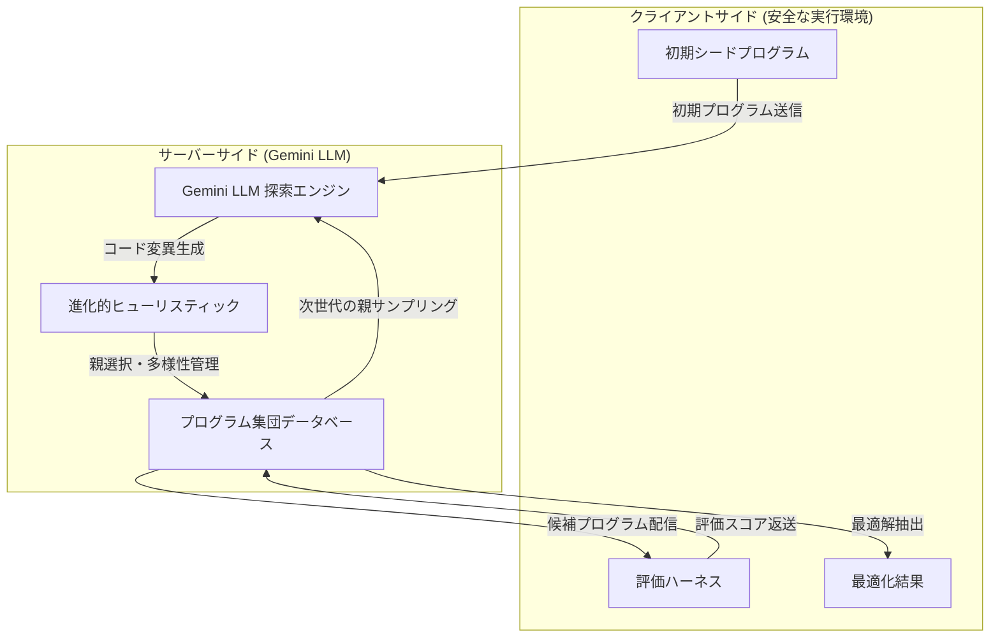

# Gemini Enterprise: AlphaEvolve アルゴリズム最適化エージェント (GA)

**リリース日**: 2026-07-09

**サービス**: Gemini Enterprise

**機能**: AlphaEvolve algorithm optimization agent

**ステータス**: GA (一般提供)

[このアップデートのインフォグラフィックを見る](https://takech9203.github.io/google-cloud-news-summary/20260709-gemini-enterprise-alphaevolve-ga.html)

## 概要

Gemini Enterprise エージェント上で AlphaEvolve 最適化サービスが一般提供 (GA) となった。AlphaEvolve は Gemini をベースに構築されたコード最適化・発見エージェントであり、ビジネスや研究における最も困難なアルゴリズム問題の解決を支援する。進化的手法を用いてアルゴリズム発見、数学的探索、組合せ最適化のユースケースに特化しており、NP 完全問題や NP 困難問題に特に適している。

AlphaEvolve の最大の特徴は、サーバーサイドでの創造的な LLM 探索とクライアントサイドでの安全なコード実行を組み合わせることで、人間が設計したベースラインを超える新しい最適化ソリューションを自律的に発見できる点にある。初期のシードプログラムから出発し、複数世代にわたる進化的ヒューリスティックを反復実行することで、目標とする最適化目的を満たす新規ソリューションを漸進的に改善していく。

対象ユーザーは、複雑なアルゴリズム最適化問題を抱える研究者、データサイエンティスト、ソフトウェアエンジニアであり、従来の厳密ソルバーが組合せ爆発の限界に直面するようなケースで最も高い ROI を発揮する。

**アップデート前の課題**

- NP 困難な最適化問題に対しては、人間の専門家が手動でヒューリスティックを設計・チューニングする必要があった
- 組合せ最適化において厳密ソルバーが組合せ爆発の壁に直面し、実用的な時間内に最適解を得られなかった
- アルゴリズム設計の反復サイクルが長く、探索空間が指数的に大きい場合に人間の直感だけでは限界があった
- Preview 段階ではアクセスが制限されており、本番環境での利用に制約があった

**アップデート後の改善**

- GA により本番ワークロードでの利用が正式にサポートされ、SLA の対象となった
- サーバーサイド LLM による創造的な解探索とクライアントサイドでの安全なコード実行の組み合わせにより、人間のベースラインを超えるソリューションを自律的に発見可能
- 進化的ヒューリスティックにより、最大 100,000 プログラムの生成・評価を並列実行 (最大同時実行数 30) で自動化
- API を通じたプログラマティックな実験管理が可能となり、既存のワークフローへの統合が容易に

## アーキテクチャ図



AlphaEvolve は サーバーサイドの LLM がコード変異を生成し、クライアントサイドの評価ハーネスが安全にコードを実行してスコアリングする分離アーキテクチャを採用している。進化的ヒューリスティックが世代間の選択・多様性管理を行い、反復的に最適解へ収束させる。

## サービスアップデートの詳細

### 主要機能

1. **進化的アルゴリズム探索**
   - LLM とメタヒューリスティック探索を組み合わせた独自のアプローチ
   - 指数的に大きいまたは無限の設計空間を持つ問題に対応
   - パレートフロンティアサンプリングによる多目的最適化をサポート

2. **安全なクライアントサイド実行**
   - コード実行はクライアント側の隔離された環境で行われ、セキュリティを確保
   - 決定論的計算、データ駆動型推定、インフラテストの3種類の評価方法に対応
   - アトミックロックトークンメカニズムにより分散環境での競合を防止

3. **柔軟な実験設定**
   - 最大 100,000 プログラムまでの生成予算設定
   - 最大同時実行数 30 の並列処理
   - 最大 7 日間の実験実行期間
   - アイドルタイムアウトによる自動一時停止

4. **マルチ言語サポート**
   - Python、C++、Verilog、CUDA、Julia、Java など複数のプログラミング言語に対応
   - スキルベースのワークフローは現時点では Python のみサポート

5. **エージェント型開発統合**
   - AlphaEvolve Skills によりコーディングアシスタントからの直接実験実行が可能
   - Gemini CLI、Antigravity などのエージェントフレームワークと統合

## 技術仕様

### 実験設定パラメータ

| パラメータ | 型 | デフォルト | 制約 |
|------|------|------|------|
| maxPrograms | int32 | 100 | 最小: 1、最大: 100,000 |
| concurrency | int32 | 1 | 最小: 1、最大: 30 |
| maxDuration | string | null | 最大 7 日間 (ISO 8601) |
| idleTimeout | string | null | 最大 24 時間 (ISO 8601) |
| context | string | - | 推奨 200,000 トークン以下 |
| paretoSamplingProbability | float | - | 0.0 - 1.0 (単一メトリクスの場合は 0.0) |

### 実験ライフサイクル状態

| 状態 | 説明 |
|------|------|
| CREATED | 初期化済み、未実行 |
| RUNNING | アクティブな評価・生成中 |
| PAUSED | 手動またはアイドルタイムアウトにより一時停止 |
| COMPLETED | max_programs 達成または生成上限到達 |
| FAILED | システムエラーにより停止 |

### IAM ロール要件

| プロファイル | 必要なロール |
|------|------|
| Cloud Administrator | roles/resourcemanager.projectCreator, roles/billing.user, roles/serviceusage.admin |
| System User | roles/iam.serviceAccountTokenCreator |
| Service Account | roles/discoveryengine.admin |

## 設定方法

### 前提条件

1. Gemini Enterprise ライセンスを保有していること (任意のティア、トライアルライセンスでもアクセス可能)
2. 課金が有効な Google Cloud プロジェクトが作成済みであること
3. gcloud CLI がインストールされた管理ホスト環境

### 手順

#### ステップ 1: サービスアカウントの作成

```bash
PROJECT_ID="my-gcp-project-id"
SA_NAME="alpha-evolve-client"

gcloud iam service-accounts create "${SA_NAME}" \
  --description="Service Account to call AlphaEvolve API" \
  --display-name="AlphaEvolve Client SA" \
  --project=$PROJECT_ID
```

#### ステップ 2: IAM ロールの付与

```bash
SERVICE_ACCOUNT_EMAIL=$(gcloud iam service-accounts list \
  --filter="displayName:AlphaEvolve Client SA" \
  --format='value(email)' \
  --project=$PROJECT_ID)

gcloud projects add-iam-policy-binding "${PROJECT_ID}" \
  --member="serviceAccount:${SERVICE_ACCOUNT_EMAIL}" \
  --role="roles/discoveryengine.admin" \
  --project="${PROJECT_ID}"
```

#### ステップ 3: Discovery Engine エンジンの作成

```bash
ENGINE_ID="alpha-evolve-experiment-engine"

URL="https://discoveryengine.googleapis.com/v1alpha"
URL="${URL}/projects/${PROJECT_ID}/locations/global"
URL="${URL}/collections/default_collection/engines"
URL="${URL}?engineId=${ENGINE_ID}"

curl -X POST "${URL}" \
  -H "Content-Type: application/json" \
  -H "x-goog-user-project: ${PROJECT_ID}" \
  -H "Authorization: Bearer $(gcloud auth print-access-token)" \
  -d '{
    "display_name": "'"${ENGINE_ID}"'",
    "data_store_ids": [],
    "solution_type": "SOLUTION_TYPE_GENERATIVE_CHAT"
  }'
```

#### ステップ 4: 実験の作成と実行

```json
{
  "config": {
    "title": "my-optimization-experiment",
    "problemDescription": "最適化対象の問題記述",
    "programLanguage": "python",
    "runSettings": {
      "maxPrograms": 1000,
      "concurrency": 10,
      "maxDuration": "86400s"
    },
    "generationSettings": {
      "includeFullProgramInPrompt": true
    }
  }
}
```

## メリット

### ビジネス面

- **人間の限界を超える最適化**: 従来の手動チューニングでは到達不可能な解空間を探索し、ビジネス上の最適化問題 (物流ルート、リソース割当、スケジューリング等) で人間の設計を超える成果を実現
- **研究開発の加速**: アルゴリズム発見の反復サイクルを大幅に短縮し、研究者がより高次の問題設定に集中できる
- **GA による本番利用の安心感**: SLA が適用され、エンタープライズグレードのサポートが利用可能

### 技術面

- **安全な分離実行**: サーバーサイド LLM 探索とクライアントサイド実行の分離により、コード実行のセキュリティとデータ主権を確保
- **スケーラブルな並列処理**: 最大同時実行数 30、最大 100,000 プログラムの大規模探索が可能
- **柔軟な評価メカニズム**: 決定論的計算、データ駆動型推定、インフラテストの3種類の評価方法を選択可能

## デメリット・制約事項

### 制限事項

- FedRAMP および DoD コンプライアンス要件に非対応 (これらの標準を必要とする環境ではデフォルトでアクセスが制限される。アカウントチームへのリクエストにより要相談)
- スキルベースのワークフローは現時点では Python のみサポート
- 単一コードロケーションの最適化のみ検証済み (複数の evolve ブロックの同時最適化は未検証)
- コンテキストサイズは 200,000 トークン以下を推奨 (超過するとモデルの注意力が低下し変異品質が劣化)

### 考慮すべき点

- AlphaEvolve は汎用コード生成ツールではない。純粋な自然言語記述や不完全なコードから機能的なコードを生成する目的には不向き
- リンティングやコードスタイルの最適化にも不向き
- 凸最適化や線形計画法など、既存の厳密ソルバーが効率的に解ける問題には不適切
- 最適な結果を得るために複数回の実験反復が必要な場合がある
- 評価関数は数分以内に実行完了する必要がある

## ユースケース

### ユースケース 1: 組合せ最適化 (スケジューリング・ルーティング)

**シナリオ**: 大規模な物流ネットワークにおける配送ルート最適化。数千の配送先、複数の車両制約、時間枠制約を持つ NP 困難な車両ルーティング問題。

**効果**: 従来のメタヒューリスティクス (遺伝的アルゴリズム、焼きなまし法) を超えるルーティング解を発見し、配送コストの削減と配送時間の短縮を実現。

### ユースケース 2: アルゴリズム発見・コード最適化

**シナリオ**: 高頻度取引システムにおけるマッチングアルゴリズムの最適化。レイテンシとスループットの多目的最適化が必要で、設計空間が指数的に大きい。

**効果**: パレートフロンティアサンプリングにより、レイテンシとスループットのトレードオフにおいて人間のエンジニアが設計したベースラインを超える解を自動発見。

### ユースケース 3: ML パイプラインのハイパーパラメータ・アーキテクチャ最適化

**シナリオ**: 深層学習モデルのアーキテクチャ探索。非凸で高度に非線形な目的関数を持ち、ベイズ最適化では探索が不十分な広大な設計空間。

**効果**: AlphaEvolve が LLM の創造的探索と進化的選択を組み合わせ、従来のベイズ最適化を超えるモデルアーキテクチャを発見。

## 料金

Gemini Enterprise はサブスクリプションシート制で課金される。AlphaEvolve へのアクセスは Gemini Enterprise ライセンス (任意のティア、トライアルを含む) に含まれる。

- 基本料金: 月額約 $30/シート (日次按分で約 $1/日)
- サブスクリプション上限を超える利用には従量課金のオーバーレッジ料金が発生する可能性あり
- システムユーザー 1 名につき 1 ライセンスが必要 (サービスアカウントはライセンスを消費しない)

詳細な料金情報については [Gemini Enterprise 料金ページ](https://cloud.google.com/gemini-enterprise/pricing) を参照。

## 関連サービス・機能

- **Gemini Enterprise Co-Scientist**: AlphaEvolve と同じ Gemini Enterprise プラットフォーム上で提供される科学研究支援エージェント。仮説生成と実験提案に特化
- **Gemini Enterprise Agent Platform (旧 Vertex AI)**: 開発者向けのエージェント構築プラットフォーム。AlphaEvolve で最適化されたアルゴリズムのデプロイ先として活用可能
- **Discovery Engine API**: AlphaEvolve の基盤 API。エンジン、セッション、実験リソースの管理に使用
- **Vertex AI Workbench**: サービスアカウントをアタッチして AlphaEvolve 実験を実行する計算環境として利用可能

## 参考リンク

- [インフォグラフィック](https://takech9203.github.io/google-cloud-news-summary/20260709-gemini-enterprise-alphaevolve-ga.html)
- [公式リリースノート](https://cloud.google.com/release-notes#July_09_2026)
- [AlphaEvolve ドキュメント (概要)](https://docs.cloud.google.com/gemini/enterprise/docs/alphaevolve/developer-guide/overview)
- [AlphaEvolve セットアップガイド](https://docs.cloud.google.com/gemini/enterprise/docs/alphaevolve/developer-guide/get-started)
- [AlphaEvolve ユースケース適合性評価](https://docs.cloud.google.com/gemini/enterprise/docs/alphaevolve/developer-guide/use-case-qualification)
- [AlphaEvolve API リファレンス](https://docs.cloud.google.com/gemini/enterprise/docs/alphaevolve/reference-guide/api-reference)
- [Gemini Enterprise エディション比較](https://docs.cloud.google.com/gemini/enterprise/docs/editions)

## まとめ

AlphaEvolve の GA 化により、NP 困難な最適化問題を抱える企業や研究機関が、人間の設計を超えるアルゴリズムソリューションを本番環境で利用可能となった。サーバーサイド LLM 探索とクライアントサイド安全実行の分離アーキテクチャにより、セキュリティとパフォーマンスを両立している。Gemini Enterprise ライセンス保有者は、既存の環境からサービスアカウントのセットアップと Discovery Engine リソースの構成を行うことで、AlphaEvolve の利用を開始できる。ただし、FedRAMP/DoD コンプライアンス環境では利用制限があるため、該当する場合はアカウントチームへの相談が必要である。

---

**タグ**: #GeminiEnterprise #AlphaEvolve #GA #アルゴリズム最適化 #進化的計算 #LLM #コード最適化 #組合せ最適化 #NP困難
