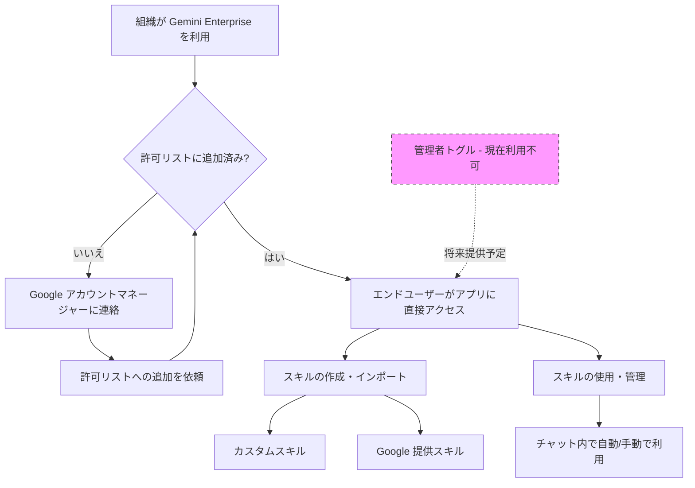

# Gemini Enterprise: スキル機能管理トグルに関する訂正

**リリース日**: 2026-07-09

**サービス**: Gemini Enterprise

**機能**: Enable skills 機能管理トグルの利用不可に関する訂正

**ステータス**: GA (許可リスト付き) - 管理者トグルは未提供

[このアップデートのインフォグラフィックを見る](https://takech9203.github.io/google-cloud-news-summary/20260709-gemini-enterprise-enable-skills-correction.html)

## 概要

2026年7月9日、Google は Gemini Enterprise のスキル機能に関するリリースノートの訂正を発表しました。2026年6月17日のリリースノートでは、管理者が「Enable skills」トグルを使用してスキル機能を有効化できると記載されていましたが、実際にはこのトグルは現時点で利用できないことが明確化されました。

現在、スキル機能自体は GA (一般提供) として許可リスト付きで利用可能ですが、管理者向けの機能管理トグルは未実装です。許可リストに追加された組織のエンドユーザーは、管理者トグルなしでアプリ内で直接スキルを作成・使用できます。この機能へのアクセスを希望する場合は、Google アカウントマネージャーへの連絡が必要です。

この訂正は、管理者向け UI が当初の説明と異なる状態であることを明確にするための事務的な修正であり、スキル機能自体の提供範囲や機能には変更はありません。

**訂正前 (6月17日のリリースノート)**

- 許可リストに追加後、管理者が「Enable skills」トグルをオンにする必要があると記載
- Web アプリの機能管理設定からトグルを操作する手順が案内されていた
- 管理者によるゲートキーピングが前提のフローとして説明されていた

**訂正後 (7月9日の発表)**

- 「Enable skills」トグルは現時点で利用不可であることが明確化
- 許可リストに追加された組織のエンドユーザーは直接スキルを利用可能
- 管理者トグルが利用可能になった際にリリースノートで改めて告知予定

## アーキテクチャ図

許可リストベースのアクセスフローを示しています。管理者トグルは将来提供予定であり、現時点ではエンドユーザーが許可リスト追加後に直接スキルを利用できます。

## サービスアップデートの詳細

### 主要ポイント

1. **「Enable skills」トグルの未提供**
   - 6月17日のリリースノートで言及された管理者向け機能管理トグルは現時点で利用できない
   - Web アプリの機能管理設定画面にこのトグルは表示されない
   - 管理者トグルの提供時期は未定 (利用可能になり次第リリースノートで告知)

2. **現在のアクセス方法 (許可リスト方式)**
   - Google アカウントマネージャーに連絡して許可リストへの追加を依頼
   - 組織が許可リストに追加されると、エンドユーザーは直接スキルを利用可能
   - 管理者によるトグル操作は現時点では不要 (かつ不可能)

3. **スキル機能自体の提供状況**
   - GA (一般提供) ステータスは変更なし (許可リスト付き)
   - スキルの作成、インポート、更新、使用は全て利用可能
   - Google 提供のデフォルトスキル (Brand Voice、Contract Review 等) も利用可能

## 技術仕様

### スキル機能の概要

| 項目 | 詳細 |
|------|------|
| 機能名 | Skills (スキル) |
| ステータス | GA with allowlist |
| 管理者トグル | 現在利用不可 (将来提供予定) |
| アクセス方法 | Google アカウントマネージャー経由で許可リスト追加 |
| 標準規格 | agentskills.io のオープンスタンダードに準拠 |

### Google 提供のデフォルトスキル

| スキル名 | 説明 |
|----------|------|
| Brand Voice | コンテンツをブランドガイドラインに準拠させる |
| Contract Creation | 法的契約書の初稿を生成 |
| Contract Review | 法的文書のリスク分析 |
| Customer Briefing | 顧客情報のサマリー作成 |
| Project Updates | プロジェクトステータスの要約 |

### 6月17日リリースノートとの差分

| 項目 | 6月17日の記載 | 7月9日の訂正 |
|------|--------------|--------------|
| 管理者トグル | 許可リスト追加後にトグルをオンにする | トグルは利用不可 |
| ユーザーアクセス | 管理者がトグル有効化後に利用可能 | 許可リスト追加後に直接利用可能 |
| 管理者の操作 | 機能管理設定でトグルを操作 | 現時点で操作不要 |

## 利用方法

### 前提条件

1. Gemini Enterprise のライセンスを保持していること
2. Google アカウントマネージャーに連絡して許可リストに追加されていること

### 手順

#### ステップ 1: 許可リストへの追加

Google アカウントマネージャーに連絡し、スキル機能の許可リストへの追加を依頼します。

#### ステップ 2: スキルの作成

許可リストに追加後、Gemini Enterprise Web アプリで以下の操作が可能です。

1. ナビゲーションメニューから「Skills」をクリック
2. 「+ New skill」をクリック
3. スキル名、説明、指示を入力
4. 「Create」をクリック

#### ステップ 3: スキルの使用

チャット内で以下の方法でスキルを利用できます。

- `@` メンションで明示的に呼び出し (例: `@Brand Voice`)
- 直接依頼 (例: 「Brand Voice スキルを使ってレビューして」)
- 自動選択 (タスクに関連するスキルが自動的に適用)

## 影響と考慮事項

### 管理者への影響

- **トグルによる制御ができない**: 現時点では管理者がスキル機能を組織単位で無効化するトグルが存在しない
- **許可リスト単位の制御**: アクセス制御は許可リストの追加/未追加でのみ管理される
- **将来のトグル提供**: 管理者トグルが提供された後は、より細かい制御が可能になる見込み

### エンドユーザーへの影響

- **直接利用可能**: 許可リストに追加された組織のユーザーは、管理者の追加操作なしでスキルを利用可能
- **機能制限なし**: スキルの作成、インポート、使用は全て利用可能

### 制限事項

- 管理者向け「Enable skills」トグルは現時点で利用不可
- 機能へのアクセスには許可リストへの追加が必要 (セルフサービスでは有効化不可)
- 管理者トグルの提供時期は未定

## 関連サービス・機能

- **Gemini Enterprise Workflow Agents**: 同様に許可リスト + 管理者トグル (Enable agent designer) で制御されるエージェント機能
- **Gemini Enterprise Web App Feature Management**: 各種機能のトグルを管理する管理者設定画面
- **agentskills.io**: スキルのオープンスタンダードを管理する規格

## 参考リンク

- [インフォグラフィック](https://takech9203.github.io/google-cloud-news-summary/20260709-gemini-enterprise-enable-skills-correction.html)
- [公式リリースノート](https://docs.cloud.google.com/release-notes#July_09_2026)
- [Gemini Enterprise リリースノート](https://docs.cloud.google.com/gemini/enterprise/docs/release-notes)
- [スキルのドキュメント](https://docs.cloud.google.com/gemini/enterprise/docs/skills)
- [Web アプリ機能管理](https://docs.cloud.google.com/gemini/enterprise/docs/manage-web-app-features)

## まとめ

今回の発表は、2026年6月17日のリリースノートに記載された「Enable skills」管理者トグルが実際には利用不可であることを訂正するものです。スキル機能自体は GA として提供されており、許可リストに追加された組織のエンドユーザーは直接利用できます。管理者は、トグルが将来提供されるまで、許可リスト単位でのアクセス管理となることを認識しておく必要があります。

---

**タグ**: #GeminiEnterprise #Skills #Correction #GA #Allowlist #FeatureManagement
