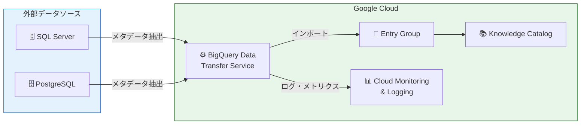

# Knowledge Catalog: SQL Server / PostgreSQL データベースコネクタ (Preview)

**リリース日**: 2026-07-09

**サービス**: Knowledge Catalog (旧 Dataplex Universal Catalog)

**機能**: SQL Server および PostgreSQL メタデータインポートコネクタ

**ステータス**: Preview

📊 [このアップデートのインフォグラフィックを見る](https://takech9203.github.io/google-cloud-news-summary/20260709-knowledge-catalog-database-connectors.html)

## 概要

Google Cloud の Knowledge Catalog に、SQL Server および PostgreSQL データソースからメタデータをインポートするためのプリビルトコネクタが Preview として追加された。これらのコネクタは BigQuery Data Transfer Service を活用し、外部データソースからメタデータ (技術メタデータ、運用メタデータ、ビジネスメタデータ) を自動抽出して Knowledge Catalog のエントリグループにインポートする。

今回の SQL Server / PostgreSQL コネクタの追加により、Knowledge Catalog がサポートするデータベースコネクタは Oracle、MySQL (2026年6月22日 Preview) と合わせて 4 種類となった。これにより、エンタープライズ環境で広く使用されている主要なリレーショナルデータベースからのメタデータ統合が実現し、データガバナンスの一元管理が大幅に容易になる。

対象ユーザーは、マルチデータソース環境でデータカタログの統合管理を行うデータエンジニア、データスチュワード、およびデータガバナンス担当者である。

**アップデート前の課題**

- SQL Server や PostgreSQL のメタデータを Knowledge Catalog に統合するには、カスタムコネクタを開発し Managed Service for Apache Spark 上でパイプラインを構築する必要があった
- メタデータの同期を維持するためにはカスタムオーケストレーション (Workflows ベース) を自前で実装する必要があった
- 技術メタデータ、運用メタデータ、ビジネスメタデータを個別に管理・同期する運用負荷が高かった

**アップデート後の改善**

- Google Cloud コンソールからの GUI 操作でコネクタを設定し、SQL Server / PostgreSQL のメタデータを自動インポート可能になった
- スケジュール設定により定期的なメタデータ同期が自動化され、カタログとソースシステムの一貫性が維持される
- 技術・運用・ビジネスメタデータを統合的に抽出し、Knowledge Catalog のエントリとして一元管理できるようになった

## アーキテクチャ図



Knowledge Catalog コネクタは BigQuery Data Transfer Service の転送構成を利用してデータソースに接続し、メタデータを抽出して指定された Entry Group にインポートする。各実行時にはエントリの完全上書きが行われ、ソースに存在しなくなったオブジェクトは削除される。

## サービスアップデートの詳細

### 主要機能

1. **プリビルトデータベースコネクタ**
   - SQL Server および PostgreSQL に対応した設定不要のコネクタ
   - Google Cloud コンソールの Knowledge Catalog セクションから直接設定可能
   - Network Attachment によるプライベートネットワーク経由の接続をサポート

2. **3 種類のメタデータ自動抽出**
   - **技術メタデータ**: データベース、スキーマ、テーブル、ビューの定義情報
   - **運用メタデータ**: テーブル、ビュー、ルーティンの作成日時と最終更新日時
   - **ビジネスメタデータ**: アセットオーナーとアノテーション情報

3. **スケジュールベースの自動同期**
   - カスタムスケジュールでメタデータインポートを定期実行
   - オンデマンド実行 (手動トリガー) もサポート
   - 各実行時にフルオーバーライトによりソースとの一貫性を維持

4. **エンタープライズ対応のセキュリティ機能**
   - TLS 暗号化通信のサポート (PEM 証明書指定可能)
   - CMEK (顧客管理暗号鍵) による一時データの暗号化
   - IAM ベースのアクセス制御 (Dataplex Entry Group Importer ロール)

## 技術仕様

### サポートされるデータソース

| データソース | コネクタ提供日 | ステータス |
|-------------|---------------|-----------|
| Oracle | 2026-06-22 | Preview |
| MySQL | 2026-06-22 | Preview |
| SQL Server | 2026-07-09 | Preview |
| PostgreSQL | 2026-07-09 | Preview |

### 抽出されるメタデータ種別

| メタデータ種別 | 内容 | 例 |
|--------------|------|-----|
| 技術メタデータ | データ構造の定義 | データベース、スキーマ、テーブル、ビュー |
| 運用メタデータ | アセットのライフサイクル情報 | 作成日時、最終更新日時 |
| ビジネスメタデータ | ビジネスコンテキスト | オーナー、アノテーション |

### 必要な IAM ロール

| 操作 | 必要なロール |
|------|-------------|
| ジョブ・実行履歴の閲覧 | BigQuery User (`roles/bigquery.user`) + Dataplex Viewer (`roles/dataplex.viewer`) |
| ジョブの編集・削除・手動トリガー | BigQuery Admin (`roles/bigquery.admin`) + Dataplex Administrator (`roles/dataplex.admin`) または Dataplex Editor (`roles/dataplex.editor`) |
| メタデータインポート実行 | Dataplex Entry Group Importer (`roles/dataplex.entryGroupImporter`) をサービスエージェントに付与 |

### サービスエージェント

BigQuery Data Transfer Service のサービスエージェントに対して、プロジェクトレベルまたはエントリグループレベルで `dataplex.entryGroups.import` 権限を付与する必要がある。

```
service-PROJECT_NUMBER@gcp-sa-bigquerydatatransfer.iam.gserviceaccount.com
```

## 設定方法

### 前提条件

1. BigQuery Data Transfer Service API が有効化されていること
2. Knowledge Catalog (Dataplex API) が有効化されていること
3. BigQuery Data Transfer Service サービスエージェントに `roles/dataplex.entryGroupImporter` ロールが付与されていること
4. データソースへのネットワーク接続が確立されていること (Network Attachment が必要な場合あり)

### 手順

#### ステップ 1: コネクタの作成

1. Google Cloud コンソールで Knowledge Catalog ページに移動
2. ナビゲーションメニューの「管理」セクションで「コネクタ」をクリック
3. 「接続を追加」をクリック
4. コネクタリストから「SQL Server」または「PostgreSQL」を選択

#### ステップ 2: データソースの設定

データソースの接続情報を入力:
- Network Attachment (必要に応じて)
- Host、Port、Database name
- Username、Password
- TLS Mode および Trusted PEM Certificate (TLS 使用時)
- インポート対象のメタデータオブジェクトを選択

#### ステップ 3: 宛先の設定

- 既存の Knowledge Catalog エントリグループを選択するか、新規作成
- エントリグループに対する権限を設定 (推奨)

#### ステップ 4: スケジュールの設定

- メタデータインポートジョブの実行頻度を設定
- 「On-demand」を選択した場合、手動トリガー時のみ実行

#### ステップ 5: オプション設定

- 通知オプション: メールまたは Pub/Sub によるジョブ失敗通知
- 暗号化設定: CMEK による一時データの暗号化

## メリット

### ビジネス面

- **データガバナンスの統一**: SQL Server や PostgreSQL に分散するメタデータを Knowledge Catalog で一元管理し、組織全体のデータ可視性を向上
- **コンプライアンス対応の簡素化**: データ資産の所在とオーナーシップを自動的にカタログ化することで、監査対応やデータリネージの追跡が容易に
- **データ民主化の促進**: Knowledge Catalog のセマンティック検索を通じて、ビジネスユーザーが SQL Server / PostgreSQL 上のデータ資産を発見・理解しやすくなる

### 技術面

- **運用負荷の削減**: カスタムコネクタ開発やパイプライン管理が不要になり、コンソール操作のみでメタデータ同期を実現
- **自動同期による一貫性確保**: スケジュールベースのフルオーバーライトにより、カタログとソースシステムの乖離を防止
- **パートナーエコシステムとの連携**: Collibra、Atlan、Datahub などのサードパーティガバナンスツールとの統合が可能

## デメリット・制約事項

### 制限事項

- 現時点では Preview ステータスのため、SLA の適用外であり本番環境での使用には注意が必要
- 各実行時にフルオーバーライト (完全上書き) が行われるため、差分のみの更新 (インクリメンタル同期) には非対応
- コネクタが管理するエントリグループ内のエントリのみが上書き対象となり、手動追加したエントリには影響しない

### 考慮すべき点

- Network Attachment によるプライベートネットワーク接続の設定が必要になる場合がある
- BigQuery Data Transfer Service のサービスエージェントに適切な権限を付与する必要がある
- ジョブ実行履歴は 90 日間で自動削除される
- CMEK は一時データの暗号化のみに使用され、宛先エントリグループ内のメタデータの暗号化には使用されない
- Preview 期間中のフィードバック・サポートは dataplex-discuss@google.com へのメール連絡

## ユースケース

### ユースケース 1: ハイブリッドクラウド環境のメタデータ統合

**シナリオ**: 企業がオンプレミスの SQL Server と Cloud SQL for PostgreSQL の両方にデータを保持しており、データ資産の全体像を把握したい場合。

**効果**: 両データソースのメタデータを Knowledge Catalog に自動インポートすることで、オンプレミスとクラウドにまたがるデータ資産のカタログを一元的に検索・閲覧でき、データスチュワードの管理工数を削減できる。

### ユースケース 2: データマイグレーション計画の策定

**シナリオ**: レガシーの SQL Server データベースを Google Cloud に移行する計画があり、移行対象のテーブル・ビューの全体像を事前に把握する必要がある場合。

**効果**: コネクタで SQL Server のメタデータを Knowledge Catalog にインポートし、テーブル定義やスキーマ構造を可視化することで、移行計画の精度向上とスコープ定義の明確化に貢献する。

### ユースケース 3: AI エージェントへのデータコンテキスト提供

**シナリオ**: AI エージェントがデータ分析タスクを実行する際に、利用可能なデータ資産とその意味を理解する必要がある場合。

**効果**: Knowledge Catalog の lookupContext API と組み合わせることで、SQL Server / PostgreSQL 上のデータ資産のコンテキストを AI エージェントに提供し、より適切なデータ利活用を実現できる。

## 料金

Knowledge Catalog のコネクタ機能は、以下の料金体系に基づいて課金される。

### 料金例

| 項目 | 料金 (USD) |
|------|-----------|
| Knowledge Catalog Standard 処理 (無料枠) | 毎月最初の 100 DCU-hour は無料 |
| Knowledge Catalog Standard 処理 | $0.060/DCU-hour~ |
| メタデータストレージ (無料枠) | 毎月平均 1 MiB まで無料 |
| メタデータストレージ | $2/GiB/月~ |
| API コール (無料枠) | 毎月最初の 100 万コールまで無料 |
| API コール | $10/10 万コール~ |

コネクタが使用する BigQuery Data Transfer Service の利用料は、BigQuery の料金体系に基づいて別途課金される。

詳細は [Knowledge Catalog 料金ページ](https://cloud.google.com/dataplex/pricing) を参照。

## 関連サービス・機能

- **BigQuery Data Transfer Service**: コネクタの実行基盤として使用され、メタデータ抽出ジョブのスケジューリングと実行を管理する
- **Cloud Monitoring / Cloud Logging**: コネクタジョブの実行状況の監視、ダッシュボード作成、エラーのトラブルシューティングに使用
- **Knowledge Catalog データリネージ**: インポートされたメタデータとデータフロー全体の追跡を組み合わせたデータガバナンスに活用
- **Knowledge Catalog マネージドコネクティビティ**: カスタムコネクタを Workflows と Managed Service for Apache Spark で実行する代替アプローチ (Snowflake、Databricks など追加ソースに対応)
- **Data Catalog (非推奨)**: 2026年6月1日より段階的シャットダウン開始。Knowledge Catalog への移行が推奨

## 参考リンク

- 📊 [インフォグラフィック](https://takech9203.github.io/google-cloud-news-summary/20260709-knowledge-catalog-database-connectors.html)
- [公式リリースノート](https://docs.cloud.google.com/release-notes#July_09_2026)
- [About database connectors](https://docs.cloud.google.com/dataplex/docs/connectors)
- [Manage connector jobs](https://docs.cloud.google.com/dataplex/docs/manage-connector-jobs)
- [Knowledge Catalog 料金ページ](https://cloud.google.com/dataplex/pricing)
- [Knowledge Catalog 概要](https://docs.cloud.google.com/dataplex/docs/introduction)
- [SQL Server コネクタ設定](https://docs.cloud.google.com/dataplex/docs/sql-server-transfer)
- [マネージドコネクティビティ概要](https://docs.cloud.google.com/dataplex/docs/managed-connectivity-overview)

## まとめ

Knowledge Catalog に SQL Server と PostgreSQL のプリビルトコネクタが追加されたことで、エンタープライズ環境で広く使われる 4 大 RDBMS (Oracle、MySQL、SQL Server、PostgreSQL) からのメタデータ自動インポートが実現した。カスタムコネクタ開発やパイプライン管理の負担なくデータカタログの統合管理が可能になるため、データガバナンスの強化を検討している組織は、Preview 段階で検証を開始することを推奨する。

---

**タグ**: #KnowledgeCatalog #Dataplex #メタデータ管理 #データガバナンス #SQLServer #PostgreSQL #データカタログ #Preview
