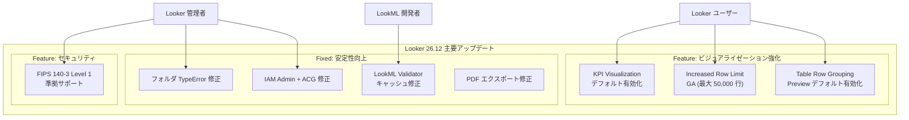

# Looker: 26.12 リリース (KPI Visualization デフォルト有効化 / Increased Row Limit GA)

**リリース日**: 2026-07-09

**サービス**: Looker (Google Cloud core / Looker original)

**機能**: Looker 26.12 リリース - KPI Visualization、Increased Row Limit GA、多数のバグ修正

**ステータス**: GA / Preview (機能による)

:chart_with_upwards_trend: [このアップデートのインフォグラフィックを見る](https://takech9203.github.io/google-cloud-news-summary/20260709-looker-26-12-release.html)

## 概要

Looker 26.12 が 2026 年 7 月 12 日から段階的にロールアウトされる。今回のリリースでは、KPI Visualization プレビュー機能がデフォルトで有効化され、Increased Row Limit 機能が GA (一般提供) に昇格するという 2 つの主要な機能強化が含まれている。さらに、Table Row Grouping プレビュー機能の追加、Looker (Google Cloud core) 向けの FIPS 140-3 Level 1 準拠サポートなど、幅広いアップデートが行われる。

バグ修正面では、フォルダクラッシュ、IAM ロール経由の Admin ユーザーの接続アクセス問題、OIDC/SAML ページのレイアウト不具合、LookML Validator のキャッシュ問題、PDF エクスポートでのカスタムビジュアライゼーション切れなど、合計 10 件以上の修正が含まれており、プラットフォーム全体の安定性が大幅に向上する。

デプロイメントは 2026 年 7 月 12 日に開始され、7 月 26 日までに全インスタンスへの展開完了が予定されている。

**アップデート前の課題**

- KPI Visualization は Preview 機能として存在していたが、管理者が手動で有効化する必要があり、多くのインスタンスで利用されていなかった
- Increased Row Limit は Preview 段階であり、本番環境での利用に躊躇するユーザーが存在していた (最大行数は 5,000 行に制限)
- フォルダ内に無効化されたインテグレーションのスケジュールコンテンツがある場合、TypeError でクラッシュしていた
- ACG (Advanced Control Governance) 有効時に IAM 経由の Admin ロールユーザーが接続にアクセスできなかった
- LookML Validator がプロジェクト依存関係の更新時に古いキャッシュを使用していた

**アップデート後の改善**

- KPI Visualization がデフォルト有効化され、すべてのユーザーが追加設定なしでリッチな KPI 表示を利用可能
- Increased Row Limit が GA 昇格し、本番環境でも安心して最大 50,000 行までのデータ表示が可能に
- フォルダアクセス時のクラッシュが解消され、安定したコンテンツ管理が可能に
- IAM 経由の管理者が ACG 環境下でも正しく接続にアクセス可能に
- LookML Validator が依存関係更新を正しく検知し、常に最新の検証結果を提供

## アーキテクチャ図

Looker 26.12 の主要アップデートを機能カテゴリ別に示した図。ビジュアライゼーション強化、セキュリティ向上、安定性改善の 3 領域にわたる包括的なリリースとなっている。

## サービスアップデートの詳細

### 主要機能

1. **KPI Visualization プレビュー機能 (デフォルト有効化)**
   - 従来の Single Value チャートオプションを KPI (Single Value) チャートオプションに置き換え
   - スパークラインやバーチャートの副次的ビジュアライゼーションの追加が可能
   - プライマリ値と他のメジャーとの比較表示 (first row、second row、last row、totals row から選択)
   - 背景色、値の配置などの拡張スタイリングオプション
   - Looker 26.10 以降のインスタンスで利用可能

2. **Increased Row Limit (GA)**
   - Preview から GA (一般提供) に昇格
   - マップチャート、散布図チャート、テーブルチャートの行制限を最大 50,000 行まで設定可能
   - 管理者が Content Guardrails ページの Visualization Limits 設定でチャートタイプごとに制限を設定
   - PDF 配信時はダッシュボードあたり最大 200,000 セルの制限あり

3. **Table Row Grouping (Preview、デフォルト有効化)**
   - テーブルチャートデータを階層的にグループ表示
   - Grouping メニューオプションによる外観のカスタマイズ
   - ドリルダウンによるデータ探索が可能
   - 小計 (Subtotals) の表示サポート

4. **FIPS 140-3 Level 1 準拠 (Looker Google Cloud core のみ)**
   - Looker (Google Cloud core) が FIPS 140-3 Level 1 に対応
   - 既存の FIPS 140-2 準拠インスタンスは 26.12 アップグレード時に自動的に FIPS 140-3 に移行
   - Enterprise または Embed エディションで新規インスタンス作成時に有効化可能

### バグ修正

| 修正内容 | 対象 | 影響 |
|---------|------|------|
| 無効化されたインテグレーションのスケジュールコンテンツを含むフォルダでの TypeError クラッシュ | Google Cloud core | 高 |
| IAM 経由 Admin ロールが ACG 有効時に接続アクセス不可 | Google Cloud core | 高 |
| OIDC/SAML 認証 Admin ページのレイアウト・カラム配置の不具合 | 共通 | 中 |
| Reset Styles がテーブルテーマ・カラーパレット・カスタムボーダーをリセット | 共通 | 中 |
| create_alerts 権限ユーザーに Workflows ページが表示されない | 共通 | 中 |
| KPI Visualization のスパークライン無効時に比較値が不正にセンタリング | 共通 | 低 |
| LookML Validator がプロジェクト依存関係更新時に古いキャッシュを使用 | 共通 | 高 |
| カスタムビジュアライゼーションが PDF エクスポートで切れる | 共通 | 中 |
| ダッシュボードタイルに結果がない場合 row_total がスケジュール配信でエラー | 共通 | 中 |
| Deploy Manager のコミットハッシュがコンパイル中 PENDING のまま更新されない | 共通 | 低 |

## 技術仕様

### Increased Row Limit の制限設定

| チャートタイプ | 設定可能な最大行数 | 従来の最大行数 |
|--------------|-------------------|---------------|
| Maps (Google Maps) | 50,000 データポイント | 5,000 |
| Scatterplot | 50,000 データポイント | 5,000 |
| Table | 50,000 行 | 5,000 |

### KPI Visualization の要件

| 項目 | 詳細 |
|------|------|
| 最低バージョン | Looker 26.10 以降 |
| 有効化権限 | Admin Looker ロール |
| 利用権限 | User ロール (explore 権限) |
| 対象プラットフォーム | Looker (Google Cloud core)、Looker (original、Looker-hosted) |

### PDF 配信時の制限事項

| 項目 | 制限値 |
|------|--------|
| テーブルチャートの最大表示行数 | 50,000 行 / タイル |
| ダッシュボード全体のセル上限 | 200,000 セル |
| 散布図 / Google Maps | 50,000 データポイント (タイルサムネイルと同じ表示) |

## 設定方法

### KPI Visualization の有効化確認

26.12 ではデフォルト有効化されるため、特別な設定は不要。無効化する場合の手順:

1. Admin メニューから **Preview** (General セクション) を開く
2. **KPI Visualization** スイッチをオフに切り替え

### Increased Row Limit の設定

#### ステップ 1: Content Guardrails ページにアクセス

Admin パネル > Performance Center > Content Guardrails に移動。

#### ステップ 2: Visualization Limits を設定

Visualization Limits セクションで各チャートタイプの行制限を設定:
- Maps visualization row limit
- Scatterplot visualization row limit
- Table visualization row limit

**注意**: 既存のダッシュボードタイルは自動的に新しい行制限を反映しない。個別にタイルを編集して行制限を更新する必要がある。

## メリット

### ビジネス面

- **データ表現力の向上**: KPI Visualization により、スパークラインや比較値を含むリッチな KPI 表示が標準装備となり、ダッシュボードの表現力が向上
- **大規模データ対応**: 50,000 行までの表示対応により、従来は分割が必要だったレポートを 1 つのビジュアライゼーションで完結可能
- **コンプライアンス強化**: FIPS 140-3 Level 1 対応により、政府機関や金融機関の厳格なセキュリティ要件を満たすことが可能

### 技術面

- **開発効率の向上**: LookML Validator のキャッシュ問題修正により、依存関係のある複数プロジェクト構成での開発が信頼性向上
- **運用安定性**: フォルダクラッシュや IAM アクセス問題の修正により、管理者の運用負荷が軽減
- **デプロイメント管理**: Deploy Manager のコミットハッシュ表示修正により、デプロイ状態の正確な把握が可能

## デメリット・制約事項

### 制限事項

- Increased Row Limit で 5,000 行を超える設定はインスタンスパフォーマンスに影響する可能性がある (データベース負荷、ブラウザ負荷、ネットワーク負荷)
- 既存のダッシュボードタイルには新しい行制限が自動適用されず、個別編集が必要
- FIPS 140-3 準拠モードでは Apache Druid、Microsoft SQL Server、Teradata 等の一部データベースダイアレクトが使用不可
- FIPS 準拠インスタンスへの非 FIPS インスタンスからのデータエクスポート・移行は不可

### 考慮すべき点

- KPI Visualization 有効化により、既存の Single Value チャートが KPI (Single Value) に置き換わるため、既存ダッシュボードの表示確認を推奨
- 行制限を大幅に引き上げる場合は、パフォーマンスへの影響を事前にテストすることを推奨
- デプロイ期間が 7 月 12 日〜26 日と 2 週間にわたるため、インスタンスごとに適用タイミングが異なる点に注意

## ユースケース

### ユースケース 1: エグゼクティブ KPI ダッシュボード

**シナリオ**: 経営層向けに売上、利益率、前年比較を 1 つのダッシュボードタイルで視覚的に表示したい

**実装例**:
1. Explore でメジャー (売上) を選択
2. KPI (Single Value) チャートタイプを選択
3. Comparison メニューで前年同期のメジャーを比較対象に指定
4. Style メニューでスパークラインを有効化し、トレンドを表示
5. 背景色やアラインメントを調整

**効果**: 管理者による事前設定なしで、すべてのユーザーがリッチな KPI ビジュアライゼーションを即座に利用可能

### ユースケース 2: 大規模データテーブルの分析

**シナリオ**: 小売業で 10,000 件以上の SKU データを 1 つのテーブルビジュアライゼーションで表示・分析したい

**実装例**:
1. Admin > Performance Center > Content Guardrails に移動
2. Table visualization row limit を 10,000 に設定
3. ダッシュボードタイルを編集して新しい行制限を適用
4. Table Row Grouping を有効化してカテゴリ別に階層表示

**効果**: 従来 5,000 行制限で複数ページに分割していたレポートを統合し、データ分析の効率が向上

## 料金

Looker の料金は Looker (Google Cloud core) のエディション (Standard、Enterprise、Embed) に基づく。今回のアップデートに追加料金は発生しない。KPI Visualization、Increased Row Limit、Table Row Grouping はすべて既存ライセンスに含まれる機能である。

詳細は [Looker 料金ページ](https://cloud.google.com/looker/pricing) を参照。

## 関連サービス・機能

- **Looker Studio**: Google Cloud のもう一つの BI ツール。Looker はエンタープライズ向けのセマンティックレイヤーと LookML によるデータモデリングに強み
- **Gemini in Looker**: AI アシスタント機能。LookML 生成支援、Expression Assistant、Visualization Assistant を提供
- **Looker Continuous Integration (CI)**: LookML Validator を含む CI 機能。プロジェクト品質管理に活用
- **Knowledge Catalog (Dataplex)**: Looker メタデータとのデータリネージ連携

## 参考リンク

- :chart_with_upwards_trend: [インフォグラフィック](https://takech9203.github.io/google-cloud-news-summary/20260709-looker-26-12-release.html)
- [公式リリースノート](https://docs.cloud.google.com/release-notes#July_09_2026)
- [KPI (Single Value) Visualization ドキュメント](https://docs.cloud.google.com/looker/docs/kpi-single-value-options)
- [Content Guardrails - Visualization Limits](https://docs.cloud.google.com/looker/docs/admin-panel-performance-center-content-guardrails#visualization-limits)
- [Preview Features 一覧](https://docs.cloud.google.com/looker/docs/admin-panel-general-preview-features)
- [FIPS 140-3 Level 1 準拠](https://docs.cloud.google.com/looker/docs/looker-core-fips-mode)
- [Table Row Grouping オプション](https://docs.cloud.google.com/looker/docs/table-options#grouping-menu-options)
- [Looker 料金](https://cloud.google.com/looker/pricing)

## まとめ

Looker 26.12 は、KPI Visualization のデフォルト有効化と Increased Row Limit の GA 昇格という 2 つのビジュアライゼーション強化を軸に、FIPS 140-3 対応によるセキュリティ向上、10 件以上のバグ修正による安定性改善を含む包括的なリリースである。特に Increased Row Limit の GA 昇格により、大規模データセットを扱う組織は本番環境で安心して 50,000 行までのデータ表示を活用できるようになる。デプロイ開始は 7 月 12 日からのため、既存ダッシュボードへの影響確認と Content Guardrails の設定計画を事前に進めることを推奨する。

---

**タグ**: #Looker #BI #KPI-Visualization #Increased-Row-Limit #FIPS-140-3 #Table-Row-Grouping #GA #Preview #BugFix
