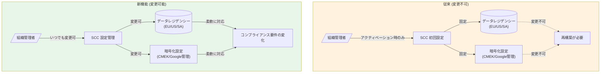

# Security Command Center: データレジデンシーおよびデータ暗号化設定のアクティベーション後変更が可能に

**リリース日**: 2026-07-09

**サービス**: Security Command Center

**機能**: データレジデンシーおよびデータ暗号化構成のアクティベーション後変更

**ステータス**: GA (General Availability)

[このアップデートのインフォグラフィックを見る](https://takech9203.github.io/google-cloud-news-summary/20260709-security-command-center-data-residency-modification.html)

## 概要

Security Command Center の Premium および Standard ティアにおいて、組織に対して Security Command Center をアクティベーションした後でも、データレジデンシーとデータ暗号化の構成を変更できるようになりました。これまではアクティベーション時にのみ設定可能であり、一度有効化すると変更不可能であった制約が緩和されています。

この機能改善は、コンプライアンス要件の変化やビジネス展開に伴い、セキュリティデータの保存先リージョンや暗号化方式を事後的に見直す必要がある組織にとって、極めて重要なアップデートです。GDPR、データ主権規制、業界固有のコンプライアンス要件への対応が、再アクティベーションなしで柔軟に行えるようになります。

対象ユーザーは、Security Command Center を組織レベルで運用している Standard および Premium ティアのお客様です。特に、グローバル展開や規制環境の変化に伴うデータガバナンス戦略の見直しを検討している組織に大きなメリットがあります。

**アップデート前の課題**

- データレジデンシーの設定は Security Command Center アクティベーション時にのみ構成可能で、後から変更できなかった
- データ暗号化 (CMEK) の設定もアクティベーション後に変更不可であり、暗号鍵の切り替えや暗号化方式の変更には再構築が必要だった
- コンプライアンス要件が変更された場合、Security Command Center を一度無効化して再アクティベーションする以外に対応方法がなく、運用上の大きな負担が発生していた
- 組織のデータ主権ポリシーの変化に追随できず、セキュリティ運用とコンプライアンスの間にギャップが生じる可能性があった

**アップデート後の改善**

- Premium および Standard ティアでアクティベーション後にデータレジデンシー設定を変更可能になった
- データ暗号化構成 (Google デフォルト暗号化と CMEK 間の切り替えなど) もアクティベーション後に変更可能になった
- コンプライアンス要件の変化に対して、サービスの中断なく柔軟に対応できるようになった
- 既存のセキュリティ findings やデータを維持しつつ、データガバナンスポリシーの変更が可能になった

## アーキテクチャ図



従来はアクティベーション時に固定されていたデータレジデンシーおよび暗号化設定が、アクティベーション後にも変更可能になったことを示す Before/After 比較図です。

## サービスアップデートの詳細

### 主要機能

1. **データレジデンシー設定のポストアクティベーション変更**
   - Security Command Center のアクティベーション後に、データの保存場所 (リージョン) を変更可能
   - サポートされるロケーション: EU (欧州連合)、US (米国)、SA (サウジアラビア王国)
   - Jurisdictional Google Cloud Console を使用して設定変更を実施

2. **データ暗号化設定のポストアクティベーション変更**
   - Google デフォルト暗号化から CMEK (顧客管理暗号鍵) への切り替え、またはその逆が可能
   - Cloud KMS キーの変更にも対応
   - 暗号化ポリシーの見直しを運用中に実施可能

3. **対象ティア**
   - Premium ティア: サブスクリプションおよび従量課金の両方に対応
   - Standard ティア: 無償ティアでも設定変更が利用可能
   - 組織レベルのアクティベーションが前提条件

## 技術仕様

### データレジデンシー対応ロケーション

| ロケーション | リージョンコード | 対応する Cloud KMS キーロケーション | 対応内容 |
|------|------|------|------|
| 欧州連合 (EU) | `eu` | `europe` | EU 加盟国内の Google Cloud リージョンにデータを保存 |
| 米国 (US) | `us` | `us` | 米国内の Google Cloud リージョンにデータを保存 |
| サウジアラビア王国 (KSA) | `sa` | `me-central2` | KSA 内の Google Cloud リージョンにデータを保存 |

### データレジデンシー対象リソース

| リソースタイプ | データレジデンシー制御 |
|------|------|
| Findings (検出結果) | 対象 |
| BigQuery エクスポート設定 | 対象 |
| 継続的エクスポート設定 (NotificationConfig) | 対象 |
| ミュートルール設定 (MuteConfig) | 対象 |
| Google SecOps リソース | 対象 |
| その他の SCC リソース・設定 | 対象外 (Google Cloud 利用規約に従い保存) |

### CMEK で暗号化されるリソースタイプ

| リソースタイプ | CMEK 暗号化対応 |
|------|------|
| Findings | 対応 |
| 通知設定 (Notification configurations) | 対応 |
| BigQuery エクスポート | 対応 |
| ミュート設定 (Mute configs) | 対応 |

### API 要件

- データレジデンシーを有効化する場合、Security Command Center v2 API の使用が必須
- リージョナルエンドポイント: `securitycenter.LOCATION.rep.googleapis.com`

## 設定方法

### 前提条件

1. Security Command Center が組織レベルで有効化されていること
2. Premium または Standard ティアを使用していること
3. データレジデンシー変更の場合: Jurisdictional Google Cloud Console へのアクセス権限
4. CMEK 変更の場合: Cloud KMS キーの作成権限および該当するロケーションのキーリング

### 手順

#### ステップ 1: Jurisdictional Console へのアクセス

データレジデンシー設定を変更する場合は、対象ロケーションの Jurisdictional Console を使用します。

| ロケーション | Console URL |
|------|------|
| EU | `console.eu.cloud.google.com` |
| US | `console.us.cloud.google.com` |
| KSA | `console.sa.cloud.google.com` |

#### ステップ 2: データレジデンシーおよび暗号化設定の変更

Security Command Center の設定画面から、データレジデンシーと暗号化の構成を変更します。詳細な手順は公式ドキュメント「[Modify data residency and encryption](https://docs.cloud.google.com/security-command-center/docs/modify-data-residency-encryption.md)」を参照してください。

#### ステップ 3: CMEK キーの設定 (暗号化変更時)

CMEK を使用する場合は、適切なロケーションに Cloud KMS キーを準備します。

```bash
# キーリングの作成 (例: EU ロケーション)
gcloud kms keyrings create scc-keyring \
  --location europe \
  --project YOUR_KMS_PROJECT_ID

# 暗号化キーの作成
gcloud kms keys create scc-cmek-key \
  --keyring scc-keyring \
  --location europe \
  --purpose encryption \
  --project YOUR_KMS_PROJECT_ID
```

#### ステップ 4: サービスエージェントへの権限付与

```bash
# SCC サービスエージェントに Cloud KMS CryptoKey Encrypter/Decrypter ロールを付与
gcloud kms keys add-iam-policy-binding scc-cmek-key \
  --keyring scc-keyring \
  --location europe \
  --member=serviceAccount:service-org-ORGANIZATION_NUMBER@security-center-api.iam.gserviceaccount.com \
  --role=roles/cloudkms.cryptoKeyEncrypterDecrypter
```

## メリット

### ビジネス面

- **コンプライアンス対応の柔軟性**: 規制変更やビジネス展開に伴うデータ主権要件の変化に、サービスの再構築なしで対応可能
- **運用継続性の向上**: Security Command Center を停止・再アクティベーションする必要がなくなり、セキュリティ監視のギャップが発生しない
- **マルチリージョン展開の促進**: EU、US、KSA 間でのデータレジデンシー変更が容易になり、グローバル展開時のガバナンス調整が簡素化

### 技術面

- **暗号化ライフサイクル管理の改善**: CMEK キーの変更やローテーションに伴う暗号化方式の見直しが、運用中に実施可能
- **Infrastructure as Code との親和性**: 設定変更が可能になったことで、Terraform 等による宣言的な構成管理に対応しやすくなる
- **セキュリティポスチャーの継続的改善**: 暗号化強度の向上やリージョン変更を、既存の Findings データを維持しつつ段階的に実施可能

## デメリット・制約事項

### 制限事項

- データレジデンシーを有効化すると、一部の機能が利用不可となる (Premium ティアでは KSA 環境での AI Protection、Compliance ページのスキャン数表示が利用不可)
- Security Command Center v2 API の使用が必須 (v1 API は使用不可)
- CMEK キーを無効化・破棄した場合、Security Command Center が動作停止し、データ損失が発生する可能性がある (鍵バージョンの破棄は不可逆)

### 考慮すべき点

- データレジデンシーの変更に伴い、既存の Findings が新しいロケーションに移行されるまでの間、一時的に異なるリージョンに存在する可能性がある
- CMEK キーの変更後も、古いキーは 30 日間一部の機能で使用される場合がある
- Enterprise ティアでは本変更の対象外となる可能性があるため、Enterprise ティア利用者は別途確認が必要

## ユースケース

### ユースケース 1: EU 規制対応後の KSA 展開

**シナリオ**: 当初は EU のデータレジデンシー要件に対応するため EU リージョンで Security Command Center を設定していた企業が、中東市場への展開に伴い KSA のデータ主権規制にも準拠する必要が生じた場合。

**効果**: Security Command Center の再構築やデータ移行プロジェクトを実施することなく、設定変更のみで新しいデータレジデンシー要件に対応可能。セキュリティ監視のダウンタイムがゼロ。

### ユースケース 2: Google デフォルト暗号化から CMEK への移行

**シナリオ**: 当初はコスト最適化を優先して Google デフォルト暗号化で Security Command Center を運用していた組織が、監査要件の厳格化により顧客管理暗号鍵 (CMEK) の使用が必須となった場合。

**効果**: 既存のセキュリティ Findings やアラート設定を維持したまま、暗号化方式を CMEK に移行可能。Cloud KMS による鍵のライフサイクル管理、監査ログ、アクセス制御が追加される。

### ユースケース 3: M&A に伴うデータガバナンス統合

**シナリオ**: 企業買収により、買収先の組織が異なるデータレジデンシー設定で Security Command Center を運用していた場合。買収元の統合ガバナンスポリシーに合わせる必要がある。

**効果**: 買収先の Security Command Center のデータレジデンシーおよび暗号化設定を、統合ポリシーに合わせて変更可能。セキュリティ態勢の統合をスムーズに実施。

## 料金

Security Command Center の料金体系はティアによって異なります。データレジデンシーおよび暗号化設定の変更自体には追加料金は発生しませんが、CMEK を使用する場合は Cloud KMS の料金が別途発生します。

### 料金例

| 項目 | 料金 |
|--------|-----------------|
| Standard ティア | 無料 |
| Premium ティア (従量課金) | リソース使用量に基づく課金 |
| Premium ティア (サブスクリプション) | 契約内容に基づく |
| Cloud KMS (CMEK 使用時) | キーバージョンあたり $0.06/月 + 暗号化オペレーション料金 |

詳細は [Security Command Center の料金ページ](https://cloud.google.com/security-command-center/pricing) を参照してください。

## 利用可能リージョン

データレジデンシーでサポートされるロケーション:

- **欧州連合 (EU)**: EU 加盟国内の Google Cloud リージョン
- **米国 (US)**: 米国内の Google Cloud リージョン
- **サウジアラビア王国 (KSA)**: KSA 内の Google Cloud リージョン (`me-central2`)

## 関連サービス・機能

- **Cloud KMS**: CMEK による暗号鍵管理。Security Command Center の暗号化設定変更時にキーの作成・管理が必要
- **Organization Policy Service**: `gcp.resourceLocations` 制約によるリソースロケーションポリシーの適用。SCC のデータレジデンシーと整合性を取る必要がある
- **Google SecOps (Chronicle)**: Enterprise ティアで連携。データレジデンシーはデフォルトで有効
- **Security Health Analytics**: データレジデンシー有効化時に一部の Compliance 機能が制限される

## 参考リンク

- [インフォグラフィック](https://takech9203.github.io/google-cloud-news-summary/20260709-security-command-center-data-residency-modification.html)
- [公式リリースノート](https://docs.cloud.google.com/release-notes#July_09_2026)
- [データレジデンシーサポート](https://docs.cloud.google.com/security-command-center/docs/data-residency-support)
- [CMEK (顧客管理暗号鍵)](https://docs.cloud.google.com/security-command-center/docs/cmek)
- [データレジデンシーと暗号化の変更手順](https://docs.cloud.google.com/security-command-center/docs/modify-data-residency-encryption.md)
- [Security Command Center リージョナルエンドポイント](https://docs.cloud.google.com/security-command-center/docs/regional-endpoints)
- [料金ページ](https://cloud.google.com/security-command-center/pricing)

## まとめ

今回のアップデートにより、Security Command Center の Premium および Standard ティアにおいて、これまでアクティベーション時にのみ設定可能であったデータレジデンシーとデータ暗号化の構成を、運用開始後にも変更できるようになりました。これはコンプライアンス要件の変化に柔軟に対応する必要がある組織にとって、セキュリティ運用の継続性を維持しつつガバナンスポリシーを適応させることを可能にする重要な改善です。既に Security Command Center を運用中でデータ主権要件の見直しを検討している組織は、公式ドキュメント「Modify data residency and encryption」を確認し、変更手順と制約事項を把握した上で計画的に実施することを推奨します。

---

**タグ**: #SecurityCommandCenter #DataResidency #CMEK #Compliance #DataSovereignty #Encryption #CloudKMS #セキュリティ #コンプライアンス
