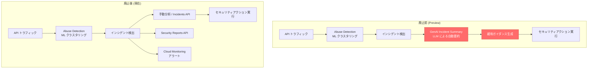

# Apigee Advanced API Security: GenAI Incident Summary (generative AI Insights) の廃止

**リリース日**: 2026-07-10

**サービス**: Apigee Advanced API Security

**機能**: GenAI Incident Summary (generative AI Insights)

**ステータス**: Deprecated (廃止・シャットダウン)

[このアップデートのインフォグラフィックを見る](https://takech9203.github.io/google-cloud-news-summary/20260710-apigee-genai-incident-summary-deprecated.html)

## 概要

Apigee Advanced API Security の Abuse Detection 機能に含まれていた GenAI Incident Summary (generative AI Insights) が、2026 年 7 月 9 日をもって廃止およびシャットダウンされた。この機能は Preview ステータスのまま提供終了となる。

GenAI Incident Summary は、Google Cloud の生成 AI 大規模言語モデル (LLM) を活用し、Abuse Detection のクラスタリングツールが検出したセキュリティインシデントに対して、自動要約と緩和ガイダンスを提供する機能であった。2024 年 6 月 27 日に Preview としてリリースされ、約 2 年間の提供期間を経て廃止が決定された。

この廃止はスタンドアロン機能としての GenAI Incident Summary のみに影響し、Abuse Detection の中核機能 (ML ベースの異常検知、インシデントクラスタリング、セキュリティアクション) は引き続き利用可能である。

**アップデート前の状態**

- GenAI Incident Summary により、検出されたインシデントの LLM ベースの自動要約が利用可能であった
- セキュリティインシデントに対する AI 生成の緩和ガイダンスが提供されていた
- Gemini Code Assist アドオンを必要とせず、Advanced API Security 有効化プロジェクトで利用可能であった

**アップデート後の変更**

- GenAI Incident Summary 機能は完全に利用不可となった
- インシデントの要約と緩和ガイダンスは手動で分析する必要がある
- Abuse Detection の ML ベースの検出、セキュリティアクション、セキュリティレポートなどの中核機能は引き続き利用可能

## アーキテクチャ図



上図は、GenAI Incident Summary の廃止前後の Abuse Detection ワークフローの変化を示している。LLM ベースの自動要約と緩和ガイダンス生成のステップが削除され、手動分析や既存の API・レポート機能を活用したワークフローへの移行が必要となる。

## サービスアップデートの詳細

### 廃止される機能

1. **GenAI Incident Summary (自動要約)**
   - Abuse Detection が検出したセキュリティインシデントの自動要約生成
   - Google Cloud の生成 AI LLM を使用した自然言語による説明
   - インシデントの影響範囲、攻撃パターンの解説

2. **AI ベースの緩和ガイダンス**
   - インシデントに対する推奨される対策の自動生成
   - セキュリティアクション (deny, flag) の提案
   - 対応優先度の AI 判定

3. **対象ステータス**
   - Preview (Public Preview) のまま廃止
   - GA (一般提供) には移行せず終了

### 引き続き利用可能な機能

1. **Abuse Detection (中核機能)**
   - ML ベースの異常検知とクラスタリング
   - セキュリティインシデントの自動検出
   - リスクレベル評価 (Severe / Moderate / Low)
   - インシデントの属性情報 (IP アドレス、国、プロキシ、検出ルール)

2. **Security Actions (セキュリティアクション)**
   - 検出されたトラフィックに対する deny / flag / allow アクション
   - IP アドレス、CIDR 範囲、API キー、User Agent 等による条件指定
   - プロキシ固有のセキュリティアクション

3. **Security Reports (セキュリティレポート)**
   - カスタムレポートの生成
   - 国別、IP 別の悪意あるリクエスト分析

4. **Risk Assessment v2 (GA)**
   - API 構成のセキュリティスコア評価
   - セキュリティプロファイルに基づく改善推奨

## 技術仕様

### 廃止スケジュール

| 日付 | イベント |
|------|---------|
| 2024-06-27 | GenAI Incident Summary Preview リリース |
| 2024-07-19 | 一時的な既知の問題により無効化 |
| 2024-08-02 | 問題解決後に再有効化 |
| 2026-07-09 | 廃止およびシャットダウン (最終日) |
| 2026-07-10 | 公式廃止アナウンス |

### 影響を受ける API エンドポイント

| 項目 | 詳細 |
|------|------|
| 対象サービス | Apigee Advanced API Security - Abuse Detection |
| 廃止機能 | GenAI Incident Summary (generative AI Insights) |
| 影響範囲 | すべての Advanced API Security 有効化プロジェクト |
| ステータス | Preview → 廃止 (GA 移行なし) |
| 代替機能 | Incidents API、Security Reports API、手動分析 |

## 代替アプローチ

### 方法 1: Incidents API による詳細情報取得

```bash
# Incidents API でインシデント一覧を取得
curl -X GET \
  "https://apigee.googleapis.com/v1/organizations/{ORG}/environments/{ENV}/securityIncidents" \
  -H "Authorization: Bearer $(gcloud auth print-access-token)"
```

Incidents API を使用してインシデントの詳細データ (検出ルール、影響プロキシ、IP アドレス、国情報) をプログラム的に取得し、独自の分析パイプラインで処理する。

### 方法 2: Security Reports API によるカスタム分析

```bash
# Security Reports API でカスタムレポートを作成
curl -X POST \
  "https://apigee.googleapis.com/v1/organizations/{ORG}/environments/{ENV}/securityReports" \
  -H "Authorization: Bearer $(gcloud auth print-access-token)" \
  -H "Content-Type: application/json" \
  -d '{
    "displayName": "Incident Analysis Report",
    "dimensions": ["ax_resolved_client_ip", "ax_geo_country"],
    "metrics": ["message_count", "error_count"],
    "filter": "ax_security_incident_id != \"\"",
    "timeRange": "last7days"
  }'
```

### 方法 3: Cloud Monitoring によるアラート設定

セキュリティアラート機能を活用し、インシデント検出時に自動通知を設定することで、迅速な手動対応を実現する。

## メリット

### (廃止による) 影響が限定的な理由

- **中核機能は維持**: Abuse Detection の ML ベースの検出、クラスタリング、セキュリティアクションは引き続き動作
- **API アクセス可能**: Incidents API と Security Stats API でインシデントデータへのプログラム的アクセスが維持
- **Preview 段階**: GA 未到達のため、本番依存が少ないと想定

### 代替手段の利点

- **Incidents API**: より詳細なデータアクセスと自動化が可能
- **Security Actions**: 自動的な遮断/フラグ付け機能は引き続き利用可能
- **Security Reports**: カスタマイズ可能な分析レポートの生成

## デメリット・制約事項

### 影響

- GenAI による自動要約がなくなるため、インシデント分析に人手が必要になる
- 特にセキュリティチームの少ない組織では、インシデント対応の初動が遅れる可能性がある
- AI ベースの緩和ガイダンスがなくなるため、対策の立案に専門知識がより求められる

### 考慮すべき点

- GenAI Incident Summary に依存したワークフローを構築している場合、代替手段への移行計画が必要
- インシデントの要約と対応ガイダンスを自動化したい場合、Vertex AI や Gemini API を使った独自の分析パイプライン構築を検討する必要がある
- Preview 機能であったため、SLA や正式サポートの対象外であった点に留意

## ユースケース

### ユースケース 1: Incidents API を活用した独自の要約パイプライン

**シナリオ**: GenAI Incident Summary に代わり、Vertex AI を使って独自のインシデント要約システムを構築する

**実装例**:
```python
from google.cloud import aiplatform
import requests

# 1. Incidents API からインシデント詳細を取得
incidents = get_security_incidents(org, env)

# 2. Vertex AI (Gemini) でインシデント要約を生成
for incident in incidents:
    prompt = f"""
    以下のセキュリティインシデントを要約し、緩和策を提案してください:
    - リスクレベル: {incident['risk_level']}
    - 検出ルール: {incident['detection_rules']}
    - 影響プロキシ: {incident['affected_proxies']}
    - ソース IP: {incident['source_ips']}
    """
    summary = generate_with_gemini(prompt)
```

**効果**: GenAI Incident Summary と同等の機能を、カスタマイズ可能な形で再構築できる

### ユースケース 2: Security Actions による自動対応

**シナリオ**: AI 要約なしでも、検出されたインシデントに対して自動的にセキュリティアクションを適用する

**効果**: 人手を介さない即時対応により、インシデント影響の最小化を実現

## 料金

Apigee Advanced API Security の料金体系 (GenAI Incident Summary 廃止による料金変更なし):

### 料金例

| プラン | 料金 |
|--------|------|
| Pay-as-you-go (100 万 API コールあたり) | $350 |
| Subscription | 契約内容により異なる |

GenAI Incident Summary は追加料金なしで提供されていた Preview 機能であったため、廃止による料金への直接的な影響はない。

## 関連サービス・機能

- **Apigee Abuse Detection**: インシデント検出の中核機能。ML ベースの異常検知は引き続き動作
- **Apigee Security Actions**: 検出結果に基づく自動対応 (deny/flag/allow)
- **Apigee Security Reports**: カスタム分析レポートの生成
- **Apigee Risk Assessment v2**: API 構成のセキュリティスコア評価 (GA)
- **Cloud Monitoring**: セキュリティアラートの通知設定
- **Vertex AI / Gemini API**: 独自の AI 要約パイプライン構築に活用可能

## 参考リンク

- [インフォグラフィック](https://takech9203.github.io/google-cloud-news-summary/20260710-apigee-genai-incident-summary-deprecated.html)
- [公式リリースノート](https://docs.cloud.google.com/release-notes#July_10_2026)
- [GenAI Incident Summary 廃止ドキュメント](https://docs.cloud.google.com/apigee/docs/deprecations/genai-incident-summary)
- [Apigee Advanced API Security 概要](https://docs.cloud.google.com/apigee/docs/api-security/aas-apigee-overview)
- [Abuse Detection ドキュメント](https://docs.cloud.google.com/apigee/docs/api-security/abuse-detection)
- [Incidents API](https://docs.cloud.google.com/apigee/docs/api-security/incidents-api)
- [Security Actions](https://docs.cloud.google.com/apigee/docs/api-security/security-actions)
- [料金ページ](https://docs.cloud.google.com/apigee/docs/api-platform/reference/pay-as-you-go-updated-overview)

## まとめ

Apigee Advanced API Security の GenAI Incident Summary は Preview のまま廃止となったが、Abuse Detection の中核機能 (ML ベースの検出、セキュリティアクション、レポート) は引き続き利用可能である。AI ベースのインシデント要約が必要な場合は、Incidents API と Vertex AI (Gemini) を組み合わせた独自パイプラインの構築を推奨する。影響を受けるユーザーは、手動分析ワークフローへの移行、または代替の AI 分析基盤の構築を早期に計画されたい。

---

**タグ**: #Apigee #AdvancedAPISecurity #AbuseDetection #GenAI #Deprecated #セキュリティ #API管理
